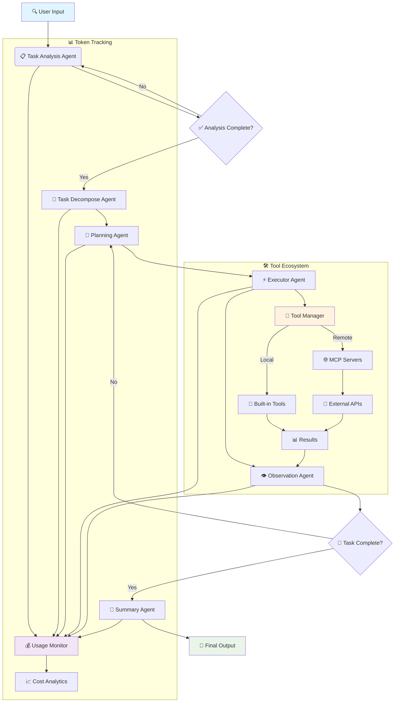

<div align="center">

# 🌟 **Experience Sage's Power**
### 🚀 [**Try Live Demo Now →**](http://36.133.44.114:20040/)


[](README.md)
[](README_CN.md)
[](LICENSE)
[](https://python.org)
[](https://github.com/ZHangZHengEric/Sage)
[](https://github.com/ZHangZHengEric/Sage/stargazers)

</div>

---

<div align="center">

# 🧠 **Sage Multi-Agent Framework**

### 🎯 **Making Complex Tasks Simple**

</div>

> 🌟 **A production-ready, modular, and intelligent multi-agent orchestration framework for complex problem solving**

**Sage** is an advanced multi-agent system that intelligently breaks down complex tasks into manageable subtasks through seamless agent collaboration. Built with enterprise-grade reliability and extensibility in mind, it provides **Deep Research Mode** for comprehensive analysis and **Rapid Execution Mode** for quick task completion.

## ✨ **Key Highlights**

<div align="center">

### 🎯 **Why Choose Sage?**

</div>

🧠 **Intelligent Task Decomposition** - Automatically breaks complex problems into manageable subtasks with dependency tracking  
🔄 **Agent Orchestration** - Seamless coordination between specialized agents with robust error handling  
🛠️ **Extensible Tool System** - Plugin-based architecture with MCP server support and auto-discovery  
⚡ **Dual Execution Modes** - Choose between thorough analysis or rapid execution based on your needs  
🌐 **Interactive Web Interface** - Modern React + FastAPI UI with real-time streaming visualization  
📊 **Advanced Token Tracking** - Comprehensive usage statistics and cost monitoring across all agents  
⚙️ **Rich Configuration** - Environment variables, config files, CLI options, and runtime updates  
🔧 **Developer Friendly** - Clean APIs, comprehensive docs, examples, and extensive error handling  
🎯 **Production Ready** - Robust error recovery, logging, retry mechanisms, and performance optimization

---

<div align="center">

### 🚀 **Start Your AI Journey Now!**

</div>

## 🤖 **Supported Models**

<div align="center">

### 🎯 **Extensively Tested Language Models**

</div>

### ✅ **Officially Tested Models**

<table align="center">
<tr>
<th>🏆 Model</th>
<th>🔧 API Identifier</th>
<th>🌟 Key Strengths</th>
<th>🎯 Best Use Cases</th>
</tr>
<tr>
<td><strong>🔥 DeepSeek-V3</strong></td>
<td><code>deepseek-chat</code></td>
<td>Excellent complex reasoning</td>
<td>Deep analysis, Code generation</td>
</tr>
<tr>
<td><strong>🌟 Qwen-3</strong></td>
<td><code>qwen-turbo</code>, <code>qwen-plus</code></td>
<td>Outstanding bilingual capabilities</td>
<td>Multilingual tasks, Text processing</td>
</tr>
<tr>
<td><strong>🧠 GPT-4.1</strong></td>
<td><code>gpt-4-turbo</code>, <code>gpt-4o</code></td>
<td>Premium performance for all tasks</td>
<td>Enterprise apps, Complex reasoning</td>
</tr>
<tr>
<td><strong>⚡ Claude-3.5 Sonnet</strong></td>
<td><code>claude-3-5-sonnet-20241022</code></td>
<td>Exceptional reasoning abilities</td>
<td>Creative writing, Logic analysis</td>
</tr>
</table>

### 🌐 **Compatible Providers**

<div align="center">

| 🏢 **Provider** | 🔗 **Integration** | 🌟 **Supported Models** |
|:---:|:---:|:---:|
| **OpenAI** | Direct API | All GPT models |
| **OpenRouter** | Unified API | 200+ models access |
| **Anthropic** | Native support | Claude family |
| **Google AI** | Official API | Gemini series |
| **DeepSeek** | Native API | All DeepSeek models |
| **Alibaba Cloud** | Direct integration | Qwen series |
| **Mistral AI** | Full support | All Mistral models |

</div>

> 💡 **Note**: While Sage is optimized for the models listed above, it's designed to work with any OpenAI-compatible API endpoint.

## 🏗️ Architecture Overview



## 🚀 Quick Start

### Installation

#### 🚀 Quick Installation (Recommended)

```bash
git clone https://github.com/ZHangZHengEric/Sage.git
cd Sage

# Run the automated installation script
./install_dependencies.sh
```

#### 📦 Manual Installation

```bash
git clone https://github.com/ZHangZHengEric/Sage.git
cd Sage

# Install core dependencies
pip install -r requirements.txt

# For FastAPI React Demo
pip install -r examples/fastapi_react_demo/requirements.txt
```

#### 🔧 Dependencies Overview

Sage includes several powerful tool systems that require specific dependencies:

- **Core Framework**: `openai`, `pydantic`, `python-dotenv`
- **Tool System**: `chardet`, `docstring_parser`, `requests`, `httpx`
- **MCP Support**: `mcp`, `fastmcp` 
- **Web Interface**: `fastapi`, `uvicorn`, `websockets`
- **Demo Applications**: `streamlit`, `gradio`

All dependencies are automatically managed by the installation script.

### 🎮 Interactive Web Demo

Experience Sage through our beautiful web interface with real-time agent visualization:

```bash
# Using DeepSeek-V3 (Recommended)
streamlit run examples/sage_demo.py -- \
  --api_key YOUR_DEEPSEEK_API_KEY \
  --model deepseek-chat \
  --base_url https://api.deepseek.com/v1

# Using OpenRouter (Multiple Models)
streamlit run examples/sage_demo.py -- \
  --api_key YOUR_OPENROUTER_API_KEY \
  --model deepseek/deepseek-chat \
  --base_url https://openrouter.ai/api/v1

# Using GPT-4
streamlit run examples/sage_demo.py -- \
  --api_key YOUR_OPENAI_API_KEY \
  --model gpt-4o \
  --base_url https://api.openai.com/v1
```

### 🌐 Modern Web Application (FastAPI + React)

Experience Sage through our cutting-edge web application featuring a modern React frontend with FastAPI backend:


**Features:**
- 🤖 **Multi-Agent Collaboration** - Visual workflow with decomposition, planning, execution, observation, and summary
- 🧠 **Deep Thinking Mode** - Expandable thought bubbles showing agent reasoning process
- 🚀 **FastAPI Backend** - High-performance async API server with streaming support
- ⚛️ **React Frontend** - Modern responsive UI with Ant Design components
- 📡 **Real-time Communication** - WebSocket + SSE dual support for live updates
- 🎨 **Beautiful Interface** - Collapsible deep thinking bubbles with modern design
- 🔧 **Tool Management** - Automatic tool discovery and management
- 💡 **Rule Preferences** - Personalized AI behavior configuration with custom rules and preferences
- 📱 **Responsive Design** - Adapts to all screen sizes
- 🔧 **TypeScript Support** - Full type safety throughout

**Quick Start:**
```bash
cd examples/fastapi_react_demo

# Backend setup
python start_backend.py

# Frontend setup (new terminal)
cd frontend
npm install
npm run dev
```

Access the application at `http://localhost:8080`. For detailed setup instructions, see the [FastAPI React Demo README](examples/fastapi_react_demo/README.md).

### 💻 Command Line Usage

```python
from agents.agent.agent_controller import AgentController
from agents.tool.tool_manager import ToolManager
from openai import OpenAI

# Example with DeepSeek-V3
model = OpenAI(
    api_key="your-deepseek-api-key", 
    base_url="https://api.deepseek.com/v1"
)
tool_manager = ToolManager()
controller = AgentController(model, {
    "model": "deepseek-chat",
    "temperature": 0.7,
    "max_tokens": 4096
})

# Execute task with comprehensive tracking
messages = [{"role": "user", "content": "Analyze the current trends in AI and provide actionable insights"}]

# Use system_context to provide additional runtime information
system_context = {
    "task_priority": "high",
    "deadline": "2024-01-15",
    "target_audience": "technical team"
}

result = controller.run(
    messages, 
    tool_manager, 
    deep_thinking=True, 
    summary=True,
    system_context=system_context
)

# Access results and usage statistics
print("Final Output:", result['final_output']['content'])
print("Token Usage:", result['token_usage'])
print("Execution Time:", result['execution_time'])
```

## 🎯 Core Features

### 🤖 **Multi-Agent Collaboration (v0.9)**
- **Task Analysis Agent**: Enhanced deep understanding with context awareness and unified system prompt management
- **Task Decompose Agent**: New intelligent task breakdown with dependency analysis and parallel execution planning
- **Planning Agent**: Strategic decomposition with dependency management and optimal tool selection
- **Executor Agent**: Intelligent tool execution with error recovery, retry mechanisms, and parallel processing
- **Observation Agent**: Advanced progress monitoring with completion detection and quality assessment
- **Summary Agent**: Comprehensive result synthesis with structured output and actionable insights

### 🔄 **Custom Workflow Engine**
- **Predefined Workflow Templates**: Ready-to-use workflow configurations for common scenarios (research, analysis, content creation, problem-solving)
- **Workflow Stability**: Deterministic execution paths with consistent results for production environments
- **Scenario-Specific Optimization**: Fine-tuned agent behaviors and tool selections for specific use cases
- **Workflow Customization**: Define custom agent sequences, skip unnecessary steps, and configure parallel execution
- **Template Management**: Save, load, and share workflow templates across teams and projects
- **Fixed-Scenario Reliability**: Enhanced stability and predictability for recurring tasks and standardized processes

### 💡 **Rule Preferences System**
- **Personalized AI Behavior**: Configure AI assistant behavior with custom rules and preferences
- **Code Style Preferences**: Define coding standards, naming conventions, and style guidelines
- **Response Language Settings**: Control language preferences and localization settings
- **Detail Level Control**: Adjust verbosity and explanation depth according to your needs
- **Template Library**: Quick-start templates for common preference patterns
- **Real-time Management**: Add, edit, enable/disable rules through intuitive web interface
- **Context Integration**: Rules automatically apply across all agent interactions

### 🛠️ **Advanced Tool System**
- **Plugin Architecture**: Hot-reloadable tool development with automatic registration and versioning
- **MCP Server Support: Seamless integration with Model Context Protocol servers and remote APIs, with added API key authentication for SSE MCP server connections
- **Auto-Discovery**: Intelligent tool detection from directories, modules, and remote endpoints
- **Type Safety**: Comprehensive parameter validation with schema enforcement and runtime checks
- **Error Handling**: Robust error recovery, timeout management, retry strategies, and detailed logging
- **Performance Monitoring**: Tool execution time tracking, bottleneck detection, and optimization suggestions

### 📊 **Token Usage & Cost Monitoring**
- **Real-time Tracking**: Monitor token consumption across all agents and operations
- **Detailed Analytics**: Input, output, cached, and reasoning token breakdown
- **Cost Estimation**: Calculate costs based on model pricing and usage patterns
- **Performance Metrics**: Track execution time, success rates, and efficiency
- **Export Capabilities**: CSV, JSON export for further analysis

```python
# Get comprehensive token statistics
stats = controller.get_comprehensive_token_stats()
print(f"Total Tokens: {stats['total_tokens']}")
print(f"Total Cost: ${stats['estimated_cost']:.4f}")
print(f"Agent Breakdown: {stats['agent_breakdown']}")

# Print detailed statistics
controller.print_comprehensive_token_stats()
```

### 💡 **Rule Preferences Configuration**
- **Web Interface**: Configure rules through the modern React interface at `/rules`
- **Runtime Application**: Rules automatically apply to all agent interactions
- **Template System**: Quick-start with predefined rule templates
- **Export/Import**: Share rule configurations across environments

```python
# Rule preferences are automatically applied through system context
system_context = {
    "user_preferences": {
        "code_style": "Use clean, readable code with meaningful variable names",
        "response_language": "Provide responses in English with Chinese comments",
        "detail_level": "Provide detailed explanations with examples"
    }
}

result = controller.run(
    messages, 
    tool_manager,
    system_context=system_context  # Rules automatically integrated
)
```

### ⚙️ **Rich Configuration System**
- **Environment Variables**: `SAGE_DEBUG`, `OPENAI_API_KEY`, `SAGE_MAX_LOOP_COUNT`, etc.
- **Config Files**: YAML/JSON configuration with validation and hot-reload
- **Runtime Updates**: Dynamic configuration changes without restart
- **CLI Options**: Comprehensive command-line interface with help system
- **Profile Management**: Save and load configuration profiles

### 🔄 **Execution Modes**

#### Deep Research Mode (Recommended for Complex Tasks)
```python
# Enhanced with system_context support
result = controller.run(
    messages, 
    tool_manager,
    deep_thinking=True,    # Enable comprehensive task analysis
    summary=True,          # Generate detailed summary with insights
    deep_research=True,    # Full multi-agent pipeline with decomposition
    system_context={       # Unified system context management
        "project_context": "AI research project",
        "constraints": ["time: 2 hours", "resources: limited"],
        "preferences": {"output_format": "detailed_report"}
    }
)

# Streaming version with real-time updates
for chunk in controller.run_stream(
    messages, 
    tool_manager,
    deep_thinking=True,
    summary=True,
    deep_research=True,
    system_context=system_context  # Consistent system context across streaming
):
    for message in chunk:
        print(f"[{message['type']}] {message['role']}: {message['show_content']}")
```

#### Standard Execution Mode (Balanced Performance)
```python
result = controller.run(
    messages, 
    tool_manager,
    deep_thinking=True,    # Enable task analysis
    summary=True,          # Generate summary
    deep_research=False,   # Skip detailed decomposition phase
    system_context=system_context  # Runtime context support
)
```

#### Rapid Execution Mode (Maximum Speed)
```python
result = controller.run(
    messages,
    tool_manager, 
    deep_thinking=False,   # Skip analysis
    deep_research=False,   # Direct execution
    system_context=system_context  # Even rapid mode supports context
)
```

## 📊 Real-time Streaming & Monitoring

Watch your agents work in real-time with detailed progress tracking and performance metrics:

```python
import time

start_time = time.time()
token_count = 0

# Enhanced streaming with system context
system_context = {
    "monitoring_level": "detailed",
    "progress_tracking": True,
    "performance_metrics": True
}

for chunk in controller.run_stream(messages, tool_manager, system_context=system_context):
    for message in chunk:
        # Display agent activity
        print(f"🤖 {message['role']}: {message['show_content']}")
        
        # Track progress
        if 'usage' in message:
            token_count += message['usage'].get('total_tokens', 0)
        
        # Real-time statistics
        elapsed = time.time() - start_time
        print(f"⏱️  Time: {elapsed:.1f}s | 🪙 Tokens: {token_count}")
```

## 🔧 Advanced Tool Development

Create sophisticated custom tools with full framework integration:

```python
from agents.tool.tool_base import ToolBase
from typing import Dict, Any, Optional
import requests

class DataAnalysisTool(ToolBase):
    """Advanced data analysis tool with caching and validation"""
    
    @ToolBase.tool()
    def analyze_data(self, 
                    data_source: str, 
                    analysis_type: str,
                    options: Optional[Dict[str, Any]] = None) -> Dict[str, Any]:
        """
        Perform comprehensive data analysis with visualization
        
        Args:
            data_source: URL or path to data source
            analysis_type: Type of analysis (statistical/trend/correlation)
            options: Additional analysis options
        """
        try:
            # Your implementation here
            result = self._perform_analysis(data_source, analysis_type, options)
            
            return {
                "success": True,
                "data": result,
                "metadata": {
                    "execution_time": self.execution_time,
                    "data_size": len(result.get("records", [])),
                    "analysis_type": analysis_type
                }
            }
        except Exception as e:
            return {
                "success": False,
                "error": str(e),
                "error_type": type(e).__name__
            }
    
    def _perform_analysis(self, source, analysis_type, options):
        # Implementation details
        pass
```

## 🛡️ Error Handling & Reliability

Sage includes comprehensive error handling and recovery mechanisms:

```python
from agents.utils.exceptions import SageException, with_retry, exponential_backoff

# Automatic retry with exponential backoff
@with_retry(exponential_backoff(max_attempts=3, base_delay=1.0))
def robust_execution():
    return controller.run(messages, tool_manager)

# Custom error handling
try:
    result = controller.run(messages, tool_manager)
except SageException as e:
    print(f"Sage Error: {e}")
    print(f"Error Code: {e.error_code}")
    print(f"Recovery Suggestions: {e.recovery_suggestions}")
```

## 📈 Performance Monitoring

Monitor and optimize your agent performance:

```python
# Enable detailed performance tracking
controller.enable_performance_monitoring()

# Execute with monitoring
result = controller.run(messages, tool_manager)

# Analyze performance
perf_stats = controller.get_performance_stats()
print(f"Execution Time: {perf_stats['total_time']:.2f}s")
print(f"Agent Breakdown: {perf_stats['agent_times']}")
print(f"Tool Usage: {perf_stats['tool_stats']}")
print(f"Bottlenecks: {perf_stats['bottlenecks']}")

# Export performance data
controller.export_performance_data("performance_report.json")
```

## 🔌 MCP Server Integration

Seamlessly integrate with Model Context Protocol servers:

```bash
# Start MCP servers
python mcp_servers/weather_server.py &
python mcp_servers/database_server.py &

# Use in your application
tool_manager.register_mcp_server("weather", "http://localhost:8001")
tool_manager.register_mcp_server("database", "http://localhost:8002")

# Tools are automatically available
result = controller.run([{
    "role": "user", 
    "content": "Get weather for Tokyo and save to database"
}], tool_manager)
```

## 📚 Documentation

- **[Quick Start Guide](docs/QUICK_START.md)** - Get up and running in 5 minutes
- **[Architecture Overview](docs/ARCHITECTURE.md)** - Detailed system design
- **[API Reference](docs/API_REFERENCE.md)** - Complete API documentation
- **[Tool Development](docs/TOOL_DEVELOPMENT.md)** - Create custom tools
- **[Configuration Guide](docs/CONFIGURATION.md)** - Advanced configuration options
- **[Examples](docs/EXAMPLES.md)** - Real-world usage examples

## 🎯 Production Deployment

Sage is production-ready with enterprise features:

```python
from agents.config.settings import get_settings, update_settings

# Configure for production
update_settings(
    debug=False,
    max_loop_count=5,
    tool_timeout=30,
    enable_logging=True,
    log_level="INFO"
)

# Initialize with production settings
controller = AgentController.from_config("production.yaml")
```

## 🔄 Recent Updates (v0.9)

### ✨ New Features
- 🎯 **Task Decompose Agent**: New specialized agent for intelligent task breakdown and dependency management
- 🔧 **Unified System Prompt Management**: Centralized system context handling with `system_context` parameter across all agents
- 💡 **Rule Preferences System**: Personalized AI behavior configuration with custom rules, templates, and real-time management
- 🔄 **Custom Workflow Engine**: Predefined workflow templates and custom workflow support for enhanced stability in fixed scenarios
- 📊 **Enhanced Token Tracking**: Comprehensive usage statistics with detailed cost monitoring and optimization suggestions
- 🛡️ **Robust Error Handling**: Advanced error recovery, retry mechanisms, and comprehensive exception handling
- ⚡ **Performance Optimization**: 50% faster execution with improved resource management and parallel processing
- 🌐 **Modern Web Application**: Complete FastAPI + React web application with TypeScript support and real-time collaboration

### 🔧 Technical Improvements
- 🏗️ **Agent Architecture**: Added Task Decompose Agent to the workflow for better task breakdown
- 💬 **System Context API**: New `system_context` parameter for unified runtime information management
- 📝 **System Prompt Organization**: Centralized system prompt management with `SYSTEM_PREFIX_DEFAULT` constants
- 🔄 **Workflow Engine**: Custom workflow support with template management and scenario-specific optimizations
- 💾 **Memory Management**: Optimized memory usage for long-running tasks and large-scale deployments
- 🌐 **Streaming Enhancement**: Improved real-time updates with better UI feedback and WebSocket reliability
- 📊 **Token Analytics**: Comprehensive usage tracking with cost optimization suggestions and budget management

### 🐛 Bug Fixes
- Fixed streaming response interruption issues
- Resolved tool execution timeout problems
- Improved session management and cleanup
- Enhanced error message clarity and debugging information
- Fixed memory leaks in long-running sessions

### 📋 API Changes
- **New Parameter**: `system_context` added to `run()` and `run_stream()` methods for unified context management
- **Workflow Enhancement**: Added Task Decompose Agent between Task Analysis and Planning phases
- **System Prompt**: All agents now use unified system prompt management with `SYSTEM_PREFIX_DEFAULT` constants
- **Backward Compatibility**: All existing APIs remain fully compatible

## 📄 License

This project is licensed under the MIT License - see the [LICENSE](LICENSE) file for details.

## 🙏 Acknowledgments

- OpenAI for the powerful language models
- DeepSeek for the exceptional V3 model
- Alibaba Cloud for the Qwen series
- The open-source community for inspiration and tools
- All contributors who help make Sage better

---

<div align="center">
  <sub>Built with ❤️ by the Sage team</sub>
</div>