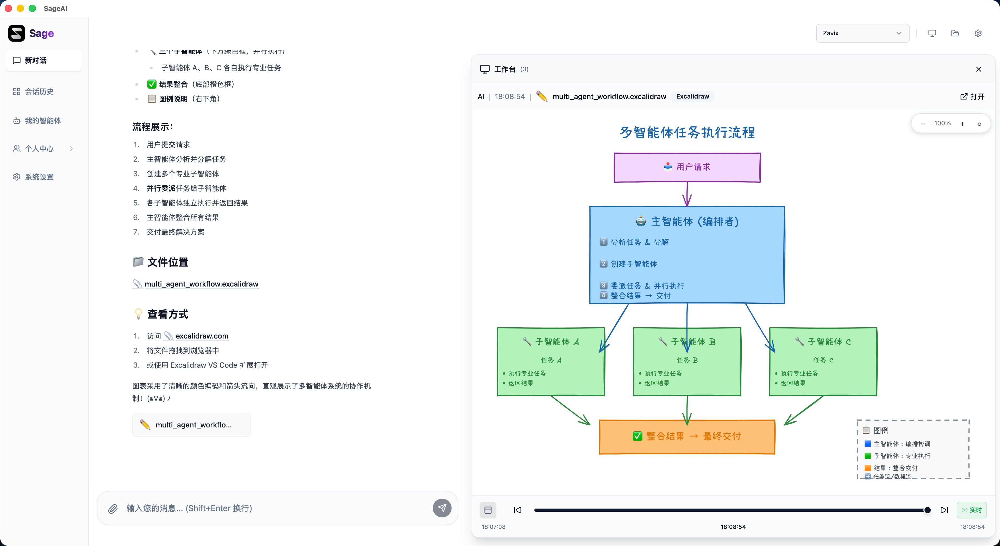
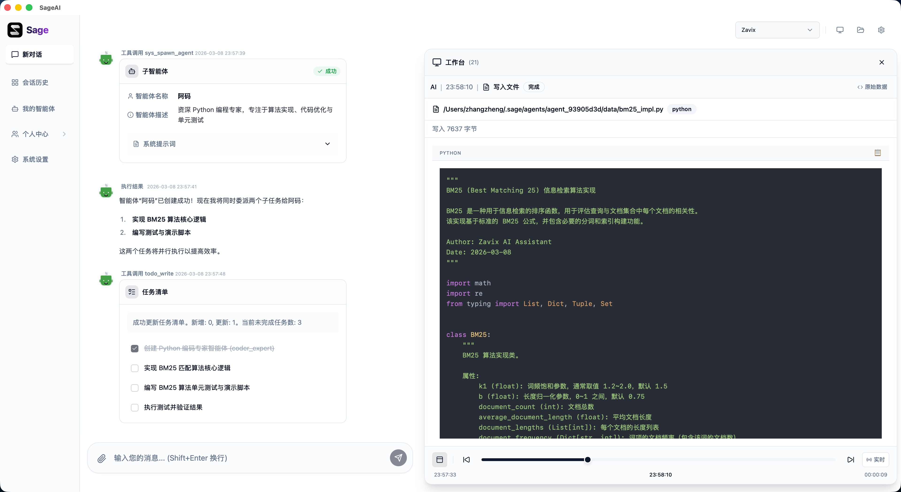
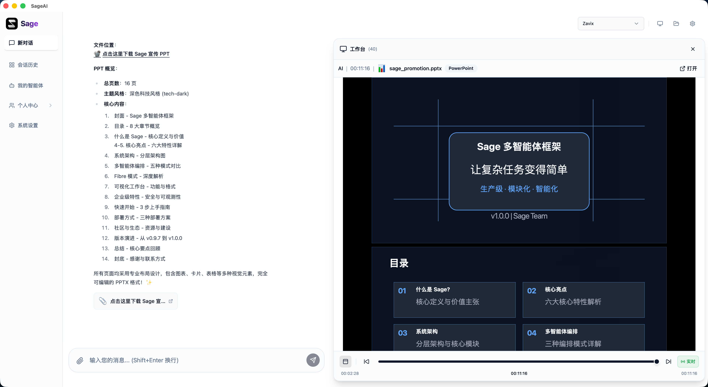
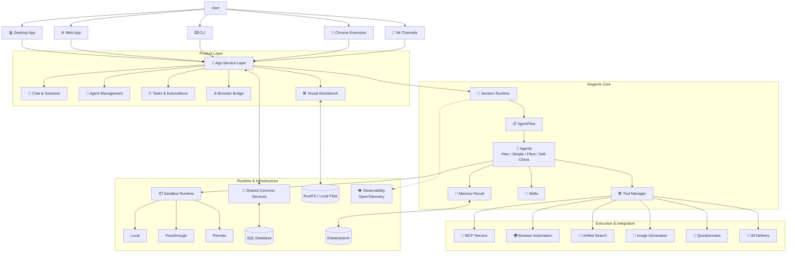

<div align="center">

# 🌟 **Experience Sage's Power**


[](README.md)
[](README_CN.md)
[](LICENSE)
[](https://python.org)
[](https://github.com/ZHangZHengEric/Sage)
[](https://deepwiki.com/ZHangZHengEric/Sage)
[](https://join.slack.com/t/sage-b021145/shared_invite/zt-3t8nabs6c-qCEDzNUYtMblPshQTKSWOA)

# 🧠 **Sage Agent Platform**

### 🎯 **From Complex Work to Reliable Delivery**

> 🌟 **A production-ready agent platform for task execution, automation, browser workflows, IM delivery, and enterprise deployment.**

</div>

---

## 📸 **Product Screenshots**

<div align="center">

<table>
  <tr>
    <td align="center" width="33%">
      
      <br/><strong>Visual Workbench</strong>
    </td>
    <td align="center" width="33%">
      
      <br/><strong>Real-time Collaboration</strong>
    </td>
    <td align="center" width="33%">
      
      <br/><strong>Multi-format Support</strong>
    </td>
  </tr>
</table>

</div>

> 📖 **Detailed Documentation**: [https://wiki.sage.zavixai.com/](https://wiki.sage.zavixai.com/)

---

## ✨ **Key Features**

- 🤖 **Planning to Delivery**: Built-in planning, execution, self-check, memory recall, and tool suggestion agents for complex task completion.
- 🌐 **Multi-Entry Product Surface**: Use Sage from desktop, web, CLI, and Chrome extension depending on the workflow.
- 🔁 **Automation & Recurring Tasks**: Run scheduled jobs, questionnaire-driven collection flows, and long-running operational tasks with progress visibility.
- 💬 **Omnichannel IM Integration**: Connect WeChat Personal (iLink), WeCom, Feishu, and DingTalk with message and file delivery support.
- 🧰 **Unified Tooling System**: Combine built-in tools, Skills, MCP servers, browser automation, search, and image generation in one execution stack.
- 🛡️ **Sandboxed Execution**: Local, passthrough, and remote sandbox options for safer agent runtime isolation.
- 🛠️ **Visual Workbench**: Inspect files, tool outputs, code, charts, Mermaid, Draw.io, audio, video, and remote previews in one workspace.
- 🏢 **Enterprise-Ready Foundation**: OAuth2, configurable auth and CORS, shared service architecture, CI coverage, and deployable multi-platform packaging.

---

## 🚀 **Quick Start**

**Prerequisites (web from source):** Python 3.10+, Node.js 18+.

### Web (clone and run)

```bash
git clone https://github.com/ZHangZHengEric/Sage.git
cd Sage
export SAGE_DEFAULT_LLM_API_KEY="your-api-key"
export SAGE_DEFAULT_LLM_API_BASE_URL="https://api.deepseek.com/v1"
export SAGE_DEFAULT_LLM_MODEL_NAME="deepseek-chat"
./scripts/dev-up.sh
```

Open [http://localhost:5173](http://localhost:5173). The first run may ask for **Minimal** (SQLite) vs **Full** stacks — Minimal is the quickest. Optional: `PYTHON_BIN=...` or `USE_UV=1 ./scripts/dev-up.sh` if you use a custom Python or [uv](https://github.com/astral-sh/uv).

**Detailed documentation:** [Web Application](docs/en/applications/WEB.md) — manual backend + Vite, Docker Compose, and port notes.

### Desktop (installers)

Download the latest `.dmg` (macOS), `.exe` NSIS installer (Windows), or `.deb` (Linux) from [GitHub Releases](https://github.com/ZHangZHengEric/Sage/releases), then install as below.

**macOS**

1. Open the `.dmg` for your CPU (Intel or Apple Silicon), drag **Sage.app** into **Applications**.
2. The build is **not** currently Apple-notarized. If macOS says the developer cannot be verified or the app cannot be checked for malware: in **Finder → Applications**, **right‑click** `Sage.app` → **Open**, then confirm **Open** in the dialog (this adds a one-time exception for Gatekeeper).
3. If it is still blocked: **System Settings → Privacy & Security**, scroll to the message about Sage, click **Open Anyway**, then try opening the app again.
4. If macOS reports the app is **damaged** or will not open, clear the quarantine flag and retry:

```bash
xattr -dr com.apple.quarantine /Applications/Sage.app
```

**Windows**

1. Run the `.exe` installer and complete the wizard.
2. If **Windows SmartScreen** warns about an unknown publisher, click **More info** → **Run anyway** (wording may vary by Windows version).

**Linux (Debian / Ubuntu)**

1. Download the `.deb` for your architecture from Releases.
2. Install from a terminal (adjust the filename):

```bash
sudo apt install ./Sage-<version>-<arch>.deb
```

You can also double-click the `.deb` in many desktop environments.

**Detailed documentation:** [Desktop Application](docs/en/applications/DESKTOP.md) — build from source, env, and platform notes.

### CLI

```bash
pip install -e .
export SAGE_DEFAULT_LLM_API_KEY="your-api-key"
export SAGE_DEFAULT_LLM_API_BASE_URL="https://api.deepseek.com/v1"
export SAGE_DEFAULT_LLM_MODEL_NAME="deepseek-chat"
export SAGE_DB_TYPE="file"
sage doctor
sage run "Say hello briefly."
# or: sage chat
```

**Detailed documentation:** [CLI Guide](docs/en/applications/CLI.md)

### TUI

After `pip install -e .` and the same `SAGE_DEFAULT_*` + `SAGE_DB_TYPE=file` as above, use `sage-terminal` (or run from `app/terminal/` with `cargo` — see the guide).

**Detailed documentation:** [TUI Guide](docs/en/applications/TUI.md)

### Chrome extension

Load the unpacked extension from `app/chrome-extension/` in `chrome://extensions/` (Developer mode). Point the extension at your local Sage backend if the port differs from defaults.

**Detailed documentation:** [Chrome extension](docs/en/applications/CHROME_EXTENSION.md)

---

## 🏗️ **System Architecture**


```mermaid
graph TD
    User[User] --> Desktop[💻 Desktop App]
    User --> Web[🌐 Web App]
    User --> CLI[⌨️ CLI]
    User --> Ext[🧩 Chrome Extension]
    User --> IM[💬 IM Channels]

    Desktop --> AppLayer[🧭 App Service Layer]
    Web --> AppLayer
    CLI --> AppLayer
    Ext --> AppLayer
    IM --> AppLayer

    subgraph App[Product Layer]
        AppLayer --> Chat[💬 Chat & Sessions]
        AppLayer --> AgentsUI[🤖 Agent Management]
        AppLayer --> Tasks[⏰ Tasks & Automations]
        AppLayer --> Browser[🌐 Browser Bridge]
        AppLayer --> Workbench[🛠️ Visual Workbench]
    end

    subgraph Core[SAgents Core]
        AppLayer --> Runtime[🧠 Session Runtime]
        Runtime --> Flow[📋 AgentFlow]
        Flow --> Agents["🤖 Agents<br/>Plan / Simple / Fibre / Self-Check"]
        Agents --> Memory[🧠 Memory Recall]
        Agents --> Skills[🧩 Skills]
        Agents --> ToolMgr[🛠️ Tool Manager]
    end

    subgraph Tools[Execution & Integration]
        ToolMgr --> MCP[🔌 MCP Servers]
        ToolMgr --> BrowserTools[🌍 Browser Automation]
        ToolMgr --> Search[🔎 Unified Search]
        ToolMgr --> ImageGen[🎨 Image Generation]
        ToolMgr --> Questionnaire[📝 Questionnaire]
        ToolMgr --> IMTools[📨 IM Delivery]
    end

    subgraph RuntimeEnv[Runtime & Infrastructure]
        Agents --> Sandbox[📦 Sandbox Runtime]
        Sandbox --> Local[Local]
        Sandbox --> Pass[Passthrough]
        Sandbox --> Remote[Remote]
        AppLayer <--> Common[🧱 Shared Common Services]
        Common <--> DB[(SQL Database)]
        Memory <--> ES[(Elasticsearch)]
        Workbench <--> FS[(RustFS / Local Files)]
        Runtime -.-> Obs["👁️ Observability<br/>OpenTelemetry"]
    end
```

---

## 📅 **What's New in v1.1.0**

### 🤖 **SAgents Kernel Updates**

- **Execution Chain Enhancements**: Added `PlanAgent`, `SelfCheckAgent`, `MemoryRecallAgent`, and `ToolSuggestionAgent`
- **Context Efficiency**: Improved user input optimization and conversation history compression for long-running tasks
- **Session & Messaging**: Added edit-and-rerun support, richer progress feedback, and better session inspection workflows
- **Tooling Expansion**: Added questionnaire collection workflows and improved tool-call rendering, truncation, and observability

### 💻 **Product Layer Updates**

- **New Entry Points**: Added Sage CLI, Chrome extension, and browser automation tooling
- **Workbench Upgrades**: Expanded support for audio, video, Mermaid, Draw.io, remote file preview, and richer tool cards
- **Chat Experience**: Improved progress messages, delivery flow display, reasoning content presentation, and workspace interactions
- **IM Integrations**: Expanded WeChat Personal (iLink), WeCom, Feishu, and DingTalk support with stronger file messaging flows

### 🛡️ **Platform & Infrastructure**

- **Enterprise Readiness**: Added OAuth2, email verification, and stronger auth/CORS/security controls
- **Sandbox & Runtime**: Refactored local/passthrough/remote sandbox support and improved Node runtime/sidecar packaging
- **Shared Architecture**: Extracted reusable `common/` services, models, and schemas across desktop and server
- **Documentation & CI**: Rebuilt the docs structure, added CLI guides, and expanded CI/test coverage

**[View Full Release Notes](release_notes/v1.1.0.md)**

---

## 📚 **Documentation**

- 📖 **Full Documentation**: [https://wiki.sage.zavixai.com/](https://wiki.sage.zavixai.com/)
- 📝 **Release Notes**: [release_notes/](release_notes/)
- 🏗️ **Architecture**: See `sagents/`, `common/`, and `app/` for the core runtime and product layers
- 🔧 **Configuration**: Environment variables and config files in `app/desktop/`

---

## 🛠️ **Development**

### Project Structure

```
Sage/
├── sagents/                    # SAgents core runtime, flow, context, tools, sandbox
├── common/                     # Shared models, schemas, services, core clients
├── app/
│   ├── desktop/                # Desktop app (Python backend + Vue UI + Tauri shell)
│   ├── server/                 # Server app and web frontend
│   ├── cli/                    # Sage CLI entrypoint and services
│   └── chrome-extension/       # Browser extension and sidepanel
├── mcp_servers/                # IM, search, scheduler, image generation and more
├── docs/                       # English and Chinese documentation
└── release_notes/              # Version release notes
```

### Contributing

We welcome contributions! Please see our [GitHub Issues](https://github.com/ZHangZHengEric/Sage/issues) for tasks and discussions.

---

## 💖 **Sponsors**

<div align="center">

We are grateful to our sponsors for their support in making Sage better:

<table>
  <tr>
    <td align="center" width="33%">
      <a href="#" target="_blank">
        
      </a>
      <br/>
    </td>
    <td align="center" width="33%">
      <a href="#" target="_blank">
        
      </a>
    </td>
    <td align="center" width="33%">
      <a href="#" target="_blank">
        
      </a>
    </td>
  </tr>
</table>

</div>


---

## 🦌 **Join Our Community**


### 💬 Connect with us

[Slack](https://join.slack.com/t/sage-b021145/shared_invite/zt-3t8nabs6c-qCEDzNUYtMblPshQTKSWOA)

### 📱 WeChat Group


*Scan to join our WeChat community 🦌*


---

Built with ❤️ by the Sage Team 🦌