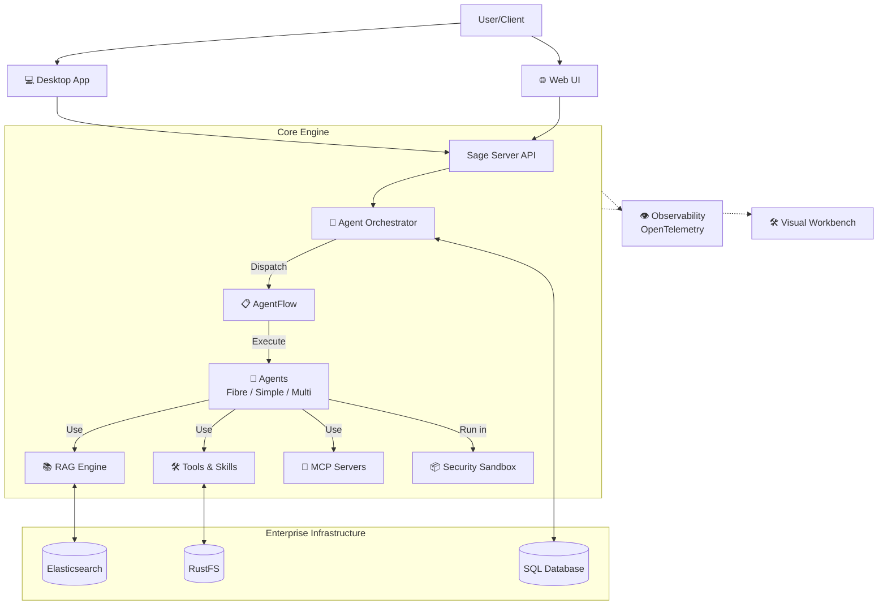

<div align="center">

# 🌟 **Experience Sage's Power**


[](README.md)
[](README_CN.md)
[](LICENSE)
[](https://python.org)
[](https://github.com/ZHangZHengEric/Sage)
[](https://deepwiki.com/ZHangZHengEric/Sage)
[](https://join.slack.com/t/sage-b021145/shared_invite/zt-3t8nabs6c-qCEDzNUYtMblPshQTKSWOA)

# 🧠 **Sage Multi-Agent Framework**

### 🎯 **Making Complex Tasks Simple**

> 🌟 **A production-ready, modular, and intelligent multi-agent orchestration framework for complex problem solving.**

</div>

---

## 📸 **Product Screenshots**

<div align="center">

<table>
  <tr>
    <td align="center" width="33%">
      
      <br/><strong>Visual Workbench</strong>
    </td>
    <td align="center" width="33%">
      
      <br/><strong>Real-time Collaboration</strong>
    </td>
    <td align="center" width="33%">
      
      <br/><strong>Multi-format Support</strong>
    </td>
  </tr>
</table>

</div>

> 📖 **Detailed Documentation**: [https://wiki.sage.zavixai.com/](https://wiki.sage.zavixai.com/)

---

## ✨ **Key Features**

- 🧠 **Multi-Agent Orchestration**: Support for **TaskExecutor** (Sequential), **FibreAgent** (Parallel), and **AgentFlow** (Declarative) orchestration modes.
- 🎯 **Maximized Model Capability**: Stable execution of complex tasks even on smaller models like **Qwen3.5 35B-A3B**, with framework-level optimizations unlocking model potential.
- 🧩 **Built-in High-Stability Skills**: Pre-installed production-ready Skills that work out of the box, ensuring reliable execution for critical tasks.
- 🛡️ **Secure Sandbox**: Isolated execution environment (`sagents.utils.sandbox`) for safe agent code execution.
- 👁️ **Full Observability**: Integrated **OpenTelemetry** tracing to visualize agent thought processes and execution paths.
- 🧩 **Modular Components**: Plug-and-play architecture for **Skills**, **Tools**, and **MCP Servers**.
- 📊 **Context Management**: Advanced **Context Budget** controls for precise token optimization.
- 💻 **Cross-Platform Desktop**: Native desktop apps for **macOS** (Intel/Apple Silicon), **Windows**, and **Linux**.
- 🛠️ **Visual Workbench**: Unified workspace for file preview, tool results, and code execution with 15+ format support.
- 🔌 **MCP Protocol**: Model Context Protocol support for standardized tool integration.

---

## 🚀 **Quick Start**

### Installation

```bash
git clone https://github.com/ZHangZHengEric/Sage.git
cd Sage
```

### Running Sage

**Option 1: One-Command Startup (Recommended for Development)**

```bash
# 1. Optional: activate your environment first
# conda activate your-env

# 2. Set your LLM API Key
export SAGE_DEFAULT_LLM_API_KEY="your-api-key"
export SAGE_DEFAULT_LLM_API_BASE_URL="https://api.deepseek.com/v1"
export SAGE_DEFAULT_LLM_MODEL_NAME="deepseek-chat"

# 3. Run the startup script
./scripts/dev-up.sh
```

The script will automatically:
- Check Python (>= 3.10) and Node.js (>= 18) versions
- Create configuration files (minimal mode: SQLite, no external dependencies)
- Install dependencies and start both backend and frontend services
- Create `logs/server.log` automatically
- Honor `SAGE_PORT` from `.env` for backend startup and health checks

Optional overrides:

```bash
# Explicitly choose a Python executable
PYTHON_BIN=/path/to/python ./scripts/dev-up.sh

# Use uv instead of python -m pip / python -m ...
USE_UV=1 ./scripts/dev-up.sh
```

**First time?** The script will prompt you to choose between:
- **Minimal mode**: SQLite, no external dependencies (recommended for quick start)
- **Full mode**: MySQL + Elasticsearch + RustFS (for production-like environment)

After starting, open: http://localhost:5173

**Option 2: Desktop Application (Recommended for Users)**

Download the latest desktop package from [GitHub Releases](https://github.com/ZHangZHengEric/Sage/releases):
- **macOS**: `.dmg` (Intel & Apple Silicon)
- **Windows**: `.exe` / `.msi`
- **Linux**: `.deb` (x86_64 / arm64)

#### Desktop Installation Guide

**macOS**

1. Download the `.dmg` for your CPU architecture and open it.
2. Drag `Sage.app` into the `Applications` folder.
3. The current macOS build is not yet signed/notarized by Apple. If you see a warning that the developer cannot be verified or Apple cannot check the app for malicious software, open `Applications`, right-click `Sage.app`, choose `Open`, and then click `Open` again in the dialog.
4. If macOS still blocks the app, go to `System Settings -> Privacy & Security`, find the Sage warning near the bottom, and click `Open Anyway`.
5. If macOS says the app is damaged or still refuses to launch, run the following command and try again:

```bash
xattr -dr com.apple.quarantine /Applications/Sage.app
```

**Windows**

1. Download the `.exe` installer and run it.
2. Follow the setup wizard to finish installation.
3. If Windows SmartScreen shows a warning, click `More info` -> `Run anyway`.

**Linux**

1. Download the `.deb` package for your architecture from [GitHub Releases](https://github.com/ZHangZHengEric/Sage/releases).
2. On Debian/Ubuntu, you can install it directly by double-clicking it, or by running:

```bash
sudo apt install ./Sage-<version>-<arch>.deb
```

If you prefer to build the desktop app from source, use the commands below.

```bash
# macOS/Linux
app/desktop/scripts/build.sh release

# Windows
./app/desktop/scripts/build_windows.ps1 release
```

**Command Line Interface (CLI)**:
```bash
# Install editable package once
pip install -e .

# Configure the minimum runtime variables
export SAGE_DEFAULT_LLM_API_KEY="your-api-key"
export SAGE_DEFAULT_LLM_API_BASE_URL="https://api.deepseek.com/v1"
export SAGE_DEFAULT_LLM_MODEL_NAME="deepseek-chat"
export SAGE_DB_TYPE="file"

# Diagnose local runtime config
sage doctor

# Show effective CLI config
sage config show

# Create a minimal local CLI config
sage config init

# List recent sessions for the current CLI user
sage sessions

# Run a single task
sage run "Help me analyze the current repository"

# Run a task and print execution stats
sage run --stats "Help me analyze the current repository"

# Run against a specific local workspace
sage run --workspace /path/to/project --stats "Say hello briefly."

# Start an interactive chat session
sage chat

# Resume an existing session
sage resume your-session-id
```

In `sage chat` and `sage resume`, you can use:
- `/help` to show built-in chat commands
- `/session` to print the current session id
- `/exit` or `/quit` to leave the session

By default, the CLI uses a stable local user id. You can override it with `--user-id`, `SAGE_CLI_USER_ID`, or `SAGE_DESKTOP_USER_ID`.

If you prefer not to install an editable package yet, you can run the module directly:

```bash
python -m app.cli.main doctor
python -m app.cli.main config show
python -m app.cli.main config init
python -m app.cli.main sessions
python -m app.cli.main run "Help me analyze the current repository"
python -m app.cli.main run --workspace /path/to/project "Help me analyze the current repository"
python -m app.cli.main run --stats "Help me analyze the current repository"
python -m app.cli.main chat
python -m app.cli.main resume your-session-id
```

The current CLI MVP still uses the existing Sage runtime config system, so `.env` and shell environment variables remain the primary configuration mechanism.

**Web Application (FastAPI + Vue3)**:

```bash
# Start backend
python -m app.server.main

# Start frontend (in another terminal)
cd app/server/web
npm install
npm run dev
```

---

## 🏗️ **System Architecture**


```mermaid
graph TD
    User[User/Client] --> Desktop[💻 Desktop App]
    User --> Web[🌐 Web UI]
    Desktop --> API[Sage Server API]
    Web --> API
    
    subgraph Core[Core Engine]
        API --> Orch[🧠 Agent Orchestrator]
        Orch -- "Dispatch" --> Flow[📋 AgentFlow]
        Flow -- "Execute" --> Agents["🤖 Agents<br/>Fibre / Simple / Multi"]
        Agents -- "Use" --> RAG[📚 RAG Engine]
        Agents -- "Use" --> Tools[🛠️ Tools & Skills]
        Agents -- "Use" --> MCP[🔌 MCP Servers]
        Agents -- "Run in" --> Box[📦 Security Sandbox]
    end

    subgraph Infra[Enterprise Infrastructure]
        RAG <--> ES[(Elasticsearch)]
        Tools <--> RustFS[(RustFS)]
        Orch <--> DB[(SQL Database)]
    end
    
    Core -.-> Obs["👁️ Observability<br/>OpenTelemetry"]
    Core -.-> Workbench["🛠️ Visual Workbench"]
```

---

## 📅 **What's New in v1.0.0**

### 🤖 **SAgents Kernel Updates**

- **Session Management Refactor**: Global `SessionManager` with parent-child session tracking
- **AgentFlow Engine**: Declarative workflow orchestration with Router → DeepThink → Mode Switch → Suggest flow
- **Fibre Mode Optimization**: 
  - Dynamic sub-agent spawning with `sys_spawn_agent`
  - Parallel task delegation with `sys_delegate_task`
  - Hour-level long-running task support
  - 4-level hierarchy depth control
  - Recursive orchestration capabilities
- **Lock Management**: Global `LockManager` for session-level isolation
- **Observability**: OpenTelemetry integration with performance monitoring

### 💻 **App Layer Updates**

- **Visual Workbench**: 
  - 20+ rendering components
  - 15+ file format support (PDF, DOCX, PPTX, XLSX, etc.)
  - List/Single view dual mode
  - Timeline navigation
  - Session-isolated state management
- **Cross-Platform Desktop**: 
  - macOS (Intel/Apple Silicon) - DMG
  - Windows - NSIS Installer
  - Linux - DEB support
- **Real-time Collaboration**: 
  - Message stream optimization
  - File reference extraction
  - Code block highlighting
  - Disconnect detection & resume
- **MCP Support**: Model Context Protocol for external tool integration

### 🔧 **Infrastructure**

- **Tauri 2.0**: Upgraded to stable version with new permission system
- **Build Optimization**: Rust caching, parallel builds, auto-signing
- **State Management**: Pinia store with session isolation

**[View Full Release Notes](release_notes/v1.0.0.md)**

---

## 📚 **Documentation**

- 📖 **Full Documentation**: [https://wiki.sage.zavixai.com/](https://wiki.sage.zavixai.com/)
- 📝 **Release Notes**: [release_notes/](release_notes/)
- 🏗️ **Architecture**: See `sagents/` directory for core framework
- 🔧 **Configuration**: Environment variables and config files in `app/desktop/`

---

## 🛠️ **Development**

### Project Structure

```
Sage/
├── sagents/                    # Core Agent Framework
│   ├── agent/                  # Agent implementations
│   │   ├── fibre/              # Fibre multi-agent orchestration
│   │   ├── simple_agent.py     # Simple mode agent
│   │   └── ...
│   ├── flow/                   # AgentFlow engine
│   ├── context/                # Session & message management
│   ├── tool/                   # Tool system
│   └── session_runtime.py      # Session manager
├── app/desktop/                # Desktop Application
│   ├── core/                   # Python backend (FastAPI)
│   ├── ui/                     # Vue3 frontend
│   └── tauri/                  # Tauri 2.0 desktop shell
└── skills/                     # Built-in skills
```

### Contributing

We welcome contributions! Please see our [GitHub Issues](https://github.com/ZHangZHengEric/Sage/issues) for tasks and discussions.

---

## 💖 **Sponsors**

<div align="center">

We are grateful to our sponsors for their support in making Sage better:

<table>
  <tr>
    <td align="center" width="33%">
      <a href="#" target="_blank">
        
      </a>
      <br/>
    </td>
    <td align="center" width="33%">
      <a href="#" target="_blank">
        
      </a>
    </td>
    <td align="center" width="33%">
      <a href="#" target="_blank">
        
      </a>
    </td>
  </tr>
</table>

</div>

---

## 🦌 **Join Our Community**

<div align="center">

### 💬 Connect with us

[](https://join.slack.com/t/sage-b021145/shared_invite/zt-3t8nabs6c-qCEDzNUYtMblPshQTKSWOA)

### 📱 WeChat Group


*Scan to join our WeChat community 🦌*

</div>

---

<div align="center">
Built with ❤️ by the Sage Team 🦌
</div>
