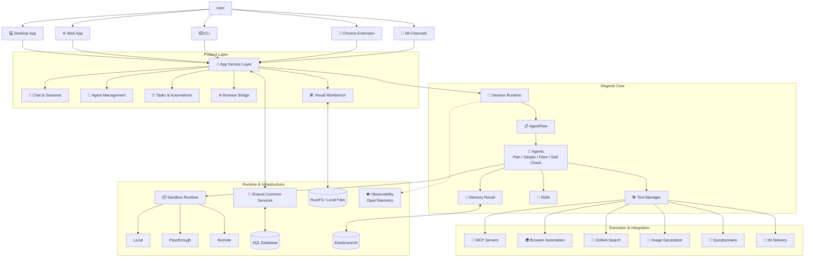

<div align="center">

# 🌟 **Experience Sage's Power**


[](README.md)
[](README_CN.md)
[](LICENSE)
[](https://python.org)
[](https://github.com/ZHangZHengEric/Sage)
[](https://deepwiki.com/ZHangZHengEric/Sage)
[](https://join.slack.com/t/sage-b021145/shared_invite/zt-3t8nabs6c-qCEDzNUYtMblPshQTKSWOA)

# 🧠 **Sage Agent Platform**

### 🎯 **From Complex Work to Reliable Delivery**

> 🌟 **A production-ready agent platform for task execution, automation, browser workflows, IM delivery, and enterprise deployment.**

</div>

---

## 📸 **Product Screenshots**

<div align="center">

<table>
  <tr>
    <td align="center" width="33%">
      
      <br/><strong>Visual Workbench</strong>
    </td>
    <td align="center" width="33%">
      
      <br/><strong>Real-time Collaboration</strong>
    </td>
    <td align="center" width="33%">
      
      <br/><strong>Multi-format Support</strong>
    </td>
  </tr>
</table>

</div>

> 📖 **Detailed Documentation**: [https://wiki.sage.zavixai.com/](https://wiki.sage.zavixai.com/)

---

## ✨ **Key Features**

- 🤖 **Planning to Delivery**: Built-in planning, execution, self-check, memory recall, and tool suggestion agents for complex task completion.
- 🌐 **Multi-Entry Product Surface**: Use Sage from desktop, web, CLI, and Chrome extension depending on the workflow.
- 🔁 **Automation & Recurring Tasks**: Run scheduled jobs, questionnaire-driven collection flows, and long-running operational tasks with progress visibility.
- 💬 **Omnichannel IM Integration**: Connect WeChat Personal (iLink), WeCom, Feishu, and DingTalk with message and file delivery support.
- 🧰 **Unified Tooling System**: Combine built-in tools, Skills, MCP servers, browser automation, search, and image generation in one execution stack.
- 🛡️ **Sandboxed Execution**: Local, passthrough, and remote sandbox options for safer agent runtime isolation.
- 🛠️ **Visual Workbench**: Inspect files, tool outputs, code, charts, Mermaid, Draw.io, audio, video, and remote previews in one workspace.
- 🏢 **Enterprise-Ready Foundation**: OAuth2, configurable auth and CORS, shared service architecture, CI coverage, and deployable multi-platform packaging.

---

## 🚀 **Quick Start**

### Installation

```bash
git clone https://github.com/ZHangZHengEric/Sage.git
cd Sage
```

### Running Sage

**Option 1: One-Command Startup (Recommended for Development)**

```bash
# 1. Optional: activate your environment first
# conda activate your-env

# 2. Set your LLM API Key
export SAGE_DEFAULT_LLM_API_KEY="your-api-key"
export SAGE_DEFAULT_LLM_API_BASE_URL="https://api.deepseek.com/v1"
export SAGE_DEFAULT_LLM_MODEL_NAME="deepseek-chat"

# 3. Run the startup script
./scripts/dev-up.sh
```

The script will automatically:
- Check Python (>= 3.10) and Node.js (>= 18) versions
- Create configuration files (minimal mode: SQLite, no external dependencies)
- Install dependencies and start both backend and frontend services
- Create `logs/server.log` automatically
- Honor `SAGE_PORT` from `.env` for backend startup and health checks

Optional overrides:

```bash
# Explicitly choose a Python executable
PYTHON_BIN=/path/to/python ./scripts/dev-up.sh

# Use uv instead of python -m pip / python -m ...
USE_UV=1 ./scripts/dev-up.sh
```

**First time?** The script will prompt you to choose between:
- **Minimal mode**: SQLite, no external dependencies (recommended for quick start)
- **Full mode**: MySQL + Elasticsearch + RustFS (for production-like environment)

After starting, open: http://localhost:5173

**Option 2: Desktop Application (Recommended for Users)**

Download the latest desktop package from [GitHub Releases](https://github.com/ZHangZHengEric/Sage/releases):
- **macOS**: `.dmg` (Intel & Apple Silicon)
- **Windows**: `.exe` / `.msi`
- **Linux**: `.deb` (x86_64 / arm64)

#### Desktop Installation Guide

**macOS**

1. Download the `.dmg` for your CPU architecture and open it.
2. Drag `Sage.app` into the `Applications` folder.
3. The current macOS build is not yet signed/notarized by Apple. If you see a warning that the developer cannot be verified or Apple cannot check the app for malicious software, open `Applications`, right-click `Sage.app`, choose `Open`, and then click `Open` again in the dialog.
4. If macOS still blocks the app, go to `System Settings -> Privacy & Security`, find the Sage warning near the bottom, and click `Open Anyway`.
5. If macOS says the app is damaged or still refuses to launch, run the following command and try again:

```bash
xattr -dr com.apple.quarantine /Applications/Sage.app
```

**Windows**

1. Download the `.exe` installer and run it.
2. Follow the setup wizard to finish installation.
3. If Windows SmartScreen shows a warning, click `More info` -> `Run anyway`.

**Linux**

1. Download the `.deb` package for your architecture from [GitHub Releases](https://github.com/ZHangZHengEric/Sage/releases).
2. On Debian/Ubuntu, you can install it directly by double-clicking it, or by running:

```bash
sudo apt install ./Sage-<version>-<arch>.deb
```

If you prefer to build the desktop app from source, use the commands below.

```bash
# macOS/Linux
app/desktop/scripts/build.sh release

# Windows
./app/desktop/scripts/build_windows.ps1 release
```

**Command Line Interface (CLI)**:
```bash
# Install editable package
pip install -e .

# Configure the minimum runtime variables
export SAGE_DEFAULT_LLM_API_KEY="your-api-key"
export SAGE_DEFAULT_LLM_API_BASE_URL="https://api.deepseek.com/v1"
export SAGE_DEFAULT_LLM_MODEL_NAME="deepseek-chat"
export SAGE_DB_TYPE="file"

# Diagnose local runtime config
sage doctor

# Create a shared local CLI/Desktop config in ~/.sage/.sage_env if needed
sage config init

# Run a quick task
sage run --stats "Say hello briefly."

# Start an interactive chat session
sage chat
```

Detailed CLI usage is documented here:
- English: [docs/en/applications/CLI.md](docs/en/applications/CLI.md)
- 中文: [docs/zh/applications/CLI.md](docs/zh/applications/CLI.md)

The CLI now defaults to the same local data root as desktop: `~/.sage/`.
By default it reads `~/.sage/.sage_env` first, and then lets a repository-local `.env` override it for development.
When `--json` is enabled, the CLI emits stream events and appends a final `cli_stats` event for structured post-run inspection.

**Terminal UI (TUI preview)**:

```bash
# Make the local Sage CLI/backend available first
pip install -e .

# Configure the same minimum local runtime
export SAGE_DEFAULT_LLM_API_KEY="your-api-key"
export SAGE_DEFAULT_LLM_API_BASE_URL="https://api.deepseek.com/v1"
export SAGE_DEFAULT_LLM_MODEL_NAME="deepseek-chat"
export SAGE_DB_TYPE="file"

# Run the Rust TUI from source
cargo run --quiet --offline --manifest-path app/terminal/Cargo.toml
```

Current startup forms:

```bash
sage-terminal
sage-terminal run "inspect this repo"
sage-terminal chat "hello"
sage-terminal config init
sage-terminal config init /tmp/.sage_env --force
sage-terminal doctor
sage-terminal doctor probe-provider
sage-terminal provider verify
sage-terminal provider verify model=deepseek-chat base=https://api.deepseek.com/v1
sage-terminal sessions
sage-terminal sessions 25
sage-terminal sessions inspect latest
sage-terminal sessions inspect <session_id>
sage-terminal resume
sage-terminal resume latest
sage-terminal resume <session_id>
```

Detailed TUI usage is documented here:
- English: [docs/en/applications/TUI.md](docs/en/applications/TUI.md)
- 中文: [docs/zh/applications/TUI.md](docs/zh/applications/TUI.md)

**Web Application (FastAPI + Vue3)**:

```bash
# Start backend
python -m app.server.main

# Start frontend (in another terminal)
cd app/server/web
npm install
npm run dev
```

---

## 🏗️ **System Architecture**


```mermaid
graph TD
    User[User] --> Desktop[💻 Desktop App]
    User --> Web[🌐 Web App]
    User --> CLI[⌨️ CLI]
    User --> Ext[🧩 Chrome Extension]
    User --> IM[💬 IM Channels]

    Desktop --> AppLayer[🧭 App Service Layer]
    Web --> AppLayer
    CLI --> AppLayer
    Ext --> AppLayer
    IM --> AppLayer

    subgraph App[Product Layer]
        AppLayer --> Chat[💬 Chat & Sessions]
        AppLayer --> AgentsUI[🤖 Agent Management]
        AppLayer --> Tasks[⏰ Tasks & Automations]
        AppLayer --> Browser[🌐 Browser Bridge]
        AppLayer --> Workbench[🛠️ Visual Workbench]
    end

    subgraph Core[SAgents Core]
        AppLayer --> Runtime[🧠 Session Runtime]
        Runtime --> Flow[📋 AgentFlow]
        Flow --> Agents["🤖 Agents<br/>Plan / Simple / Fibre / Self-Check"]
        Agents --> Memory[🧠 Memory Recall]
        Agents --> Skills[🧩 Skills]
        Agents --> ToolMgr[🛠️ Tool Manager]
    end

    subgraph Tools[Execution & Integration]
        ToolMgr --> MCP[🔌 MCP Servers]
        ToolMgr --> BrowserTools[🌍 Browser Automation]
        ToolMgr --> Search[🔎 Unified Search]
        ToolMgr --> ImageGen[🎨 Image Generation]
        ToolMgr --> Questionnaire[📝 Questionnaire]
        ToolMgr --> IMTools[📨 IM Delivery]
    end

    subgraph RuntimeEnv[Runtime & Infrastructure]
        Agents --> Sandbox[📦 Sandbox Runtime]
        Sandbox --> Local[Local]
        Sandbox --> Pass[Passthrough]
        Sandbox --> Remote[Remote]
        AppLayer <--> Common[🧱 Shared Common Services]
        Common <--> DB[(SQL Database)]
        Memory <--> ES[(Elasticsearch)]
        Workbench <--> FS[(RustFS / Local Files)]
        Runtime -.-> Obs["👁️ Observability<br/>OpenTelemetry"]
    end
```

---

## 📅 **What's New in v1.1.0**

### 🤖 **SAgents Kernel Updates**

- **Execution Chain Enhancements**: Added `PlanAgent`, `SelfCheckAgent`, `MemoryRecallAgent`, and `ToolSuggestionAgent`
- **Context Efficiency**: Improved user input optimization and conversation history compression for long-running tasks
- **Session & Messaging**: Added edit-and-rerun support, richer progress feedback, and better session inspection workflows
- **Tooling Expansion**: Added questionnaire collection workflows and improved tool-call rendering, truncation, and observability

### 💻 **Product Layer Updates**

- **New Entry Points**: Added Sage CLI, Chrome extension, and browser automation tooling
- **Workbench Upgrades**: Expanded support for audio, video, Mermaid, Draw.io, remote file preview, and richer tool cards
- **Chat Experience**: Improved progress messages, delivery flow display, reasoning content presentation, and workspace interactions
- **IM Integrations**: Expanded WeChat Personal (iLink), WeCom, Feishu, and DingTalk support with stronger file messaging flows

### 🛡️ **Platform & Infrastructure**

- **Enterprise Readiness**: Added OAuth2, email verification, and stronger auth/CORS/security controls
- **Sandbox & Runtime**: Refactored local/passthrough/remote sandbox support and improved Node runtime/sidecar packaging
- **Shared Architecture**: Extracted reusable `common/` services, models, and schemas across desktop and server
- **Documentation & CI**: Rebuilt the docs structure, added CLI guides, and expanded CI/test coverage

**[View Full Release Notes](release_notes/v1.1.0.md)**

---

## 📚 **Documentation**

- 📖 **Full Documentation**: [https://wiki.sage.zavixai.com/](https://wiki.sage.zavixai.com/)
- 📝 **Release Notes**: [release_notes/](release_notes/)
- 🏗️ **Architecture**: See `sagents/`, `common/`, and `app/` for the core runtime and product layers
- 🔧 **Configuration**: Environment variables and config files in `app/desktop/`

---

## 🛠️ **Development**

### Project Structure

```
Sage/
├── sagents/                    # SAgents core runtime, flow, context, tools, sandbox
├── common/                     # Shared models, schemas, services, core clients
├── app/
│   ├── desktop/                # Desktop app (Python backend + Vue UI + Tauri shell)
│   ├── server/                 # Server app and web frontend
│   ├── cli/                    # Sage CLI entrypoint and services
│   └── chrome-extension/       # Browser extension and sidepanel
├── mcp_servers/                # IM, search, scheduler, image generation and more
├── docs/                       # English and Chinese documentation
└── release_notes/              # Version release notes
```

### Contributing

We welcome contributions! Please see our [GitHub Issues](https://github.com/ZHangZHengEric/Sage/issues) for tasks and discussions.

---

## 💖 **Sponsors**

<div align="center">

We are grateful to our sponsors for their support in making Sage better:

<table>
  <tr>
    <td align="center" width="33%">
      <a href="#" target="_blank">
        
      </a>
      <br/>
    </td>
    <td align="center" width="33%">
      <a href="#" target="_blank">
        
      </a>
    </td>
    <td align="center" width="33%">
      <a href="#" target="_blank">
        
      </a>
    </td>
  </tr>
</table>

</div>

---

## 🦌 **Join Our Community**

<div align="center">

### 💬 Connect with us

[](https://join.slack.com/t/sage-b021145/shared_invite/zt-3t8nabs6c-qCEDzNUYtMblPshQTKSWOA)

### 📱 WeChat Group


*Scan to join our WeChat community 🦌*

</div>

---

<div align="center">
Built with ❤️ by the Sage Team 🦌
</div>
