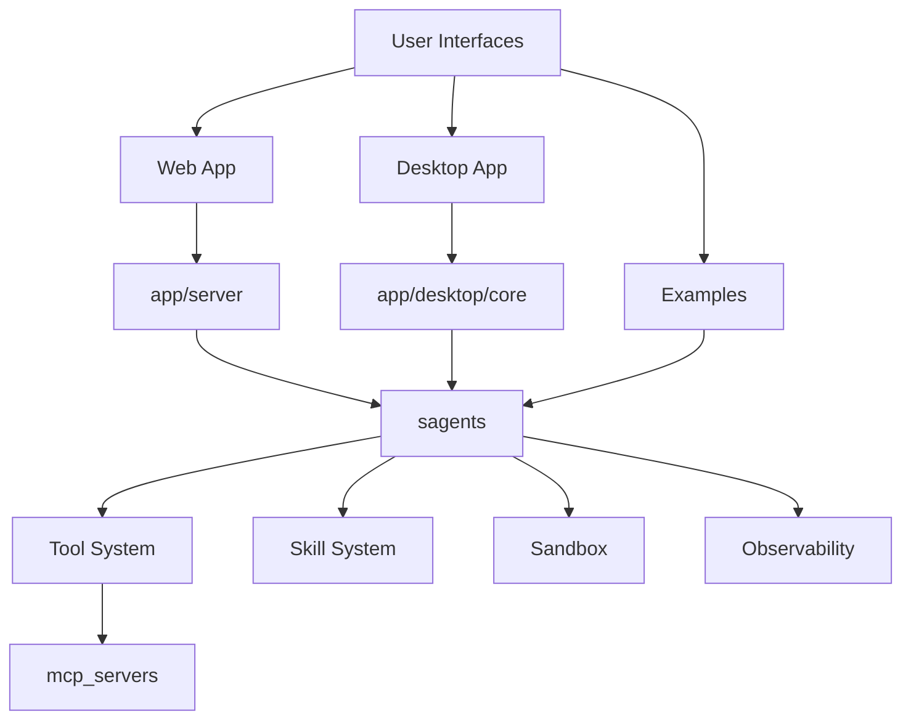

<div align="center">

# Sage


[](README.md)
[](README_CN.md)
[](LICENSE)
[](https://python.org)
[](https://github.com/ZHangZHengEric/Sage)
[](https://deepwiki.com/ZHangZHengEric/Sage)
[](https://join.slack.com/t/sage-b021145/shared_invite/zt-3t8nabs6c-qCEDzNUYtMblPshQTKSWOA)

Production-oriented multi-agent runtime and application stack for building, running, and extending Sage agents across CLI, web, and desktop surfaces.

</div>

## Why Sage

Sage is designed for teams that need more than a chat wrapper around an LLM. It combines a reusable multi-agent runtime with product-ready application surfaces so you can:

- run agent workflows through CLI, web, and desktop entry points
- extend capabilities through tools, skills, and MCP servers
- keep execution safer with sandbox support
- operate sessions with streaming output and observability hooks

## Highlights

- Multi-agent execution with `simple`, `multi`, and `fibre` runtime modes
- Tool, skill, and MCP extension model for custom capabilities
- Built-in sandboxing for safer runtime execution
- Streaming chat, session-based workflows, and resumable execution flows
- Web and desktop application shells on top of the same runtime concepts
- OpenTelemetry-oriented observability hooks

## What Sage Is

Sage is organized as a layered codebase:

- `sagents/`: core runtime, orchestration, tools, skills, sandboxing, and observability
- `app/server/`: main FastAPI application and Vue web client
- `app/desktop/`: desktop-local backend and desktop UI
- `examples/`: lightweight runnable examples
- `mcp_servers/`: built-in MCP server implementations

The repository includes both product-facing applications and the lower-level runtime they are built on.

## Product Surfaces

### Main server and web UI

Use this when you want the primary multi-user application stack.

- Backend entry: `app/server/main.py`
- Frontend source: `app/server/web/`

### Desktop app

Use this when you want the packaged local desktop experience.

- Bootstrap entry: `app/desktop/entry.py`
- Desktop backend: `app/desktop/core/main.py`

### Lightweight examples

Use these when you want the smallest possible feedback loop.

- `examples/sage_cli.py`
- `examples/sage_demo.py`
- `examples/sage_server.py`

## Screenshots

<div align="center">

<table>
  <tr>
    <td align="center" width="33%">
      
      <br/><strong>Visual Workbench</strong>
    </td>
    <td align="center" width="33%">
      
      <br/><strong>Streaming Chat</strong>
    </td>
    <td align="center" width="33%">
      
      <br/><strong>File Preview</strong>
    </td>
  </tr>
</table>

</div>

## Quick Start

### 1. Install dependencies

```bash
git clone https://github.com/ZHangZHengEric/Sage.git
cd Sage
pip install -r requirements.txt
```

### 2. Set minimum environment

```bash
export SAGE_DEFAULT_LLM_API_KEY="your-api-key"
export SAGE_DEFAULT_LLM_API_BASE_URL="https://api.deepseek.com/v1"
export SAGE_DEFAULT_LLM_MODEL_NAME="deepseek-chat"
```

### 3. Choose one entry point

Example CLI:

```bash
python examples/sage_cli.py \
  --default_llm_api_key "$SAGE_DEFAULT_LLM_API_KEY" \
  --default_llm_api_base_url "$SAGE_DEFAULT_LLM_API_BASE_URL" \
  --default_llm_model_name "$SAGE_DEFAULT_LLM_MODEL_NAME"
```

Main server:

```bash
python -m app.server.main
```

Health check:

```bash
curl http://127.0.0.1:8080/api/health
```

Web UI:

```bash
cd app/server/web
npm install
npm run dev
```

Streamlit demo:

```bash
streamlit run examples/sage_demo.py -- \
  --default_llm_api_key "$SAGE_DEFAULT_LLM_API_KEY" \
  --default_llm_api_base_url "$SAGE_DEFAULT_LLM_API_BASE_URL" \
  --default_llm_model_name "$SAGE_DEFAULT_LLM_MODEL_NAME"
```

## Learn More

- Technical docs: [`docs/README.md`](docs/README.md)
- Getting started guide: [`docs/GETTING_STARTED.md`](docs/GETTING_STARTED.md)
- Release notes: [`release_notes/`](release_notes/)
- DeepWiki: https://deepwiki.com/ZHangZHengEric/Sage
- Slack community: https://join.slack.com/t/sage-b021145/shared_invite/zt-3t8nabs6c-qCEDzNUYtMblPshQTKSWOA

## Architecture


```mermaid
flowchart TD
    User[User Interfaces] --> Web[Web App]
    User --> Desktop[Desktop App]
    User --> Examples[Examples]
    Web --> Server[app/server]
    Desktop --> DesktopCore[app/desktop/core]
    Server --> Runtime[sagents]
    DesktopCore --> Runtime
    Examples --> Runtime
    Runtime --> Tools[Tool System]
    Runtime --> Skills[Skill System]
    Runtime --> Sandbox[Sandbox]
    Runtime --> Obs[Observability]
    Tools --> MCP[mcp_servers]
```

## Repository Guide

```text
Sage/
├── sagents/          # Core runtime and orchestration
├── app/server/       # Main backend and web application
├── app/desktop/      # Desktop backend, UI, and packaging
├── examples/         # Lightweight runnable examples
├── mcp_servers/      # Built-in MCP server implementations
├── docs/             # Technical documentation
└── release_notes/    # Release-specific notes
```

## Documentation

Start with the technical docs in [`docs/`](docs/):

- [`docs/README.md`](docs/README.md)
- [`docs/GETTING_STARTED.md`](docs/GETTING_STARTED.md)
- [`docs/CORE_CONCEPTS.md`](docs/CORE_CONCEPTS.md)
- [`docs/ARCHITECTURE.md`](docs/ARCHITECTURE.md)
- [`docs/CONFIGURATION.md`](docs/CONFIGURATION.md)
- [`docs/API_REFERENCE.md`](docs/API_REFERENCE.md)
- [`docs/DEVELOPMENT.md`](docs/DEVELOPMENT.md)
- [`docs/TROUBLESHOOTING.md`](docs/TROUBLESHOOTING.md)

For a repository landing page, this README stays intentionally shorter than the docs site. The deeper technical detail lives in `docs/`.

## Development

Backend:

```bash
python -m app.server.main
```

Frontend:

```bash
cd app/server/web
npm install
npm run dev
```

Desktop build:

```bash
app/desktop/scripts/build.sh release
```

## Contributing

Contributions are welcome. When changing runtime behavior, prefer updating the matching page under `docs/` in the same change.

## Community

- Issues: https://github.com/ZHangZHengEric/Sage/issues
- Slack: https://join.slack.com/t/sage-b021145/shared_invite/zt-3t8nabs6c-qCEDzNUYtMblPshQTKSWOA

## License

MIT. See [`LICENSE`](LICENSE).
