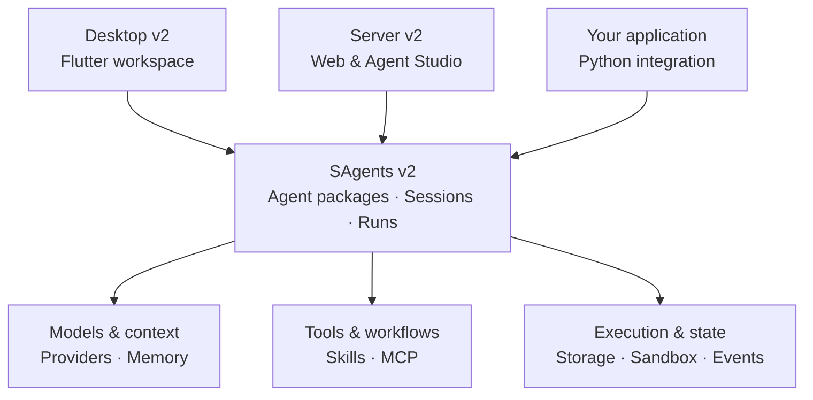

<div align="center">

# 🌟 **Experience Sage's Power**


[](README.md)
[](README_CN.md)
[](LICENSE)
[-blue.svg?logo=python)](https://python.org)
[](https://github.com/ZHangZHengEric/Sage)
[](https://deepwiki.com/ZHangZHengEric/Sage)
[](https://join.slack.com/t/sage-b021145/shared_invite/zt-3t8nabs6c-qCEDzNUYtMblPshQTKSWOA)

# 🧠 **Sage Agent Platform**

### 🎯 **From Complex Work to Reliable Delivery**

> 🌟 **An open-source agent platform for project work, tool execution, and multi-agent collaboration — on your desktop, on the web, or in your own application.**

</div>

---

## ✨ **Why Sage**

- 🧩 **Plugin-based architecture** — Compose model, memory, storage, tool, and scheduling providers with explicit contracts and managed lifecycles.
- 📦 **Declarative Agent packages** — Define instructions, capabilities, and runtime configuration in `sage.yaml`; manage immutable versions in Server Studio.
- 🔄 **Stateful, interactive execution** — Durable Session history, streamed events, and pause/resume with human input and approvals.
- 🤝 **Multi-agent orchestration** — Coordinate Studio members through directed messages, or compose Agent Flows in the runtime.
- 🔌 **An extensible tool ecosystem** — Bring built-in tools, reusable Skills, and MCP services into the same agent workflow.
- 🏗️ **One runtime, multiple hosts** — Use SAgents v2 through Desktop and Server, or embed it in your own Python application.

---

## 🚀 **Get Started**

| Choose your path | Start here |
| --- | --- |
| 💻 **Desktop v2** — Local projects and agent collaboration | [Desktop guide](app/desktop_v2/README.md) |
| 🌐 **Server v2** — Multi-user web access and Agent Studio | [Server guide](app/server_v2/README.md) |
| 🧠 **SAgents v2** — Build agents into your own application | [Runtime quick start](sagents/v2/README.md#quick-start) |
| 📦 **Desktop installers** — Available release builds | [Downloads & release instructions](https://github.com/ZHangZHengEric/Sage/releases) |

### 💻 Desktop from source

Requires **Python 3.12+** and **Flutter** with Dart `^3.12.2` and desktop support. On macOS:

```bash
git clone https://github.com/ZHangZHengEric/Sage.git
cd Sage
python3.12 -m venv .venv
source .venv/bin/activate
python -m pip install -e .
cd app/desktop_v2
flutter pub get
flutter run -d macos
```

**Add a model → Configure an Agent → Start a conversation or open a project.**

The app starts its local backend automatically. Settings and session data live in `~/sage/runtime`; the default workspace is `~/sage/agent_workspace`.

For Windows and Linux setup, see the [Desktop guide](app/desktop_v2/README.md). Packaged releases follow their own release instructions; the existing release workflow builds the legacy Tauri app.

### 🌐 Server from source

Requires **Python 3.12+**, **MySQL**, and **Node.js 22.12+**. From the checkout root, with the Python environment active:

```bash
python -m pip install -e '.[server-v2]'
cp app/server_v2/.env.example app/server_v2/.env
```

Set the MySQL connection, JWT secret, and initial administrator credentials in `.env`, then run:

```bash
cd app/server_v2/web
npm install
npm run build
cd ../../..
python -m app.server_v2
```

Open **[localhost:8090](http://localhost:8090)**. Add a model and an Agent to start chatting, or open **`/studio`** to manage Agent packages.

See the [Server guide](app/server_v2/README.md) for configuration. Server v2 currently supports **one worker**; MySQL persistence does not enable horizontal scaling.

### 🧑‍💻 Run your first SAgents v2 agent

After the Python setup above, save these two files in the same directory. The example prints runtime events and the final state.

**1. Define the agent — `sage.yaml`**

```yaml
# sage.yaml
schema_version: sage/v2
kind: application
metadata:
  id: com.example.assistant
  version: 1.0.0
  name: My Assistant
credentials:
  model-key:
    source: env
    key: MODEL_API_KEY
models:
  primary:
    provider: openai-responses
    base_url: https://api.openai.com/v1
    credential: model-key
    model: your-model
agents:
  main:
    name: My Assistant
    instructions:
      inline: Be helpful and concise.
    models:
      primary: primary
entrypoint:
  agent: main
```

**2. Start a Run — `quickstart.py`**

```python
# quickstart.py
import asyncio
from uuid import uuid4

from sagents.v2 import ActorRef, RequestContext, SAgentBuilder, StartRun
from sagents.v2.contracts.commands import InputItem
from sagents.v2.contracts.items import TextBlock
from sagents.v2.contracts.principals import PrincipalType


async def main():
    app = await SAgentBuilder().with_defaults(session_root="runtime").build("sage.yaml")
    try:
        context = RequestContext(actor=ActorRef(
            principal_id="user-1", principal_type=PrincipalType.USER,
        ))
        command = StartRun(
            agent_id="main",
            input=(InputItem(role="user", content=(TextBlock(text="Say hello!"),)),),
            resolved_spec_hash=app.composition_hash,
            idempotency_key=str(uuid4()),
        )
        stream = await app.entrypoint().run_stream(command, context)
        async for event in stream.events:
            print(event.model_dump_json())
        result = await stream.wait()
        print(result.state)
    finally:
        await app.close()


asyncio.run(main())
```

**3. Replace `your-model` with an available model ID, set your key, and run**

```bash
export MODEL_API_KEY="your-api-key"
python quickstart.py
```

This example calls the model without file or shell tools. [Tool integration and configuration →](sagents/v2/使用手册.md)

### ⌨️ More ways to use Sage

The existing [Web](docs/en/applications/WEB.md), [CLI](docs/en/applications/CLI.md), [TUI](docs/en/applications/TUI.md), and [Chrome extension](docs/en/applications/CHROME_EXTENSION.md) remain available. These use the legacy stack and have separate setup instructions. Desktop v2 does not import v1 settings or data.

---

## 🧠 **Built on SAgents v2**


```mermaid
flowchart TB
    desktop["Desktop v2<br/>Flutter workspace"]
    server["Server v2<br/>Web & Agent Studio"]
    custom["Your application<br/>Python integration"]

    runtime["SAgents v2<br/>Agent packages · Sessions · Runs"]

    desktop --> runtime
    server --> runtime
    custom --> runtime

    runtime --> intelligence["Models & context<br/>Providers · Memory"]
    runtime --> capabilities["Tools & workflows<br/>Skills · MCP"]
    runtime --> execution["Execution & state<br/>Storage · Sandbox · Events"]
```

- 📦 **Agent package** — Define what an agent can do.
- 💬 **Session** — Keep its conversation history across Runs.
- ⚡ **Run** — Execute a task with live progress and interaction.

Your application owns the UI, authentication, and credentials. Built-in runtime configurations target a single process or host; local process execution is not container isolation.

[Explore the runtime →](sagents/v2/README.md) · [Read the architecture →](sagents/v2/ARCHITECTURE.md)

---

## 📚 **Documentation**

| Learn | Build |
| --- | --- |
| [Documentation index](docs/en/README.md) | [Runtime integration manual](sagents/v2/使用手册.md) |
| [Desktop v2](app/desktop_v2/README.md) | [Server Agent platform](docs/zh/architecture/SERVER_V2_AGENT_PLATFORM.md) |
| [Server v2](app/server_v2/README.md) | [Deployment](deploy/README.md) |
| [Release notes](release_notes/) | [Development changelog](change_log.md) |

Some component guides are currently in Chinese. Use the guide for your chosen entry point.

## 🛠️ **Contributing**

Explore [`sagents/v2/`](sagents/v2/) for the runtime, [`app/desktop_v2/`](app/desktop_v2/) for the desktop app, and [`app/server_v2/`](app/server_v2/) for the web platform.

Contributions are welcome through [Issues](https://github.com/ZHangZHengEric/Sage/issues) and pull requests. Include reproduction steps and run the affected component's checks: Python tests live in [`tests/`](tests/); Desktop v2 uses `flutter analyze` and `flutter test`.

## 💬 **Community**

<div align="center">

[](https://join.slack.com/t/sage-b021145/shared_invite/zt-3t8nabs6c-qCEDzNUYtMblPshQTKSWOA)
[](https://github.com/ZHangZHengEric/Sage/issues)

</div>

## 💖 **Sponsors**

<p align="center">
  
  &nbsp;&nbsp;&nbsp;&nbsp;&nbsp;&nbsp;
  
</p>

---

<div align="center">

[MIT License](LICENSE) · Built with ❤️ by the Sage Team 🦌

</div>
