<div align="center">

# 🌟 **Experience Sage's Power**


[](README.md)
[](README_CN.md)
[](LICENSE)
[](https://python.org)
[](https://github.com/ZHangZHengEric/Sage)
[](https://github.com/ZHangZHengEric/Sage/stargazers)

</div>

---

<div align="center">

# 🧠 **Sage Multi-Agent Framework**

### 🎯 **Making Complex Tasks Simple**

</div>

> 🌟 **A production-ready, modular, and intelligent multi-agent orchestration framework for complex problem solving**

**Sage** is an advanced multi-agent system that intelligently breaks down complex tasks into manageable subtasks through seamless agent collaboration. Built with enterprise-grade reliability and extensibility in mind, it provides **Deep Research Mode** for comprehensive analysis and **Rapid Execution Mode** for quick task completion.

## ✨ **Key Highlights**

<div align="center">

### 🎯 **Why Choose Sage?**

</div>

🧠 **Intelligent Task Decomposition** - Automatically breaks complex problems into manageable subtasks with dependency tracking  
🔄 **Agent Orchestration** - Seamless coordination between specialized agents with robust error handling  
🛠️ **Extensible Tool System** - Plugin-based architecture with MCP server support and auto-discovery  
⚡ **Dual Execution Modes** - Choose between thorough analysis or rapid execution based on your needs  
🌐 **Interactive Web Interface** - Modern React + FastAPI UI with real-time streaming visualization  
📊 **Advanced Token Tracking** - Comprehensive usage statistics and cost monitoring across all agents  
⚙️ **Rich Configuration** - Environment variables, config files, CLI options, and runtime updates  
🔧 **Developer Friendly** - Clean APIs, comprehensive docs, examples, and extensive error handling  
🎯 **Production Ready** - Robust error recovery, logging, retry mechanisms, and performance optimization

---

<div align="center">

### 🚀 **Start Your AI Journey Now!**

</div>

## 🤖 **Supported Models**

<div align="center">

### 🎯 **Extensively Tested Language Models**

</div>

### ✅ **Officially Tested Models**

<table align="center">
<tr>
<th>🏆 Model</th>
<th>🔧 API Identifier</th>
<th>🌟 Key Strengths</th>
<th>🎯 Best Use Cases</th>
</tr>
<tr>
<td><strong>🔥 DeepSeek-V3</strong></td>
<td><code>deepseek-chat</code></td>
<td>Excellent complex reasoning</td>
<td>Deep analysis, Code generation</td>
</tr>
<tr>
<td><strong>🌟 Qwen-3</strong></td>
<td><code>qwen-turbo</code>, <code>qwen-plus</code></td>
<td>Outstanding bilingual capabilities</td>
<td>Multilingual tasks, Text processing</td>
</tr>
<tr>
<td><strong>🧠 GPT-4.1</strong></td>
<td><code>gpt-4-turbo</code>, <code>gpt-4o</code></td>
<td>Premium performance for all tasks</td>
<td>Enterprise apps, Complex reasoning</td>
</tr>
<tr>
<td><strong>⚡ Claude-3.5 Sonnet</strong></td>
<td><code>claude-3-5-sonnet-20241022</code></td>
<td>Exceptional reasoning abilities</td>
<td>Creative writing, Logic analysis</td>
</tr>
</table>

### 🌐 **Compatible Providers**

<div align="center">

| 🏢 **Provider** | 🔗 **Integration** | 🌟 **Supported Models** |
|:---:|:---:|:---:|
| **OpenAI** | Direct API | All GPT models |
| **OpenRouter** | Unified API | 200+ models access |
| **Anthropic** | Native support | Claude family |
| **Google AI** | Official API | Gemini series |
| **DeepSeek** | Native API | All DeepSeek models |
| **Alibaba Cloud** | Direct integration | Qwen series |
| **Mistral AI** | Full support | All Mistral models |

</div>

> 💡 **Note**: While Sage is optimized for the models listed above, it's designed to work with any OpenAI-compatible API endpoint.

## 🏗️ Architecture Overview

```mermaid
graph LR
    U[User Input] --> AC[Agent Controller]
    AC --> WF
    AC --> RM

    subgraph WF[Workflow]
        A[Analysis Agent] --> B[Planning Agent] --> C[Execution Agent] --> D[Observation Agent] --> E[Summary Agent]
        D -- "if not complete" --> B
        C -- uses --> X[🛠️ Tool System]
    end
    E --> R[Result Display]

    subgraph RM["Resource & State Management"]
        F[TaskManager]
        G[MessageManager]
        H[Workspace]
    end
```



**Note:** _All workflow agents read/write state & context from Resource & State Management (right)._

## 🚀 Quick Start

### Installation

```bash
git clone https://github.com/ZHangZHengEric/Sage.git
cd Sage

# Install core dependencies
pip install -r requirements.txt

# Install dependencies for the FastAPI React demo
pip install -r examples/fastapi_react_demo/requirements.txt
```

#### 🔧 Dependencies Overview

Sage includes several powerful tool systems that require specific dependencies:

- **Core Framework**: `openai`, `pydantic`, `python-dotenv`
- **Tool System**: `chardet`, `docstring_parser`, `requests`, `httpx`
- **MCP Support**: `mcp`, `fastmcp` 
- **Web Interface**: `fastapi`, `uvicorn`, `websockets`
- **Demo Applications**: `streamlit`, `gradio`

All dependencies are automatically managed by the installation script.

### 🎮 Interactive Web Demo

Experience Sage through our beautiful web interface with real-time agent visualization. Supports DeepSeek-V3, OpenRouter, and OpenAI models.

### 🌐 Modern Web Application (FastAPI + React)

Experience Sage through our cutting-edge web application featuring a modern React frontend with FastAPI backend:


**Features:**
- 🤖 **Multi-Agent Collaboration** - Visual workflow with decomposition, planning, execution, observation, and summary
- 🧠 **Deep Thinking Mode** - Expandable thought bubbles showing agent reasoning process
- 🔄 **Custom Workflow Management** - Create, edit, and manage custom workflows with visual mind-map editor
- ⚡ **Response Interruption** - Stop AI responses at any time with graceful cancellation handling
- 🚀 **FastAPI Backend** - High-performance async API server with streaming support
- ⚛️ **React Frontend** - Modern responsive UI with Ant Design components
- 📡 **Real-time Communication** - WebSocket + SSE dual support for live updates
- 🎨 **Beautiful Interface** - Collapsible deep thinking bubbles with modern design
- 🔧 **Tool Management** - Automatic tool discovery and management
- 💡 **Rule Preferences** - Personalized AI behavior configuration with custom rules and preferences
- 📱 **Responsive Design** - Adapts to all screen sizes
- 🔧 **TypeScript Support** - Full type safety throughout

**Quick Start:** See [FastAPI React Demo README](examples/fastapi_react_demo/README.md) for detailed setup instructions.

**🎯 Try the Live Demo:** Experience all features immediately at [**Live Demo →**](http://36.133.44.114:20040/)

**Demo Features:**
- 💬 **Interactive Chat Interface** - Chat with AI agents using custom workflows
- 🔄 **Workflow Configuration** - Create and customize workflows with visual editor
- ⚡ **Response Interruption** - Click stop button to interrupt AI responses at any time
- 💡 **Rule Preferences** - Configure AI behavior with custom rules and preferences
- 🛠️ **System Configuration** - Adjust model settings, temperature, and other parameters
- 📊 **Real-time Monitoring** - Watch token usage and execution progress in real-time

Access the local application at `http://localhost:8080`. For detailed setup instructions, see the [FastAPI React Demo README](examples/fastapi_react_demo/README.md).

### 💻 **Command Line Usage**

Sage provides a powerful command-line interface for interactive AI agent conversations:

```bash
# Basic usage
python examples/sage_cli.py --api_key YOUR_API_KEY --model deepseek/deepseek-chat --base_url https://api.deepseek.com

# With advanced options
python examples/sage_cli.py \
  --api_key YOUR_API_KEY \
  --model deepseek/deepseek-chat \
  --base_url https://api.deepseek.com \
  --max_tokens 4096 \
  --temperature 0.2 \
  --workspace ./workspace
```

**CLI Features:**
- 🤖 **Interactive Conversations**: Natural language chat with AI agents
- 🔧 **Tool Integration**: Built-in MCP tools for file operations, web search, etc.
- 🧠 **Deep Thinking Mode**: Optional detailed reasoning process
- 👥 **Multi-Agent Support**: Complex task handling with agent collaboration
- 🎨 **Beautiful Interface**: Colored message frames with different visual effects
- ⚡ **Streaming Output**: Real-time AI responses for smooth interaction

**📖 For detailed CLI usage, configuration, and examples, see [Examples README](examples/README.md)**


## 🎯 Core Features

### 🤖 **Multi-Agent Collaboration (v0.9.5)**
- **Task Analysis Agent**: Enhanced deep understanding with context awareness and unified system prompt management
- **Task Decompose Agent**: Intelligent task breakdown with dependency analysis, parallel execution planning, and TaskManager integration
- **Planning Agent**: Strategic decomposition with dependency management, optimal tool selection, and MessageManager optimization
- **Executor Agent**: Intelligent tool execution with error recovery, retry mechanisms, parallel processing, and result management
- **Observation Agent**: Advanced progress monitoring with completion detection, quality assessment, and TaskManager state tracking
- **Summary Agent**: Comprehensive result synthesis with structured output, actionable insights, and execution history analysis
- **Task Router Agent**: 🆕 Intelligent task routing system that automatically directs tasks to the most suitable agents based on task type and complexity
- **Task Rewrite Agent**: Intelligent task reformulation and optimization for better execution
- **Task Stage Summary Agent**: Intermediate progress summarization and milestone tracking
- **Query Suggest Agent**: Smart query enhancement and suggestion generation
- **Workflow Select Agent**: Intelligent workflow selection and optimization
- **Simple Agent**: Lightweight agent for basic tasks and rapid prototyping with optimized tool handling logic
- **Simple React Agent**: Reactive agent with real-time response capabilities
- **Common Agent**: General-purpose agent for standard operations
- **Message Manager**: Smart message filtering and compression system for token optimization across all agents
- **Task Manager**: Structured task lifecycle management with state persistence and dependency tracking

### 🔄 **Custom Workflow Engine**
- **Visual Workflow Editor**: Interactive drag-and-drop interface for creating custom workflows with mind-map visualization
- **Predefined Templates**: Ready-to-use workflows for research reports, product development, content creation, and more
- **Smart Step Management**: Hierarchical workflow structure with main steps and sub-steps for complex task organization
- **Real-time Preview**: Live visualization of workflow structure with automatic layout and connection rendering
- **Workflow Stability**: Deterministic execution paths with consistent results for production environments
- **Template Sharing**: Export/import workflow configurations and share across teams and projects
- **Zoom & Pan Support**: Navigate large workflows with mouse wheel zoom and drag-to-pan functionality
- **Auto-fit Display**: Intelligent viewport adjustment to show all workflow nodes at optimal scale

### 🎭 **Custom Agent Development**
- **AgentBase Framework**: Abstract base class for creating custom agents with standardized interfaces
- **Agent-to-Tool Conversion**: Automatic conversion of agents to tool format for seamless integration
- **Streaming Support**: Built-in streaming capabilities for real-time agent responses
- **Context Management**: Unified session context and system message handling
- **Plugin Architecture**: Extensible plugin system for custom agent implementations
- **Agent Registration**: Dynamic agent discovery and registration from directories

### 🔀 **Agent Flow Orchestration**
- **Sequential Execution**: Define custom agent execution sequences with AgentFlow
- **Session Management**: Automatic session context initialization and cleanup
- **Workflow Integration**: Support for available_workflows parameter in agent flows
- **Error Recovery**: Robust error handling with session state preservation
- **Interruption Support**: Graceful handling of workflow interruptions
- **Memory Management**: Automatic cleanup to prevent memory leaks

### 💡 **Rule Preferences System**
- **Personalized AI Behavior**: Configure AI assistant behavior with custom rules and preferences
- **Code Style Preferences**: Define coding standards, naming conventions, and style guidelines
- **Response Language Settings**: Control language preferences and localization settings
- **Detail Level Control**: Adjust verbosity and explanation depth according to your needs
- **Template Library**: Quick-start templates for common preference patterns
- **Real-time Management**: Add, edit, enable/disable rules through intuitive web interface
- **Context Integration**: Rules automatically apply across all agent interactions

### 📨 **Message Manager - Smart Token Optimization**
- **Intelligent Filtering**: Agent-specific message filtering strategies for optimal context management
- **Automatic Compression**: Smart message compression reducing token usage by 30-70%
- **Session Isolation**: Independent message managers per session preventing cross-contamination
- **Agent-Specific Strategies**: Customized filtering for each agent type (TaskDecompose, Planning, Executor, etc.)
- **Real-time Statistics**: Live compression metrics and optimization tracking
- **State Persistence**: Automatic saving and restoration of message manager state

### 📋 **Task Manager - Comprehensive State Management**
- **Task Lifecycle Management**: Complete task creation, execution, and completion tracking
- **Dependency Tracking**: Smart dependency resolution and execution ordering
- **State Persistence**: Automatic task state saving to workspace files
- **Progress Monitoring**: Real-time task progress and completion status
- **Session Integration**: Seamless integration with AgentController for workflow management
- **Structured Data**: Rich task objects with metadata, timing, and result storage

### 📁 **Advanced File System Operations**
- **Smart Content Search**: Multi-keyword search with context extraction and relevance scoring
- **Encoding Detection**: Automatic character encoding detection for international files
- **Security Validation**: Path traversal protection and dangerous file detection
- **Metadata Extraction**: Comprehensive file information including size, permissions, and timestamps
- **Range Reading**: Efficient partial file reading with line-based navigation
- **Error Recovery**: Robust error handling with detailed diagnostic information

### 🛠️ **Advanced Tool System**
- **Plugin Architecture**: Hot-reloadable tool development with automatic registration and versioning
- **MCP Server Support**: Seamless integration with Model Context Protocol servers and remote APIs, with added API key authentication for SSE MCP server connections
- **Built-in MCP Servers**: Pre-built servers for file operations, parsing, command execution, and web search
- **Auto-Discovery**: Intelligent tool detection from directories, modules, and remote endpoints
- **Type Safety**: Comprehensive parameter validation with schema enforcement and runtime checks
- **Error Handling**: Robust error recovery, timeout management, retry strategies, and detailed logging
- **Performance Monitoring**: Tool execution time tracking, bottleneck detection, and optimization suggestions
- **Security Features**: Path validation, dangerous file detection, and protected directory access control

### 📊 **Token Usage & Cost Monitoring**
- **Real-time Tracking**: Monitor token consumption across all agents and operations with MessageManager optimization
- **Detailed Analytics**: Input, output, cached, and reasoning token breakdown with compression statistics
- **Cost Estimation**: Calculate costs based on model pricing and usage patterns with savings tracking
- **Performance Metrics**: Track execution time, success rates, efficiency, and token reduction rates
- **Smart Optimization**: Automatic message filtering and compression reducing token usage by 30-70%
- **Export Capabilities**: CSV, JSON export for further analysis including optimization metrics


### 💡 **Rule Preferences Configuration**
- **Web Interface**: Configure rules through the modern React interface at `/rules`
- **Runtime Application**: Rules automatically apply to all agent interactions
- **Template System**: Quick-start with predefined rule templates
- **Export/Import**: Share rule configurations across environments

### ⚙️ **Rich Configuration System**
- **Environment Variables**: `SAGE_DEBUG`, `OPENAI_API_KEY`, `SAGE_MAX_LOOP_COUNT`, etc.
- **Config Files**: YAML/JSON configuration with validation and hot-reload
- **Runtime Updates**: Dynamic configuration changes without restart
- **CLI Options**: Comprehensive command-line interface with help system
- **Profile Management**: Save and load configuration profiles

### 🔄 **Execution Modes**

#### Deep Research Mode (Recommended for Complex Tasks)
- Enable comprehensive task analysis and detailed decomposition
- Generate detailed summary with insights
- Full multi-agent pipeline execution

#### Standard Execution Mode (Balanced Performance)
- Enable task analysis
- Generate summary
- Skip detailed decomposition phase

#### Rapid Execution Mode (Maximum Speed)
- Skip analysis phase
- Direct execution
- Minimize processing time

## 📊 Real-time Streaming & Monitoring

Watch your agents work in real-time with detailed progress tracking and performance metrics, supporting real-time statistics and monitoring capabilities.

## 🔧 Advanced Tool Development

Create sophisticated custom tools with full framework integration, including caching, validation, error handling, and advanced features.

## 🛡️ Error Handling & Reliability

Sage includes comprehensive error handling and recovery mechanisms with automatic retry, exponential backoff, and exception management.

## 📈 Performance Monitoring

Monitor and optimize your agent performance with detailed tracking, statistics analysis, and bottleneck identification.

## 🔌 MCP Server Integration

Seamlessly integrate with Model Context Protocol servers, supporting automatic tool discovery and remote API calls.

### 🏗️ **Built-in MCP Servers**

Sage includes several production-ready MCP servers:

#### 📁 **File System Server**
- **Smart File Operations**: Advanced file reading with line range support and encoding detection
- **Security Controls**: Path validation, dangerous file detection, and protected directory access
- **Cloud Integration**: Optional cloud upload capabilities
- **Batch Processing**: Multi-file operations with error handling

#### 📄 **File Parser Server**
- **Multi-Format Support**: 20+ file formats including PDF, Word, Excel, PowerPoint, HTML, and more
- **Intelligent Extraction**: Smart text extraction with metadata preservation
- **Web Content**: URL parsing and HTML content extraction
- **Batch Processing**: Multiple file parsing with performance optimization

#### ⚡ **Command Execution Server**
- **Secure Execution**: Safe command execution with timeout management
- **Cross-Platform**: Windows, macOS, and Linux support
- **Error Handling**: Comprehensive error capture and reporting
- **Security Features**: Command validation and execution sandboxing

#### 🔍 **Web Search Server**
- **Serper Integration**: High-quality web search results
- **Content Extraction**: Automatic content parsing from search results
- **Rate Limiting**: Built-in request throttling
- **Result Formatting**: Clean, structured search output

### 🔧 **MCP Configuration**

Sage supports three MCP connection types:

#### 📡 **STDIO Connection**
```json
{
  "mcpServers": {
    "file_system": {
      "command": "python",
      "args": ["./mcp_servers/file_system/file_system.py"],
      "connection_type": "stdio"
    }
  }
}
```

#### 🌐 **SSE (Server-Sent Events) Connection**
```json
{
  "mcpServers": {
    "file_parser": {
      "sse_url": "http://127.0.0.1:34001/sse",
      "api_key": "your-api-key"
    }
  }
}
```

#### ⚡ **Streamable HTTP Connection**
```json
{
  "mcpServers": {
    "web_service": {
      "streamable_http_url": "http://api.example.com/mcp",
      "api_key": "your-api-key"
    }
  }
}
```

### 🔗 **Connection Type Comparison**

| Connection Type | Use Case | Advantages | Best For |
|:---:|:---:|:---:|:---:|
| **STDIO** | Local processes | Low latency, secure | Development, local tools |
| **SSE** | Remote servers | Real-time streaming | Cloud services, live data |
| **Streamable HTTP** | Web APIs | HTTP compatibility | REST APIs, microservices |

### 🛡️ **Security Features**
- **API Key Authentication**: Secure access control for remote MCP servers
- **Connection Validation**: Automatic health checks and connection monitoring
- **Error Recovery**: Robust reconnection and failover mechanisms
- **Rate Limiting**: Built-in request throttling and quota management

## 🎭 Custom Agent Development

### 🏗️ **Creating Custom Agents**

```python
from sagents.agent.agent_base import AgentBase
from sagents.context.session_context import SessionContext
from sagents.context.messages.message import MessageChunk, MessageRole, MessageType

class CustomResearchAgent(AgentBase):
    """Custom agent for specialized research tasks"""
    
    def __init__(self, model, model_config):
        super().__init__(model, model_config, system_prefix="Research Agent")
        self.agent_description = "Specialized agent for in-depth research and analysis"
    
    def run_stream(self, session_context: SessionContext, tool_manager=None, session_id=None):
        """Implement custom agent logic"""
        # Access conversation history
        messages = session_context.message_manager.get_messages_for_llm()
        
        # Custom research logic here
        research_prompt = "Conduct thorough research on the given topic..."
        
        # Stream responses
        for chunk in self._call_llm_streaming(
            messages + [{"role": "user", "content": research_prompt}],
            session_id=session_id,
            step_name="research_analysis"
        ):
            yield [chunk]
```

### 🔀 **Agent Flow Orchestration**

```python
from sagents.agent_flow import AgentFlow
from sagents.agent.task_analysis_agent import TaskAnalysisAgent
from sagents.agent.task_planning_agent import PlanningAgent
from sagents.agent.task_executor_agent import ExecutorAgent

# Define custom agent sequence
custom_agents = [
    TaskAnalysisAgent(model, model_config),
    CustomResearchAgent(model, model_config),
    PlanningAgent(model, model_config),
    ExecutorAgent(model, model_config)
]

# Create agent flow
agent_flow = AgentFlow(custom_agents, workspace="./workspace")

# Execute with streaming
for message_chunks in agent_flow.run_stream(
    input_messages=messages,
    tool_manager=tool_manager,
    session_id="custom-session",
    system_context={
        "project_type": "research",
        "domain": "AI/ML"
    }
):
    # Process streaming results
    for chunk in message_chunks:
        print(f"{chunk.role}: {chunk.content}")
```

### 🛠️ **Agent-to-Tool Conversion**

```python
# Convert agent to tool for use in other workflows
research_tool = CustomResearchAgent(model, model_config).to_tool()

# Register with tool manager
tool_manager.register_tool(research_tool)

# Now available as a tool in other agent workflows
result = tool_manager.run_tool(
    "CustomResearchAgent",
    messages=messages,
    session_id=session_id
)
```

## 📚 Documentation

- **[Quick Start Guide](docs/QUICK_START.md)** - Get up and running in 5 minutes
- **[Architecture Overview](docs/ARCHITECTURE.md)** - Detailed system design
- **[API Reference](docs/API_REFERENCE.md)** - Complete API documentation
- **[Tool Development](docs/TOOL_DEVELOPMENT.md)** - Create custom tools
- **[Configuration Guide](docs/CONFIGURATION.md)** - Advanced configuration options
- **[Examples](docs/EXAMPLES.md)** - Real-world usage examples

## 🎯 Production Deployment

Sage is production-ready with enterprise features, supporting configuration management, logging, and monitoring capabilities.

## 🎯 Key Features Spotlight

### 🔄 Custom Workflow Management

Create, edit, and visualize custom workflows with our interactive mind-map editor, supporting automatic workflow selection and intelligent execution.

**Visual Editor Features:**
- 🎨 **Mind-map visualization** with hierarchical node layout
- 🖱️ **Interactive editing** - click to edit nodes directly
- 🔍 **Zoom & Pan** - navigate large workflows with mouse controls
- 📐 **Auto-fit display** - intelligent viewport adjustment
- 💾 **Template system** - save and reuse workflow configurations

### ⚡ Response Interruption

Stop AI responses at any time with graceful cancellation and resource cleanup, with web interface support for stopping responses via button click.

**Interruption Features:**
- 🛑 **Immediate stopping** - responses halt within 1-2 seconds
- 🧹 **Resource cleanup** - proper memory and connection management
- 💾 **State preservation** - partial results are saved and accessible
- 🔄 **Resumable execution** - continue from interruption point if needed

## 🔄 Recent Updates (v0.9.5)

### ✨ New Features
- **Task Router Agent**: 🆕 Intelligent task routing system that automatically directs tasks to the most suitable agents based on task type and complexity
- **Unified Tool Interface**: Standardized tool calling interface using session_context instead of messages parameter for better consistency
- **Enhanced Workflow Display**: Improved workflow step visualization with detailed step descriptions and progress indicators
- **Optimized Simple Agent**: Enhanced tool handling logic that returns directly when tool count is minimal for better performance
- **Simplified Configuration**: Updated .gitignore with streamlined __pycache__ configuration for cleaner project structure
- **Advanced File Search**: Enhanced file content search with multi-keyword support, context extraction, and relevance scoring
- **Built-in MCP Servers**: Four production-ready MCP servers for file operations, parsing, command execution, and web search
- **Triple MCP Connection Support**: STDIO, SSE, and Streamable HTTP connection types with API key authentication
- **Extended Agent Ecosystem**: 14 specialized agents including Task Router, Task Rewrite, Query Suggest, Workflow Select, and more
- **Custom Agent Development**: AgentBase framework for creating specialized agents with standardized interfaces
- **Agent Flow Orchestration**: Sequential agent execution with AgentFlow for custom workflow design
- **Agent-to-Tool Conversion**: Automatic conversion of agents to tools for seamless integration

### 🔧 Technical Improvements
- **Interface Standardization**: Unified tool calling patterns across all agents for better maintainability
- **Performance Optimization**: Improved file reading with range-based operations and metadata caching
- **Error Recovery**: Enhanced error handling with detailed diagnostic information and recovery strategies
- **Type Safety**: Comprehensive parameter validation with schema enforcement
- **Memory Management**: Optimized memory usage for large file operations
- **Streaming Support**: Real-time streaming capabilities for long-running operations
- **Workflow Visualization**: Enhanced step display with descriptive information and better user experience

### 🐛 Bug Fixes
- **Tool Interface Consistency**: Standardized tool calling interface across all agent types
- **Workflow Step Display**: Improved step description rendering and progress tracking
- **Simple Agent Optimization**: Fixed tool handling logic for scenarios with minimal tool requirements
- **Configuration Management**: Streamlined project configuration and dependency management
- **Framework Stability**: Enhanced overall system reliability and error recovery

## 📄 License

This project is licensed under the MIT License - see the [LICENSE](LICENSE) file for details.

## 🙏 Acknowledgments

- OpenAI for the powerful language models
- DeepSeek for the exceptional V3 model
- Alibaba Cloud for the Qwen series
- The open-source community for inspiration and tools
- All contributors who help make Sage better

---

<div align="center">
  <sub>Built with ❤️ by the Sage team</sub>
</div>