<div align="center">

# 🌟 **Experience Sage's Power**


[](README.md)
[](README_CN.md)
[](LICENSE)
[](https://python.org)
[](https://github.com/ZHangZHengEric/Sage)

# 🧠 **Sage Multi-Agent Framework**

### 🎯 **Making Complex Tasks Simple**

> 🌟 **A production-ready, modular, and intelligent multi-agent orchestration framework for complex problem solving.**

</div>

---

## ✨ **Key Features**

- 🧠 **Intelligent Task Decomposition**: Automatically breaks down complex problems with dependency tracking.
- 🔄 **Agent Orchestration**: Seamless coordination between specialized agents (Planning, Execution, Observation, Summary, Rewrite, Router).
- 🛠️ **Extensible Tool System**: Plugin-based architecture supporting **MCP Servers** (Model Context Protocol) and auto-discovery.
- 👁️ **Full Observability**: Integrated **Jaeger** distributed tracing to visualize agent thought processes and execution paths.
- ⚡ **Dual Modes**: **Deep Research** for analysis and **Rapid Execution** for speed.
- 📊 **Context Management**: Advanced **Context Budget** controls for precise token optimization (v0.9.7+).
- 🌐 **Modern UI**: Vue3 + FastAPI web interface with real-time streaming and visualization.
- 🐍 **Python 3.11+ Optimized**: Fully typed and linted codebase for enterprise-grade reliability.

## 🚀 **Quick Start**

### Installation

```bash
git clone https://github.com/ZHangZHengEric/Sage.git
cd Sage
pip install -r requirements.txt
# For Web UI
pip install -r app/server/requirements.txt
```

### Running Sage

**Interactive Web Demo (Streamlit)**:
```bash
streamlit run app/sage_demo.py -- \
  --default_llm_api_key YOUR_API_KEY \
  --default_llm_model deepseek-chat \
  --default_llm_api_base_url https://api.deepseek.com
```

> If you get "ModuleNotFoundError: No module named 'sagents'", set PYTHONPATH: `export PYTHONPATH=/path/to/your/Sage:$PYTHONPATH`

**Command Line Interface (CLI)**:
```bash
python app/sage_cli.py \
  --default_llm_api_key YOUR_API_KEY \
  --default_llm_model deepseek-chat \
  --default_llm_base_url https://api.deepseek.com
```

**Modern Web App (FastAPI + Vue3)**:

The modern web application is now structured as `app/server` (Backend) and `app/web` (Frontend).

**Deploy with Docker Compose (Recommended)**:
```bash
docker-compose up -d
```
Access the application at `http://localhost:30051` (Web) / `http://localhost:30050/docs` (API).

## 🤖 **Supported Models**

```mermaid
graph LR
    U[User Input] --> AC[Agent Controller]
    AC --> WF
    AC --> RM

    subgraph WF[Workflow]
        A[Analysis] --> B[Planning] --> C[Execution] --> D[Observation] --> E[Summary]
        D -- "Loop" --> B
        C -- uses --> X[🛠️ Tool System]
    end
    E --> R[Result]

    subgraph RM[Resource Management]
        F[TaskManager]
        G[MessageManager]
        H[Workspace]
    end
```



## 📅 **What's New in v0.9.7**

- **Context Budget**: New parameters (`--context_history_ratio`, etc.) for granular context control.
- **Unified Parameters**: Standardized `default_llm_*` arguments across Server, CLI, and Demo.
- **Stability**: Full Python 3.11+ type safety compliance and code style optimizations.
- **[View Full Release Notes](release_notes/v0.9.7.md)**

## 📚 **Documentation**

- [**Full Documentation Home**](docs/README.md)
- [**Server Deployment Guide**](docs/SERVER_DEPLOYMENT.md) - Docker & Source deployment
- [**Examples Usage Guide**](docs/EXAMPLES_USAGE.md) - CLI, Web, & API Server
- [**Changelog**](docs/CHANGELOG.md) - Latest updates & history
- [**Agent Framework Architecture**](docs/ARCHITECTURE.md)
- [**API Reference**](docs/API_REFERENCE.md)
- [**Configuration Guide**](docs/CONFIGURATION.md)
- [**Tool Development**](docs/TOOL_DEVELOPMENT.md)

---
<div align="center">
Built with ❤️ by the Sage Team
</div>
