<div align="center">

# 🌟 **Experience Sage's Power**


[](README.md)
[](README_CN.md)
[](LICENSE)
[](https://python.org)
[](https://github.com/ZHangZHengEric/Sage)

# 🧠 **Sage Multi-Agent Framework**

### 🎯 **Making Complex Tasks Simple**

> 🌟 **A production-ready, modular, and intelligent multi-agent orchestration framework for complex problem solving.**

</div>

---

## ✨ **Key Features**

- 🧠 **Multi-Agent Orchestration**: Support for both **TaskExecutor** (Sequential) and **FibreAgent** (Parallel) orchestration modes.
- 🏗️ **Enterprise Architecture**: Robust storage layer powered by **Elasticsearch** (Vector), **RustFS** (Object), and **SQLAlchemy** (Relational).
- � **RAG Engine 2.0**: Advanced Retrieval-Augmented Generation with **RRF** (Reciprocal Rank Fusion) and hybrid search.
- 🛡️ **Secure Sandbox**: Isolated execution environment (`sagents.utils.sandbox`) for safe agent code execution.
- 👁️ **Full Observability**: Integrated **OpenTelemetry** tracing to visualize agent thought processes and execution paths.
- 🧩 **Modular Components**: Plug-and-play architecture for **Skills**, **Tools**, and **MCP Servers**.
- 📊 **Context Management**: Advanced **Context Budget** controls for precise token optimization.
- 🐍 **Python 3.11+ Optimized**: Fully typed and linted codebase for enterprise-grade reliability.

## 🚀 **Quick Start**

### Installation

```bash
git clone https://github.com/ZHangZHengEric/Sage.git
cd Sage
pip install -r requirements.txt
# For Web UI
pip install -r app/server/requirements.txt
```

### Running Sage

**Interactive Web Demo (Streamlit)**:
```bash
streamlit run app/sage_demo.py -- \
  --default_llm_api_key YOUR_API_KEY \
  --default_llm_model deepseek-chat \
  --default_llm_api_base_url https://api.deepseek.com
```

> If you get "ModuleNotFoundError: No module named 'sagents'", set PYTHONPATH: `export PYTHONPATH=/path/to/your/Sage:$PYTHONPATH`

**Command Line Interface (CLI)**:
```bash
python app/sage_cli.py \
  --default_llm_api_key YOUR_API_KEY \
  --default_llm_model deepseek-chat \
  --default_llm_base_url https://api.deepseek.com
```

**Modern Web App (FastAPI + Vue3)**:

The modern web application is now structured as `app/server` (Backend) and `app/web` (Frontend).

**Deploy with Docker Compose (Recommended)**:
```bash
docker-compose up -d
```
Access the application at `http://localhost:30051` (Web) / `http://localhost:30050/docs` (API).

## 🏗️ **System Architecture**

```mermaid
graph TD
    User[User/Client] --> API[Sage Server API]
    API --> Orch[🧠 Agent Orchestrator]
    
    subgraph Core[Core Engine]
        Orch -- "Dispatches" --> Agents["🤖 Agents (Fibre/Standard)"]
        Agents -- "Uses" --> RAG[📚 RAG Engine]
        Agents -- "Uses" --> Tools[🛠️ Tools & Skills]
        Agents -- "Runs in" --> Box[📦 Security Sandbox]
    end

    subgraph Infra[Enterprise Infrastructure]
        RAG <--> ES[(Elasticsearch)]
        Tools <--> RustFS[(RustFS)]
        Orch <--> DB[(SQL Database)]
    end
    
    Core -.-> Obs["👁️ Observability (OpenTelemetry)"]
```



## 📅 **What's New in v0.9.9**

- **Smart Tool Selection**: Tool ID-based recommendation system for improved accuracy and unified Agent logic.
- **Task Scheduler MCP**: Built-in task scheduling service with SQLite persistence and cron job support.
- **Agent Hub MCP**: Inter-agent messaging center enabling multi-agent collaboration and delegation.
- **Brave Search MCP**: Web search integration for real-time information retrieval.
- **Dark Theme**: Full dark mode support with system preference detection.
- **Model Provider Management**: Dynamic LLM provider configuration with multi-source support.
- **Sub-task Visualization**: Real-time sub-agent execution tracking and message streaming.
- **Context Budget**: Intelligent context compression for long conversations.
- **[View Full Release Notes](release_notes/v0.9.9.md)**

## 📚 **Documentation**

- [**Full Documentation Home**](docs/README.md)
- [**Server Deployment Guide**](docs/SERVER_DEPLOYMENT.md) - Docker & Source deployment
- [**Examples Usage Guide**](docs/EXAMPLES_USAGE.md) - CLI, Web, & API Server
- [**Changelog**](docs/CHANGELOG.md) - Latest updates & history
- [**Agent Framework Architecture**](docs/ARCHITECTURE.md)
- [**API Reference**](docs/API_REFERENCE.md)
- [**Configuration Guide**](docs/CONFIGURATION.md)
- [**Tool Development**](docs/TOOL_DEVELOPMENT.md)

---
<div align="center">
Built with ❤️ by the Sage Team
</div>
