<div align="center">

# 🌟 **Experience Sage's Power**
### 🚀 [**Try Live Demo Now →**](http://36.133.44.114:20040/)


[](README.md)
[](README_CN.md)
[](LICENSE)
[](https://python.org)
[](https://github.com/ZHangZHengEric/Sage)
[](https://github.com/ZHangZHengEric/Sage/stargazers)

</div>

---

<div align="center">

# 🧠 **Sage Multi-Agent Framework**

### 🎯 **Making Complex Tasks Simple**

</div>

> 🌟 **A production-ready, modular, and intelligent multi-agent orchestration framework for complex problem solving**

**Sage** is an advanced multi-agent system that intelligently breaks down complex tasks into manageable subtasks through seamless agent collaboration. Built with enterprise-grade reliability and extensibility in mind, it provides **Deep Research Mode** for comprehensive analysis and **Rapid Execution Mode** for quick task completion.

## ✨ **Key Highlights**

<div align="center">

### 🎯 **Why Choose Sage?**

</div>

🧠 **Intelligent Task Decomposition** - Automatically breaks complex problems into manageable subtasks with dependency tracking  
🔄 **Agent Orchestration** - Seamless coordination between specialized agents with robust error handling  
🛠️ **Extensible Tool System** - Plugin-based architecture with MCP server support and auto-discovery  
⚡ **Dual Execution Modes** - Choose between thorough analysis or rapid execution based on your needs  
🌐 **Interactive Web Interface** - Modern React + FastAPI UI with real-time streaming visualization  
📊 **Advanced Token Tracking** - Comprehensive usage statistics and cost monitoring across all agents  
⚙️ **Rich Configuration** - Environment variables, config files, CLI options, and runtime updates  
🔧 **Developer Friendly** - Clean APIs, comprehensive docs, examples, and extensive error handling  
🎯 **Production Ready** - Robust error recovery, logging, retry mechanisms, and performance optimization

---

<div align="center">

### 🚀 **Start Your AI Journey Now!**

</div>

## 🤖 **Supported Models**

<div align="center">

### 🎯 **Extensively Tested Language Models**

</div>

### ✅ **Officially Tested Models**

<table align="center">
<tr>
<th>🏆 Model</th>
<th>🔧 API Identifier</th>
<th>🌟 Key Strengths</th>
<th>🎯 Best Use Cases</th>
</tr>
<tr>
<td><strong>🔥 DeepSeek-V3</strong></td>
<td><code>deepseek-chat</code></td>
<td>Excellent complex reasoning</td>
<td>Deep analysis, Code generation</td>
</tr>
<tr>
<td><strong>🌟 Qwen-3</strong></td>
<td><code>qwen-turbo</code>, <code>qwen-plus</code></td>
<td>Outstanding bilingual capabilities</td>
<td>Multilingual tasks, Text processing</td>
</tr>
<tr>
<td><strong>🧠 GPT-4.1</strong></td>
<td><code>gpt-4-turbo</code>, <code>gpt-4o</code></td>
<td>Premium performance for all tasks</td>
<td>Enterprise apps, Complex reasoning</td>
</tr>
<tr>
<td><strong>⚡ Claude-3.5 Sonnet</strong></td>
<td><code>claude-3-5-sonnet-20241022</code></td>
<td>Exceptional reasoning abilities</td>
<td>Creative writing, Logic analysis</td>
</tr>
</table>

### 🌐 **Compatible Providers**

<div align="center">

| 🏢 **Provider** | 🔗 **Integration** | 🌟 **Supported Models** |
|:---:|:---:|:---:|
| **OpenAI** | Direct API | All GPT models |
| **OpenRouter** | Unified API | 200+ models access |
| **Anthropic** | Native support | Claude family |
| **Google AI** | Official API | Gemini series |
| **DeepSeek** | Native API | All DeepSeek models |
| **Alibaba Cloud** | Direct integration | Qwen series |
| **Mistral AI** | Full support | All Mistral models |

</div>

> 💡 **Note**: While Sage is optimized for the models listed above, it's designed to work with any OpenAI-compatible API endpoint.

## 🏗️ Architecture Overview

```mermaid
graph LR
    U[User Input] --> AC[Agent Controller]
    AC --> WF
    AC --> RM

    subgraph WF[Workflow]
        A[Analysis Agent] --> B[Planning Agent] --> C[Execution Agent] --> D[Observation Agent] --> E[Summary Agent]
        D -- "if not complete" --> B
        C -- uses --> X[🛠️ Tool System]
    end
    E --> R[Result Display]

    subgraph RM["Resource & State Management"]
        F[TaskManager]
        G[MessageManager]
        H[Workspace]
    end
```



**Note:** _All workflow agents read/write state & context from Resource & State Management (right)._

## 🚀 Quick Start

### Installation

```bash
git clone https://github.com/ZHangZHengEric/Sage.git
cd Sage

# Install core dependencies
pip install -r requirements.txt

# Install dependencies for the FastAPI React demo
pip install -r examples/fastapi_react_demo/requirements.txt
```

#### 🔧 Dependencies Overview

Sage includes several powerful tool systems that require specific dependencies:

- **Core Framework**: `openai`, `pydantic`, `python-dotenv`
- **Tool System**: `chardet`, `docstring_parser`, `requests`, `httpx`
- **MCP Support**: `mcp`, `fastmcp` 
- **Web Interface**: `fastapi`, `uvicorn`, `websockets`
- **Demo Applications**: `streamlit`, `gradio`

All dependencies are automatically managed by the installation script.

### 🎮 Interactive Web Demo

Experience Sage through our beautiful web interface with real-time agent visualization. Supports DeepSeek-V3, OpenRouter, and OpenAI models.

### 🌐 Modern Web Application (FastAPI + React)

Experience Sage through our cutting-edge web application featuring a modern React frontend with FastAPI backend:


**Features:**
- 🤖 **Multi-Agent Collaboration** - Visual workflow with decomposition, planning, execution, observation, and summary
- 🧠 **Deep Thinking Mode** - Expandable thought bubbles showing agent reasoning process
- 🔄 **Custom Workflow Management** - Create, edit, and manage custom workflows with visual mind-map editor
- ⚡ **Response Interruption** - Stop AI responses at any time with graceful cancellation handling
- 🚀 **FastAPI Backend** - High-performance async API server with streaming support
- ⚛️ **React Frontend** - Modern responsive UI with Ant Design components
- 📡 **Real-time Communication** - WebSocket + SSE dual support for live updates
- 🎨 **Beautiful Interface** - Collapsible deep thinking bubbles with modern design
- 🔧 **Tool Management** - Automatic tool discovery and management
- 💡 **Rule Preferences** - Personalized AI behavior configuration with custom rules and preferences
- 📱 **Responsive Design** - Adapts to all screen sizes
- 🔧 **TypeScript Support** - Full type safety throughout

**Quick Start:** See [FastAPI React Demo README](examples/fastapi_react_demo/README.md) for detailed setup instructions.

**🎯 Try the Live Demo:** Experience all features immediately at [**Live Demo →**](http://36.133.44.114:20040/)

**Demo Features:**
- 💬 **Interactive Chat Interface** - Chat with AI agents using custom workflows
- 🔄 **Workflow Configuration** - Create and customize workflows with visual editor
- ⚡ **Response Interruption** - Click stop button to interrupt AI responses at any time
- 💡 **Rule Preferences** - Configure AI behavior with custom rules and preferences
- 🛠️ **System Configuration** - Adjust model settings, temperature, and other parameters
- 📊 **Real-time Monitoring** - Watch token usage and execution progress in real-time

Access the local application at `http://localhost:8080`. For detailed setup instructions, see the [FastAPI React Demo README](examples/fastapi_react_demo/README.md).

### 💻 Command Line Usage


## 🎯 Core Features

### 🤖 **Multi-Agent Collaboration (v0.9.1)**
- **Task Analysis Agent**: Enhanced deep understanding with context awareness and unified system prompt management
- **Task Decompose Agent**: Intelligent task breakdown with dependency analysis, parallel execution planning, and TaskManager integration
- **Planning Agent**: Strategic decomposition with dependency management, optimal tool selection, and MessageManager optimization
- **Executor Agent**: Intelligent tool execution with error recovery, retry mechanisms, parallel processing, and result management
- **Observation Agent**: Advanced progress monitoring with completion detection, quality assessment, and TaskManager state tracking
- **Summary Agent**: Comprehensive result synthesis with structured output, actionable insights, and execution history analysis
- **Message Manager**: Smart message filtering and compression system for token optimization across all agents
- **Task Manager**: Structured task lifecycle management with state persistence and dependency tracking

### 🔄 **Custom Workflow Engine**
- **Visual Workflow Editor**: Interactive drag-and-drop interface for creating custom workflows with mind-map visualization
- **Predefined Templates**: Ready-to-use workflows for research reports, product development, content creation, and more
- **Smart Step Management**: Hierarchical workflow structure with main steps and sub-steps for complex task organization
- **Real-time Preview**: Live visualization of workflow structure with automatic layout and connection rendering
- **Workflow Stability**: Deterministic execution paths with consistent results for production environments
- **Template Sharing**: Export/import workflow configurations and share across teams and projects
- **Zoom & Pan Support**: Navigate large workflows with mouse wheel zoom and drag-to-pan functionality
- **Auto-fit Display**: Intelligent viewport adjustment to show all workflow nodes at optimal scale

### 💡 **Rule Preferences System**
- **Personalized AI Behavior**: Configure AI assistant behavior with custom rules and preferences
- **Code Style Preferences**: Define coding standards, naming conventions, and style guidelines
- **Response Language Settings**: Control language preferences and localization settings
- **Detail Level Control**: Adjust verbosity and explanation depth according to your needs
- **Template Library**: Quick-start templates for common preference patterns
- **Real-time Management**: Add, edit, enable/disable rules through intuitive web interface
- **Context Integration**: Rules automatically apply across all agent interactions

### 📨 **Message Manager - Smart Token Optimization**
- **Intelligent Filtering**: Agent-specific message filtering strategies for optimal context management
- **Automatic Compression**: Smart message compression reducing token usage by 30-70%
- **Session Isolation**: Independent message managers per session preventing cross-contamination
- **Agent-Specific Strategies**: Customized filtering for each agent type (TaskDecompose, Planning, Executor, etc.)
- **Real-time Statistics**: Live compression metrics and optimization tracking
- **State Persistence**: Automatic saving and restoration of message manager state

### 📋 **Task Manager - Comprehensive State Management**
- **Task Lifecycle Management**: Complete task creation, execution, and completion tracking
- **Dependency Tracking**: Smart dependency resolution and execution ordering
- **State Persistence**: Automatic task state saving to workspace files
- **Progress Monitoring**: Real-time task progress and completion status
- **Session Integration**: Seamless integration with AgentController for workflow management
- **Structured Data**: Rich task objects with metadata, timing, and result storage

### 🛠️ **Advanced Tool System**
- **Plugin Architecture**: Hot-reloadable tool development with automatic registration and versioning
- **MCP Server Support: Seamless integration with Model Context Protocol servers and remote APIs, with added API key authentication for SSE MCP server connections
- **Auto-Discovery**: Intelligent tool detection from directories, modules, and remote endpoints
- **Type Safety**: Comprehensive parameter validation with schema enforcement and runtime checks
- **Error Handling**: Robust error recovery, timeout management, retry strategies, and detailed logging
- **Performance Monitoring**: Tool execution time tracking, bottleneck detection, and optimization suggestions

### 📊 **Token Usage & Cost Monitoring**
- **Real-time Tracking**: Monitor token consumption across all agents and operations with MessageManager optimization
- **Detailed Analytics**: Input, output, cached, and reasoning token breakdown with compression statistics
- **Cost Estimation**: Calculate costs based on model pricing and usage patterns with savings tracking
- **Performance Metrics**: Track execution time, success rates, efficiency, and token reduction rates
- **Smart Optimization**: Automatic message filtering and compression reducing token usage by 30-70%
- **Export Capabilities**: CSV, JSON export for further analysis including optimization metrics


### 💡 **Rule Preferences Configuration**
- **Web Interface**: Configure rules through the modern React interface at `/rules`
- **Runtime Application**: Rules automatically apply to all agent interactions
- **Template System**: Quick-start with predefined rule templates
- **Export/Import**: Share rule configurations across environments

### ⚙️ **Rich Configuration System**
- **Environment Variables**: `SAGE_DEBUG`, `OPENAI_API_KEY`, `SAGE_MAX_LOOP_COUNT`, etc.
- **Config Files**: YAML/JSON configuration with validation and hot-reload
- **Runtime Updates**: Dynamic configuration changes without restart
- **CLI Options**: Comprehensive command-line interface with help system
- **Profile Management**: Save and load configuration profiles

### 🔄 **Execution Modes**

#### Deep Research Mode (Recommended for Complex Tasks)
- Enable comprehensive task analysis and detailed decomposition
- Generate detailed summary with insights
- Full multi-agent pipeline execution

#### Standard Execution Mode (Balanced Performance)
- Enable task analysis
- Generate summary
- Skip detailed decomposition phase

#### Rapid Execution Mode (Maximum Speed)
- Skip analysis phase
- Direct execution
- Minimize processing time

## 📊 Real-time Streaming & Monitoring

Watch your agents work in real-time with detailed progress tracking and performance metrics, supporting real-time statistics and monitoring capabilities.

## 🔧 Advanced Tool Development

Create sophisticated custom tools with full framework integration, including caching, validation, error handling, and advanced features.

## 🛡️ Error Handling & Reliability

Sage includes comprehensive error handling and recovery mechanisms with automatic retry, exponential backoff, and exception management.

## 📈 Performance Monitoring

Monitor and optimize your agent performance with detailed tracking, statistics analysis, and bottleneck identification.

## 🔌 MCP Server Integration

Seamlessly integrate with Model Context Protocol servers, supporting automatic tool discovery and remote API calls.

## 📚 Documentation

- **[Quick Start Guide](docs/QUICK_START.md)** - Get up and running in 5 minutes
- **[Architecture Overview](docs/ARCHITECTURE.md)** - Detailed system design
- **[API Reference](docs/API_REFERENCE.md)** - Complete API documentation
- **[Tool Development](docs/TOOL_DEVELOPMENT.md)** - Create custom tools
- **[Configuration Guide](docs/CONFIGURATION.md)** - Advanced configuration options
- **[Examples](docs/EXAMPLES.md)** - Real-world usage examples

## 🎯 Production Deployment

Sage is production-ready with enterprise features, supporting configuration management, logging, and monitoring capabilities.

## 🎯 Key Features Spotlight

### 🔄 Custom Workflow Management

Create, edit, and visualize custom workflows with our interactive mind-map editor, supporting automatic workflow selection and intelligent execution.

**Visual Editor Features:**
- 🎨 **Mind-map visualization** with hierarchical node layout
- 🖱️ **Interactive editing** - click to edit nodes directly
- 🔍 **Zoom & Pan** - navigate large workflows with mouse controls
- 📐 **Auto-fit display** - intelligent viewport adjustment
- 💾 **Template system** - save and reuse workflow configurations

### ⚡ Response Interruption

Stop AI responses at any time with graceful cancellation and resource cleanup, with web interface support for stopping responses via button click.

**Interruption Features:**
- 🛑 **Immediate stopping** - responses halt within 1-2 seconds
- 🧹 **Resource cleanup** - proper memory and connection management
- 💾 **State preservation** - partial results are saved and accessible
- 🔄 **Resumable execution** - continue from interruption point if needed

## 🔄 Recent Updates (v0.9.2)

### ✨ New Features
- **File Viewer**: Added a file viewer to the web UI, allowing users to view file contents in a side panel instead of downloading them.
- **Dynamic Layout**: The web UI now features a dynamic layout that adjusts to show one or two side panels, optimizing screen real estate.
- **Backend Proxy**: Implemented a backend proxy for file fetching to resolve mixed-content browser security issues.
- **Enhanced Logging**: Added detailed logging to the backend proxy for easier debugging of server-side errors.

### 🔧 Technical Improvements
- **UI Responsiveness**: Improved the responsiveness of the side panels with smooth transitions.
- **Error Handling**: Enhanced error handling in the `FileViewer` component to display clear error messages from the backend.
- **Code Refactoring**: Refactored the `MarkdownWithMath` component to handle link clicks consistently, regardless of content.

### 🐛 Bug Fixes
- **Syntax Error**: Fixed a critical syntax error in `executor_agent.py` that prevented the backend server from starting.
- **User-Agent Simulation**: Resolved a `500 Internal Server Error` by simulating a `curl` User-Agent in backend `httpx` requests.
- **Link Click Handler**: Corrected an issue where file link clicks were not being handled correctly in messages containing mathematical formulas.
- **Backward Compatibility**: All existing APIs remain fully compatible with automatic manager creation.
- **Framework Stability**: The core framework is now more stable and reliable.

## 📄 License

This project is licensed under the MIT License - see the [LICENSE](LICENSE) file for details.

## 🙏 Acknowledgments

- OpenAI for the powerful language models
- DeepSeek for the exceptional V3 model
- Alibaba Cloud for the Qwen series
- The open-source community for inspiration and tools
- All contributors who help make Sage better

---

<div align="center">
  <sub>Built with ❤️ by the Sage team</sub>
</div>