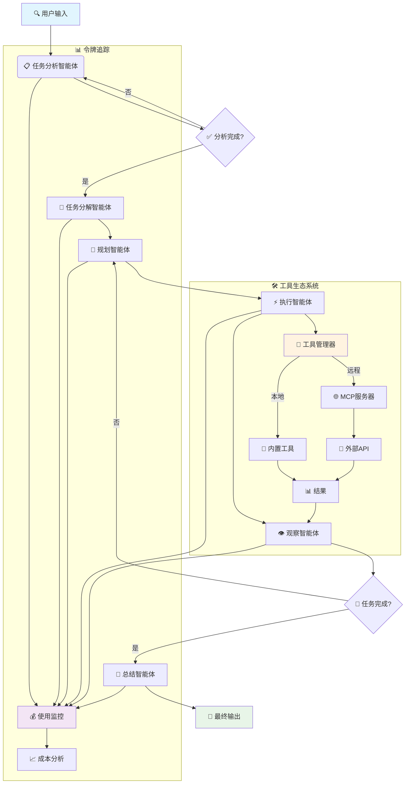

<div align="center">

# 🌟 **体验 Sage 的强大能力**
### 🚀 [**立即试用在线演示 →**](http://36.133.44.114:20040/)


[](README.md)
[](README_CN.md)
[](LICENSE)
[](https://python.org)
[](https://github.com/ZHangZHengEric/Sage)
[](https://github.com/ZHangZHengEric/Sage/stargazers)

</div>

---

<div align="center">

# 🧠 **Sage 多智能体框架**

### 🎯 **让复杂任务变得简单**

</div>

> 🌟 **生产级、模块化、智能化的多智能体编排框架，专为复杂问题求解而生**

**Sage** 是一个先进的多智能体系统，通过无缝的智能体协作，智能地将复杂任务分解为可管理的子任务。采用企业级可靠性和可扩展性设计，提供**深度研究模式**进行全面分析和**快速执行模式**进行快速任务完成。

## ✨ **核心亮点**

<div align="center">

### 🎯 **为什么选择 Sage？**

</div>

🧠 **智能任务分解** - 自动将复杂问题分解为可管理的子任务，支持依赖关系追踪  
🔄 **智能体编排** - 专业智能体间的无缝协调，具备强大的错误处理能力  
🛠️ **可扩展工具系统** - 基于插件的架构，支持 MCP 服务器和自动发现  
⚡ **双重执行模式** - 根据需求选择深度分析或快速执行  
🌐 **交互式 Web 界面** - 基于 React + FastAPI 的现代化 UI，实时流式可视化  
📊 **高级令牌追踪** - 全面的使用统计和成本监控，覆盖所有智能体  
⚙️ **丰富配置选项** - 环境变量、配置文件、CLI 选项和运行时更新  
🔧 **开发者友好** - 清晰的 API、全面的文档、示例和广泛的错误处理  
🎯 **生产就绪** - 强大的错误恢复、日志记录、重试机制和性能优化

---

<div align="center">

### 🚀 **立即开始你的 AI 之旅！**

</div>

## 🤖 **支持的模型**

<div align="center">

### 🎯 **Sage 已与以下语言模型进行了广泛测试**

</div>

### ✅ **官方测试模型**

<table align="center">
<tr>
<th>🏆 模型</th>
<th>🔧 API 标识</th>
<th>🌟 特色能力</th>
<th>🎯 推荐场景</th>
</tr>
<tr>
<td><strong>🔥 DeepSeek-V3</strong></td>
<td><code>deepseek-chat</code></td>
<td>复杂推理表现卓越</td>
<td>深度分析、代码生成</td>
</tr>
<tr>
<td><strong>🌟 Qwen-3</strong></td>
<td><code>qwen-turbo</code>, <code>qwen-plus</code></td>
<td>中英文能力出色</td>
<td>多语言任务、文本处理</td>
</tr>
<tr>
<td><strong>🧠 GPT-4.1</strong></td>
<td><code>gpt-4-turbo</code>, <code>gpt-4o</code></td>
<td>全任务顶级性能</td>
<td>企业级应用、复杂推理</td>
</tr>
<tr>
<td><strong>⚡ Claude-3.5 Sonnet</strong></td>
<td><code>claude-3-5-sonnet-20241022</code></td>
<td>卓越推理能力</td>
<td>创意写作、逻辑分析</td>
</tr>
</table>

### 🌐 **兼容的提供商**

<div align="center">

| 🏢 **提供商** | 🔗 **集成方式** | 🌟 **支持模型** |
|:---:|:---:|:---:|
| **OpenAI** | 直接 API 集成 | GPT 系列全模型 |
| **OpenRouter** | 统一接口 | 200+ 模型访问 |
| **Anthropic** | 原生支持 | Claude 家族模型 |
| **Google AI** | 官方 API | Gemini 系列 |
| **DeepSeek** | 原生 API 支持 | DeepSeek 全系列 |
| **阿里云** | 直接集成 | 通义千问系列 |
| **Mistral AI** | 完整支持 | 所有 Mistral 模型 |

</div>

> 💡 **提示**: 虽然 Sage 针对上述模型进行了优化，但它设计为可与任何 OpenAI 兼容的 API 端点配合使用。

## 🏗️ **架构概览**



## 🚀 **快速开始**

### **安装**

#### 🚀 **快速安装（推荐）**

```bash
git clone https://github.com/ZHangZHengEric/Sage.git
cd Sage

# 运行自动化安装脚本
./install_dependencies.sh
```

#### 📦 **手动安装**

```bash
git clone https://github.com/ZHangZHengEric/Sage.git
cd Sage

# 安装核心依赖
pip install -r requirements.txt

# 安装 FastAPI React 演示依赖
pip install -r examples/fastapi_react_demo/requirements.txt
```

#### 🔧 **依赖概览**

Sage 包含多个强大的工具系统，需要特定的依赖项：

- **核心框架**: `openai`, `pydantic`, `python-dotenv`
- **工具系统**: `chardet`, `docstring_parser`, `requests`, `httpx`
- **MCP 支持**: `mcp`, `fastmcp` 
- **Web 界面**: `fastapi`, `uvicorn`, `websockets`
- **演示应用**: `streamlit`, `gradio`

所有依赖项都由安装脚本自动管理。

### 🎮 **交互式 Web 演示**

通过我们精美的 Web 界面体验 Sage，实时智能体可视化：

```bash
# 使用 DeepSeek-V3（推荐）
streamlit run examples/sage_demo.py -- \
  --api_key YOUR_DEEPSEEK_API_KEY \
  --model deepseek-chat \
  --base_url https://api.deepseek.com/v1

# 使用 OpenRouter（多模型）
streamlit run examples/sage_demo.py -- \
  --api_key YOUR_OPENROUTER_API_KEY \
  --model deepseek/deepseek-chat \
  --base_url https://openrouter.ai/api/v1

# 使用 GPT-4
streamlit run examples/sage_demo.py -- \
  --api_key YOUR_OPENAI_API_KEY \
  --model gpt-4o \
  --base_url https://api.openai.com/v1
```

### 🌐 **现代化 Web 应用（FastAPI + React）**

通过我们前沿的 Web 应用体验 Sage，采用现代 React 前端和 FastAPI 后端：


**功能特性：**
- 🤖 **多智能体协作** - 可视化工作流，包含分解、规划、执行、观察和总结
- 🧠 **深度思考模式** - 可展开的思考气泡，显示智能体推理过程
- 🔄 **自定义工作流管理** - 使用可视化思维导图编辑器创建、编辑和管理自定义工作流
- ⚡ **响应中断功能** - 随时停止AI响应，支持优雅的取消处理
- 🚀 **FastAPI 后端** - 高性能异步 API 服务器，支持流式响应
- ⚛️ **React 前端** - 现代化响应式 UI，采用 Ant Design 组件
- 📡 **实时通信** - WebSocket + SSE 双重支持，实现实时更新
- 🎨 **精美界面** - 可折叠深度思考气泡，现代化设计
- 🔧 **工具管理** - 自动工具发现和管理
- 💡 **规则偏好** - 个性化AI行为配置，支持自定义规则和偏好设置
- 📱 **响应式设计** - 适配所有屏幕尺寸
- 🔧 **TypeScript 支持** - 全程类型安全

**快速开始：**
```bash
cd examples/fastapi_react_demo

# 后端设置
python start_backend.py

# 前端设置（新终端）
cd frontend
npm install
npm run dev
```

**🎯 立即试用在线演示：** 在 [**在线演示 →**](http://36.133.44.114:20040/) 立即体验所有功能

**演示功能：**
- 💬 **交互式聊天界面** - 使用自定义工作流与AI智能体对话
- 🔄 **工作流配置** - 使用可视化编辑器创建和自定义工作流
- ⚡ **响应中断** - 随时点击停止按钮中断AI响应
- 💡 **规则偏好** - 使用自定义规则和偏好配置AI行为
- 🛠️ **系统配置** - 调整模型设置、温度和其他参数
- 📊 **实时监控** - 实时观察令牌使用情况和执行进度

在 `http://localhost:8080` 访问本地应用。详细设置说明请参见 [FastAPI React Demo README](examples/fastapi_react_demo/README.md)。

### 💻 **命令行使用**


## 🎯 **核心功能**

### 🤖 **多智能体协作 (v0.9.1)**
- **任务分析智能体**: 增强的深度理解，支持上下文感知和统一系统提示管理
- **任务分解智能体**: 智能任务分解，支持依赖分析、并行执行规划和TaskManager集成
- **规划智能体**: 战略性分解，支持依赖管理、最优工具选择和MessageManager优化
- **执行智能体**: 智能工具执行，支持错误恢复、重试机制、并行处理和结果管理
- **观察智能体**: 高级进度监控，支持完成检测、质量评估和TaskManager状态跟踪
- **总结智能体**: 全面结果综合，支持结构化输出、可操作见解和执行历史分析
- **消息管理器**: 智能消息过滤和压缩系统，为所有智能体提供token优化
- **任务管理器**: 结构化任务生命周期管理，支持状态持久化和依赖跟踪

### 🔄 **自定义工作流引擎**
- **可视化工作流编辑器**: 交互式拖放界面，支持思维导图可视化创建自定义工作流
- **预定义模板**: 为调研报告、产品开发、内容创作等提供即用型工作流
- **智能步骤管理**: 分层工作流结构，支持主步骤和子步骤的复杂任务组织
- **实时预览**: 工作流结构实时可视化，自动布局和连接渲染
- **工作流稳定性**: 确定性执行路径，在生产环境中提供一致的结果
- **模板共享**: 导出/导入工作流配置，支持团队和项目间共享
- **缩放平移支持**: 使用鼠标滚轮缩放和拖拽平移功能浏览大型工作流
- **自动适应显示**: 智能视口调整，以最佳比例显示所有工作流节点

### 💡 **规则偏好系统**
- **个性化AI行为**: 通过自定义规则和偏好配置AI助手行为
- **代码风格偏好**: 定义编码标准、命名约定和风格指南
- **响应语言设置**: 控制语言偏好和本地化设置
- **详细程度控制**: 根据需求调整详细程度和解释深度
- **模板库**: 常见偏好模式的快速启动模板
- **实时管理**: 通过直观的Web界面添加、编辑、启用/禁用规则
- **上下文集成**: 规则在所有智能体交互中自动应用

### 📨 **消息管理器 - 智能Token优化**
- **智能过滤**: 针对智能体的专用消息过滤策略，实现最优上下文管理
- **自动压缩**: 智能消息压缩，减少30-70%的token使用量
- **会话隔离**: 每个会话独立的消息管理器，防止交叉污染
- **智能体专用策略**: 为每种智能体类型（任务分解、规划、执行等）定制过滤
- **实时统计**: 实时压缩指标和优化追踪
- **状态持久化**: 自动保存和恢复消息管理器状态

### 📋 **任务管理器 - 全面状态管理**
- **任务生命周期管理**: 完整的任务创建、执行和完成追踪
- **依赖跟踪**: 智能依赖解析和执行排序
- **状态持久化**: 自动将任务状态保存到工作空间文件
- **进度监控**: 实时任务进度和完成状态
- **会话集成**: 与AgentController无缝集成进行工作流管理
- **结构化数据**: 包含元数据、时间和结果存储的丰富任务对象

### 🛠️ **高级工具系统**
- **插件架构**: 热重载工具开发，支持自动注册和版本管理
- **MCP 服务器支持**: 与模型上下文协议服务器和远程 API 无缝集成，并为 SSE MCP 服务器连接添加了 API 密钥认证功能
- **自动发现**: 从目录、模块和远程端点智能检测工具
- **类型安全**: 全面的参数验证和模式强制以及运行时检查
- **错误处理**: 强大的错误恢复、超时管理、重试策略和详细日志
- **性能监控**: 工具执行时间追踪、瓶颈检测和优化建议

### 📊 **Token 使用和成本监控**
- **实时追踪**: 监控所有智能体和操作的 token 消耗，集成MessageManager优化
- **详细分析**: 输入、输出、缓存和推理 token 细分，包含压缩统计
- **成本估算**: 基于模型定价和使用模式计算成本，追踪节省金额
- **性能指标**: 追踪执行时间、成功率、效率和token减少率
- **智能优化**: 自动消息过滤和压缩，减少30-70%的token使用量
- **导出功能**: CSV、JSON 导出供进一步分析，包含优化指标


### 💡 **规则偏好配置**
- **Web 界面**: 通过现代化 React 界面在 `/rules` 路径配置规则
- **运行时应用**: 规则自动应用到所有智能体交互
- **模板系统**: 使用预定义规则模板快速开始
- **导出/导入**: 在不同环境间共享规则配置

### ⚙️ **丰富的配置系统**
- **环境变量**: `SAGE_DEBUG`, `OPENAI_API_KEY`, `SAGE_MAX_LOOP_COUNT` 等
- **配置文件**: YAML/JSON 配置，支持验证和热重载
- **运行时更新**: 无需重启的动态配置更改
- **命令行选项**: 全面的命令行界面和帮助系统
- **配置文件管理**: 保存和加载配置配置文件

### 🔄 **执行模式**

#### **深度研究模式（复杂任务推荐）**
- 启用全面任务分析和详细分解
- 生成详细总结和见解
- 完整多智能体流水线执行

#### **标准执行模式（平衡性能）**
- 启用任务分析
- 生成总结
- 跳过详细分解阶段

#### **快速执行模式（最大速度）**
- 跳过分析阶段
- 直接执行任务
- 最小化处理时间

## 📊 **实时流式传输和监控**

实时观看智能体工作，详细进度追踪和性能指标，支持实时统计和监控功能。

## 🔧 **高级工具开发**

支持创建具有完整框架集成的复杂自定义工具，包括缓存、验证、错误处理等高级特性。

## 🛡️ **错误处理和可靠性**

Sage 包含全面的错误处理和恢复机制，支持自动重试、指数退避、异常管理等功能。

## 📈 **性能监控**

监控和优化您的智能体性能，支持详细的性能追踪、统计分析和瓶颈识别。

## 🔌 **MCP 服务器集成**

与模型上下文协议服务器无缝集成，支持自动工具发现和远程API调用。

## 📚 **文档**

- **[快速开始指南](docs/QUICK_START.md)** - 5 分钟内快速上手
- **[架构概览](docs/ARCHITECTURE.md)** - 详细的系统设计
- **[API 参考](docs/API_REFERENCE_CN.md)** - 完整的 API 文档
- **[工具开发](docs/TOOL_DEVELOPMENT.md)** - 创建自定义工具
- **[配置指南](docs/CONFIGURATION.md)** - 高级配置选项
- **[示例](docs/EXAMPLES_CN.md)** - 实际使用示例

## 🎯 **生产部署**

Sage 具备企业级特性，已为生产环境做好准备，支持配置管理、日志记录和监控功能。

## 🎯 **重点功能亮点**

### 🔄 **自定义工作流管理**

使用我们的交互式思维导图编辑器创建、编辑和可视化自定义工作流，支持自动工作流选择和智能执行。

**可视化编辑器功能：**
- 🎨 **思维导图可视化** - 分层节点布局
- 🖱️ **交互式编辑** - 点击直接编辑节点
- 🔍 **缩放平移** - 使用鼠标控制浏览大型工作流
- 📐 **自动适应显示** - 智能视口调整
- 💾 **模板系统** - 保存和重用工作流配置

### ⚡ **响应中断功能**

随时停止AI响应，支持优雅的取消和资源清理，在Web界面中可通过停止按钮中断响应。

**中断功能特性：**
- 🛑 **即时停止** - 响应在1-2秒内停止
- 🧹 **资源清理** - 适当的内存和连接管理
- 💾 **状态保存** - 部分结果被保存并可访问
- 🔄 **可恢复执行** - 如需要可从中断点继续

## 🔄 **最新更新 (v0.9.1)**

### ✨ **新功能**
- 📨 **消息管理器**: 革命性的消息过滤和压缩系统，减少30-70%的token使用量
- 📋 **任务管理器**: 全面的任务生命周期管理，支持状态持久化和依赖跟踪
- 🎯 **智能体优化**: 所有智能体现已集成MessageManager和TaskManager以实现最大效率
- 💾 **会话状态持久化**: 自动保存和恢复MessageManager和TaskManager状态
- 🔧 **智能消息过滤**: 针对智能体的专用消息过滤策略，实现最优上下文管理
- 📊 **高级Token分析**: 详细的压缩统计和优化指标追踪
- ⚡ **性能提升**: 通过智能消息优化显著提升执行速度
- 🧠 **内存管理**: 会话隔离管理器，防止长时间运行应用中的内存泄漏

### 🔧 **技术改进**
- 📨 **MessageManager集成**: 所有智能体现使用智能消息过滤进行token优化
- 📋 **TaskManager集成**: 跨所有工作流阶段的完整任务状态管理
- 🏗️ **会话管理**: 会话隔离管理器，支持自动清理和状态持久化
- 💾 **状态持久化**: 自动将MessageManager和TaskManager状态保存到工作空间文件
- 🔄 **消息优化**: 针对智能体的过滤策略，减少多达70%的上下文大小
- 🧠 **内存效率**: 智能内存管理，防止多会话环境中的泄漏
- ⚡ **性能优化**: 通过智能消息压缩显著提升速度
- 📊 **增强分析**: 详细的优化指标和压缩统计追踪

### 🐛 **错误修复**
- 修复消息块合并策略，使用一致的message_id基础方法
- 解决MessageManager系统消息过滤问题
- 改进TaskManager任务状态同步
- 增强会话清理和内存管理
- 修复优化消息流中的token追踪准确性

### 📋 **API 变更**
- **MessageManager集成**: 所有智能体的 `run_stream()` 方法现在需要 `message_manager` 参数
- **TaskManager集成**: 为所有智能体方法添加可选的 `task_manager` 参数用于状态管理
- **会话管理器**: AgentController中新增 `get_session_managers()` 方法用于访问管理器
- **Token统计**: 增强的 `get_comprehensive_token_stats()` 包含优化指标
- **向后兼容**: 所有现有API保持完全兼容，支持自动管理器创建

## 📄 **许可证**

本项目采用 MIT 许可证 - 详见 [LICENSE](LICENSE) 文件。

## 🙏 **致谢**

- OpenAI 提供的强大语言模型
- DeepSeek 提供的卓越 V3 模型
- 阿里云提供的通义千问系列
- 开源社区提供的灵感和工具
- 所有帮助 Sage 变得更好的贡献者

---

<div align="center">
  <sub>由 Sage 团队用 ❤️ 构建</sub>
</div>
