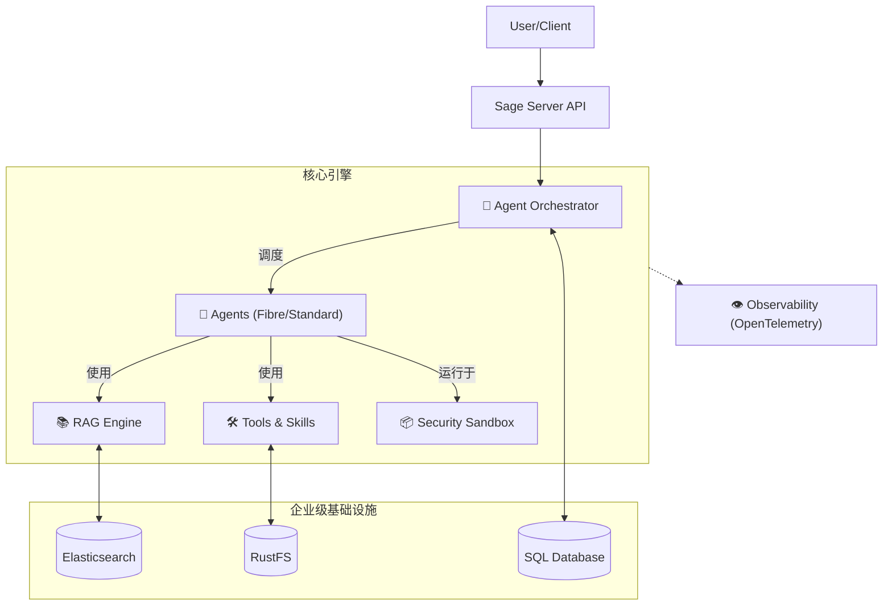

<div align="center">

# 🌟 **体验 Sage 的强大能力**


[](README.md)
[](README_CN.md)
[](LICENSE)
[](https://python.org)
[](https://github.com/ZHangZHengEric/Sage)

# 🧠 **Sage 多智能体框架**

### 🎯 **让复杂任务变得简单**

> 🌟 **生产级、模块化、智能化的多智能体编排框架，专为复杂问题求解而生。**

</div>

---

## ✨ **核心亮点**

- 🧠 **多智能体编排**：支持 **TaskExecutor** (串行) 和 **FibreAgent** (并行) 两种编排模式。
- 🏗️ **企业级架构**：基于 **Elasticsearch** (向量), **RustFS** (对象), 和 **SQLAlchemy** (关系型) 的强大存储层。
- 📚 **RAG 引擎 2.0**：支持 **RRF** (Reciprocal Rank Fusion) 和混合检索的全新检索增强生成引擎。
- 🛡️ **安全沙箱**：提供隔离执行环境 (`sagents.utils.sandbox`) 确保智能体代码执行安全。
- 👁️ **全链路可观测性**：集成 **OpenTelemetry** 追踪，可视化智能体思考与执行路径。
- 🧩 **模块化组件**：**Skills**, **Tools**, 和 **MCP Servers** 的即插即用架构。
- 📊 **上下文管理**：先进的 **Context Budget** 控制，实现精准的 Token 优化。
- 🐍 **Python 3.11+ 优化**：全类型注解和代码风格检查，确保企业级可靠性。

## 🚀 **快速开始**

### 安装

```bash
git clone https://github.com/ZHangZHengEric/Sage.git
cd Sage
pip install -r requirements.txt
# 如果需要 Web UI
pip install -r app/server/requirements.txt
```

### 运行 Sage

**交互式 Web 演示 (Streamlit)**：
```bash
streamlit run app/sage_demo.py -- \
  --default_llm_api_key YOUR_API_KEY \
  --default_llm_model deepseek-chat \
  --default_llm_api_base_url https://api.deepseek.com
```

**命令行工具 (CLI)**：
```bash
python app/sage_cli.py \
  --default_llm_api_key YOUR_API_KEY \
  --default_llm_model deepseek-chat \
  --default_llm_base_url https://api.deepseek.com
```

**现代化 Web 应用 (FastAPI + React)**：

现代化 Web 应用现在重构为 `app/server` (后端) 和 `app/web` (前端)。

**使用 Docker Compose 部署 (推荐)**：
```bash
docker-compose up -d
```
访问应用地址：`http://localhost:30051` (Web) / `http://localhost:30050/docs` (API)。

## 🏗️ **系统架构**



## 📅 **v0.9.9 更新内容**

- **智能工具选择**：基于工具 ID 的推荐系统，提升准确性并统一 Agent 逻辑。
- **任务调度 MCP**：内置任务调度服务，支持 SQLite 持久化和定时任务。
- **Agent Hub MCP**：智能体间消息中心，实现多智能体协作和任务委派。
- **Brave Search MCP**：网络搜索集成，支持实时信息获取。
- **暗色主题**：完整的暗色模式支持，自动检测系统偏好。
- **模型提供商管理**：动态 LLM 提供商配置，支持多模型源。
- **子任务可视化**：实时子智能体执行追踪和消息流展示。
- **上下文预算**：智能上下文压缩，支持长对话场景。
- **[查看完整版本发布说明](release_notes/v0.9.9.md)**

## 📚 **文档资源**

- [**完整文档首页**](docs/README.md)
- [**Server 部署指南**](docs/SERVER_DEPLOYMENT_CN.md) - Docker 与源码部署
- [**示例使用指南**](docs/EXAMPLES_USAGE_CN.md) - CLI、Web 与 API Server
- [**更新日志**](docs/CHANGELOG_CN.md) - 最新更新与历史记录
- [**智能体框架架构**](docs/ARCHITECTURE_CN.md)
- [**API 参考**](docs/API_REFERENCE_CN.md)
- [**配置指南**](docs/CONFIGURATION_CN.md)
- [**工具开发**](docs/TOOL_DEVELOPMENT_CN.md)

---
<div align="center">
Built with ❤️ by the Sage Team
</div>
