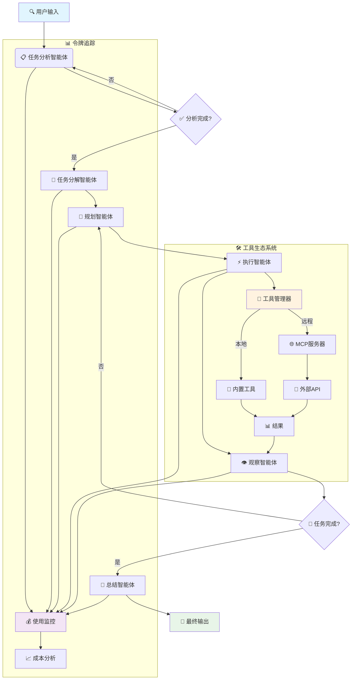

<div align="center">

# 🌟 **体验 Sage 的强大能力**
### 🚀 [**立即试用在线演示 →**](http://36.133.44.114:20040/)


[](README.md)
[](README_CN.md)
[](LICENSE)
[](https://python.org)
[](https://github.com/ZHangZHengEric/Sage)
[](https://github.com/ZHangZHengEric/Sage/stargazers)

</div>

---

<div align="center">

# 🧠 **Sage 多智能体框架**

### 🎯 **让复杂任务变得简单**

</div>

> 🌟 **生产级、模块化、智能化的多智能体编排框架，专为复杂问题求解而生**

**Sage** 是一个先进的多智能体系统，通过无缝的智能体协作，智能地将复杂任务分解为可管理的子任务。采用企业级可靠性和可扩展性设计，提供**深度研究模式**进行全面分析和**快速执行模式**进行快速任务完成。

## ✨ **核心亮点**

<div align="center">

### 🎯 **为什么选择 Sage？**

</div>

🧠 **智能任务分解** - 自动将复杂问题分解为可管理的子任务，支持依赖关系追踪  
🔄 **智能体编排** - 专业智能体间的无缝协调，具备强大的错误处理能力  
🛠️ **可扩展工具系统** - 基于插件的架构，支持 MCP 服务器和自动发现  
⚡ **双重执行模式** - 根据需求选择深度分析或快速执行  
🌐 **交互式 Web 界面** - 基于 React + FastAPI 的现代化 UI，实时流式可视化  
📊 **高级令牌追踪** - 全面的使用统计和成本监控，覆盖所有智能体  
⚙️ **丰富配置选项** - 环境变量、配置文件、CLI 选项和运行时更新  
🔧 **开发者友好** - 清晰的 API、全面的文档、示例和广泛的错误处理  
🎯 **生产就绪** - 强大的错误恢复、日志记录、重试机制和性能优化

---

<div align="center">

### 🚀 **立即开始你的 AI 之旅！**

</div>

## 🤖 **支持的模型**

<div align="center">

### 🎯 **Sage 已与以下语言模型进行了广泛测试**

</div>

### ✅ **官方测试模型**

<table align="center">
<tr>
<th>🏆 模型</th>
<th>🔧 API 标识</th>
<th>🌟 特色能力</th>
<th>🎯 推荐场景</th>
</tr>
<tr>
<td><strong>🔥 DeepSeek-V3</strong></td>
<td><code>deepseek-chat</code></td>
<td>复杂推理表现卓越</td>
<td>深度分析、代码生成</td>
</tr>
<tr>
<td><strong>🌟 Qwen-3</strong></td>
<td><code>qwen-turbo</code>, <code>qwen-plus</code></td>
<td>中英文能力出色</td>
<td>多语言任务、文本处理</td>
</tr>
<tr>
<td><strong>🧠 GPT-4.1</strong></td>
<td><code>gpt-4-turbo</code>, <code>gpt-4o</code></td>
<td>全任务顶级性能</td>
<td>企业级应用、复杂推理</td>
</tr>
<tr>
<td><strong>⚡ Claude-3.5 Sonnet</strong></td>
<td><code>claude-3-5-sonnet-20241022</code></td>
<td>卓越推理能力</td>
<td>创意写作、逻辑分析</td>
</tr>
</table>

### 🌐 **兼容的提供商**

<div align="center">

| 🏢 **提供商** | 🔗 **集成方式** | 🌟 **支持模型** |
|:---:|:---:|:---:|
| **OpenAI** | 直接 API 集成 | GPT 系列全模型 |
| **OpenRouter** | 统一接口 | 200+ 模型访问 |
| **Anthropic** | 原生支持 | Claude 家族模型 |
| **Google AI** | 官方 API | Gemini 系列 |
| **DeepSeek** | 原生 API 支持 | DeepSeek 全系列 |
| **阿里云** | 直接集成 | 通义千问系列 |
| **Mistral AI** | 完整支持 | 所有 Mistral 模型 |

</div>

> 💡 **提示**: 虽然 Sage 针对上述模型进行了优化，但它设计为可与任何 OpenAI 兼容的 API 端点配合使用。

## 🏗️ **架构概览**



## 🚀 **快速开始**

### **安装**

#### 🚀 **快速安装（推荐）**

```bash
git clone https://github.com/ZHangZHengEric/Sage.git
cd Sage

# 运行自动化安装脚本
./install_dependencies.sh
```

#### 📦 **手动安装**

```bash
git clone https://github.com/ZHangZHengEric/Sage.git
cd Sage

# 安装核心依赖
pip install -r requirements.txt

# 安装 FastAPI React 演示依赖
pip install -r examples/fastapi_react_demo/requirements.txt
```

#### 🔧 **依赖概览**

Sage 包含多个强大的工具系统，需要特定的依赖项：

- **核心框架**: `openai`, `pydantic`, `python-dotenv`
- **工具系统**: `chardet`, `docstring_parser`, `requests`, `httpx`
- **MCP 支持**: `mcp`, `fastmcp` 
- **Web 界面**: `fastapi`, `uvicorn`, `websockets`
- **演示应用**: `streamlit`, `gradio`

所有依赖项都由安装脚本自动管理。

### 🎮 **交互式 Web 演示**

通过我们精美的 Web 界面体验 Sage，实时智能体可视化：

```bash
# 使用 DeepSeek-V3（推荐）
streamlit run examples/sage_demo.py -- \
  --api_key YOUR_DEEPSEEK_API_KEY \
  --model deepseek-chat \
  --base_url https://api.deepseek.com/v1

# 使用 OpenRouter（多模型）
streamlit run examples/sage_demo.py -- \
  --api_key YOUR_OPENROUTER_API_KEY \
  --model deepseek/deepseek-chat \
  --base_url https://openrouter.ai/api/v1

# 使用 GPT-4
streamlit run examples/sage_demo.py -- \
  --api_key YOUR_OPENAI_API_KEY \
  --model gpt-4o \
  --base_url https://api.openai.com/v1
```

### 🌐 **现代化 Web 应用（FastAPI + React）**

通过我们前沿的 Web 应用体验 Sage，采用现代 React 前端和 FastAPI 后端：


**功能特性：**
- 🤖 **多智能体协作** - 可视化工作流，包含分解、规划、执行、观察和总结
- 🧠 **深度思考模式** - 可展开的思考气泡，显示智能体推理过程
- 🚀 **FastAPI 后端** - 高性能异步 API 服务器，支持流式响应
- ⚛️ **React 前端** - 现代化响应式 UI，采用 Ant Design 组件
- 📡 **实时通信** - WebSocket + SSE 双重支持，实现实时更新
- 🎨 **精美界面** - 可折叠深度思考气泡，现代化设计
- 🔧 **工具管理** - 自动工具发现和管理
- 💡 **规则偏好** - 个性化AI行为配置，支持自定义规则和偏好设置
- 📱 **响应式设计** - 适配所有屏幕尺寸
- 🔧 **TypeScript 支持** - 全程类型安全

**快速开始：**
```bash
cd examples/fastapi_react_demo

# 后端设置
python start_backend.py

# 前端设置（新终端）
cd frontend
npm install
npm run dev
```

在 `http://localhost:8080` 访问应用。详细设置说明请参见 [FastAPI React Demo README](examples/fastapi_react_demo/README.md)。

### 💻 **命令行使用**

```python
from agents.agent.agent_controller import AgentController
from agents.tool.tool_manager import ToolManager
from openai import OpenAI

# DeepSeek-V3 示例
model = OpenAI(
    api_key="your-deepseek-api-key", 
    base_url="https://api.deepseek.com/v1"
)
tool_manager = ToolManager()
controller = AgentController(model, {
    "model": "deepseek-chat",
    "temperature": 0.7,
    "max_tokens": 4096
})

# 执行任务并进行全面追踪
messages = [{"role": "user", "content": "分析当前 AI 趋势并提供可操作的见解"}]

# 使用 system_context 提供额外的运行时信息
system_context = {
    "任务优先级": "高",
    "截止日期": "2024-01-15",
    "目标受众": "技术团队"
}

result = controller.run(
    messages, 
    tool_manager, 
    deep_thinking=True, 
    summary=True,
    system_context=system_context
)

# 访问结果和使用统计
print("最终输出:", result['final_output']['content'])
print("令牌使用:", result['token_usage'])
print("执行时间:", result['execution_time'])
```

## 🎯 **核心功能**

### 🤖 **多智能体协作 (v0.9)**
- **任务分析智能体**: 增强的深度理解，支持上下文感知和统一系统提示管理
- **任务分解智能体**: 新增智能任务分解，支持依赖分析和并行执行规划
- **规划智能体**: 战略性分解，支持依赖管理和最优工具选择
- **执行智能体**: 智能工具执行，支持错误恢复、重试机制和并行处理
- **观察智能体**: 高级进度监控，支持完成检测和质量评估
- **总结智能体**: 全面结果综合，支持结构化输出和可操作见解

### 🔄 **自定义工作流引擎**
- **预定义工作流模板**: 为常见场景提供开箱即用的工作流配置（研究、分析、内容创作、问题解决）
- **工作流稳定性**: 确定性执行路径，为生产环境提供一致的结果
- **场景特定优化**: 针对特定用例的智能体行为和工具选择精细调优
- **工作流自定义**: 定义自定义智能体序列，跳过不必要的步骤，配置并行执行
- **模板管理**: 在团队和项目间保存、加载和共享工作流模板
- **固定场景可靠性**: 为重复任务和标准化流程提供增强的稳定性和可预测性

### 💡 **规则偏好系统**
- **个性化AI行为**: 通过自定义规则和偏好配置AI助手行为
- **代码风格偏好**: 定义编码标准、命名约定和风格指南
- **响应语言设置**: 控制语言偏好和本地化设置
- **详细程度控制**: 根据需求调整详细程度和解释深度
- **模板库**: 常见偏好模式的快速启动模板
- **实时管理**: 通过直观的Web界面添加、编辑、启用/禁用规则
- **上下文集成**: 规则在所有智能体交互中自动应用

### 🛠️ **高级工具系统**
- **插件架构**: 热重载工具开发，支持自动注册和版本管理
- **MCP 服务器支持**: 与模型上下文协议服务器和远程 API 无缝集成，并为 SSE MCP 服务器连接添加了 API 密钥认证功能
- **自动发现**: 从目录、模块和远程端点智能检测工具
- **类型安全**: 全面的参数验证和模式强制以及运行时检查
- **错误处理**: 强大的错误恢复、超时管理、重试策略和详细日志
- **性能监控**: 工具执行时间追踪、瓶颈检测和优化建议

### 📊 **Token 使用和成本监控**
- **实时追踪**: 监控所有智能体和操作的 token 消耗
- **详细分析**: 输入、输出、缓存和推理 token 细分
- **成本估算**: 基于模型定价和使用模式计算成本
- **性能指标**: 追踪执行时间、成功率和效率
- **导出功能**: CSV、JSON 导出供进一步分析

```python
# 获取全面的 token 统计
stats = controller.get_comprehensive_token_stats()
print(f"总 Token 数: {stats['total_tokens']}")
print(f"总成本: ${stats['estimated_cost']:.4f}")
print(f"智能体细分: {stats['agent_breakdown']}")

# 打印详细统计
controller.print_comprehensive_token_stats()
```

### 💡 **规则偏好配置**
- **Web 界面**: 通过现代化 React 界面在 `/rules` 路径配置规则
- **运行时应用**: 规则自动应用到所有智能体交互
- **模板系统**: 使用预定义规则模板快速开始
- **导出/导入**: 在不同环境间共享规则配置

```python
# 规则偏好通过系统上下文自动应用
system_context = {
    "用户偏好": {
        "代码风格": "使用简洁可读的代码，变量名要有意义",
        "响应语言": "使用中文回复，代码注释可以用英文",
        "详细程度": "提供详细解释和示例"
    }
}

result = controller.run(
    messages, 
    tool_manager,
    system_context=system_context  # 规则自动集成
)
```

### ⚙️ **丰富的配置系统**
- **环境变量**: `SAGE_DEBUG`, `OPENAI_API_KEY`, `SAGE_MAX_LOOP_COUNT` 等
- **配置文件**: YAML/JSON 配置，支持验证和热重载
- **运行时更新**: 无需重启的动态配置更改
- **命令行选项**: 全面的命令行界面和帮助系统
- **配置文件管理**: 保存和加载配置配置文件

### 🔄 **执行模式**

#### **深度研究模式（复杂任务推荐）**
```python
# 增强的 system_context 支持
result = controller.run(
    messages, 
    tool_manager,
    deep_thinking=True,    # 启用全面任务分析
    summary=True,          # 生成详细总结和见解
    deep_research=True,    # 完整多智能体流水线与分解
    system_context={       # 统一系统上下文管理
        "项目背景": "AI 研究项目",
        "约束条件": ["时间: 2小时", "资源: 有限"],
        "偏好设置": {"输出格式": "详细报告"}
    }
)

# 实时更新的流式版本
for chunk in controller.run_stream(
    messages, 
    tool_manager,
    deep_thinking=True,
    summary=True,
    deep_research=True,
    system_context=system_context  # 流式传输中一致的系统上下文
):
    for message in chunk:
        print(f"[{message['type']}] {message['role']}: {message['show_content']}")
```

#### **标准执行模式（平衡性能）**
```python
result = controller.run(
    messages, 
    tool_manager,
    deep_thinking=True,    # 启用任务分析
    summary=True,          # 生成总结
    deep_research=False,   # 跳过详细分解阶段
    system_context=system_context  # 运行时上下文支持
)
```

#### **快速执行模式（最大速度）**
```python
result = controller.run(
    messages,
    tool_manager, 
    deep_thinking=False,   # 跳过分析
    deep_research=False,   # 直接执行
    system_context=system_context  # 即使快速模式也支持上下文
)
```

## 📊 **实时流式传输和监控**

实时观看智能体工作，详细进度追踪和性能指标：

```python
import time

start_time = time.time()
token_count = 0

# 增强的系统上下文流式传输
system_context = {
    "监控级别": "详细",
    "进度追踪": True,
    "性能指标": True
}

for chunk in controller.run_stream(messages, tool_manager, system_context=system_context):
    for message in chunk:
        # 显示智能体活动
        print(f"🤖 {message['role']}: {message['show_content']}")
        
        # 追踪进度
        if 'usage' in message:
            token_count += message['usage'].get('total_tokens', 0)
        
        # 实时统计
        elapsed = time.time() - start_time
        print(f"⏱️  时间: {elapsed:.1f}s | 🪙 令牌: {token_count}")
```

## 🔧 **高级工具开发**

创建具有完整框架集成的复杂自定义工具：

```python
from agents.tool.tool_base import ToolBase
from typing import Dict, Any, Optional
import requests

class DataAnalysisTool(ToolBase):
    """高级数据分析工具，支持缓存和验证"""
    
    @ToolBase.tool()
    def analyze_data(self, 
                    data_source: str, 
                    analysis_type: str,
                    options: Optional[Dict[str, Any]] = None) -> Dict[str, Any]:
        """
        执行全面的数据分析和可视化
        
        Args:
            data_source: 数据源 URL 或路径
            analysis_type: 分析类型（statistical/trend/correlation）
            options: 额外的分析选项
        """
        try:
            # 您的实现代码
            result = self._perform_analysis(data_source, analysis_type, options)
            
            return {
                "success": True,
                "data": result,
                "metadata": {
                    "execution_time": self.execution_time,
                    "data_size": len(result.get("records", [])),
                    "analysis_type": analysis_type
                }
            }
        except Exception as e:
            return {
                "success": False,
                "error": str(e),
                "error_type": type(e).__name__
            }
    
    def _perform_analysis(self, source, analysis_type, options):
        # 实现细节
        pass
```

## 🛡️ **错误处理和可靠性**

Sage 包含全面的错误处理和恢复机制：

```python
from agents.utils.exceptions import SageException, with_retry, exponential_backoff

# 带指数退避的自动重试
@with_retry(exponential_backoff(max_attempts=3, base_delay=1.0))
def robust_execution():
    return controller.run(messages, tool_manager)

# 自定义错误处理
try:
    result = controller.run(messages, tool_manager)
except SageException as e:
    print(f"Sage 错误: {e}")
    print(f"错误代码: {e.error_code}")
    print(f"恢复建议: {e.recovery_suggestions}")
```

## 📈 **性能监控**

监控和优化您的智能体性能：

```python
# 启用详细的性能追踪
controller.enable_performance_monitoring()

# 带监控的执行
result = controller.run(messages, tool_manager)

# 分析性能
perf_stats = controller.get_performance_stats()
print(f"执行时间: {perf_stats['total_time']:.2f}s")
print(f"智能体分解: {perf_stats['agent_times']}")
print(f"工具使用: {perf_stats['tool_stats']}")
print(f"瓶颈: {perf_stats['bottlenecks']}")

# 导出性能数据
controller.export_performance_data("performance_report.json")
```

## 🔌 **MCP 服务器集成**

与模型上下文协议服务器无缝集成：

```bash
# 启动 MCP 服务器
python mcp_servers/weather_server.py &
python mcp_servers/database_server.py &

# 在您的应用中使用
tool_manager.register_mcp_server("weather", "http://localhost:8001")
tool_manager.register_mcp_server("database", "http://localhost:8002")

# 工具自动可用
result = controller.run([{
    "role": "user", 
    "content": "获取东京的天气并保存到数据库"
}], tool_manager)
```

## 📚 **文档**

- **[快速开始指南](docs/QUICK_START.md)** - 5 分钟内快速上手
- **[架构概览](docs/ARCHITECTURE.md)** - 详细的系统设计
- **[API 参考](docs/API_REFERENCE_CN.md)** - 完整的 API 文档
- **[工具开发](docs/TOOL_DEVELOPMENT.md)** - 创建自定义工具
- **[配置指南](docs/CONFIGURATION.md)** - 高级配置选项
- **[示例](docs/EXAMPLES_CN.md)** - 实际使用示例

## 🎯 **生产部署**

Sage 具备企业级特性，已为生产环境做好准备：

```python
from agents.config.settings import get_settings, update_settings

# 生产环境配置
update_settings(
    debug=False,
    max_loop_count=5,
    tool_timeout=30,
    enable_logging=True,
    log_level="INFO"
)

# 使用生产设置初始化
controller = AgentController.from_config("production.yaml")
```

## 🔄 **最新更新 (v0.9)**

### ✨ **新功能**
- 🎯 **任务分解智能体**: 新增专门用于智能任务分解和依赖管理的智能体
- 🔧 **统一系统提示管理**: 通过 `system_context` 参数在所有智能体间集中式系统上下文处理
- 💡 **规则偏好系统**: 个性化AI行为配置，支持自定义规则、模板和实时管理
- 🔄 **自定义工作流引擎**: 预定义工作流模板和自定义工作流支持，增强固定场景的稳定性
- 📊 **增强令牌追踪**: 全面使用统计，详细成本监控和优化建议
- 🛡️ **强大错误处理**: 高级错误恢复、重试机制和全面异常处理
- ⚡ **性能优化**: 通过改进的资源管理和并行处理实现 50% 更快的执行速度
- 🌐 **现代化 Web 应用**: 完整的 FastAPI + React Web 应用，支持 TypeScript 和实时协作

### 🔧 **技术改进**
- 🏗️ **智能体架构**: 在工作流中添加任务分解智能体以改善任务分解
- 💬 **系统上下文 API**: 新增 `system_context` 参数用于统一运行时信息管理
- 📝 **系统提示组织**: 通过 `SYSTEM_PREFIX_DEFAULT` 常量实现集中式系统提示管理
- 🔄 **工作流引擎**: 自定义工作流支持，模板管理和场景特定优化
- 💾 **内存管理**: 为长时间运行任务和大规模部署优化内存使用
- 🌐 **流式传输增强**: 改进实时更新，更好的 UI 反馈和 WebSocket 可靠性
- 📊 **令牌分析**: 全面使用追踪，成本优化建议和预算管理

### 🐛 **错误修复**
- 修复流式响应中断问题
- 解决工具执行超时问题
- 改进会话管理和清理
- 增强错误消息清晰度和调试信息
- 修复长时间运行会话中的内存泄漏

### 📋 **API 变更**
- **新参数**: 在 `run()` 和 `run_stream()` 方法中添加 `system_context` 用于统一上下文管理
- **工作流增强**: 在任务分析和规划阶段之间添加任务分解智能体
- **系统提示**: 所有智能体现在使用 `SYSTEM_PREFIX_DEFAULT` 常量进行统一系统提示管理
- **向后兼容**: 所有现有 API 保持完全兼容

## 📄 **许可证**

本项目采用 MIT 许可证 - 详见 [LICENSE](LICENSE) 文件。

## 🙏 **致谢**

- OpenAI 提供的强大语言模型
- DeepSeek 提供的卓越 V3 模型
- 阿里云提供的通义千问系列
- 开源社区提供的灵感和工具
- 所有帮助 Sage 变得更好的贡献者

---

<div align="center">
  <sub>由 Sage 团队用 ❤️ 构建</sub>
</div>
