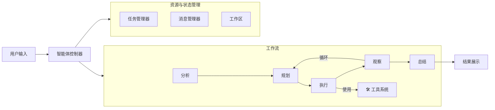

<div align="center">

# 🌟 **体验 Sage 的强大能力**


[](README.md)
[](README_CN.md)
[](LICENSE)
[](https://python.org)
[](https://github.com/ZHangZHengEric/Sage)

# 🧠 **Sage 多智能体框架**

### 🎯 **让复杂任务变得简单**

> 🌟 **生产级、模块化、智能化的多智能体编排框架，专为复杂问题求解而生。**

</div>

---

## ✨ **核心亮点**

- 🧠 **智能任务分解**：自动将复杂问题分解为可管理的子任务，支持依赖追踪。
- 🔄 **智能体编排**：专业智能体（规划、执行、观察、总结、重写、路由）间的无缝协作。
- 🛠️ **可扩展工具系统**：基于插件的架构，支持 **MCP 服务器** (Model Context Protocol) 和自动发现。
- ⚡ **双重模式**：**深度研究模式**用于全面分析，**快速执行模式**用于高效完成。
- 📊 **上下文管理**：先进的 **Context Budget** 控制，实现精准的 Token 优化 (v0.9.7+)。
- 👁️ **全链路可观测性**：集成 **Jaeger** 分布式追踪，可视化智能体思考与执行路径。
- 🌐 **现代化 UI**：基于 Vue3 + FastAPI 的 Web 界面，支持实时流式可视化。
- 🐍 **Python 3.11+ 优化**：全类型注解和代码风格检查，确保企业级可靠性。

## 🚀 **快速开始**

### 安装

```bash
git clone https://github.com/ZHangZHengEric/Sage.git
cd Sage
pip install -r requirements.txt
# 如果需要 Web UI
pip install -r app/fastapi_react_demo/requirements.txt
```

### 运行 Sage

**交互式 Web 演示 (Streamlit)**：
```bash
streamlit run app/sage_demo.py -- \
  --default_llm_api_key YOUR_API_KEY \
  --default_llm_model deepseek-chat \
  --default_llm_base_url https://api.deepseek.com
```

**命令行工具 (CLI)**：
```bash
python app/sage_cli.py \
  --default_llm_api_key YOUR_API_KEY \
  --default_llm_model deepseek-chat \
  --default_llm_base_url https://api.deepseek.com
```

**现代化 Web 应用 (FastAPI + React)**：

现代化 Web 应用现在重构为 `app/server` (后端) 和 `app/web` (前端)。

**使用 Docker Compose 部署 (推荐)**：
```bash
docker-compose up -d
```
访问应用地址：`http://localhost:30051` (Web) / `http://localhost:30050/docs` (API)。

## 🤖 **支持的模型**



## 📅 **v0.9.7 更新内容**

- **上下文预算 (Context Budget)**：新增参数（`--context_history_ratio` 等），实现细粒度上下文控制。
- **参数统一**：在 Server、CLI 和 Demo 中标准化了 `default_llm_*` 参数。
- **稳定性**：全面符合 Python 3.11+ 类型安全标准，优化代码风格。
- **[查看完整版本发布说明](release_notes/v0.9.7.md)**

## 📚 **文档资源**

- [**完整文档首页**](docs/README.md)
- [**Server 部署指南**](docs/SERVER_DEPLOYMENT_CN.md) - Docker 与源码部署
- [**示例使用指南**](docs/EXAMPLES_USAGE_CN.md) - CLI、Web 与 API Server
- [**更新日志**](docs/CHANGELOG_CN.md) - 最新更新与历史记录
- [**智能体框架架构**](docs/ARCHITECTURE_CN.md)
- [**API 参考**](docs/API_REFERENCE_CN.md)
- [**配置指南**](docs/CONFIGURATION_CN.md)
- [**工具开发**](docs/TOOL_DEVELOPMENT_CN.md)

---
<div align="center">
Built with ❤️ by the Sage Team
</div>
