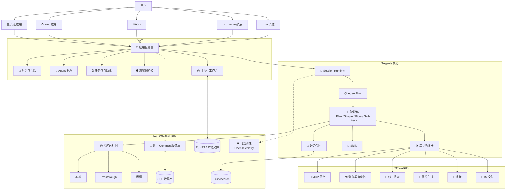

<div align="center">

# 🌟 **体验 Sage 的强大能力**


[](README.md)
[](README_CN.md)
[](LICENSE)
[](https://python.org)
[](https://github.com/ZHangZHengEric/Sage)
[](https://deepwiki.com/ZHangZHengEric/Sage)
[](https://join.slack.com/t/sage-b021145/shared_invite/zt-3t8nabs6c-qCEDzNUYtMblPshQTKSWOA)

# 🧠 **Sage 智能体平台**

### 🎯 **让复杂工作走向可靠交付**

> 🌟 **面向任务执行、自动化调度、浏览器工作流、IM 交付与企业部署的生产级智能体平台。**

</div>

---

## 📸 **产品截图**

<div align="center">

<table>
  <tr>
    <td align="center" width="33%">
      
      <br/><strong>可视化工作台</strong>
    </td>
    <td align="center" width="33%">
      
      <br/><strong>实时协作</strong>
    </td>
    <td align="center" width="33%">
      
      <br/><strong>多格式支持</strong>
    </td>
  </tr>
</table>

</div>

> 📖 **详细文档**: [https://wiki.sage.zavixai.com/](https://wiki.sage.zavixai.com/)

---

## ✨ **核心亮点**

- 🤖 **从规划到交付**：内置规划、执行、自检、记忆召回与工具推荐等智能体能力，面向复杂任务闭环。
- 🌐 **多入口接入**：支持桌面端、Web、CLI 和 Chrome 扩展，覆盖开发、运营与日常使用场景。
- 🔁 **自动化与循环任务**：支持定时任务、问卷收集流程与长任务执行，并提供可见的进度反馈。
- 💬 **全渠道 IM 集成**：支持 WeChat Personal(iLink)、企业微信、飞书、钉钉等渠道的消息与文件收发。
- 🧰 **统一工具体系**：内置工具、Skills、MCP 服务、浏览器自动化、搜索与图片生成能力可统一编排。
- 🛡️ **安全沙箱执行**：支持本地、passthrough、远程等多种沙箱模式，保障运行时隔离与安全。
- 🛠️ **可视化工作台**：统一查看文件、工具输出、代码、图表、Mermaid、Draw.io、音视频与远程预览内容。
- 🏢 **企业级基础能力**：提供 OAuth2、可配置认证与 CORS、共享服务架构、CI 覆盖和多平台发布能力。

---

## 🚀 **快速开始**

### 安装

```bash
git clone https://github.com/ZHangZHengEric/Sage.git
cd Sage
```

### 运行 Sage

**一键启动脚本（推荐本地开发）**：

```bash
# 1. 可选：先激活你的环境
# conda activate your-env

# 2. 设置 LLM Key
export SAGE_DEFAULT_LLM_API_KEY="your-api-key"
export SAGE_DEFAULT_LLM_API_BASE_URL="https://api.deepseek.com/v1"
export SAGE_DEFAULT_LLM_MODEL_NAME="deepseek-chat"

# 3. 运行启动脚本
./scripts/dev-up.sh
```

启动脚本会自动：
- 检查 Python（>= 3.10）和 Node.js（>= 18）
- 自动创建配置文件（最小模式默认使用 SQLite）
- 自动安装依赖并启动后端、前端
- 自动创建 `logs/server.log`
- 优先使用 `.env` 中的 `SAGE_PORT`

可选覆盖方式：

```bash
# 显式指定 Python
PYTHON_BIN=/path/to/python ./scripts/dev-up.sh

# 显式使用 uv
USE_UV=1 ./scripts/dev-up.sh
```

首次运行时，脚本会提示你选择：
- **最小模式**：SQLite、无外部依赖，适合快速开始
- **完整模式**：MySQL + Elasticsearch + RustFS，适合更接近生产的环境

**桌面应用（推荐）**：

桌面版安装包请前往 [GitHub Releases](https://github.com/ZHangZHengEric/Sage/releases) 下载最新版本：
- **macOS**: `.dmg` (Intel & Apple Silicon)
- **Windows**: `.exe` / `.msi`
- **Linux**: `.deb` (x86_64 / arm64)

#### 桌面版安装指南

**macOS**

1. 下载对应架构的 `.dmg` 文件并双击打开。
2. 将 `Sage.app` 拖动到“应用程序”文件夹。
3. 当前发布包暂未经过 Apple Developer 签名/公证，首次启动如果看到“无法验证开发者”或“Apple 无法检查其是否包含恶意软件”，请在“应用程序”中找到 `Sage.app`，右键选择“打开”，然后在弹窗中再次点击“打开”。
4. 如果系统仍然拦截，请前往“系统设置 -> 隐私与安全性”，在底部找到 `Sage` 的安全提示后点击“仍要打开”。
5. 如果 macOS 提示应用“已损坏”或始终无法启动，可在终端执行以下命令后重试：

```bash
xattr -dr com.apple.quarantine /Applications/Sage.app
```

**Windows**

1. 下载 `.exe` 安装包并双击运行。
2. 按照安装向导完成安装。
3. 如果系统弹出 SmartScreen 警告，可点击“更多信息”->“仍要运行”继续安装。

**Linux**

1. 从 [GitHub Releases](https://github.com/ZHangZHengEric/Sage/releases) 下载对应架构的 `.deb` 安装包。
2. 在 Debian / Ubuntu 上可直接双击安装，或执行以下命令安装：

```bash
sudo apt install ./Sage-<version>-<arch>.deb
```

如需自行从源码构建桌面版，可使用下面的命令：

```bash
# macOS/Linux
app/desktop/scripts/build.sh release

# Windows
./app/desktop/scripts/build_windows.ps1 release
```

**命令行工具 (CLI)**：
```bash
# 先安装为可编辑包
pip install -e .

# 配置最小运行环境变量
export SAGE_DEFAULT_LLM_API_KEY="your-api-key"
export SAGE_DEFAULT_LLM_API_BASE_URL="https://api.deepseek.com/v1"
export SAGE_DEFAULT_LLM_MODEL_NAME="deepseek-chat"
export SAGE_DB_TYPE="file"

# 检查本地运行环境
sage doctor

# 生成最小本地配置
sage config init

# 快速执行一次任务
sage run --stats "用一句话介绍你自己"

# 进入交互式对话
sage chat
```

完整 CLI 使用说明请看：
- English: [docs/en/CLI.md](docs/en/CLI.md)
- 中文: [docs/zh/CLI.md](docs/zh/CLI.md)

当前这版 CLI MVP 仍然复用 Sage 现有的运行时配置体系，所以 `.env` 和 shell 环境变量仍然是主要配置方式。
启用 `--json` 时，CLI 会输出流式事件，并在结束时附加一个最终的 `cli_stats` 结构化摘要事件。

**Web 应用 (FastAPI + Vue3)**：

```bash
# 启动后端
python -m app.server.main

# 启动前端（在另一个终端）
cd app/server/web
npm install
npm run dev
```

---

## 🏗️ **系统架构**


```mermaid
graph TD
    User[用户] --> Desktop[💻 桌面应用]
    User --> Web[🌐 Web 应用]
    User --> CLI[⌨️ CLI]
    User --> Ext[🧩 Chrome 扩展]
    User --> IM[💬 IM 渠道]

    Desktop --> AppLayer[🧭 应用服务层]
    Web --> AppLayer
    CLI --> AppLayer
    Ext --> AppLayer
    IM --> AppLayer

    subgraph App[产品层]
        AppLayer --> Chat[💬 对话与会话]
        AppLayer --> AgentsUI[🤖 Agent 管理]
        AppLayer --> Tasks[⏰ 任务与自动化]
        AppLayer --> Browser[🌐 浏览器桥接]
        AppLayer --> Workbench[🛠️ 可视化工作台]
    end

    subgraph Core[SAgents 核心]
        AppLayer --> Runtime[🧠 Session Runtime]
        Runtime --> Flow[📋 AgentFlow]
        Flow --> Agents["🤖 智能体<br/>Plan / Simple / Fibre / Self-Check"]
        Agents --> Memory[🧠 记忆召回]
        Agents --> Skills[🧩 Skills]
        Agents --> ToolMgr[🛠️ 工具管理器]
    end

    subgraph Tools[执行与集成]
        ToolMgr --> MCP[🔌 MCP 服务]
        ToolMgr --> BrowserTools[🌍 浏览器自动化]
        ToolMgr --> Search[🔎 统一搜索]
        ToolMgr --> ImageGen[🎨 图片生成]
        ToolMgr --> Questionnaire[📝 问卷]
        ToolMgr --> IMTools[📨 IM 交付]
    end

    subgraph RuntimeEnv[运行时与基础设施]
        Agents --> Sandbox[📦 沙箱运行时]
        Sandbox --> Local[本地]
        Sandbox --> Pass[Passthrough]
        Sandbox --> Remote[远程]
        AppLayer <--> Common[🧱 共享 Common 服务层]
        Common <--> DB[(SQL 数据库)]
        Memory <--> ES[(Elasticsearch)]
        Workbench <--> FS[(RustFS / 本地文件)]
        Runtime -.-> Obs["👁️ 可观测性<br/>OpenTelemetry"]
    end
```

---

## 📅 **v1.1.0 更新内容**

### 🤖 **SAgents 内核更新**

- **执行链路增强**：新增 `PlanAgent`、`SelfCheckAgent`、`MemoryRecallAgent` 与 `ToolSuggestionAgent`
- **上下文效率优化**：补强用户输入优化与历史消息压缩，提升长任务执行稳定性
- **会话与消息能力升级**：支持编辑并重跑、增强进度反馈、补强 Session 检查与调试体验
- **工具能力扩展**：新增问卷采集工作流，强化工具调用展示、结果截断与可观测性

### 💻 **产品层更新**

- **新增多入口**：加入 Sage CLI、Chrome 扩展与浏览器自动化能力
- **工作台升级**：增强音频、视频、Mermaid、Draw.io、远程文件预览等渲染支持
- **聊天体验优化**：完善进度消息、交付流展示、推理内容展示与工作区交互
- **IM 集成增强**：扩展 WeChat Personal(iLink)、企业微信、飞书、钉钉等渠道能力，并强化文件消息流程

### 🛡️ **平台与基础设施**

- **企业级能力补齐**：新增 OAuth2、邮箱验证，并增强认证、CORS 与安全配置
- **沙箱与运行时升级**：重构本地 / passthrough / 远程沙箱能力，完善 Node runtime 与 sidecar 打包
- **共享架构升级**：抽离 `common/` 共享服务、模型与 Schema，提升桌面端与服务端复用度
- **文档与 CI**：重建文档体系，新增 CLI 指南，并补充测试与持续集成覆盖

**[查看完整发布说明](release_notes/v1.1.0.md)**

---

## 📚 **文档资源**

- 📖 **完整文档**: [https://wiki.sage.zavixai.com/](https://wiki.sage.zavixai.com/)
- 📝 **发布说明**: [release_notes/](release_notes/)
- 🏗️ **架构说明**: 查看 `sagents/`、`common/` 与 `app/` 目录了解核心运行时与产品层结构
- 🔧 **配置指南**: `app/desktop/` 目录下的环境变量和配置文件

---

## 🛠️ **开发**

### 项目结构

```
Sage/
├── sagents/                    # SAgents 核心运行时、流程、上下文、工具与沙箱
├── common/                     # 共享模型、Schema、服务与核心客户端
├── app/
│   ├── desktop/                # 桌面应用（Python 后端 + Vue UI + Tauri 壳）
│   ├── server/                 # 服务端应用与 Web 前端
│   ├── cli/                    # Sage CLI 入口与服务
│   └── chrome-extension/       # 浏览器扩展与侧边栏
├── mcp_servers/                # IM、搜索、调度、图片生成等服务
├── docs/                       # 中英文文档
└── release_notes/              # 版本发布说明
```

### 参与贡献

我们欢迎贡献！请查看我们的 [GitHub Issues](https://github.com/ZHangZHengEric/Sage/issues) 了解任务和讨论。

---

## 💖 **赞助者**

<div align="center">

感谢以下赞助者对 Sage 的支持：

<table>
  <tr>
    <td align="center" width="33%">
      <a href="#" target="_blank">
        
      </a>
      <br/>
    </td>
    <td align="center" width="33%">
      <a href="#" target="_blank">
        
      </a>
    </td>
    <td align="center" width="33%">
      <a href="#" target="_blank">
        
      </a>
    </td>
  </tr>
</table>

</div>

---

## 🦌 **加入我们的社区**

<div align="center">

### 💬 与我们交流

[](https://join.slack.com/t/sage-b021145/shared_invite/zt-3t8nabs6c-qCEDzNUYtMblPshQTKSWOA)

### 📱 微信群


*扫码加入我们的微信社区 🦌*

</div>

---

<div align="center">
Built with ❤️ by the Sage Team 🦌
</div>
