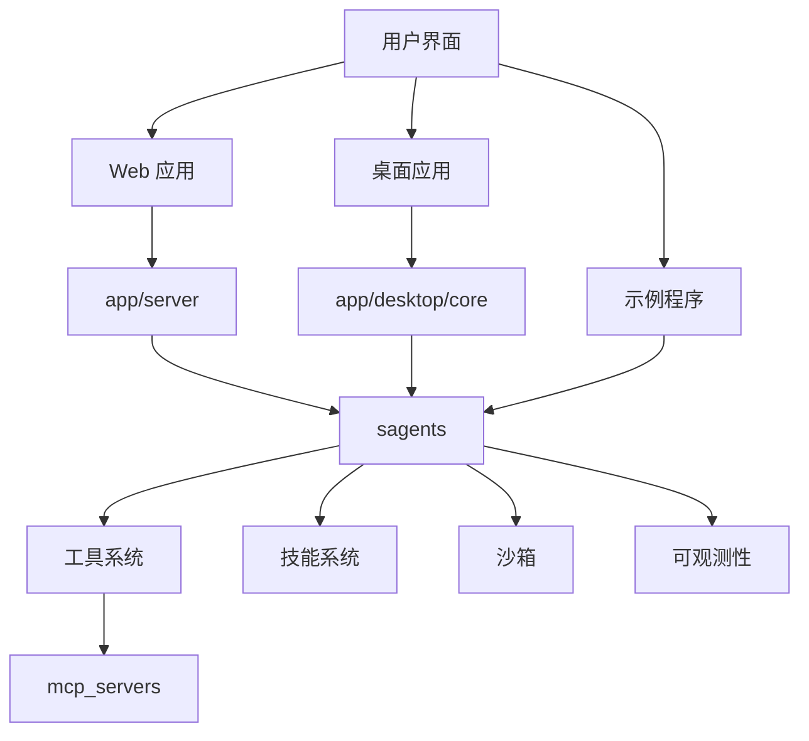

<div align="center">

# Sage


[](README.md)
[](README_CN.md)
[](LICENSE)
[](https://python.org)
[](https://github.com/ZHangZHengEric/Sage)
[](https://deepwiki.com/ZHangZHengEric/Sage)
[](https://join.slack.com/t/sage-b021145/shared_invite/zt-3t8nabs6c-qCEDzNUYtMblPshQTKSWOA)

面向生产场景的多智能体运行时与应用栈，支持在 CLI、Web 和桌面端构建、运行和扩展 Sage 智能体。

</div>

## 为什么是 Sage

Sage 面向的不是“套一层 LLM 的聊天壳”，而是需要可扩展、可运行、可产品化智能体能力的团队。它把可复用的多智能体运行时和应用层入口放在同一个仓库里，帮助你：

- 通过 CLI、Web 和桌面端运行智能体工作流
- 通过 Tool、Skill 和 MCP Server 扩展能力
- 用沙箱机制提升执行安全性
- 用流式会话和可观测性能力支撑真实使用场景

## 核心亮点

- 支持 `simple`、`multi`、`fibre` 三种多智能体执行模式
- 基于 Tool、Skill 和 MCP 的扩展模型
- 内置沙箱机制，提升运行时安全性
- 基于会话的流式执行、恢复与工作流能力
- 在统一运行时概念之上提供 Web 与桌面应用壳
- 面向 OpenTelemetry 的可观测性能力

## Sage 是什么

Sage 采用分层代码结构：

- `sagents/`：核心运行时、编排、工具、技能、沙箱与可观测性
- `app/server/`：主 FastAPI 应用与 Vue Web 客户端
- `app/desktop/`：桌面端本地后端与桌面 UI
- `examples/`：轻量可运行示例
- `mcp_servers/`：内置 MCP Server 实现

这个仓库同时包含产品层应用和它们依赖的底层运行时。

## 产品形态

### 主服务与 Web UI

当你需要完整的多用户应用栈时，使用这一套。

- 后端入口：`app/server/main.py`
- 前端源码：`app/server/web/`

### 桌面应用

当你需要本地打包的桌面体验时，使用这一套。

- 启动入口：`app/desktop/entry.py`
- 桌面后端：`app/desktop/core/main.py`

### 轻量示例

当你想要最短反馈回路时，使用这些入口。

- `examples/sage_cli.py`
- `examples/sage_demo.py`
- `examples/sage_server.py`

## 截图

<div align="center">

<table>
  <tr>
    <td align="center" width="33%">
      
      <br/><strong>可视化工作台</strong>
    </td>
    <td align="center" width="33%">
      
      <br/><strong>流式对话</strong>
    </td>
    <td align="center" width="33%">
      
      <br/><strong>文件预览</strong>
    </td>
  </tr>
</table>

</div>

## 快速开始

### 1. 安装依赖

```bash
git clone https://github.com/ZHangZHengEric/Sage.git
cd Sage
pip install -r requirements.txt
```

### 2. 设置最小环境变量

```bash
export SAGE_DEFAULT_LLM_API_KEY="your-api-key"
export SAGE_DEFAULT_LLM_API_BASE_URL="https://api.deepseek.com/v1"
export SAGE_DEFAULT_LLM_MODEL_NAME="deepseek-chat"
```

### 3. 选择一个入口运行

CLI 示例：

```bash
python examples/sage_cli.py \
  --default_llm_api_key "$SAGE_DEFAULT_LLM_API_KEY" \
  --default_llm_api_base_url "$SAGE_DEFAULT_LLM_API_BASE_URL" \
  --default_llm_model_name "$SAGE_DEFAULT_LLM_MODEL_NAME"
```

主服务：

```bash
python -m app.server.main
```

健康检查：

```bash
curl http://127.0.0.1:8080/api/health
```

Web UI：

```bash
cd app/server/web
npm install
npm run dev
```

Streamlit 示例：

```bash
streamlit run examples/sage_demo.py -- \
  --default_llm_api_key "$SAGE_DEFAULT_LLM_API_KEY" \
  --default_llm_api_base_url "$SAGE_DEFAULT_LLM_API_BASE_URL" \
  --default_llm_model_name "$SAGE_DEFAULT_LLM_MODEL_NAME"
```

## 延伸阅读

- 技术文档：[`docs/README.md`](docs/README.md)
- 快速上手：[`docs/GETTING_STARTED.md`](docs/GETTING_STARTED.md)
- 发布说明：[`release_notes/`](release_notes/)
- DeepWiki：https://deepwiki.com/ZHangZHengEric/Sage
- Slack 社区：https://join.slack.com/t/sage-b021145/shared_invite/zt-3t8nabs6c-qCEDzNUYtMblPshQTKSWOA

## 架构概览


```mermaid
flowchart TD
    User[用户界面] --> Web[Web 应用]
    User --> Desktop[桌面应用]
    User --> Examples[示例程序]
    Web --> Server[app/server]
    Desktop --> DesktopCore[app/desktop/core]
    Server --> Runtime[sagents]
    DesktopCore --> Runtime
    Examples --> Runtime
    Runtime --> Tools[工具系统]
    Runtime --> Skills[技能系统]
    Runtime --> Sandbox[沙箱]
    Runtime --> Obs[可观测性]
    Tools --> MCP[mcp_servers]
```

## 仓库导览

```text
Sage/
├── sagents/          # 核心运行时与编排
├── app/server/       # 主后端与 Web 应用
├── app/desktop/      # 桌面端后端、UI 与打包脚本
├── examples/         # 轻量可运行示例
├── mcp_servers/      # 内置 MCP Server
├── docs/             # 技术文档
└── release_notes/    # 版本发布说明
```

## 文档

技术文档统一放在 [`docs/`](docs/)：

- [`docs/README.md`](docs/README.md)
- [`docs/GETTING_STARTED.md`](docs/GETTING_STARTED.md)
- [`docs/CORE_CONCEPTS.md`](docs/CORE_CONCEPTS.md)
- [`docs/ARCHITECTURE.md`](docs/ARCHITECTURE.md)
- [`docs/CONFIGURATION.md`](docs/CONFIGURATION.md)
- [`docs/API_REFERENCE.md`](docs/API_REFERENCE.md)
- [`docs/DEVELOPMENT.md`](docs/DEVELOPMENT.md)
- [`docs/TROUBLESHOOTING.md`](docs/TROUBLESHOOTING.md)

作为仓库首页，README 会刻意保持比 `docs/` 更短；更细的技术细节统一收敛在 `docs/` 中。

## 开发

后端：

```bash
python -m app.server.main
```

前端：

```bash
cd app/server/web
npm install
npm run dev
```

桌面端构建：

```bash
app/desktop/scripts/build.sh release
```

## 参与贡献

欢迎贡献。若你修改了运行时行为，建议在同一个变更中同步更新 `docs/` 中对应的文档页面。

## 社区

- Issues：https://github.com/ZHangZHengEric/Sage/issues
- Slack：https://join.slack.com/t/sage-b021145/shared_invite/zt-3t8nabs6c-qCEDzNUYtMblPshQTKSWOA

## 许可证

MIT，见 [`LICENSE`](LICENSE)。
