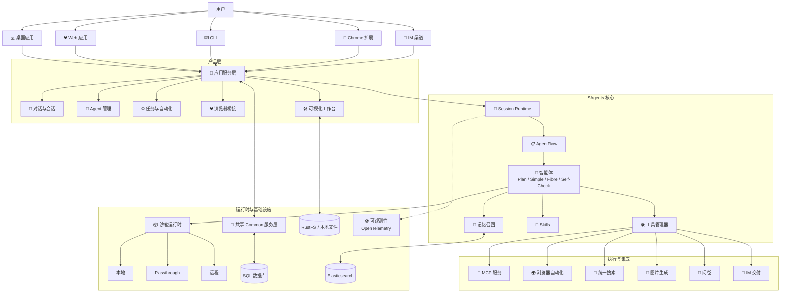

# 🌟 **体验 Sage 的强大能力**

cover

[English](README.md)
[简体中文](README_CN.md)
[License: MIT](LICENSE)
[Python 3.10+](https://python.org)
[Version](https://github.com/ZHangZHengEric/Sage)
[DeepWiki](https://deepwiki.com/ZHangZHengEric/Sage)
[Slack](https://join.slack.com/t/sage-b021145/shared_invite/zt-3t8nabs6c-qCEDzNUYtMblPshQTKSWOA)

# 🧠 **Sage 智能体平台**

### 🎯 **让复杂工作走向可靠交付**

> 🌟 **面向任务执行、自动化调度、浏览器工作流、IM 交付与企业部署的生产级智能体平台。**

---

## 📸 **产品截图**


|            |          |           |
| ---------- | -------- | --------- |
| **可视化工作台** | **实时协作** | **多格式支持** |


> 📖 **详细文档**: [https://wiki.sage.zavixai.com/](https://wiki.sage.zavixai.com/)

---

## ✨ **核心亮点**

- 🤖 **从规划到交付**：内置规划、执行、自检、记忆召回与工具推荐等智能体能力，面向复杂任务闭环。
- 🌐 **多入口接入**：支持桌面端、Web、CLI 和 Chrome 扩展，覆盖开发、运营与日常使用场景。
- 🔁 **自动化与循环任务**：支持定时任务、问卷收集流程与长任务执行，并提供可见的进度反馈。
- 💬 **全渠道 IM 集成**：支持 WeChat Personal(iLink)、企业微信、飞书、钉钉等渠道的消息与文件收发。
- 🧰 **统一工具体系**：内置工具、Skills、MCP 服务、浏览器自动化、搜索与图片生成能力可统一编排。
- 🛡️ **安全沙箱执行**：支持本地、passthrough、远程等多种沙箱模式，保障运行时隔离与安全。
- 🛠️ **可视化工作台**：统一查看文件、工具输出、代码、图表、Mermaid、Draw.io、音视频与远程预览内容。
- 🏢 **企业级基础能力**：提供 OAuth2、可配置认证与 CORS、共享服务架构、CI 覆盖和多平台发布能力。

---

## 🚀 **快速开始**

**环境要求（从源码跑 Web）：** Python 3.10+、Node.js 18+。

### Web（克隆后一键启动）

```bash
git clone https://github.com/ZHangZHengEric/Sage.git
cd Sage
export SAGE_DEFAULT_LLM_API_KEY="your-api-key"
export SAGE_DEFAULT_LLM_API_BASE_URL="https://api.deepseek.com/v1"
export SAGE_DEFAULT_LLM_MODEL_NAME="deepseek-chat"
./scripts/dev-up.sh
```

浏览器打开 [http://localhost:5173](http://localhost:5173)。首次可能提示**最小模式**（SQLite）与**完整模式**等选择，想最快跑通选最小模式即可。可选：`PYTHON_BIN=...` 或 `USE_UV=1 ./scripts/dev-up.sh` 指定解释器或用 [uv](https://github.com/astral-sh/uv) 装依赖。

**详细文档：** [Web 应用](docs/zh/applications/WEB.md)（手工起前后端、Docker Compose 全栈、端口等）

### 桌面端（安装包）

在 [GitHub Releases](https://github.com/ZHangZHengEric/Sage/releases) 下载 `**.dmg`（macOS）**、Windows 的 `**.exe`（NSIS 安装包）** 或 `**.deb`（Linux）**，按下面安装。

**macOS**

1. 打开对应 CPU 架构的 `.dmg`，将 **Sage.app** 拖入 **应用程序**。
2. 当前安装包**尚未**经 Apple 公证/签名。若提示「无法验证开发者」或「无法检查是否包含恶意软件」：在 **访达 → 应用程序** 中 **右键** `Sage.app` → **打开**，在弹窗中再次点 **打开**（为 Gatekeeper 增加一次性例外）。
3. 若仍被拦截：**系统设置 → 隐私与安全性**，在页面下方找到与 Sage 相关的提示，点 **仍要打开** 后再启动一次。
4. 若提示应用**已损坏**或始终无法打开，可在终端清除隔离属性后重试：

```bash
xattr -dr com.apple.quarantine /Applications/Sage.app
```

**Windows**

1. 运行 `.exe` 安装程序并按向导完成安装。
2. 若出现 **SmartScreen**「已保护你的电脑」等提示，可点 **更多信息** → **仍要运行**（具体文案因系统版本可能略有不同）。

**Linux（Debian / Ubuntu）**

1. 从 Releases 下载对应架构的 `.deb`。
2. 在终端安装（请按实际文件名替换）：

```bash
sudo apt install ./Sage-<version>-<arch>.deb
```

多数桌面环境也可直接双击 `.deb` 安装。

**详细文档：** [桌面应用](docs/zh/applications/DESKTOP.md)（从源码构建、环境变量、各平台说明）

### CLI

```bash
pip install -e .
export SAGE_DEFAULT_LLM_API_KEY="your-api-key"
export SAGE_DEFAULT_LLM_API_BASE_URL="https://api.deepseek.com/v1"
export SAGE_DEFAULT_LLM_MODEL_NAME="deepseek-chat"
export SAGE_DB_TYPE="file"
sage doctor
sage run "用一句话打个招呼"
# 或: sage chat
```

**详细文档：** [CLI 使用指南](docs/zh/applications/CLI.md)

### TUI

先 `pip install -e .` 并设置与上相同的 `SAGE_DEFAULT_`* 与 `SAGE_DB_TYPE=file`，再使用 `sage-terminal`（或按文档从 `app/terminal/` 用 `cargo` 运行）。

**详细文档：** [TUI 使用指南](docs/zh/applications/TUI.md)

### Chrome 扩展

在 `chrome://extensions/` 中开启「开发者模式」，**加载已解压的扩展程序**，选择目录 `app/chrome-extension/`。若本机服务端口与默认探测不一致，在扩展中填写后端地址。

**详细文档：** [Chrome 扩展](docs/zh/applications/CHROME_EXTENSION.md)

---

## 🏗️ **系统架构**


```mermaid
graph TD
    User[用户] --> Desktop[💻 桌面应用]
    User --> Web[🌐 Web 应用]
    User --> CLI[⌨️ CLI]
    User --> Ext[🧩 Chrome 扩展]
    User --> IM[💬 IM 渠道]

    Desktop --> AppLayer[🧭 应用服务层]
    Web --> AppLayer
    CLI --> AppLayer
    Ext --> AppLayer
    IM --> AppLayer

    subgraph App[产品层]
        AppLayer --> Chat[💬 对话与会话]
        AppLayer --> AgentsUI[🤖 Agent 管理]
        AppLayer --> Tasks[⏰ 任务与自动化]
        AppLayer --> Browser[🌐 浏览器桥接]
        AppLayer --> Workbench[🛠️ 可视化工作台]
    end

    subgraph Core[SAgents 核心]
        AppLayer --> Runtime[🧠 Session Runtime]
        Runtime --> Flow[📋 AgentFlow]
        Flow --> Agents["🤖 智能体<br/>Plan / Simple / Fibre / Self-Check"]
        Agents --> Memory[🧠 记忆召回]
        Agents --> Skills[🧩 Skills]
        Agents --> ToolMgr[🛠️ 工具管理器]
    end

    subgraph Tools[执行与集成]
        ToolMgr --> MCP[🔌 MCP 服务]
        ToolMgr --> BrowserTools[🌍 浏览器自动化]
        ToolMgr --> Search[🔎 统一搜索]
        ToolMgr --> ImageGen[🎨 图片生成]
        ToolMgr --> Questionnaire[📝 问卷]
        ToolMgr --> IMTools[📨 IM 交付]
    end

    subgraph RuntimeEnv[运行时与基础设施]
        Agents --> Sandbox[📦 沙箱运行时]
        Sandbox --> Local[本地]
        Sandbox --> Pass[Passthrough]
        Sandbox --> Remote[远程]
        AppLayer <--> Common[🧱 共享 Common 服务层]
        Common <--> DB[(SQL 数据库)]
        Memory <--> ES[(Elasticsearch)]
        Workbench <--> FS[(RustFS / 本地文件)]
        Runtime -.-> Obs["👁️ 可观测性<br/>OpenTelemetry"]
    end
```


---

## 📅 **v1.1.0 更新内容**

### 🤖 **SAgents 内核更新**

- **执行链路增强**：新增 `PlanAgent`、`SelfCheckAgent`、`MemoryRecallAgent` 与 `ToolSuggestionAgent`
- **上下文效率优化**：补强用户输入优化与历史消息压缩，提升长任务执行稳定性
- **会话与消息能力升级**：支持编辑并重跑、增强进度反馈、补强 Session 检查与调试体验
- **工具能力扩展**：新增问卷采集工作流，强化工具调用展示、结果截断与可观测性

### 💻 **产品层更新**

- **新增多入口**：加入 Sage CLI、Chrome 扩展与浏览器自动化能力
- **工作台升级**：增强音频、视频、Mermaid、Draw.io、远程文件预览等渲染支持
- **聊天体验优化**：完善进度消息、交付流展示、推理内容展示与工作区交互
- **IM 集成增强**：扩展 WeChat Personal(iLink)、企业微信、飞书、钉钉等渠道能力，并强化文件消息流程

### 🛡️ **平台与基础设施**

- **企业级能力补齐**：新增 OAuth2、邮箱验证，并增强认证、CORS 与安全配置
- **沙箱与运行时升级**：重构本地 / passthrough / 远程沙箱能力，完善 Node runtime 与 sidecar 打包
- **共享架构升级**：抽离 `common/` 共享服务、模型与 Schema，提升桌面端与服务端复用度
- **文档与 CI**：重建文档体系，新增 CLI 指南，并补充测试与持续集成覆盖

**[查看完整发布说明](release_notes/v1.1.0.md)**

---

## 📚 **文档资源**

- 📖 **完整文档**: [https://wiki.sage.zavixai.com/](https://wiki.sage.zavixai.com/)
- 📝 **发布说明**: [release_notes/](release_notes/)
- 🏗️ **架构说明**: 查看 `sagents/`、`common/` 与 `app/` 目录了解核心运行时与产品层结构
- 🔧 **配置指南**: `app/desktop/` 目录下的环境变量和配置文件

---

## 🛠️ **开发**

### 项目结构

```
Sage/
├── sagents/                    # SAgents 核心运行时、流程、上下文、工具与沙箱
├── common/                     # 共享模型、Schema、服务与核心客户端
├── app/
│   ├── desktop/                # 桌面应用（Python 后端 + Vue UI + Tauri 壳）
│   ├── server/                 # 服务端应用与 Web 前端
│   ├── cli/                    # Sage CLI 入口与服务
│   └── chrome-extension/       # 浏览器扩展与侧边栏
├── mcp_servers/                # IM、搜索、调度、图片生成等服务
├── docs/                       # 中英文文档
└── release_notes/              # 版本发布说明
```

### 参与贡献

我们欢迎贡献！请查看我们的 [GitHub Issues](https://github.com/ZHangZHengEric/Sage/issues) 了解任务和讨论。

---

## 💖 **赞助者**

感谢以下赞助者对 Sage 的支持：


|     |     |     |
| --- | --- | --- |
|     |     |     |


---

## 🦌 **加入我们的社区**

### 💬 与我们交流

[Slack](https://join.slack.com/t/sage-b021145/shared_invite/zt-3t8nabs6c-qCEDzNUYtMblPshQTKSWOA)

### 📱 微信群

*扫码加入我们的微信社区 🦌*

---

Built with ❤️ by the Sage Team 🦌