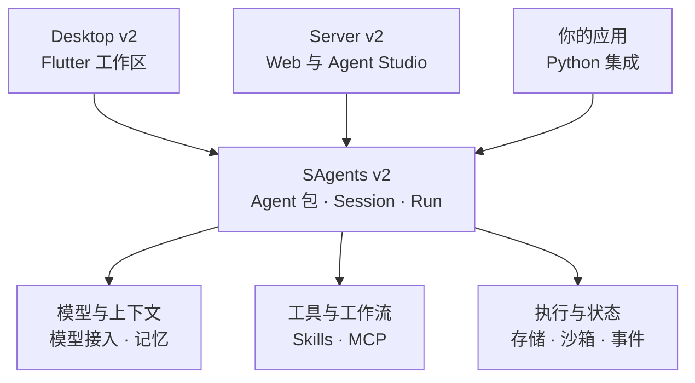

<div align="center">

# 🌟 **体验 Sage 的强大能力**


[](README.md)
[](README_CN.md)
[](LICENSE)
[-blue.svg?logo=python)](https://python.org)
[](https://github.com/ZHangZHengEric/Sage)
[](https://deepwiki.com/ZHangZHengEric/Sage)
[](https://join.slack.com/t/sage-b021145/shared_invite/zt-3t8nabs6c-qCEDzNUYtMblPshQTKSWOA)

# 🧠 **Sage 智能体平台**

### 🎯 **让复杂工作走向可靠交付**

> 🌟 **面向项目工作、工具执行与多智能体协作的开源平台，支持桌面端、Web 与自建应用。**

</div>

---

## ✨ **核心优势**

- 🧩 **插件化架构** — 按需组合模型、记忆、存储、工具和调度实现，统一管理扩展契约与组件生命周期。
- 📦 **声明式 Agent 包** — 用 `sage.yaml` 定义指令、能力和运行配置，在 Server Studio 中管理不可变版本。
- 🔄 **有状态、可交互的执行** — 持久化 Session 历史，流式输出事件，支持暂停、恢复、人工输入与审批。
- 🤝 **多智能体编排** — 通过定向消息协调 Studio 成员，或在运行时中组合 Agent Flow。
- 🔌 **可扩展的工具生态** — 将内置工具、可复用 Skills 与 MCP 服务接入同一智能体工作流程。
- 🏗️ **统一内核，多端接入** — 通过 Desktop 和 Server 使用 SAgents v2，也可以嵌入自己的 Python 应用。

---

## 🚀 **快速开始**

| 选择你的入口 | 从这里开始 |
| --- | --- |
| 💻 **Desktop v2** — 本地项目工作与智能体协作 | [桌面端指南](app/desktop_v2/README.md) |
| 🌐 **Server v2** — 多用户 Web 应用与 Agent Studio | [服务端指南](app/server_v2/README.md) |
| 🧠 **SAgents v2** — 将智能体能力集成到自己的应用 | [运行时快速开始](sagents/v2/README.md#quick-start) |
| 📦 **桌面安装包** — 已发布版本 | [下载与版本说明](https://github.com/ZHangZHengEric/Sage/releases) |

### 💻 从源码启动桌面端

需要 **Python 3.12+**，以及支持桌面构建、Dart 版本满足 `^3.12.2` 的 **Flutter**。macOS 下运行：

```bash
git clone https://github.com/ZHangZHengEric/Sage.git
cd Sage
python3.12 -m venv .venv
source .venv/bin/activate
python -m pip install -e .
cd app/desktop_v2
flutter pub get
flutter run -d macos
```

**添加模型 → 配置 Agent → 开始对话或打开项目。**

应用自动启动本机后端。设置与会话数据保存在 `~/sage/runtime`，默认工作区为 `~/sage/agent_workspace`。

Windows、Linux 配置见 [桌面端指南](app/desktop_v2/README.md)。安装包以对应版本说明为准；现有发布工作流构建的是旧版 Tauri 应用。

### 🌐 从源码启动服务端

需要 **Python 3.12+**、**MySQL** 和 **Node.js 22.12+**。在仓库根目录、已激活 Python 环境的终端中执行：

```bash
python -m pip install -e '.[server-v2]'
cp app/server_v2/.env.example app/server_v2/.env
```

在 `.env` 中配置 MySQL 连接、JWT 密钥和初始管理员账号，然后运行：

```bash
cd app/server_v2/web
npm install
npm run build
cd ../../..
python -m app.server_v2
```

打开 **[localhost:8090](http://localhost:8090)**，添加模型和 Agent 后开始对话；进入 **`/studio`** 管理 Agent 包。

详细配置见 [服务端指南](app/server_v2/README.md)。Server v2 当前支持**单 worker**，MySQL 持久化不代表已支持横向扩容。

### 🧑‍💻 用 SAgents v2 运行第一个 Agent

**一个 Python 文件即可，无需创建 `sage.yaml`。** 完成上面的 Python 安装后，保存为 `quickstart.py`，将 `your-model` 替换为可用模型：

```python
"""Set MODEL_API_KEY and replace your-model below; no sage.yaml file is needed."""

import asyncio
from uuid import uuid4

from sagents.v2 import ActorRef, RequestContext, SAgentBuilder, StartRun
from sagents.v2.contracts.commands import InputItem
from sagents.v2.contracts.items import TextBlock
from sagents.v2.contracts.principals import PrincipalType
from sagents.v2.package.manifest import SageManifestLoader

AGENT_YAML = """
schema_version: sage/v2
kind: application
metadata: {id: example.assistant, version: 1.0.0, name: Assistant}
credentials:
  api-key: {source: env, key: MODEL_API_KEY}
models:
  primary:
    provider: openai-responses
    base_url: https://api.openai.com/v1
    credential: api-key
    model: your-model
agents:
  main:
    name: Assistant
    instructions: {inline: "Be helpful and concise."}
    models: {primary: primary}
entrypoint: {agent: main}
"""


async def main():
    manifest = SageManifestLoader().loads(AGENT_YAML)
    app = await SAgentBuilder().with_defaults(session_root="runtime").build(manifest)
    try:
        context = RequestContext(actor=ActorRef(
            principal_id="user-1", principal_type=PrincipalType.USER,
        ))
        stream = await app.entrypoint().run_stream(StartRun(
            agent_id="main",
            input=(InputItem(role="user", content=(TextBlock(text="Say hello!"),)),),
            resolved_spec_hash=app.composition_hash,
            idempotency_key=str(uuid4()),
        ), context)
        async for event in stream.events:
            print(event.model_dump_json())
        print((await stream.wait()).state)
    finally:
        await app.close()


if __name__ == "__main__":
    asyncio.run(main())
```

```bash
export MODEL_API_KEY="your-api-key"
python quickstart.py
```

`loads()` 解析 YAML 字符串，`build()` 直接接收 manifest 对象。示例输出事件和最终状态，不启用文件或 Shell 工具。[更多配置方式 →](docs/zh/applications/GETTING_STARTED.md)

---

## 🧠 **SAgents v2 内核**


```mermaid
flowchart TB
    desktop["Desktop v2<br/>Flutter 工作区"]
    server["Server v2<br/>Web 与 Agent Studio"]
    custom["你的应用<br/>Python 集成"]

    runtime["SAgents v2<br/>Agent 包 · Session · Run"]

    desktop --> runtime
    server --> runtime
    custom --> runtime

    runtime --> intelligence["模型与上下文<br/>模型接入 · 记忆"]
    runtime --> capabilities["工具与工作流<br/>Skills · MCP"]
    runtime --> execution["执行与状态<br/>存储 · 沙箱 · 事件"]
```

- 📦 **Agent 包** — 定义智能体可以做什么。
- 💬 **Session** — 保存跨 Run 的对话历史。
- ⚡ **Run** — 执行任务，提供实时进度与交互。

宿主应用负责界面、身份认证和凭据。内置运行配置面向单进程或单宿主；本机进程执行不提供容器级隔离。

[了解运行时 →](sagents/v2/README.md) · [阅读架构设计 →](sagents/v2/ARCHITECTURE.md)

---

## 📚 **文档导航**

| 了解 Sage | 构建与扩展 |
| --- | --- |
| [文档索引](docs/zh/README.md) | [运行时集成手册](sagents/v2/使用手册.md) |
| [Desktop v2](app/desktop_v2/README.md) | [Server Agent 平台](docs/zh/architecture/SERVER_V2_AGENT_PLATFORM.md) |
| [Server v2](app/server_v2/README.md) | [部署指南](deploy/README.md) |
| [版本说明](release_notes/) | [开发变更日志](change_log.md) |

请优先阅读所选入口对应的组件文档。

## 🛠️ **参与贡献**

运行时位于 [`sagents/v2/`](sagents/v2/)，桌面端位于 [`app/desktop_v2/`](app/desktop_v2/)，Web 平台位于 [`app/server_v2/`](app/server_v2/)。

欢迎提交 [Issue](https://github.com/ZHangZHengEric/Sage/issues) 或 Pull Request。请附上复现步骤，并运行受影响组件的检查：Python 测试位于 [`tests/`](tests/)，Desktop v2 使用 `flutter analyze` 和 `flutter test`。

## 💬 **加入社区**

<div align="center">

[](https://join.slack.com/t/sage-b021145/shared_invite/zt-3t8nabs6c-qCEDzNUYtMblPshQTKSWOA)
[](https://github.com/ZHangZHengEric/Sage/issues)

</div>

## 💖 **赞助商**

<p align="center">
  
  &nbsp;&nbsp;&nbsp;&nbsp;&nbsp;&nbsp;
  
</p>

---

<div align="center">

[MIT 许可证](LICENSE) · Built with ❤️ by the Sage Team 🦌

</div>
