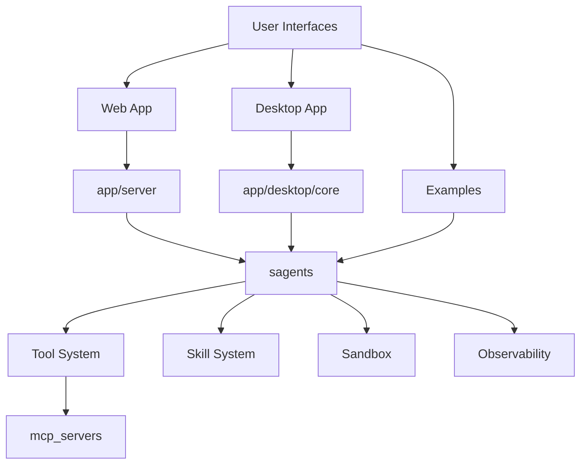

# Architecture

## Repository Overview

Sage is structured as a layered repository rather than a single binary. The main top-level subsystems are:

- `sagents/`: core runtime and orchestration
- `app/server/`: main FastAPI application and web client
- `app/desktop/`: desktop-local application stack
- `examples/`: lightweight runnable examples
- `mcp_servers/`: built-in MCP server implementations
- `release_notes/`: release-specific notes outside the main docs set

## High-Level Dependency Shape

```mermaid
flowchart TD
    User[User Interfaces] --> Web[Web App]
    User --> Desktop[Desktop App]
    User --> Examples[Examples]
    Web --> Server[app/server]
    Desktop --> DesktopCore[app/desktop/core]
    Server --> Runtime[sagents]
    DesktopCore --> Runtime
    Examples --> Runtime
    Runtime --> Tools[Tool System]
    Runtime --> Skills[Skill System]
    Runtime --> Sandbox[Sandbox]
    Runtime --> Obs[Observability]
    Tools --> MCP[mcp_servers]
```

## Core Runtime: `sagents/`

- `sagents/sagents.py`: `SAgent` runtime entry and stream orchestration
- `sagents/agent/`: agent implementations such as simple, planning, execution, routing, and fibre agents
- `sagents/flow/`: flow schema, conditions, and executor
- `sagents/tool/`: tool abstractions, built-ins, managers, and MCP support
- `sagents/skill/`: skill management and proxies
- `sagents/context/`: session and state handling
- `sagents/utils/sandbox/`: sandbox configuration and providers
- `sagents/observability/`: runtime tracing and telemetry hooks

## Main Application: `app/server/`

- `app/server/main.py`: primary FastAPI startup path
- `app/server/routers/`: HTTP route registration
- `app/server/services/`: business and integration services
- `app/server/schemas/`: request and response models
- `app/server/web/`: Vue 3 frontend

This is the main multi-user application surface and the default place to understand the productized server behavior.

## Desktop Application: `app/desktop/`

- `app/desktop/entry.py`: desktop bootstrap
- `app/desktop/core/main.py`: desktop-local FastAPI app
- `app/desktop/ui/`: desktop frontend
- `app/desktop/scripts/`: packaging and development scripts

The desktop app reuses core platform concepts while packaging a local-first application flow.

## Example Surfaces: `examples/`

The `examples/` directory is intentionally lighter weight than `app/server/` and is useful for:

- local experimentation
- simple runtime validation
- isolated demos
- packaging experiments

## MCP Servers: `mcp_servers/`

Built-in MCP implementations are versioned in the repository and can be wired into the runtime through the tool layer.

## Architectural Notes

- `app/server/` is the primary application boundary.
- `examples/` are useful, but they are not the canonical application stack.
- `sagents/` is the runtime engine and extension substrate.
- `mcp_servers/` and app-facing tool registration are separate concerns: implementation vs exposure.
