# 🏗️ Sage System Architecture & Design Principles (v3.0)

This document details the core capabilities, execution flow, and underlying implementation principles of key modules in Sage.

Sage is a highly modular, observable agent system with long-term memory capabilities. Its design core lies in the **separation of Control and State**, as well as **Multi-Mode execution strategies**, enabling it to handle both simple instant Q&A and complex long-process tasks.

## 1. Core Design Philosophy

### Core Entities
*   **SAgent (Controller)**: The brain and commander of the agent. Responsible for receiving requests, orchestrating agents, routing tasks, and controlling the entire execution flow. It does not store state itself but reads and writes state through SessionContext.
*   **SessionContext (State Center)**: The memory and state container for the agent. Responsible for maintaining all data within the session lifecycle, including message records, task states, user memory, workflow context, etc.

---

## 2. System Overall Architecture

### 2.1 Architecture Layer Diagram

```mermaid
graph TB

    %% ======================
    %% 👤 User Interface Layer
    %% ======================
    subgraph UI_Layer["👤 User Interface"]
        User["User (User)<br/>💻 API / Web / CLI"]
    end

    %% ======================
    %% 🧠 Control Plane
    %% ======================
    subgraph Control_Layer["🧠 Control Plane"]
        Orchestrator["SAgent (Controller)<br/>🕹️ Global Orchestration & Scheduling"]
    end

    %% ======================
    %% 🧩 Execution Runtime
    %% ======================
    subgraph Runtime_Layer["🧩 Agent Execution Runtime"]
        Obs["Observability (Observability)<br/>📡 Runtime Monitoring"]
        Execution["Agent Runtime (Execution Core)<br/>🤖 Agent Execution"]
        Obs --> Execution
    end

    %% ======================
    %% 📦 State Management Layer
    %% ======================
    subgraph State_Layer["📦 State Management"]
        Context["SessionContext<br/>🗂️ Session State Container"]

        subgraph State_Modules["State Modules"]
            MsgMgr["MessageManager<br/>Message Mgmt"]
            TaskMgr["TaskManager<br/>Task Mgmt"]
            WFMgr["WorkflowManager<br/>Workflow Mgmt"]
            SysCtx["SystemContext<br/>System Context"]
        end
    end

    %% ======================
    %% 🛠️ Infrastructure Layer
    %% ======================
    subgraph Infra_Layer["🛠️ Infrastructure"]
        ToolMgr["ToolManager<br/>🔌 Tool System"]
        SkillMgr["SkillManager<br/>📚 Skill System"]
        MemMgr["UserMemoryManager<br/>💾 Memory System"]

        ObsInfra["Observability Infra<br/>📊 Monitoring Infra"]

        InnerTool["Built-in Tools"]
        MCP["MCP Service Tools"]
        VectorDB["Vector DB"]
        FileDB["Local Files"]
    end

    %% ======================
    %% 🔗 Interactions & Dependencies
    %% ======================

    %% User to Control
    User --> Orchestrator

    %% Control to Runtime
    Orchestrator --> Obs

    %% Runtime dependencies
    Execution --> ToolMgr
    Execution --> SkillMgr

    %% State access
    Orchestrator <--> Context
    Execution <--> Context

    %% State internals
    Context --> MsgMgr
    Context --> TaskMgr
    Context --> WFMgr
    Context --> SysCtx
    Context --> MemMgr

    %% Infra internals
    ToolMgr --> InnerTool
    ToolMgr --> MCP
    MemMgr --> VectorDB
    MemMgr --> FileDB

    %% Observability export
    Obs -.-> ObsInfra

    %% ======================
    %% 🎨 Style Definitions
    %% ======================
    classDef actor fill:#ffeb3b,stroke:#fbc02d,stroke-width:2px;
    classDef control fill:#e3f2fd,stroke:#2196f3,stroke-width:2px;
    classDef wrapper fill:#ede7f6,stroke:#673ab7,stroke-width:2px,stroke-dasharray:5 5;
    classDef agent fill:#f3e5f5,stroke:#ab47bc,stroke-width:2px;
    classDef state fill:#fff3e0,stroke:#ff9800,stroke-width:2px;
    classDef infra fill:#e8f5e9,stroke:#4caf50,stroke-width:2px;

    class User actor;
    class Orchestrator control;
    class Obs wrapper;
    class Execution agent;
    class Context,MsgMgr,TaskMgr,WFMgr,SysCtx state;
    class ToolMgr,SkillMgr,MemMgr,ObsInfra,InnerTool,MCP,VectorDB,FileDB infra;

```

---

## 3. Dialogue Execution Flow & Trigger Logic

Sage's execution flow is highly dynamic; the system decides which path to take based on input content, configuration, and intermediate states.

### 3.1 Core Flowchart

### 3.2 Key Trigger Conditions & Flow Logic

1.  **History Context Preparation (History Context Prep)**
    *   **Trigger**: Start of every session.
    *   **Logic**: After initializing `SessionContext`, execute `set_history_context()`.
    *   **Purpose**: Load history messages, execute truncation and BM25 relevance retrieval, and apply Budget Limiter to ensure context fits within the model's Token window.

2.  **Workflow Selection (Workflow Selection)**
    *   **Trigger**: `available_workflows` count is greater than 5.
    *   **Logic**: Activate `WorkflowSelectAgent`.
    *   **Purpose**: When there are too many optional workflows, help the LLM pre-filter the one that best matches the current user intent to reduce subsequent interference.

3.  **Task Routing Judgment (Task Routing)**
    *   **Trigger**: `deep_thinking` or `multi_agent` parameters are not explicitly specified in the input arguments.
    *   **Logic**: Activate `TaskRouterAgent`.
    *   **Purpose**: Intelligently judge user intent and dynamically decide whether to require "Deep Thinking" and whether to adopt "Multi-Agent" mode. If arguments are already specified, this step is skipped and the argument configuration is used directly.

4.  **Deep Thinking (Deep Thinking)**
    *   **Trigger**: `deep_thinking = True` (from input arguments or router judgment).
    *   **Logic**: Activate `TaskAnalysisAgent`.
    *   **Purpose**: Before executing specific tasks, conduct a deep analysis of user intent, required tools, and potential skills, generating a detailed task analysis report to guide subsequent execution.

5.  **Multi-Agent Mode (Multi-Agent Workflow)**
    *   **Trigger**: `multi_agent = True`.
    *   **Process**: **Decompose** (`TaskDecomposeAgent`) -> **Loop Execution** (Plan `TaskPlanningAgent` -> Execute `TaskExecutorAgent` -> Observe `TaskObservationAgent` -> Judge `TaskCompletionJudgeAgent`) -> **Summary** (`TaskSummaryAgent`).
    *   **Applicable Scenarios**: Programming development, complex logical reasoning, multi-step tool calls, and other tasks requiring ReAct loops.

6.  **Single Agent Mode (Simple Workflow)**
    *   **Trigger**: `multi_agent = False`.
    *   **Process**: **Skill Matching** (execute `SkillExecutorAgent` if matched) -> **Simple Response** (`SimpleAgent` generates response or calls tool) -> **Force Summary** (Optional).
    *   **Applicable Scenarios**: Casual chat, simple Q&A, single tool call, low latency requirement scenarios.

7.  **Follow-up Suggestions (Query Suggestion)**
    *   **Trigger**: `more_suggest = True`.
    *   **Logic**: Activate `QuerySuggestAgent`.
    *   **Purpose**: Based on the current conversation content, generate 3 related follow-up question suggestions to guide further user interaction.

8.  **Memory Extraction (Memory Extraction)**
    *   **Trigger**: `UserMemoryManager` is enabled and the session ends normally.
    *   **Logic**: Start asynchronous task `MemoryExtractor`.
    *   **Purpose**: Without blocking user response, analyze this conversation, extract user persona, factual preferences, and store them in the vector database to achieve long-term memory.

---

## 4. Key Modules Detail

### 4.1 Tool Module

Tools are the hands of the Agent interacting with the external world. Sage uses a layered architecture to manage tool registration, permission control, and execution, shielding the differences between local functions and remote services.

#### 4.1.1 Core Components & Architecture

*   **ToolManager (`sagents/tool/tool_manager.py`)**: System core singleton.
    *   **Responsibility**: Responsible for global registration, storage, and execution dispatch of tools.
    *   **Unified Interface**: Provides `run_tool_async` method as the unified entry point for all tool executions.

*   **ToolProxy (`sagents/tool/tool_proxy.py`)**: Security and scenario isolation layer.
    *   **Responsibility**: Acts as an access gateway to `ToolManager`. It does not hold tool entities but maintains a whitelist of allowed tools (`available_tools`).
    *   **Scenario Isolation**: Different Agents (e.g., SalesAgent, CoderAgent) hold different `ToolProxy` instances, thereby only accessing tools within their permission scope.

*   **McpProxy (`sagents/tool/mcp_proxy.py`)**: MCP Protocol Adapter.
    *   **Responsibility**: Handles Model Context Protocol (MCP) protocol details, supporting multiple transport methods such as Stdio, SSE, Streamable HTTP.

#### 4.1.2 Registration Mechanism (Registration)

Sage supports tool registration from multiple sources and uses a **priority override mechanism** to resolve naming conflicts.

1.  **Auto Discovery**:
    *   **Local Tools**: Scans Python files under the `sagents` package at startup. Functions marked with the `@tool` decorator will have their metadata parsed (docstring -> description, type hints -> parameters) and registered.
    *   **Built-in MCP**: Automatically scans modules under the `sagents` directory. Functions marked with the `@sage_mcp_tool` decorator are registered as built-in MCP services.

2.  **MCP Dynamic Loading**:
    *   Reads `mcp_setting.json` configuration file.
    *   Connects to remote Server via `McpProxy`, calls `list_tools` to get the tool list, and dynamically encapsulates them as `McpToolSpec`.

3.  **Priority Override**:
    *   When a tool with the same name appears, high priority overrides low priority:
    *   `McpToolSpec` (MCP Tool) > `AgentToolSpec` (Agent Tool) > `SageMcpToolSpec` (Built-in MCP) > `ToolSpec` (Local Function).

#### 4.1.3 Invocation Flow (Invocation)

The execution entry point is `ToolProxy.run_tool_async`, and its internal flow is as follows:

1.  **Permission Check**: `ToolProxy` checks if `tool_name` is in the whitelist. If not, raises `ValueError`.
2.  **Request Forwarding**: After passing the check, forwards the request to `ToolManager.run_tool_async`.
3.  **Polymorphic Dispatch**: `ToolManager` decides execution strategy based on the tool's `ToolSpec` type:
    *   **Local Tool (`ToolSpec`)**: Directly reflection calls local Python function (`func(**kwargs)`).
    *   **MCP Tool (`McpToolSpec`)**: Delegates to `McpProxy`, sending `call_tool` request to remote Server via network protocol (SSE/Stdio).
4.  **Result Standardization**: Regardless of underlying return format, uniformly encapsulates as JSON format to return to LLM.

### 4.2 Skill Module

Skill is a capability unit higher than a tool, usually containing code files, configuration files, and usage instruction documents.

*   **SkillManager (`sagents/skills/skill_manager.py`)**:
    *   **Structured Loading**: Loads skills from `skill_workspace` directory. Each skill is a folder, with `SKILL.md` (containing metadata and Prompt instructions) as the core.
    *   **Resource Preparation**: Before execution, copies scripts and files required by the skill to the current Agent's workspace (Sandbox) to ensure execution environment isolation.
    *   **Tiered Retrieval**: Provides three-level metadata retrieval: L1 (Name Description), L2 (Detailed Instruction Prompt), L3 (Specific Resource Path).

### 4.3 Memory Module

The memory module gives Sage "personality" and "growth".

*   **UserMemoryManager (`sagents/context/user_memory/manager.py`)**:
    *   **Driver Mode**: Decouples storage implementation via `IMemoryDriver` interface. Defaults to `ToolMemoryDriver`, extensible to VectorDB (e.g., Milvus, Chroma).
    *   **CRUD Operations**: Provides `remember` (save), `recall` (retrieve), `forget` (delete) interfaces.
    *   **System-level Memory**: Automatically maintains memories of key dimensions such as `preference`, `persona`, `requirement`.

*   **MemoryExtractor (`sagents/context/user_memory/extractor.py`)**:
    *   **Asynchronous Processing**: Memory extraction is performed **asynchronously** after the conversation ends, so as not to increase user wait time.
    *   **Intelligent Extraction**: Sends the last 10 rounds of conversation to the LLM, using a specialized Prompt to extract new facts or preferences (JSON format).
    *   **Deduplication Mechanism**:
        1.  **Internal Deduplication**: Deduplication within the current extraction results.
        2.  **In-Library Deduplication**: Compares new memories with existing system memories, deleting old conflicting memories to ensure the memory bank is clean.

### 4.4 Base Managers

*   **ObservabilityManager**: Based on OpenTelemetry standards, performs full-link tracing (Tracing) and monitoring of LLM call chains.
*   **SessionContext**: State container, holding `MessageManager` (message history), `TaskManager` (task status), and `SystemContext` (environment variables), serving as the cornerstone for Agent stateless operation.

---

## 5. Session Interruption & Cancellation Logic

To respond to user "cancel" instructions at any time, Sage embeds checkpoints at key nodes in the execution flow.

*   **State Marking**: When a user initiates a cancellation request, the system sets `SessionContext.status` to `SessionStatus.INTERRUPTED`.
*   **Checkpoint Mechanism**:
    *   **Agent Level**: In `SAgent._execute_agent_phase`, the state is checked after processing each streaming Chunk.
    *   **Loop Level**: Before each iteration of the multi-agent `while` loop (Plan-Execute-Observe), `status == INTERRUPTED` is checked.
*   **Response Behavior**: Once an interruption is detected, the Agent immediately stops the current LLM generation or tool call, saves the current session state (for later recovery or auditing), and returns a "Task Cancelled" response to the user without continuing subsequent task steps.
