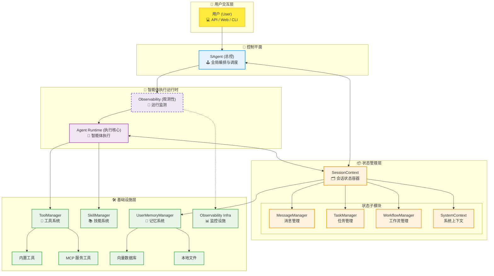
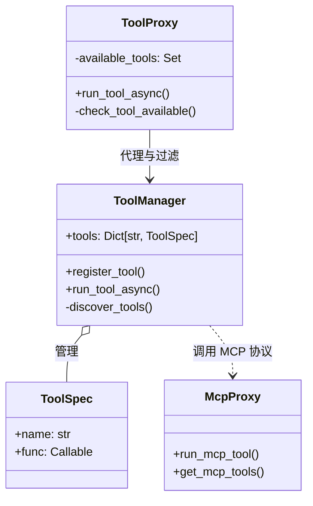

# 🏗️ Sage 系统架构与设计原理 (v3.0)

本文档详细阐述了 Sage 的核心能力、执行流程以及关键模块的底层实现原理。

Sage 是一个高度模块化、可观测且具备长期记忆能力的智能体系统。其设计核心在于**控制（Control）与状态（State）的分离**，以及**多模式（Multi-Mode）执行策略**，使其既能处理简单的即时问答，也能胜任复杂的长流程任务。

## 1. 核心设计理念

### 核心实体
*   **SAgent (控制器)**: 智能体的大脑与指挥官。负责接收请求、编排智能体、路由任务以及控制整个执行流。它本身不存储状态，而是通过 SessionContext 读写状态。
*   **SessionContext (状态中心)**: 智能体的记忆与状态容器。负责维护会话生命周期内的一切数据，包括消息记录、任务状态、用户记忆、工作流上下文等。

---

## 2. 系统整体架构

### 2.1 架构分层图

---

## 3. 对话执行流程与触发逻辑

Sage 的执行流程是高度动态的，系统会根据输入内容、配置和中间状态决定走哪条路径。

### 3.1 核心流程图

```mermaid
flowchart TD
    Start["开始 run_stream<br/>"]
        --> Init["初始化 SessionContext & UserMemory"]

    Init --> ContextPrep["准备历史上下文<br/>(预算管理器 + 用户记忆提取)"]
    ContextPrep --> WFCheck{"存在工作流?"}

    WFCheck -- "多于5个" --> WFSelect["WorkflowSelectAgent<br/>(工作流Agent)<br/>选择最匹配的工作流"]
    WFSelect -- "选择1个" --> WFGuide["注入 WorkflowManager"]

    WFCheck -- "5个及以下" --> WFGuide

    WFGuide --> RouterCheck{"入参指定deep_thinking & multi_agent?"}
    RouterCheck -- "指定" --> DeepThinkCheck
    RouterCheck -- "未指定" --> Router

    Router["TaskRouterAgent<br/>(任务路由)<br/>判断 deep_thinking & multi_agent"]
        --> DeepThinkCheck{"deep_thinking 判断"}

    DeepThinkCheck -- "Yes"
        --> Analyzer["TaskAnalysisAgent<br/>(任务分析)<br/>分析任务意图与工具/技能"]

    Analyzer --> ModeCheck{"multi_agent 判断"}
    DeepThinkCheck -- "No" --> ModeCheck

    %% 分支 1: 多智能体复杂模式
    ModeCheck -- "Multi-Agent = True"
        --> Decompose["TaskDecomposeAgent<br/>(任务分解)<br/>分解为子任务列表"]

    Decompose --> LoopStart((循环开始))

    subgraph ReActLoop ["ReAct Loop<br/>(规划-执行-观察)"]
        direction TB
        LoopStart
            --> Plan["TaskPlanningAgent<br/>(任务规划)<br/>生成下一步计划"]
        Plan
            --> Exec["TaskExecutorAgent<br/>(任务执行)<br/>调用工具或执行代码"]
        Exec
            --> Obs["TaskObservationAgent<br/>(任务观察)<br/>观察执行结果"]
        Obs
            --> Judge["TaskCompletionJudgeAgent<br/>(完成判断)<br/>判断子任务状态"]
        Judge
            --> StageSum["TaskStageSummaryAgent<br/>(阶段总结)<br/>总结当前进度"]
        StageSum
            --> CheckDone{"任务全部完成?"}
        CheckDone -- "否" --> LoopStart
    end

    CheckDone -- "是"
        --> TaskSum["TaskSummaryAgent<br/>(任务总结)<br/>生成最终回复"]

    %% 分支 2: 单智能体简单模式
    ModeCheck -- "Multi-Agent = False"
        --> SkillCheck{"Has Skills?"}

    subgraph SimpleFlow ["Simple Flow<br/>(直出 / 技能)"]
        direction TB

        SkillCheck -- "Yes"
            --> SkillExec["SkillExecutorAgent<br/>(技能执行)<br/>1. 意图识别选技能<br/>2. 沙盒执行技能"]

        SkillCheck -- "No" --> SimpleStart

        SkillExec --> SimpleStart((Loop))

        subgraph SimpleAgentLoop ["SimpleAgent Internal Loop"]
            direction TB
            SimpleStart
                --> SimpleGen["SimpleAgent<br/>(回复生成)<br/>生成回复或工具调用"]
            SimpleGen
                --> SimpleTool{"是否有工具调用?"}
            SimpleTool -- "Yes" --> SimpleGen
            SimpleTool -- "No"
                --> SimpleJudge{"任务是否完成?"}
            SimpleJudge -- "No" --> SimpleStart
        end

        SimpleJudge -- "Yes"
            --> ForceSum{"强制总结?"}
    end

    ForceSum -- "Yes" --> TaskSum["TaskSummaryAgent<br/>(任务总结)<br/>生成最终回复"]
    ForceSum -- "No" --> EndNode

    TaskSum --> EndNode

    EndNode((流程结束))
        --> Suggest{"more_suggest = True?"}

    Suggest -- "Yes"
        --> QSuggest["QuerySuggestAgent<br/>生成后续建议"]
    Suggest -- "No" --> Extract

    QSuggest --> Extract

    Extract["异步: MemoryExtractor<br/>(提取并保存用户记忆)"]
        --> Finish["结束 & 保存状态"]

```

### 3.2 关键触发条件与流转逻辑

1.  **历史上下文准备 (History Context Prep)**
    *   **触发条件**: 每次会话开始。
    *   **逻辑**: 初始化 `SessionContext` 后，执行 `set_history_context()`。
    *   **目的**: 加载历史消息，执行截断和 BM25 相关性检索，并应用预算限制（Budget Limiter），确保上下文符合模型 Token 窗口。

2.  **工作流选择 (Workflow Selection)**
    *   **触发条件**: `available_workflows` 数量大于 5 个。
    *   **逻辑**: 激活 `WorkflowSelectAgent`。
    *   **目的**: 当可选工作流过多时，帮助 LLM 预先筛选出最匹配当前用户意图的一个工作流，减少后续干扰。

3.  **任务路由判定 (Task Routing)**
    *   **触发条件**: 入参未显式指定 `deep_thinking` 或 `multi_agent` 参数。
    *   **逻辑**: 激活 `TaskRouterAgent`。
    *   **目的**: 智能判断用户意图，动态决定是否需要“深度思考”以及是否采用“多智能体”模式。若入参已指定，则跳过此步骤直接使用入参配置。

4.  **深度思考 (Deep Thinking)**
    *   **触发条件**: `deep_thinking = True` (来自入参指定或路由判断)。
    *   **逻辑**: 激活 `TaskAnalysisAgent`。
    *   **目的**: 在执行具体任务前，对用户意图、所需工具和潜在技能进行深度分析，生成详细的任务分析报告指导后续执行。

5.  **多智能体模式 (Multi-Agent Workflow)**
    *   **触发条件**: `multi_agent = True`。
    *   **流程**: **分解** (`TaskDecomposeAgent`) -> **循环执行** (规划 `TaskPlanningAgent` -> 执行 `TaskExecutorAgent` -> 观察 `TaskObservationAgent` -> 判断 `TaskCompletionJudgeAgent`) -> **总结** (`TaskSummaryAgent`)。
    *   **适用场景**: 编程开发、复杂逻辑推理、多步工具调用等需要 ReAct 循环的任务。

6.  **单智能体模式 (Simple Workflow)**
    *   **触发条件**: `multi_agent = False`。
    *   **流程**: **技能匹配** (若有匹配则执行 `SkillExecutorAgent`) -> **简单回复** (`SimpleAgent` 生成回复或调用工具) -> **强制总结** (可选)。
    *   **适用场景**: 闲聊、简单问答、单一技能调用、低延迟需求场景。

7.  **后续建议 (Query Suggestion)**
    *   **触发条件**: `more_suggest = True`。
    *   **逻辑**: 激活 `QuerySuggestAgent`。
    *   **目的**: 根据当前对话内容，生成 3 个相关的后续问题建议，引导用户进一步交互。

8.  **记忆提取 (Memory Extraction)**
    *   **触发条件**: `UserMemoryManager` 已启用且会话正常结束。
    *   **逻辑**: 启动异步任务 `MemoryExtractor`。
    *   **目的**: 在不阻塞用户响应的情况下，分析本次对话，提取用户画像、事实偏好并存入向量数据库，实现长期记忆。

---

## 4. 关键模块详解

### 4.1 工具模块 (Tool Module)

工具是 Agent 与外部世界交互的手。Sage 采用分层架构来管理工具的注册、权限控制和执行，对外屏蔽了本地函数与远程服务的差异。

#### 4.1.1 核心组件与架构

*   **ToolManager (`sagents/tool/tool_manager.py`)**: 系统核心单例。
    *   **职责**: 负责工具的全局注册、存储和执行分发。
    *   **统一接口**: 提供 `run_tool_async` 方法，作为所有工具执行的统一入口。

*   **ToolProxy (`sagents/tool/tool_proxy.py`)**: 安全与场景隔离层。
    *   **职责**: 作为 `ToolManager` 的访问网关。它不持有工具实体，而是维护一份允许使用的工具白名单 (`available_tools`)。
    *   **场景化**: 不同 Agent (如 SalesAgent, CoderAgent) 持有不同的 `ToolProxy` 实例，从而只能访问其权限范围内的工具。

*   **McpProxy (`sagents/tool/mcp_proxy.py`)**: MCP 协议适配器。
    *   **职责**: 处理 Model Context Protocol (MCP) 协议细节，支持 Stdio, SSE, Streamable HTTP 等多种传输方式。

#### 4.1.2 注册机制 (Registration)

Sage 支持多种来源的工具注册，并采用**优先级覆盖机制**解决命名冲突。

1.  **自动发现 (Auto Discovery)**:
    *   **本地工具**: 启动时扫描 `sagents` 包下的 Python 文件。凡是被 `@tool` 装饰器标记的函数，都会被解析元数据（docstring -> description, type hints -> parameters）并注册。
    *   **内置 MCP**: 自动扫描 `sagents` 目录下的模块，凡是被 `@sage_mcp_tool` 装饰器标记的函数，注册为内置 MCP 服务。

2.  **MCP 动态加载**:
    *   读取 `mcp_setting.json` 配置文件。
    *   通过 `McpProxy` 连接远程 Server，调用 `list_tools` 获取工具列表，动态封装为 `McpToolSpec`。

3.  **优先级覆盖**:
    *   当出现同名工具时，高优先级覆盖低优先级：
    *   `McpToolSpec` (MCP工具) > `AgentToolSpec` (智能体工具) > `SageMcpToolSpec` (内置MCP) > `ToolSpec` (本地函数)。

#### 4.1.3 调用流程 (Invocation)

执行入口为 `ToolProxy.run_tool_async`，其内部流程如下：

1.  **权限校验**: `ToolProxy` 检查 `tool_name` 是否在白名单中。若不在，抛出 `ValueError`。
2.  **请求转发**: 通过校验后，请求转发给 `ToolManager.run_tool_async`。
3.  **多态分发**: `ToolManager` 根据工具的 `ToolSpec` 类型决定执行策略：
    *   **本地工具 (`ToolSpec`)**: 直接反射调用本地 Python 函数 (`func(**kwargs)`).
    *   **MCP 工具 (`McpToolSpec`)**: 委托给 `McpProxy`，通过网络协议 (SSE/Stdio) 发送 `call_tool` 请求到远程 Server。
4.  **结果标准化**: 无论底层返回格式如何，统一封装为 JSON 格式返回给 LLM。

### 4.2 技能模块 (Skill Module)

技能（Skill）是比工具更高阶的能力单元，通常包含代码文件、配置文件和使用说明文档。

*   **SkillManager (`sagents/skills/skill_manager.py`)**:
    *   **结构化加载**: 从 `skill_workspace` 目录加载技能。每个技能是一个文件夹，核心是 `SKILL.md`（包含元数据和 Prompt 指令）。
    *   **资源准备**: 在执行前，会将技能所需的脚本和文件复制到当前 Agent 的工作空间（Sandbox），确保执行环境隔离。
    *   **分级获取**: 提供三级元数据获取：L1（名称描述）、L2（详细指令 Prompt）、L3（具体资源路径）。

### 4.3 记忆模块 (Memory Module)

记忆模块赋予 Sage “个性”和“成长性”。

*   **UserMemoryManager (`sagents/context/user_memory/manager.py`)**:
    *   **Driver 模式**: 通过 `IMemoryDriver` 接口解耦存储实现。默认使用 `ToolMemoryDriver`，可扩展至 VectorDB (如 Milvus, Chroma)。
    *   **CRUD 操作**: 提供 `remember` (存), `recall` (检索), `forget` (删) 接口。
    *   **系统级记忆**: 自动维护 `preference` (偏好), `persona` (人设), `requirement` (要求) 等关键维度的记忆。

*   **MemoryExtractor (`sagents/context/user_memory/extractor.py`)**:
    *   **异步处理**: 为了不增加用户等待时间，记忆提取在对话结束后**异步**进行。
    *   **智能提取**: 将最近 10 轮对话发送给 LLM，使用专门的 Prompt 提取出新的事实或偏好（JSON 格式）。
    *   **去重机制**:
        1.  **内部去重**: 本次提取结果内的去重。
        2.  **库内去重**: 将新记忆与已有系统记忆比对，删除旧的冲突记忆，确保记忆库的整洁。

### 4.4 基础管理器

*   **ObservabilityManager (观察器)**: 基于 OpenTelemetry 标准，对 LLM 调用链进行全链路追踪（Tracing）和监控。
*   **SessionContext (会话上下文)**: 状态容器，持有 `MessageManager` (消息历史)、`TaskManager` (任务状态) 和 `SystemContext` (环境变量)，是 Agent 无状态运行的基石。

---

## 5. 会话中断与取消逻辑

为了响应用户随时可能的“取消”指令，Sage 在执行流的关键节点埋入了检查点。

*   **状态标记**: 当用户发起取消请求时，系统会将 `SessionContext.status` 设置为 `SessionStatus.INTERRUPTED`。
*   **检查点机制**:
    *   **Agent 级别**: 在 `SAgent._execute_agent_phase` 中，每处理完一个流式 Chunk 都会检查状态。
    *   **循环级别**: 在多智能体 `while` 循环（规划-执行-观察）的每一次迭代开始前，都会检查 `status == INTERRUPTED`。
*   **响应行为**: 一旦检测到中断，Agent 会立即停止当前的 LLM 生成或工具调用，保存当前会话状态（以便后续恢复或审计），并向用户返回“任务已取消”的响应，而不会继续执行后续的任务步骤。
