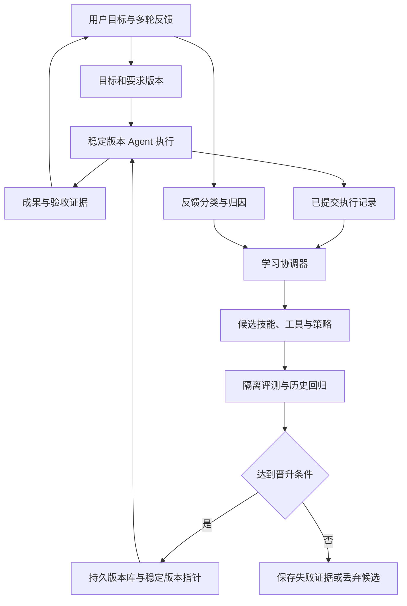

> 历史资料：本页已退出当前文档，可能包含旧接口、未实现方案或阶段性结论。请以 [Sage v2 文档](../../../zh/README.md) 为准。

# Sage 固定模型下的持续学习与递归自我改进设计

日期：2026-09-12。状态：设计草案与实现盘点；本文不表示下述学习闭环已经上线。

2026-09-13 实现进展：已新增完整 Agent Package 的模型工具与宿主管理服务，支持持久版本、创建与调用、会话续接，并补齐 Builder 的 Flow 和技能装配。见[实现与接入说明](../../../zh/architecture/SAGENTS_V2_AGENT_MANAGEMENT.md)。下文第 3 节保留 09-12 盘点基线；本次新增能力不等于自动监督与学习晋升已经实现。

本文讨论模型代码与权重均不可修改的情况。目标是让 Sage 内部的 agent 在完成用户任务、接受多轮反馈的过程中，积累可验证的专业能力，并逐步改善自身的学习方法。

实现盘点以 `sagents/v2` 为主，基于当前仓库的源码与测试定义；不推断所有桌面端、服务端或旧版运行时均已接入。外部项目依据官方仓库与文档，未在本次文档工作中安装或运行。

## 1. 产品目标与 RSI 的边界

用户可以给一个初始并不专业的 agent 设定一组目标，例如 100 个任务，以及各自的质量要求。目标可能经过多轮沟通才明确，也可能在执行期间调整。Sage 应同时完成两件事：

1. 持续交付：保留有效要求，完成当前任务，吸收用户修正。
2. 持续学习：将经验转化为可复用的技能、工具、知识和策略，使未来任务更可靠、需要更少纠正。

固定模型下，系统可表示为 `S_t = M + A_t`：`M` 是固定模型，`A_t` 是可变的技能、工具、记忆、指令和调度策略。每轮学习产生候选 `A_(t+1)`，只有验证有效后才投入后续任务。

应区分三个层次：

| 层次 | 行为 | 验收重点 |
| --- | --- | --- |
| 当前任务适应 | 根据反馈修改本次成果 | 当前有效要求得到满足 |
| 跨任务持续学习 | 保存并复用经验证的能力 | 未见任务受益，旧能力没有明显退步 |
| 递归自我改进 | 改进后的能力参与诊断、生成和验证下一轮升级 | 相同改进预算下，产生有效升级的能力提高 |

优先实现前两层，再开放第三层。更多记忆、更多提示词、更长推理时间均不能单独证明 RSI；该设计也不承诺无限进步或任意领域自动达到专家水平。

## 2. 用户任务与多轮反馈

### 2.1 100 个目标的组织方式

目标集合属于宿主产品的长期工作管理层，不应作为一条超长提示词放进单个 Run。每个目标需要独立保存成果、要求版本、依赖、预算和验收状态，再映射到一个或多个 Session / Run。

执行顺序首先尊重用户优先级、截止时间和依赖；在这些条件允许时，优先完成能为多个后续目标积累共享能力的任务。不能为了学习收益擅自牺牲用户的交付优先级。

要求可以逐步明确。缺失信息进入待澄清状态，合理假设需可追溯；用户没有回复不能被当作同意或验收通过。

### 2.2 反馈必须有类型与作用范围

| 示例 | 解释 | 持久变化 |
| --- | --- | --- |
| “这份报告再短一些” | 当前成果修改 | 更新该成果要求，不自动推广为全局偏好 |
| “以后给我的报告都先说结论” | 用户长期偏好 | 保存用户范围的偏好与来源 |
| “你把同比算成环比了” | 能力错误 | 修正结果，生成计算检查技能和回归案例 |
| “改成给投资人看的” | 当前目标变更 | 新建要求版本，重新检查验收条件 |
| “从今年起按新口径统计” | 有时间边界的项目知识 | 保存新旧口径及生效时间 |
| “不够专业” | 尚未明确的质量反馈 | 形成诊断假设，通过修订和交流校准 |

作用范围建议包含当前成果、目标、项目、用户、agent 通用能力。范围并非简单的覆盖顺序：应按上下文、明确程度和生效时间解析冲突。只有明确的修订才废止对应旧要求；不相关的旧约束继续有效。

偏好由用户表达提供依据；事实正确性还需资料、工具结果或专家证据。系统不能把讨好用户、用户暂时沉默或模型自评分当作专业能力的充分证据。

### 2.3 示例：竞品分析能力的形成

1. 初始 agent 提交竞品表，混用了地区和计费周期。
2. 用户指出问题；Sage 关联到该成果版本与对应要求，完成修正。
3. 学习流程提出候选技能：比较前统一地区、币种、周期、版本和采集日期，并保留原始来源。
4. 在其他竞品任务上验证，检查缺失数据处理和历史格式要求是否仍然满足。
5. 有效技能进入稳定版本，后续相关任务按需加载。
6. 若重复人工核对成为瓶颈，再生成字段校验工具并独立验证。

从案例修补到可迁移技能，再到可执行工具，构成专业能力的积累。若新工具进一步改善技能开发与测试，才进入递归改进阶段。

## 3. Sage 当前实现盘点

标记口径：**已有**表示相应基础机制存在；**部分**表示具备接口或局部实现，但不满足本方案完整要求；**待实现**表示本次检查范围内未发现该专门闭环。已有基础不等于产品端到端验收通过。

下列源码路径均相对本文件可跳转。

| 能力 | 状态 | 当前证据与边界 | 后续工作 |
| --- | --- | --- | --- |
| 持久会话、Run 生命周期 | 已有 | [V2 说明](../../../../sagents/v2/README.md)以 canonical Session history 为事实来源，支持完成、失败和暂停 | 学习事件通过已提交记录异步消费，避免影响交付提交 |
| 目标模式 | 部分 | [GoalState](../../../../sagents/v2/goal/contracts.py)表示单个目标；[状态服务](../../../../sagents/v2/goal/state.py)支持从日志与关联问答链恢复 | 增加跨会话目标集合、依赖、要求版本和验收证据 |
| 多轮交互 | 已有基础 | [Interaction 契约](../../../../sagents/v2/contracts/interactions.py)含用户输入、决议、版本和幂等键 | 增加反馈归因、作用范围和要求冲突处理 |
| 长期记忆与隔离 | 已有基础 | [Memory 契约](../../../../sagents/v2/memory/contracts.py)含 tenant、principal、agent、session 范围及 source / metadata | 扩展偏好、知识、经验的生命周期与失效处理 |
| 自动经验提炼 | 部分 | [MemoryService](../../../../sagents/v2/memory/service.py)有可替换 extractor；默认提取用户消息并按内容去重，并非专业经验学习 | 增加失败归因与语义合并；学习来源不能仅限 completed Run |
| 历史检索 | 已有 | [Session Memory](../../../../sagents/v2/session_memory/service.py)及 [SQLite BM25](../../../../sagents/v2/session_memory/plugins/sqlite_bm25.py) | 加入与实际任务收益关联的经验选择机制 |
| 技能发现、加载与内容标识 | 已有 | [Skill 契约](../../../../sagents/v2/skill/contracts.py)含版本、不可变 bundle、content hash 与激活记录 | 增加候选技能生成、评测、晋升和退役 |
| Agent 可配置行为 | 已有 | [AgentDefinition](../../../../sagents/v2/package/manifest/agents.py)可配置指令、工具、技能、执行模式和预算 | 定义允许演化的字段与资源边界 |
| 包版本验证与发布门槛 | 部分 | [InMemoryAgentPackageRegistry](../../../../sagents/v2/package/registry/registry.py)有 draft / validate / test / publish / retire，已发布版本不可变；只在进程内保存 | 持久化学习版本、稳定版本指针、原子晋升与回滚；覆盖外部技能和工具内容哈希 |
| 场景测试 | 部分 | [Scenario 契约](../../../../sagents/v2/testing/contracts.py)支持终态、事件、文本、工具、步数与交互响应检查 | 补充真实任务质量、多轮变更、保持能力与泛化评测 |
| 运行追踪 | 已有基础 | [Trace](../../../../sagents/v2/runtime/observability/traces.py)等可观测性模块 | 关联目标、反馈、候选版本、成本和验收证据 |
| 反馈 → 候选修改 → 评测 → 晋升 | 待实现 | 本次检查未发现专门串联上述过程的服务 | 建设独立学习协调层 |
| 改进学习机制自身 | 待实现 | 存在可配置执行与扩展机制，不等于元优化已实现 | 基础闭环稳定后允许受控实验 |

现有相关测试入口包括 [goal](../../../../tests/sagents/v2/test_goal_state_matrix.py)、[skill](../../../../tests/sagents/v2/test_skill_provider_matrix.py)、[package registry](../../../../tests/sagents/v2/test_agent_package_registry_matrix.py)、[scenario harness](../../../../tests/sagents/v2/test_scenario_harness_matrix.py)。这些是机制验证入口，不能据此宣称真实用户任务质量已经提升。

## 4. 建议架构与运行闭环

### 4.1 两个循环

交付循环优先保障当前成果；学习循环可在阶段结束或累计同类反馈后运行。学习失败不能回滚已确认的 Session 记录，也不能把未验收成果标为完成。

### 4.2 建议职责边界

以下名称是拟议模块，不是当前公共 API。

| 模块 | 职责 | 建议归属 |
| --- | --- | --- |
| GoalPortfolioService | 管理目标集合、依赖、优先级和要求版本 | 宿主应用服务层 |
| FeedbackService | 关联原始反馈、成果和要求，区分修正与学习信号 | 宿主服务层，复用运行时交互契约 |
| ExperienceStore | 保存经验、适用范围、来源、反例和有效性 | 扩展 Memory 接口与 provider |
| EvolutionCoordinator | 触发学习、生成候选、安排评测和管理预算 | 独立应用服务，通过公共运行时接口执行 |
| CapabilityRegistry | 管理技能、工具、策略的不可变版本和稳定指针 | 扩展 package / skill 生命周期能力 |
| EvaluationService | 执行质量验证、旧能力回归、候选对比 | 扩展 testing 并配置独立任务验证器 |

不要首先把优化逻辑写入 `agent/engine.py` 的每一步执行。内核保留执行、事件和生命周期职责；学习协调器作为可关闭的外围服务，便于与固定基线比较。

### 4.3 单轮学习协议

1. 消费已提交事件，以来源事件 ID 和学习策略版本去重；包含失败、用户纠正与明确验收信息。
2. 分析缺口属于知识、工具、流程、偏好还是要求变化；记录诊断依据与不确定性。
3. 提出少量有针对性的修改，标注预期收益、影响范围、基础版本和预算。
4. 生成候选快照，冻结指令、技能、工具代码、依赖和记忆快照引用。
5. 在隔离环境中运行开发案例和验证案例，取得独立验收结果。
6. 比较质量、回归和成本。有效候选才可更新稳定指针；失败候选保留诊断证据。
7. 新 Run 默认使用新稳定版本；正在执行的 Run 固定原版本。需要迁移时显式记录迁移点。
8. 监测后续任务表现；发现严重退步时回退稳定版本，并停止继续推广该能力。

晋升使用基础版本检查或 compare-and-swap，避免多个学习作业覆盖彼此结果。队列、候选与评测状态需可恢复；重启后不能重复晋升或重复外部操作。

## 5. 建议数据模型

以下是设计字段，不是数据库迁移或已实现 schema。

| 对象 | 核心字段 |
| --- | --- |
| Goal | id、owner / tenant、description、priority、dependencies、budget、status、current_requirement_revision |
| RequirementRevision | goal_id、revision、parent_revision、requirements、acceptance_criteria、source_message_ids、effective_at、superseded_ids |
| FeedbackEvent | source_event_id、goal_id、artifact_version、requirement_revision、feedback_type、scope、raw_text、interpretation、confidence |
| Experience | id、scope、capability_tags、context、action、outcome、source_refs、counterexamples、validity、supersedes |
| CapabilityVersion | capability_id、version、content_hash、artifact_refs、applicability、base_version、evidence_refs、stage |
| EvolutionRun | id、trigger_refs、base_snapshot、candidate_snapshots、budget、cost、state、idempotency_key |
| EvaluationReport | candidate_hash、suite_revision、requirement_revision、environment_snapshot、scores、hard_failures、cost、uncertainty、evidence_refs |
| PromotionRecord | scope、old_version、new_version、report_refs、decision_policy_version、timestamp、rollback_reason |

目标状态至少区分待澄清、可执行、执行中、等待外部条件、待验收、已完成、已取消。Run 的 completed 只表示执行结束，不能替代 Goal 的用户要求验收。

偏好、事实和程序性技能应使用不同类型与更新规则。跨用户共享只推广经过脱敏和验证的通用能力；用户原始反馈和私有项目知识留在相应隔离范围。删除来源时应能够追踪并撤销相关派生记忆，必要时使能力版本失效。

## 6. 评测、晋升与防止退步

### 6.1 任务集与多轮测试

100 个用户任务首先是交付目标，不应全部暴露为反复优化的考试题。可从已授权历史任务、公开案例和可验证的合成变体构建学习案例；保留独立的新任务作为验收集。

按项目或任务族划分开发集、验证集和保留集，减少同题改写带来的泄漏。候选生成可以读取开发反馈；晋升验证控制反馈暴露；最终保留集用于周期审计，若其详细结果被用于优化，就必须更换独立保留集。

多轮场景至少覆盖：新增要求、明确撤销旧要求、模糊反馈、局部与长期偏好、跨会话恢复、用户之间偏好冲突、用户修正事实、外部依赖不可用。固定对话回放之外，可使用受约束的用户模拟器做探索测试，但真实用户验收仍需单独报告。

### 6.2 指标

| 指标 | 用途 |
| --- | --- |
| 首次验收通过率 | 是否更少依赖用户修正 |
| 达标所需反馈轮数 | 是否更好适应多轮沟通 |
| 同类错误复发率 | 是否从纠正中学到东西 |
| 新任务通过率 | 区分泛化与记题 |
| 旧能力回归失败率 | 防止改进一种行为却破坏另一种 |
| 每个达标任务的调用、token、时间与费用 | 识别靠更多计算换来的收益 |
| 学习成本与摊销后的总成本 | 避免忽略后台实验开销 |
| 单位学习预算内有效晋升数量与收益 | 判断改进机制自身是否进步 |

基线包括固定 agent、仅记忆、记忆加技能、完整学习闭环。固定模型及其可用版本、工具环境、输入条件和执行预算；对于无法锁定版本的模型 API，记录时间与服务标识，承认复现限制。随机任务采用配对运行与必要的重复采样，报告波动而非只挑最好结果。

### 6.3 晋升规则

- 硬要求逐项检查，不能用平均得分掩盖关键失败。
- 客观项优先用程序、来源或环境结果验证；主观项使用有例子的 rubric、独立评审和必要的用户反馈。
- 候选作者不能改写宿主权限、预算上限、最终评分标准或独立保留集。
- 晋升阈值按任务风险、样本数和允许回归程度预先配置，不在看到结果后临时放宽。
- 数据不足时保留为实验候选，不自动称为稳定能力。
- 线上可先限于小范围新任务，记录版本并支持回滚；有副作用的回放使用模拟或沙箱，不能重复真实发送、付款或发布。

## 7. 开源项目对照与可借鉴机制

核对日期：2026-09-12。以下为机制对照，不是性能排行榜、生产成熟度认证或依赖选型结论。各项目的模型、任务和预算不同，论文分数不能直接横向比较。采用代码前还需检查所选 commit 的许可证、依赖和部署条件。

### 7.1 项目与 Sage 对照表

| 项目与官方来源 | 相关想法 | Sage 已有或部分具备 | Sage 待实现 / 可借鉴 | 建议定位 |
| --- | --- | --- | --- | --- |
| [Letta Code](https://github.com/letta-ai/letta-code)、[Skill Learning](https://www.letta.com/blog/skill-learning/) | 从轨迹和反馈提炼技能，持续修改记忆和指令，使用版本化上下文 | 已有持久会话、记忆和技能加载；部分具备包版本生命周期 | 任务后学习触发、反思到技能生成、技能证据与版本维护 | 优先研究持续交互与技能学习体验 |
| [Hermes Agent](https://github.com/NousResearch/hermes-agent)、[官方文档](https://hermes-agent.nousresearch.com/docs/) | 经验生成技能、使用中改善技能、跨会话记忆与用户建模 | 已有工具、技能、历史检索与记忆范围 | 主动学习触发、技能维护、长期用户偏好校准；另补独立晋升验证 | 优先研究完整产品学习流程 |
| [ACE](https://github.com/ace-agent/ace)、[论文](https://arxiv.org/abs/2510.04618) | Generator / Reflector / Curator，通过增量更新积累策略手册 | 已有可配置指令、记忆 extractor 扩展点和技能载体 | 结构化经验提取、局部规则更新、去重合并、反例与失效整理 | 优先借鉴经验更新算法 |
| [GEPA](https://github.com/gepa-ai/gepa) | 利用执行轨迹反思，演化搜索提示词、代码等文本参数，并通过评测选优 | 已有可配置 agent、场景 runner 和局部发布门槛 | 候选生成、搜索策略、多维比较、预算控制与泛化验证 | 优先用于后台优化与晋升实验 |
| [MemRL](https://github.com/MemTensor/MemRL)、[论文](https://arxiv.org/abs/2601.03192) | 不改权重，根据环境反馈学习情节记忆的效用；两阶段检索 | 已有 MemoryProvider、检索与 metadata | 经验效用更新、检索策略评估、对过时经验的降权 | 记忆积累后开展对照实验 |
| [Mem0](https://github.com/mem0ai/mem0)、[机制说明](https://github.com/mem0ai/mem0/blob/main/docs/core-concepts/how-it-works.mdx) | 从会话提取并检索跨会话事实与偏好 | 已有 scoped Memory、用户消息提取与检索 | 更精确的偏好提取、语义更新与冲突处理 | 记忆组件参考；单独接入不能形成 RSI |
| [Voyager](https://github.com/MineDojo/Voyager)、[论文](https://arxiv.org/abs/2305.16291) | 固定模型、自动课程、可组合的代码技能库、环境反馈 | 已有工具执行和技能加载 | 能力依赖图、学习任务选择、可执行技能生成与组合 | 借鉴课程与技能积累；实验领域主要是 Minecraft |
| [Reflexion](https://github.com/noahshinn/reflexion)、[论文](https://arxiv.org/abs/2303.11366) | 将任务反馈转化为文字反思，在后续尝试中使用 | 已有记忆和重试执行基础 | 反思提取及反思有效性比较 | 最小学习闭环基线，不能只保存自我评价 |
| [Darwin Gödel Machine](https://github.com/jennyzzt/dgm)、[研究介绍](https://sakana.ai/dgm/) | 修改智能体代码，以编码评测验证，保留候选分支探索 | 已有可扩展运行时、工具执行和场景测试 | 自改候选、版本档案、分支选择与独立实验环境 | 后期研究代码层 RSI，非现成多轮产品方案 |
| [HyperAgents](https://github.com/facebookresearch/HyperAgents) | 自指的自我改进 agent，公开任务 agent、元 agent 与演化循环 | 已有 agent / flow 扩展基础 | 受控的元优化实验及其专门验收 | 后期研究改进机制本身 |

项目含有可选训练或外部服务，并不意味着必须使用它们；本方案只考虑固定底层模型的路径。不要把可调用模型替换、模型微调或训练检索模型的收益算作固定配置下的 RSI 收益。

### 7.2 建议组合

第一阶段借鉴 Letta / Hermes 的交互与技能生命周期，ACE 的经验更新，再用 GEPA 式评测搜索验证候选。保留 Sage 的 Session、Memory、Skill 和运行时接口，不同时引入多个完整 agent 框架。

经验规模扩大后，再比较 MemRL 式效用检索与当前 BM25 / 常规检索的实际收益。DGM / HyperAgents 放到独立实验环境，待基础学习闭环证明有效后，再决定是否开放自改流程代码。

外部项目提供组成机制；“用户的目标集合 + 多轮要求版本 + 专业能力学习 + 独立验收 + 持久回滚”仍需 Sage 自己完成整合与验证。

## 8. 分阶段实施路线

| 阶段 | 交付范围 | 验收条件 |
| --- | --- | --- |
| P0：目标与反馈证据 | 目标集合、要求版本、反馈关联、固定基线数据 | 多轮变更不丢约束，能区分 Run 结束与 Goal 达标 |
| P1：经验学习最小闭环 | 一个领域、10～20 个多轮任务；生成候选经验与技能 | 相比固定及仅记忆基线，同类错误减少；保存来源和适用范围 |
| P2：验证与版本晋升 | 持久候选、隔离评测、稳定指针、回归与回滚 | 新任务受益，重启恢复和并发晋升正确，成本可追踪 |
| P3：多目标专业化 | 扩展到 100 个目标、能力复用、偏好冲突与失效治理 | 分类报告质量、反馈轮数和旧能力保持情况 |
| P4：递归改进实验 | 允许优化失败诊断、候选生成和实验调度策略 | 相同学习预算下比固定优化器产生更有效的升级 |

### 第一批可拆分的工程任务

- [ ] 定义 Goal / RequirementRevision / FeedbackEvent 契约及宿主持久层。
- [ ] 记录反馈与成果、Run、要求版本的关联；实现原始反馈追溯。
- [ ] 建立一个领域的多轮任务集、固定基线与确定性验证器。
- [ ] 从已提交日志异步提取候选经验，支持失败 Run，确保幂等。
- [ ] 生成带适用条件和来源的候选技能，不直接覆盖稳定技能。
- [ ] 将场景测试扩展为任务质量比较，添加旧能力回归与独立保留案例。
- [ ] 持久化能力快照和晋升记录，覆盖工具及技能内容哈希，支持原子切换与回滚。
- [ ] 在宿主展示学到了什么、依据是什么、影响哪些任务，并支持纠正和撤销。
- [ ] 完成闭环与仅记忆基线的对照，再决定是否引入 GEPA / MemRL 具体实现。

## 9. 风险、停止条件与开放问题

| 问题 | 处理方式 |
| --- | --- |
| 错误反思形成长期规则 | 保留原始证据，候选与稳定分离，用新任务检验 |
| 新偏好覆盖旧有效要求 | 要求版本化，显式标记范围、时间与被替代关系 |
| 技能越来越多，检索噪声上升 | 记录使用收益，合并重复规则，失效和退役可追踪 |
| 自评分偏高或测试泄漏 | 外部验证、独立保留集与版本隔离 |
| 多用户经验互相污染 | 沿用 scope 隔离；通用能力晋升单独处理 |
| 学习无限重试且费用失控 | 独立学习预算、候选上限、无收益停止条件 |
| 自改损坏运行环境 | 候选在隔离环境测试，稳定版本保留，受保护边界不可修改 |
| 基础能力不足导致停滞 | 收集可靠资料或专家反馈，明确待解决能力缺口，不宣称已掌握 |

实施前需要确定首个领域、可获得的验收证据、可接受学习成本，以及用户偏好自动持久化的产品规则。初始版本应允许关闭学习并保留正常交付能力，方便定位问题与评估真实增益。

“越来越专业”的最终证据应来自后续任务：更少重复犯错、更少纠正、更可靠地满足当前要求，并能说明哪些能力已经验证、哪些仍在实验。
