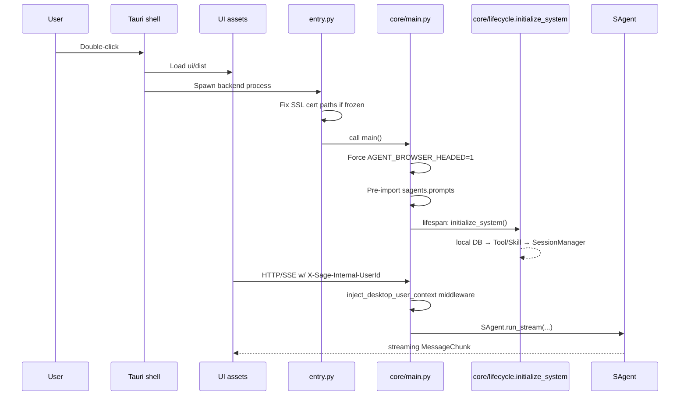
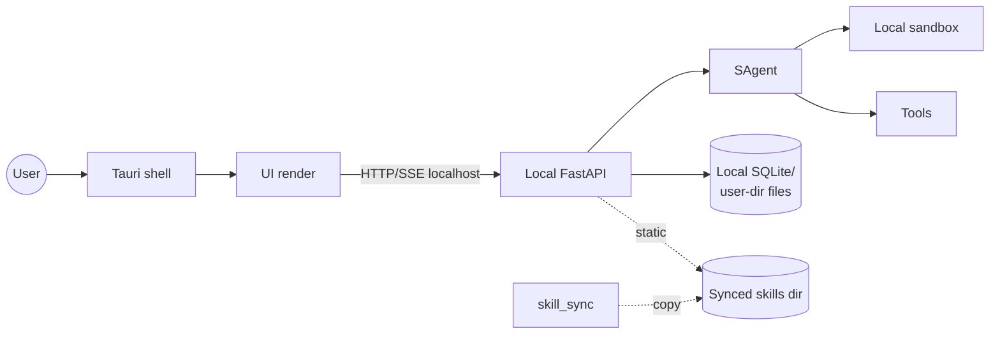
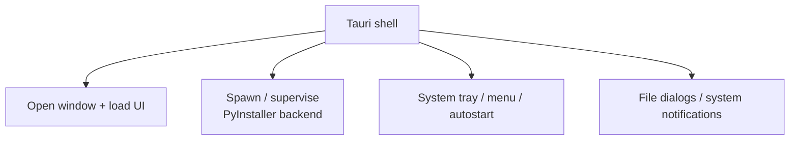
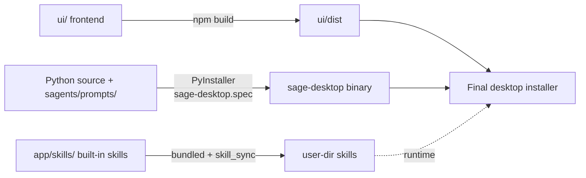

---

## layout: default

title: Desktop App Architecture
parent: Architecture
nav_order: 2
description: "app/desktop/ desktop architecture: local backend, UI, Tauri shell and how it consumes sagents"
lang: en
ref: architecture-app-desktop



# Desktop App Architecture

`app/desktop/` is Sage's desktop shape, "local-first": an embedded local FastAPI backend plus an embedded UI, wrapped by Tauri / PyInstaller into a double-clickable desktop application.

## Module Composition

```mermaid
flowchart TB
    subgraph Entry
        Entry[entry.py<br/>handle frozen / SSL certs]
    end

    subgraph LocalBackend ["Local backend (core/)"]
        Main[main.py<br/>FastAPI app + uvicorn]
        Boot[bootstrap.py · lifecycle.py]
        DB[db_schema.py · migrations.py<br/>local SQLite]
        Sync[skill_sync.py<br/>built-in skills → user dir]
        UCtx[user_context.py<br/>single-user identity injection]
        Routers[routers · desktop routes]
        Services[services · desktop services]
    end

    subgraph Frontend
        UI[ui/<br/>Vue 3 + Vite + Tailwind, separate build]
        Tauri[tauri/<br/>Tauri shell · tray/menu/system integration]
    end

    subgraph Packaging
        Spec[sage-desktop.spec<br/>PyInstaller spec]
        Scripts[scripts/<br/>build/packaging scripts]
        Out[build/ · dist/<br/>artifacts]
    end

    Entry --> Main
    Main --> Boot
    Main --> Routers --> Services
    Boot --> DB
    Boot --> Sync
    Tauri --> UI
    Tauri -.spawn.-> Entry
    Spec -.drives.-> Out
    Scripts -.drives.-> Out
```


## Startup Path




## Differences vs. Server


| Aspect             | `app/server/`                    | `app/desktop/`                                                  |
| ------------------ | -------------------------------- | --------------------------------------------------------------- |
| Multi-user         | Yes, full auth                   | No, single user injected                                        |
| Persistence        | Multi-tenant DB / object storage | Local SQLite + user-dir files                                   |
| Deployment         | Container / server               | Desktop installer (PyInstaller + Tauri)                         |
| Browser automation | Headless by default              | Headed by default (`AGENT_BROWSER_HEADED=1`)                    |
| Skills             | Platform-managed                 | `skill_sync.py` syncs built-in skills to the user dir, editable |
| Entry              | `app/server/main.py`             | `app/desktop/entry.py` → `app/desktop/core/main.py`             |
| Auth middleware    | Full OAuth/JWT                   | `inject_desktop_user_context` single-user injection             |


Both call the same `sagents/` runtime; the differences come from sandbox configuration (desktop prefers `local`), the registered tool/skill set, and where model config comes from (desktop typically reads user-provided API keys from local DB).

## Desktop Runtime Dependencies




## Tauri Shell Responsibilities




## Packaging Pipeline & Gotchas




Packaging gotchas:

- `sagents/prompts/` must be explicitly collected (the safety import in `main.py` covers this).
- Built-in `app/skills/` need to be bundled and copied to the user dir via `skill_sync.py`.
- Cert paths must work under the `_MEIPASS` temp dir (handled by `entry.py`).

