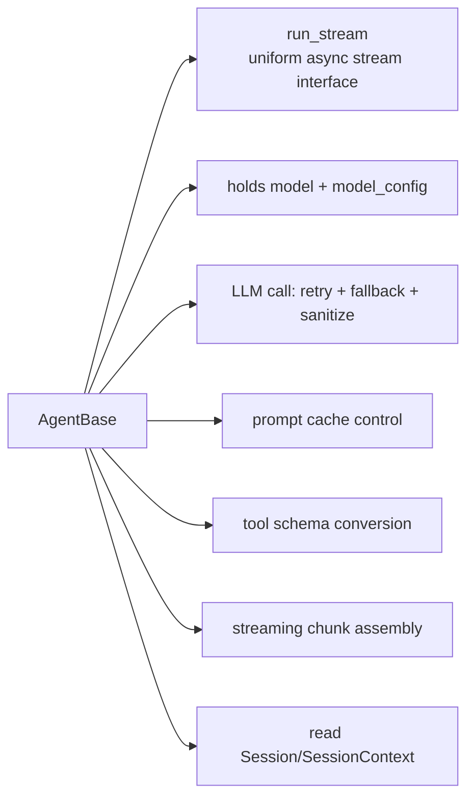
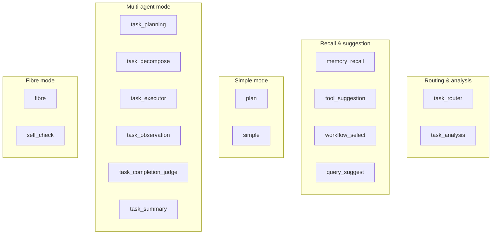
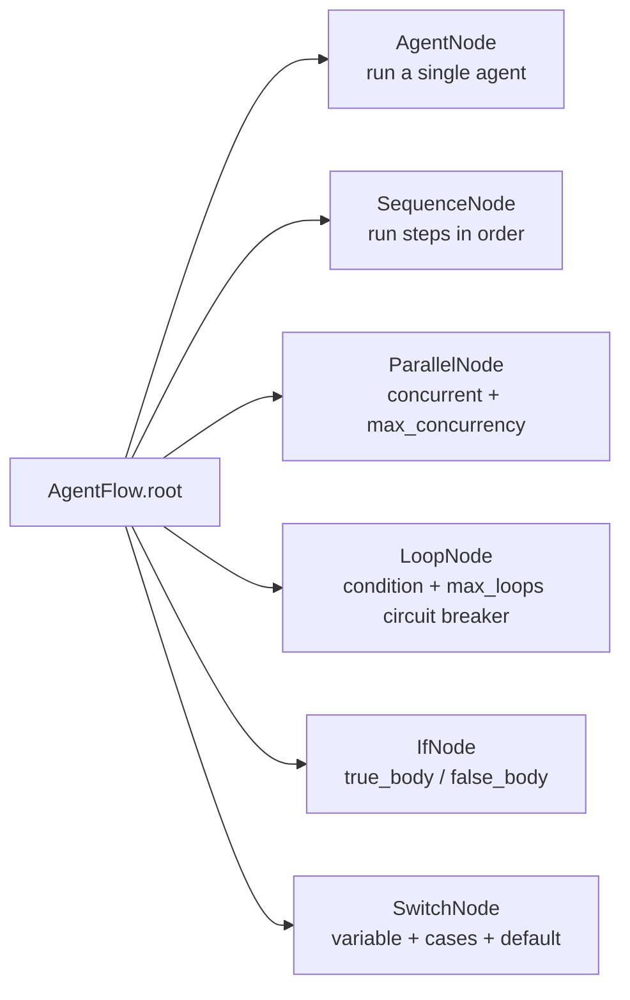
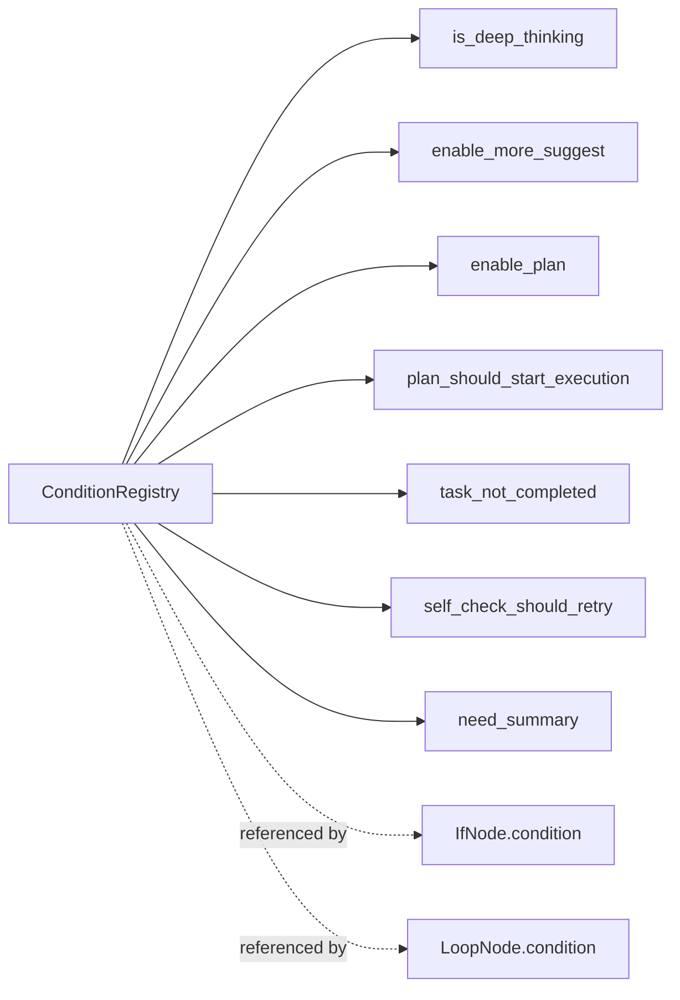
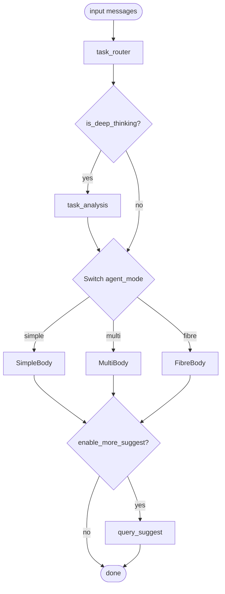
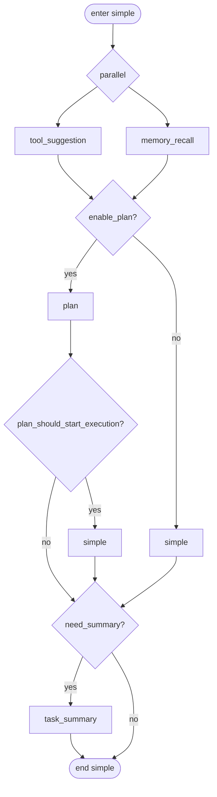
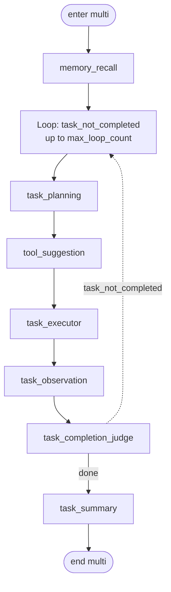
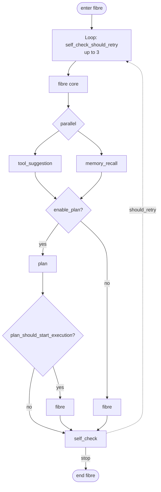

---

## layout: default
title: Agent & Flow Orchestration
parent: Architecture
nav_order: 5
description: "AgentBase, the specialized agents, AgentFlow / FlowExecutor and the three agent_modes"
lang: en
ref: architecture-sagents-agent-flow



# Agent & Flow Orchestration

This page covers `sagents/agent/` and `sagents/flow/`. **An agent is the unit of work; a flow defines the relationships between agents.** They are decoupled: changing the flow does not change the agents, and vice versa.

## 1. The Agent Layer

### 1.1 What `AgentBase` Provides




Agents own no per-conversation state — that lives in `SessionContext` — so agents can be reused concurrently.

### 1.2 Specialized Agents




Each agent's `agent_key` is how flow nodes reference it (e.g. `task_router`, `simple`, `task_planning`).

### 1.3 `FibreAgent` and Sub-agent Orchestration

```mermaid
flowchart TB
    Main[Main Session] --> FA[FibreAgent.run_stream]
    FA --> Orch[FibreOrchestrator]
    Orch --> Defs[(AgentDefinition registry<br/>sub-agent configs)]
    Orch --> Backend[FibreBackendClient<br/>fetch/manage sub-agents)]
    Orch --> SubMgr[shared SessionManager]
    Orch -->|delegated tool call| Sub[Sub-session 1..N]
    Sub -->|result| Orch
    Orch -->|aggregate| FA
```


In short: **in fibre mode, the main agent delegates work to sub-agents via tool calls; each sub-agent runs in its own sub-session and the result flows back to the main session.**

## 2. The Flow Layer

### 2.1 Node Types




The whole flow is wrapped by `AgentFlow(name, root)`. `run_stream` also accepts `custom_flow` to fully replace the default orchestration.

### 2.2 Condition Registry `flow/conditions.py`




Callers can register custom conditions and reference them from `custom_flow` (see end of this page).

### 2.3 Executor `flow/executor.py`

```mermaid
flowchart TB
    Start([execute AgentFlow.root]) --> Dispatch{node type?}

    Dispatch -->|AgentNode| Run[get agent → run_stream<br/>pass chunks through]
    Dispatch -->|SequenceNode| Seq[run steps in order]
    Dispatch -->|ParallelNode| Par[asyncio gather + semaphore]
    Dispatch -->|LoopNode| L1[check condition + max_loops]
    Dispatch -->|IfNode| If1[check condition]
    Dispatch -->|SwitchNode| Sw1[read variable → cases]

    Run --> Check{Session status?}
    Seq --> Check
    Par --> Check
    L1 --> Check
    If1 --> Check
    Sw1 --> Check

    Check -->|RUNNING| NextNode[next node]
    Check -->|INTERRUPTED / ERROR| Stop([stop])

    NextNode --> Dispatch
```




The executor only decides "how to walk the graph"; what happens inside an agent is the agent's own concern.

## 3. Default Flow: simple / multi / fibre

What `SAgent._build_default_flow(agent_mode, max_loop_count)` actually builds:




### simple_agent_body




### multi_agent_full




### fib_agent_body




## 4. Extending: Custom Flow & Sub-agents

The runtime exposes three extension points that, combined, can build arbitrary orchestration **without touching sagents source**.

### 4.1 Register a custom condition

```python
from sagents.flow.conditions import ConditionRegistry

@ConditionRegistry.register("user_paid")
def _user_paid(session_context, session=None) -> bool:
    return session_context.system_context.get("plan") == "pro"
```

### 4.2 Custom Flow

```python
from sagents.flow.schema import (
    AgentFlow, SequenceNode, AgentNode, IfNode, LoopNode,
)

custom_flow = AgentFlow(
    name="My Pipeline",
    root=SequenceNode(steps=[
        AgentNode(agent_key="task_router"),
        IfNode(
            condition="user_paid",
            true_body=LoopNode(
                condition="task_not_completed",
                max_loops=10,
                body=SequenceNode(steps=[
                    AgentNode(agent_key="task_planning"),
                    AgentNode(agent_key="task_executor"),
                    AgentNode(agent_key="task_completion_judge"),
                ]),
            ),
            false_body=AgentNode(agent_key="simple"),
        ),
        AgentNode(agent_key="task_summary"),
    ]),
)

async for chunks in agent.run_stream(
    ...,
    custom_flow=custom_flow,
):
    ...
```

When `custom_flow` is provided, `agent_mode` / `_build_default_flow` are bypassed.

### 4.3 Custom sub-agents (fibre)

`custom_sub_agents=[...]` injects extra sub-agent definitions without rewriting the flow, primarily for fibre orchestration:

```python
async for chunks in agent.run_stream(
    ...,
    agent_mode="fibre",
    custom_sub_agents=[
        {
            "agent_key": "data_fetcher",
            "description": "Pulls data from internal BI",
            "system_prompt": "...",
            "available_tools": ["http_fetcher", "sql_runner"],
        },
        # more sub-agent definitions...
    ],
):
    ...
```

The main fibre agent recognizes these as valid delegation targets.