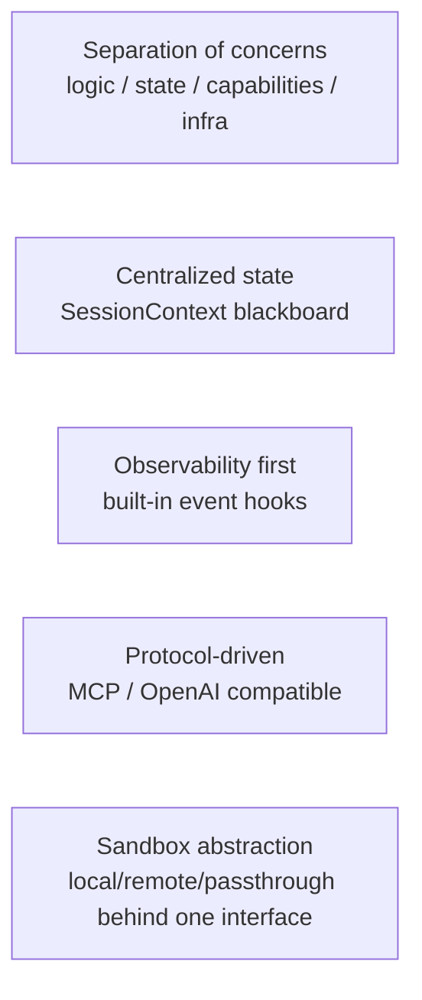
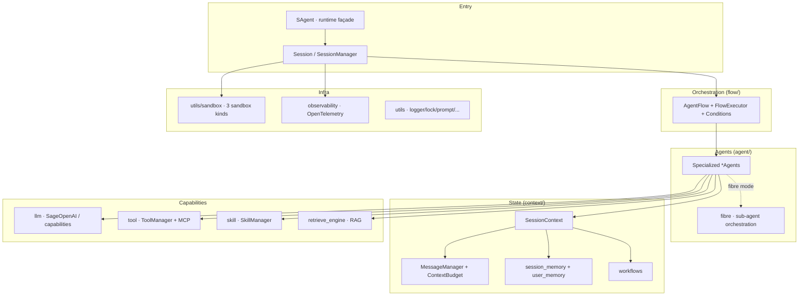
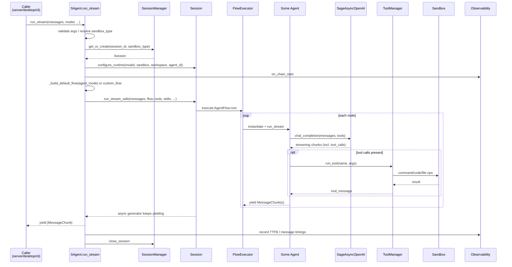
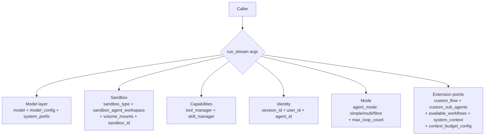
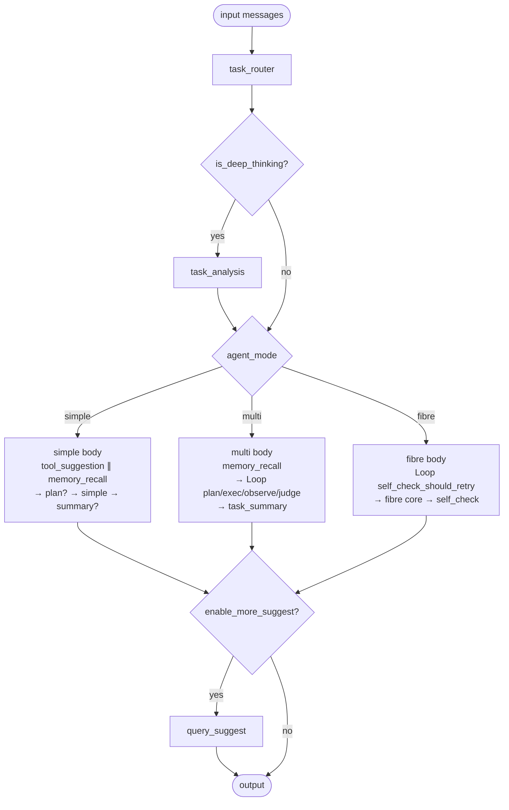
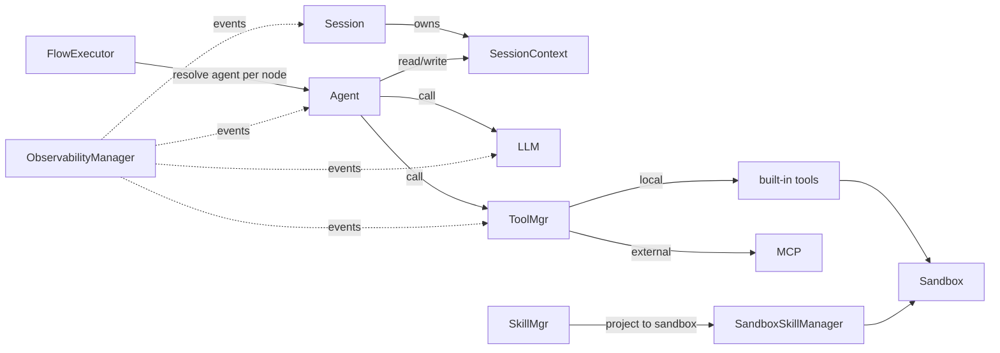
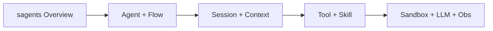

---

## layout: default
title: sagents Overview
parent: Architecture
nav_order: 4
description: "Layering, module boundaries and the full path of one run_stream call inside sagents/"
lang: en
ref: architecture-sagents-overview



# sagents Overview

`sagents/` is the core runtime of Sage. Every app shape (server, desktop, CLI, examples) ultimately runs a conversation through it. This page uses diagrams to lay out its layering, modules and the end-to-end path of one `run_stream` call.

## Design Principles




## Layering and Modules




## End-to-End: One `SAgent.run_stream`




## Key Parameters of `SAgent.run_stream`




Constraints:

- `model` and `model_config` are required.
- `max_loop_count` is required as the final circuit breaker.
- `sandbox_type` precedence: argument > `__init__` > `SAGE_SANDBOX_MODE` env > default `local`.
- Sandbox modes have different `sandbox_agent_workspace` requirements (local/passthrough required; remote falls back to `/sage-workspace`).

## Default Flow: the Three `agent_mode`s




`task_router` may rewrite `audit_status.agent_mode` at runtime, so even if `simple` is passed initially, the router may switch to `multi` or `fibre`. See [Agent & Flow Orchestration](ARCHITECTURE_SAGENTS_AGENT_FLOW.md) for node-by-node detail.

## How the Modules Cooperate




Key points:

- **Agents own no state**; everything goes through `SessionContext`, enabling reuse and concurrency.
- **Tool execution lands on the Sandbox**; the tool layer never touches the host directly.
- **Observability is cross-cutting**; every key event flows through `ObservabilityManager`.

## What to Read Next




- [Agent & Flow](ARCHITECTURE_SAGENTS_AGENT_FLOW.md)
- [Session & Context](ARCHITECTURE_SAGENTS_SESSION_CONTEXT.md)
- [Tool & Skill](ARCHITECTURE_SAGENTS_TOOL_SKILL.md)
- [Sandbox / LLM / Obs](ARCHITECTURE_SAGENTS_SANDBOX_OBS.md)

## Extending: Minimal Caller Template

The minimal way to use `SAgent.run_stream` as an SDK, useful for cross-checking parameters:

```python
import asyncio
from openai import AsyncOpenAI
from sagents.sagents import SAgent

async def main():
    agent = SAgent(session_root_space="/tmp/sage", sandbox_type="local")
    model = AsyncOpenAI(api_key="...", base_url="...")
    async for chunks in agent.run_stream(
        input_messages=[{"role": "user", "content": "Hello"}],
        model=model,
        model_config={"model": "gpt-4o-mini"},
        system_prefix="You are an assistant",
        sandbox_agent_workspace="/tmp/sage/agents/demo",
        max_loop_count=8,
        agent_mode="simple",
    ):
        for c in chunks:
            print(c.role, c.content)

asyncio.run(main())
```

For more advanced extension points (custom flow, sub-agents, conditions), see the next page.