

# Sandbox / LLM / Observability

This chapter groups three cross-cutting concerns:

- **Sandbox**: every entry point that "executes user/Agent code" goes through one unified interface.
- **LLM layer**: model clients, capability probes, prompt cache and so on are wrapped in `SageAsyncOpenAI`.
- **Observability**: a session's runtime trail is dispatched through `ObservabilityManager` to multiple handlers; OpenTelemetry is the default implementation.

These don't show up in business flows directly, but if any of them breaks the whole runtime breaks – hence a dedicated chapter.

## 1. Sandbox `sagents/utils/sandbox/`

### 1.1 Module Composition

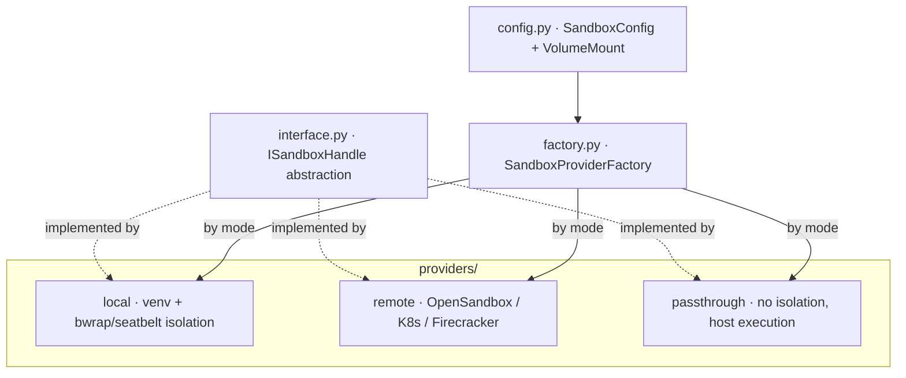

`ISandboxHandle` is the **only** interface the tool layer sees – every implementation looks the same to a tool.

### 1.2 Three Sandbox Modes

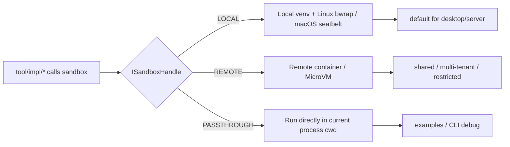

- **LOCAL**: default. Each session gets its own `sandbox_agent_workspace`, plus resource limits (CPU time, memory, allowed paths).
- **REMOTE**: outsource execution to OpenSandbox / Kubernetes / Firecracker; the factory selects the implementation by `remote_provider`.
- **PASSTHROUGH**: no isolation at all, run on the host – mostly for local CLI and examples.

### 1.3 Key Capabilities of ISandboxHandle

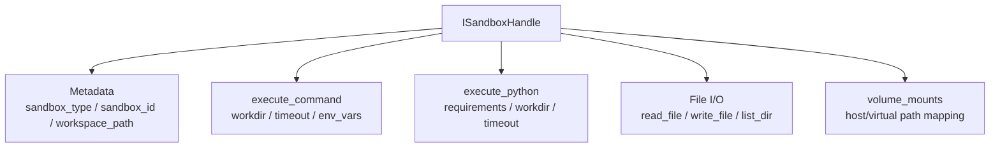

The tool layer (`execute_command_tool`, `file_system_tool`, ...) only ever calls this surface; it has no idea whether the implementation is a venv or a remote container.

### 1.4 One Tool Call End-to-End

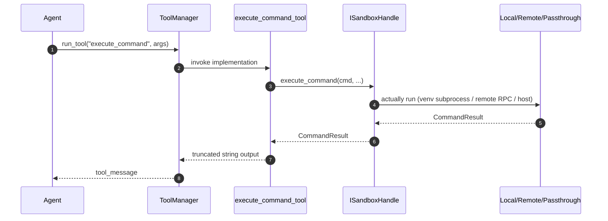

### 1.5 Interaction with Skills

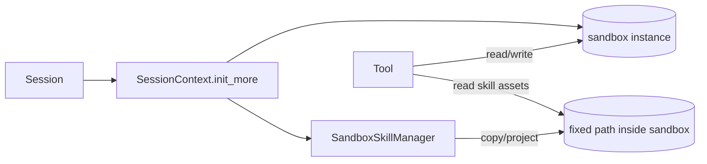

`SandboxSkillManager` bridges "skill → sandbox": once the sandbox is up, it places skill packages at conventional paths inside, so in-sandbox tool scripts can use them like local files.

## 2. LLM Layer `sagents/llm/`

### 2.1 Module Composition

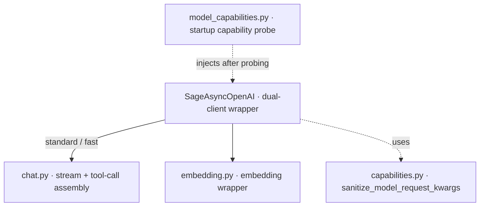

### 2.2 SageAsyncOpenAI: Dual Clients

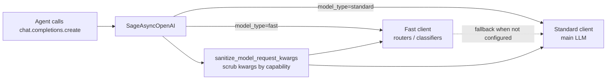

Highlights:

- Interface is fully `AsyncOpenAI`-compatible, only adds a `model_type` parameter.
- Capability flags (`supports_multimodal` / `supports_structured_output` / ...) are attached to the client object so call sites can read them directly without threading config through the stack.
- `sanitize_model_request_kwargs` strips request fields that the underlying model does not support (e.g. drop `reasoning_effort` for non-reasoning models).

### 2.3 Startup Capability Probe

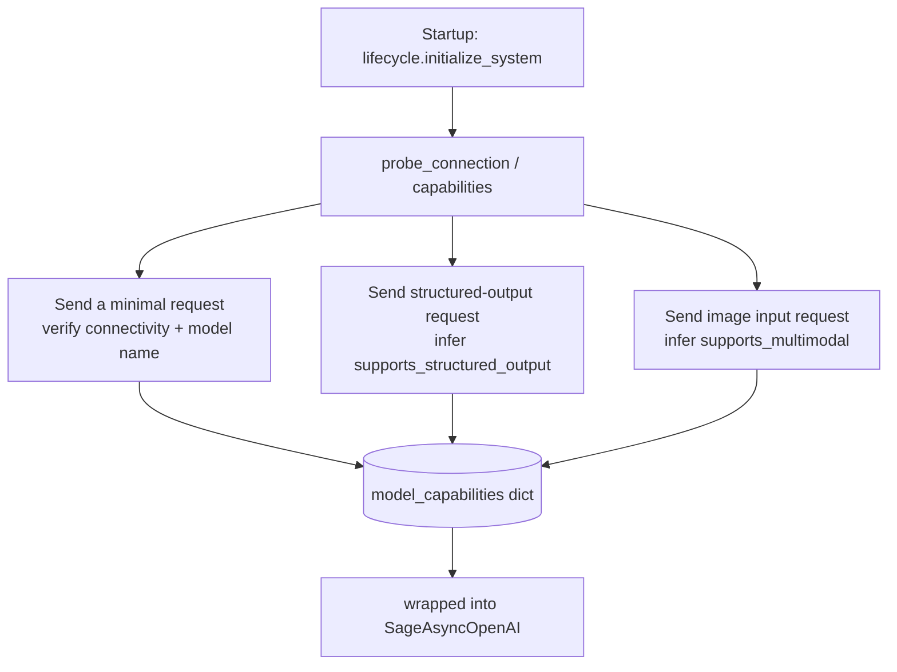

The probe runs once; its result lives with `SageAsyncOpenAI` for the entire lifetime so we don't reprobe per request.

## 3. Observability `sagents/observability/`

### 3.1 Module Composition

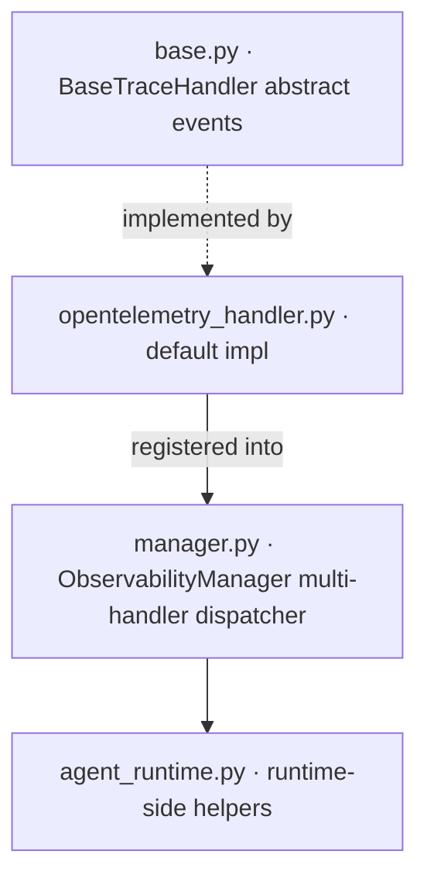

### 3.2 Event Model

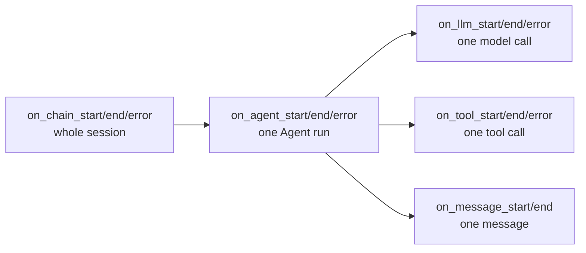

`BaseTraceHandler` defines the **shape** of observability: chain / agent / llm / tool / message events, all paired (`start` / `end`, plus optional `error`).

### 3.3 ObservabilityManager Dispatch

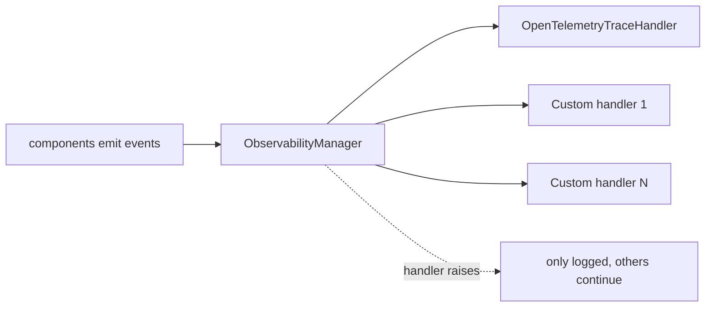

The dispatcher tolerates a single handler raising: the main flow is not interrupted and other handlers keep working.

### 3.4 OpenTelemetry Implementation

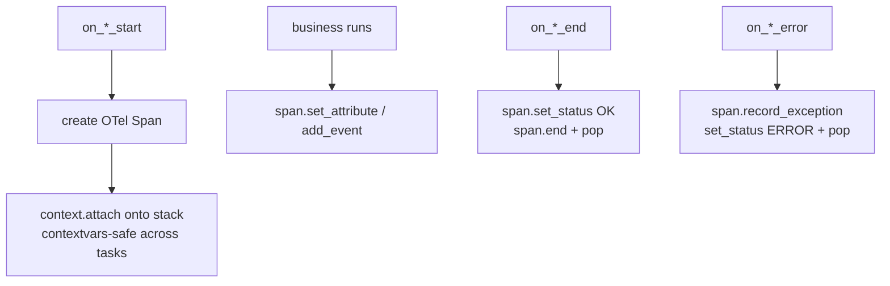

Highlights:

- Uses a `ContextVar` span stack so that nested async tasks don't tangle parent/child relationships.
- Cross-context detach errors are explicitly swallowed (very common when an async generator is cancelled across boundaries).
- This layer only **produces** OTel spans; where they are exported (Jaeger / Tempo / OTLP) is decided by the OpenTelemetry SDK config outside the runtime.

## 4. How They Connect

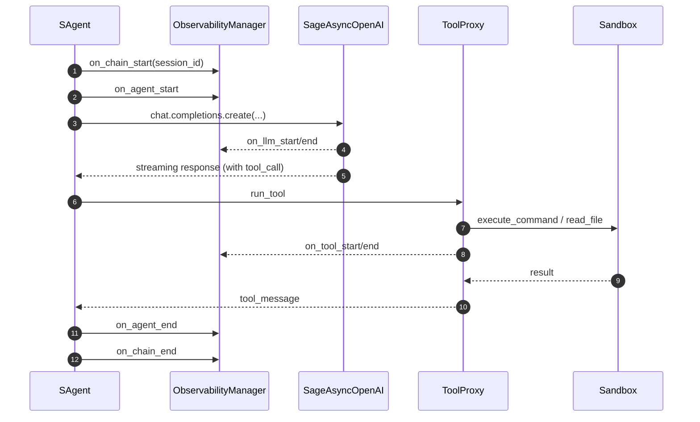

Within a single session: business logic moves through `SAgent`; everything "observable from the outside" is emitted via `ObservabilityManager`; everything that "executes across a process boundary" funnels into `SageAsyncOpenAI` and `ISandboxHandle`. That is how sagents decouples cross-cutting concerns.

## 5. Extending: Custom Handler / Provider

### 5.1 Custom Observability Handler

```python
from sagents.observability.base import BaseTraceHandler

class MyHandler(BaseTraceHandler):
    def on_llm_start(self, session_id, model_name, messages, step_name=None, **kwargs):
        print(f"[LLM start] session={session_id} model={model_name} step={step_name}")

    def on_llm_end(self, response, **kwargs):
        print("[LLM end]", getattr(response, "usage", None))

manager.add_handler(MyHandler())
```

- You only need to override the events you care about; the rest fall through to the no-op base impl.
- Raising inside a handler will not break the main flow but **is** logged, which makes debugging easy.

### 5.2 Custom Remote Sandbox

```python
from sagents.utils.sandbox.interface import ISandboxHandle, SandboxType, CommandResult
from sagents.utils.sandbox.factory import SandboxProviderFactory

class MyRemoteSandbox(ISandboxHandle):
    @property
    def sandbox_type(self): return SandboxType.REMOTE
    @property
    def sandbox_id(self): return self._id
    # ... implement the rest of the interface ...

    async def execute_command(self, command, workdir=None, timeout=30, env_vars=None):
        # call your own RPC / HTTP / SSH
        ...
        return CommandResult(success=True, stdout="...", stderr="", return_code=0, execution_time=0.1)

SandboxProviderFactory.register_remote_provider("my_remote", MyRemoteSandbox)
```

After that, `SandboxConfig(mode=SandboxType.REMOTE, remote_provider="my_remote", ...)` will route to your implementation.
