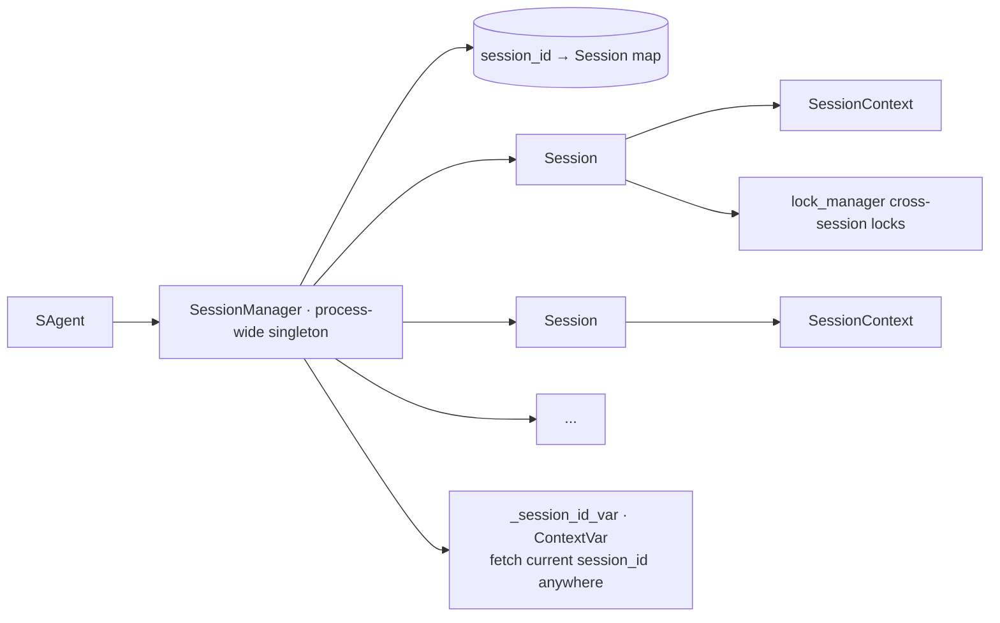
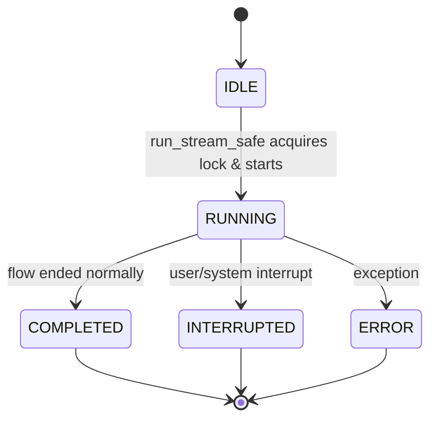
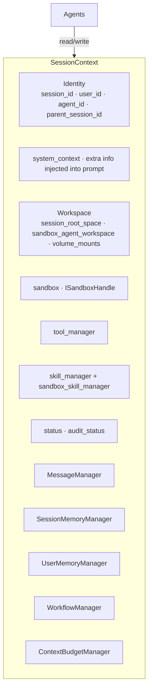
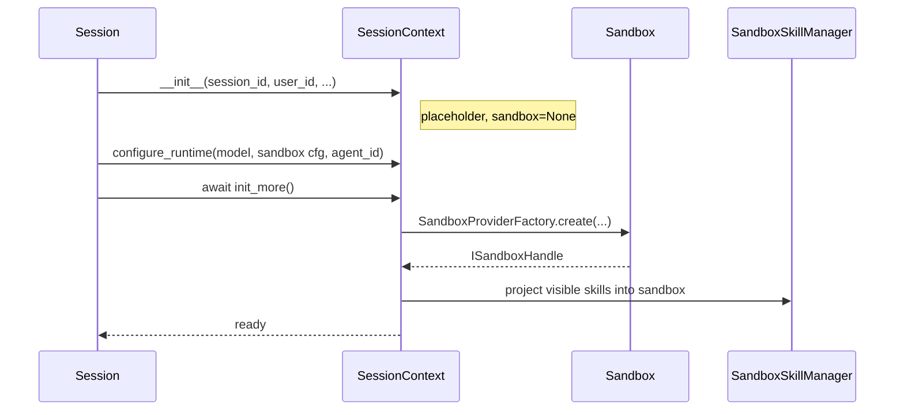
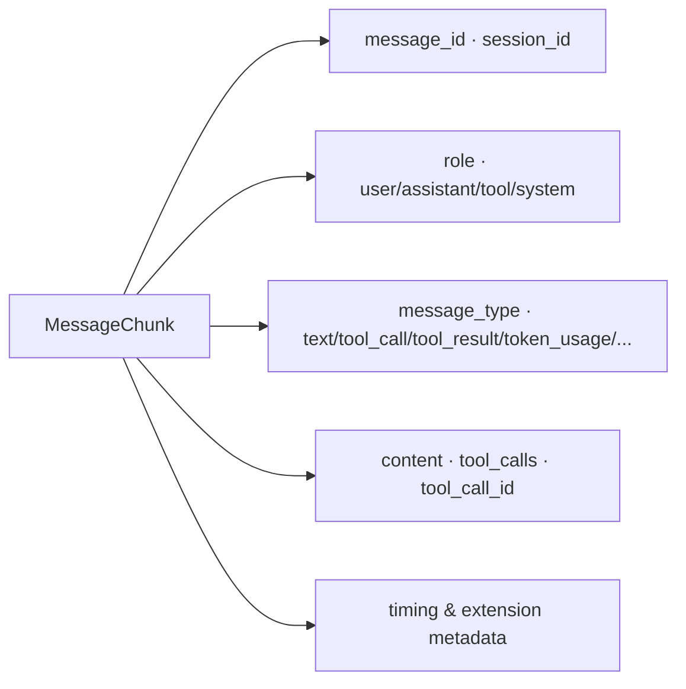
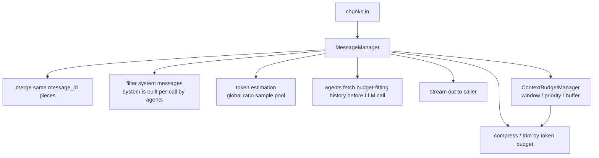
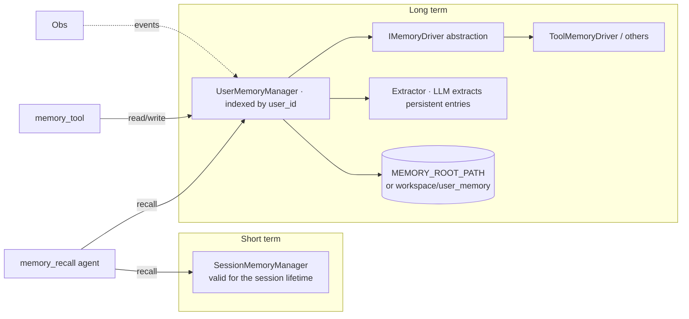
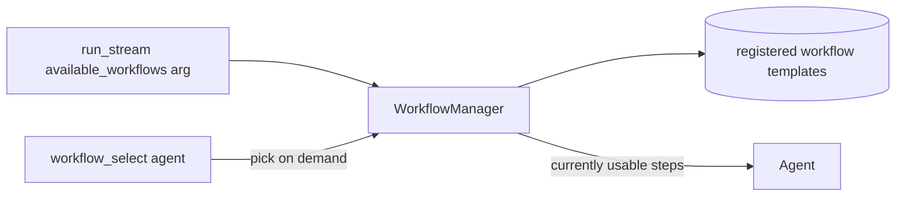
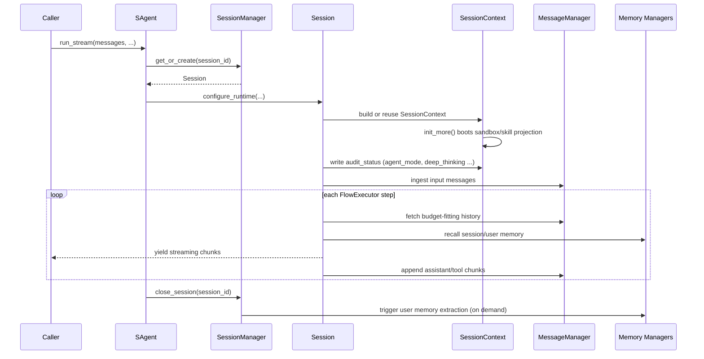
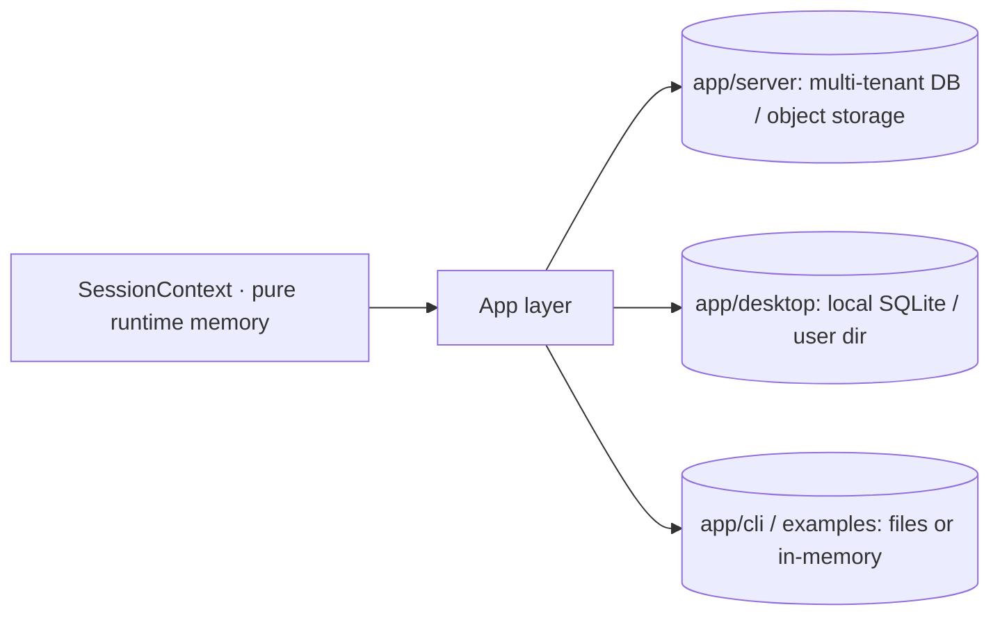



# Session & Context

`sagents/session_runtime.py` and `sagents/context/` together form the "state layer". Agents are stateless processors; everything stateful lives here.

## 1. Session Lifecycle: `Session` and `SessionManager`

`SessionManager` provides:

- `get_or_create(session_id, sandbox_type)`
- `save_session / interrupt_session / close_session`
- `get_live_session(session_id)`: get a live Session reference from anywhere
- Cooperates with `lock_manager` so one session is not driven concurrently

### Session State Machine

`FlowExecutor` checks the session status before/after every node and bails out on `INTERRUPTED` / `ERROR` to avoid burning tokens halfway.

## 2. `SessionContext`: the Blackboard

It is a **Blackboard**: agents collaborate by reading/writing it, with no direct dependency on each other.

### Two-step Explicit Init

`init_more()` moves heavy resources (sandbox boot, skill projection) out of the constructor so a half-initialized context cannot leak.

## 3. Messages: `MessageChunk` + `MessageManager`

### 3.1 The Chunk Unit

The whole runtime streams `List[MessageChunk]`.

### 3.2 MessageManager: Source of Truth for History

Highlights:

- System messages do not enter history; agents assemble them at call time.
- Context budgeting is centralized in `ContextBudgetManager`; all agents share the same rules.
- Token estimation uses a global sampled ratio (heuristic) to avoid running the tokenizer per message.

## 4. Memory: Session-level + User-level

Memory is optional for agents — invoked explicitly by `MemoryRecallAgent` and similar — not forced into every session.

## 5. Workflow: `context/workflows/`

A `Workflow` is a "reusable task template" — a predefined sequence of steps. Note the naming overlap but distinct purposes:

- `flow/`: which agents to run (orchestration)
- `workflows/`: fixed operational steps for a class of business tasks (business template)

## 6. State Evolution During One Session

## 7. Relation to External Storage

`SessionContext` itself does not bind to any database. **"Pure in-memory runtime + persistence in the app layer"** is one of the reasons sagents can be reused across so many app shapes.