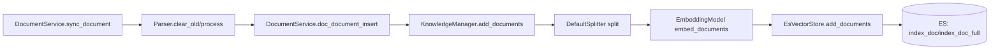
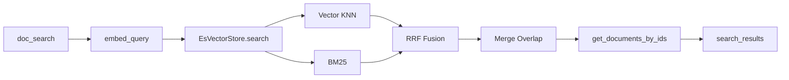



{: .note }
> Looking for the Chinese version? See [知识库指南](../zh/KNOWLEDGE_BASE.md)

# 📚 Sage Knowledge Base Guide

This document focuses on `app/server/services/knowledge_base`, including the current architecture, indexing/retrieval flow, and extension points.

## 1. Module role

The knowledge base module currently handles three responsibilities:

- Document sync: parse files, remove old records, and rebuild index data.
- Retrieval: generate embeddings and run hybrid retrieval.
- Agent integration: expose KB search via built-in MCP tool.

In the current version, Elasticsearch is the default vector store and full-text engine.

## 2. Folder layout

```text
app/server/services/knowledge_base/
├── knowledge_base.py                 # DocumentService: external service entry
├── adapter/
│   ├── es_vector_store.py            # EsVectorStore: ES implementation of VectorStore
│   └── server_embedding_adapter.py   # Embedding adapter
└── parser/
    ├── base.py                       # Parser base class
    ├── common_parser.py              # Common file parser
    ├── qa_parser.py                  # QA parser
    └── eml_parser.py                 # Email/attachment parser
```

Core classes:

- `DocumentService`: unified service interface for sync/insert/delete/search.
- `KnowledgeManager`: retrieval-engine orchestrator (split/embed/store).
- `EsVectorStore`: ES-backed `VectorStore` implementation.
- `ServerEmbeddingAdapter`: server-side embedding adapter.

## 3. Ingestion flow

`DocumentService.sync_document(...)` executes full sync:

1. Pick parser by `data_source`.
2. Run `clear_old` to collect old document IDs.
3. Run `process` to build `DocumentInput` list.
4. Call `KnowledgeManager.add_documents(...)` for split/embed/store.



## 4. Retrieval flow (current)

`DocumentService.doc_search(index_name, question, query_size)` path:

1. `KnowledgeManager.search(...)` generates query embedding.
2. `EsVectorStore.search(...)` runs in parallel:
   - Vector KNN search (`emb`)
   - BM25 search (`doc_content`)
3. `SearchResultPostProcessTool` performs RRF fusion + overlap merge.
4. The service enriches chunk results with full-doc fields.



## 5. ES index model

Each KB index uses two ES indices:

- `{index_name}_doc`: chunk-level index for retrieval.
- `{index_name}_doc_full`: full-document index for enrichment.

`_doc` key fields:

- `doc_id`, `doc_segment_id`
- `doc_content` (BM25)
- `emb` (dense vector)
- metadata fields (`start/end/path/title/main_doc_id`)

`_doc_full` key fields:

- `doc_id`
- `full_content`
- `origin_content/path/title/metadata`

## 6. How Agent calls KB

KB retrieval is exposed by built-in MCP tool `retrieve_on_zavixai_db`:

1. Tool function is defined in `app/server/routers/kdb.py`.
2. If request contains `available_knowledge_bases`, the system:
   - adds `retrieve_on_zavixai_db` into `available_tools`.
   - injects KB `index_name` into `system_context`.
3. Model issues a tool call.
4. Tool calls `DocumentService.doc_search(...)`.
5. Result is written back as `role=tool` message for next-round reasoning.

## 7. Current boundaries

- Backend is hard-bound to ES in `DocumentService`.
- `VectorStore.search` has no scalar filter argument yet.
- Scheduler initialization depends on `es_url`.

## 8. Troubleshooting checklist

- No retrieval result:
  - Check ES client initialization.
  - Check `{index_name}_doc` exists and has records.
- Uploaded but not searchable:
  - Verify parser routing by `data_source`.
  - Verify full sync flow completed.
- Agent does not call KB:
  - Verify `available_knowledge_bases` exists in agent config.
  - Verify `retrieve_on_zavixai_db` appears in `available_tools`.
