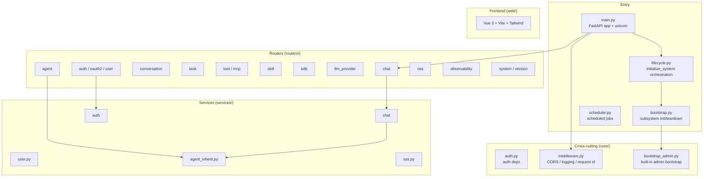
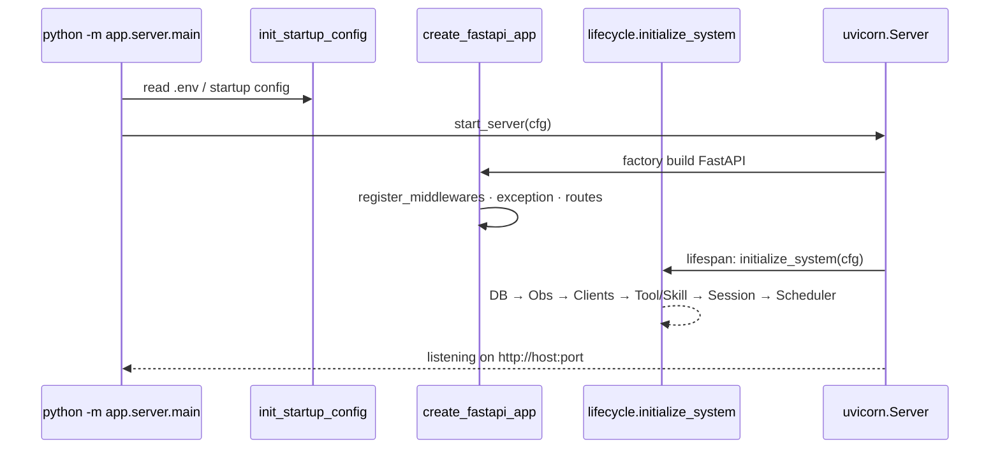
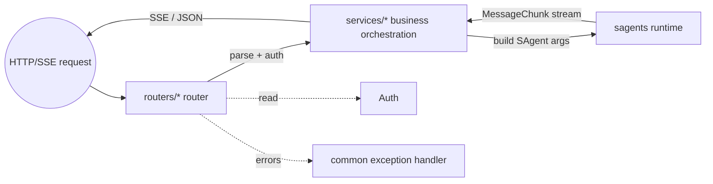
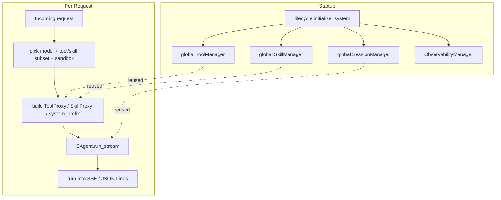
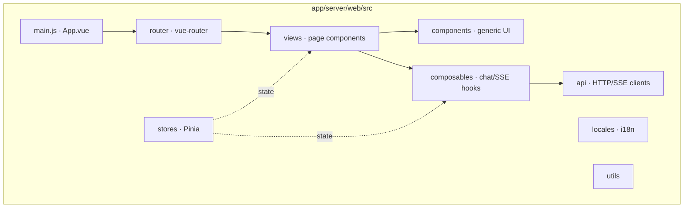



# Server & Web App Architecture

`app/server/` is the main, productized entry of Sage. It owns multi-user, web, agent management, knowledge base, observability and the rest of the platform surface. It is not a demo.

## Module Composition



## Startup Path



## Routers and Services



Each router maps to one HTTP resource group; services hold the business orchestration:

| Router | Responsibility |
| --- | --- |
| `chat` | Streaming chat (SSE), the bridge from HTTP to `SAgent.run_stream` |
| `agent` | Agent CRUD + configuration |
| `conversation` | History, lists, favorites |
| `task` | Long-running / async tasks |
| `tool` / `mcp` | Tool and MCP server registration |
| `skill` | Skill packages |
| `kdb` | Knowledge base |
| `llm_provider` | Model provider configuration |
| `auth` / `oauth2` / `user` | Login, users, third-party OAuth2 (e.g. Lage) |
| `oss` | Object storage |
| `observability` | Observability data |
| `system` / `version` | System info, version |

## Boundary with sagents



The server does not re-implement agent logic. It assembles HTTP/SSE protocol, auth, user/agent config and model providers into `SAgent.run_stream` arguments. See [sagents Overview](ARCHITECTURE_SAGENTS_OVERVIEW.md).

## Web Client Structure



The frontend subscribes to chunks via SSE and renders them based on `MessageChunk.role` / `message_type` (text, tool calls, token usage, etc.).

## Deployment Shapes

- `python -m app.server.main` for development.
- `docker-compose.yml` / `docker/` images for production (recommended).

See [Configuration](CONFIGURATION.md) and [Getting Started](../applications/GETTING_STARTED.md).

## Extending: Add a New Router

The most common server-side extension is "add a new HTTP resource". Template:

```python
# app/server/routers/my_module.py
from fastapi import APIRouter, Depends
from app.server.core.auth import current_user

router = APIRouter(prefix="/api/my", tags=["my"])

@router.get("/ping")
async def ping(user=Depends(current_user)):
    return {"ok": True, "user_id": user.id}
```

```python
# Register in app/server/routers/__init__.py
from . import my_module

def register_routes(app):
    ...
    app.include_router(my_module.router)
```

Put business logic in `services/`. The router stays thin: parse, auth, format response.
