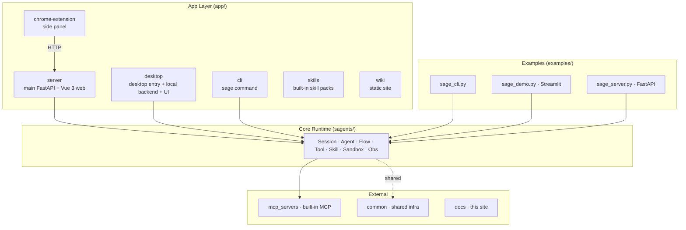
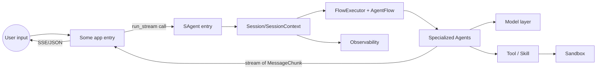
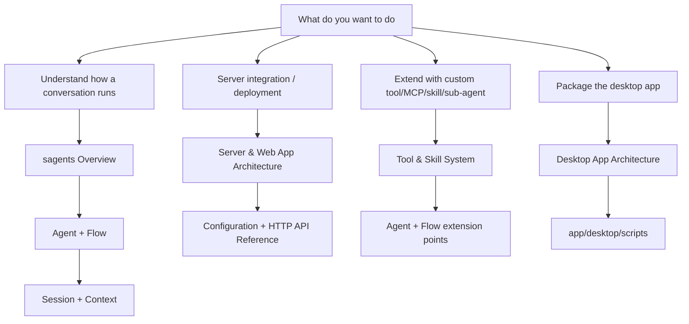

---

## layout: default
title: Architecture
nav_order: 4
has_children: true
description: "Repository and subsystem architecture overview, with sub-pages for apps and the sagents core runtime"
lang: en
ref: architecture



# Architecture

Sage is a layered codebase, not a single binary. The architecture chapter is split into two main tracks:

- **App architecture**: each user-facing entry (web server, desktop, CLI, examples, browser extension, etc.), its shape, startup path and boundary.
- **Core runtime `sagents/` architecture**: the session and agent engine shared by every app — the actual driver of "one conversation / one task".

This chapter has multiple sub-pages. This page is just the index and high-level map; details live in the children.

## Repository Map

## High-Level Data Flow of One Conversation

## Sub-pages in this Chapter

App architecture (different app entries):

1. [Server & Web App Architecture](ARCHITECTURE_APP_SERVER.md)
2. [Desktop App Architecture](ARCHITECTURE_APP_DESKTOP.md)
3. [CLI, Examples & External Entries](ARCHITECTURE_APP_OTHERS.md)

Core runtime `sagents/` architecture (the heart of this chapter):

1. [sagents Overview](ARCHITECTURE_SAGENTS_OVERVIEW.md)
2. [Agent & Flow Orchestration](ARCHITECTURE_SAGENTS_AGENT_FLOW.md)
3. [Session & Context](ARCHITECTURE_SAGENTS_SESSION_CONTEXT.md)
4. [Tool & Skill System](ARCHITECTURE_SAGENTS_TOOL_SKILL.md)
5. [Sandbox, LLM Adapter & Observability](ARCHITECTURE_SAGENTS_SANDBOX_OBS.md)

## Reading Tips

