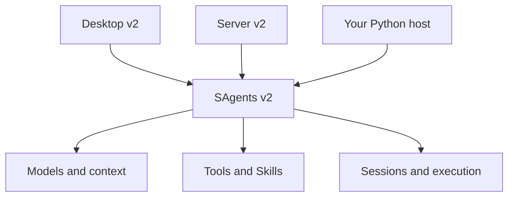



# Architecture

## Application and runtime boundaries

```mermaid
flowchart TB
    desktop[Desktop v2] --> runtime[SAgents v2]
    server[Server v2] --> runtime
    custom[Your Python host] --> runtime
    runtime --> model[Models and context]
    runtime --> tools[Tools and Skills]
    runtime --> state[Sessions and execution]
```

Hosts own authentication, credentials, UI, global conversation indexes, and tool resource bindings. `SAgentApplication` owns runtime composition and component lifetimes. SessionStore is the authority for Session state and acknowledged events.

## Read by topic

- [Plugin architecture](PLUGINS.md): registration, configuration, scopes, and host injection.
- [Memory](../memory/README.md): context projection versus durable history.
- [Tools and MCP](../MCP_SERVERS.md): capabilities and authorization.
- [Sandbox lifecycle](SAGENTS_V2_SANDBOX_LIFECYCLE.md): suspension and resource release.
- [Full runtime architecture](https://github.com/ZHangZHengEric/Sage/blob/main/sagents/v2/ARCHITECTURE.md): dependency rules and contracts.
- [Detailed v2 engineering guides (Chinese)](../../zh/architecture/README.md).

## Deployment boundary

The built-in schedulers and session stores do not make a distributed runtime. SQL persistence, per-user limits, and fencing are separate guarantees. Server v2 supports one worker. Native local process execution is not container isolation; security depends on the selected provider and the guarantees it actually enforces.
