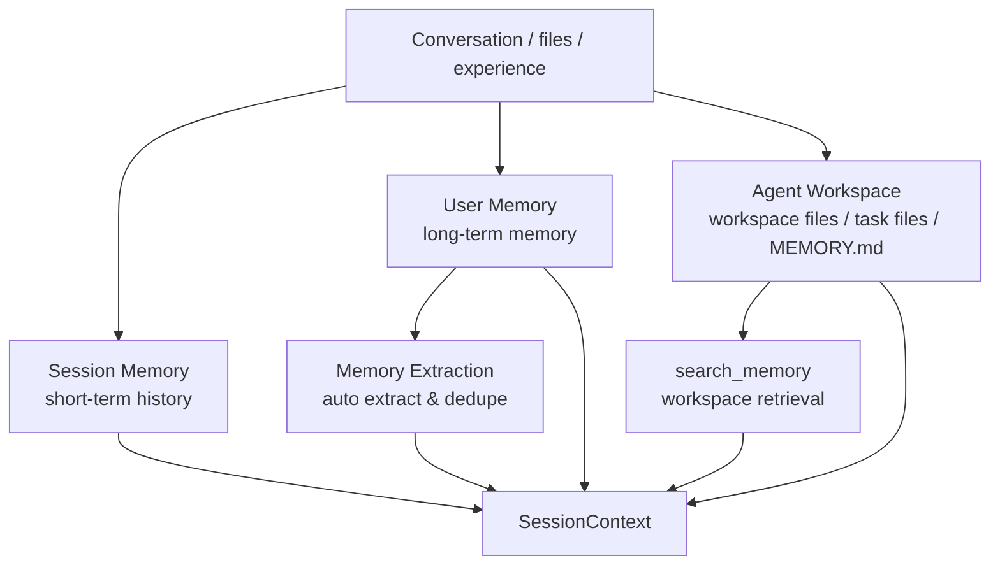



# Memory

This section collects the Sage memory system docs. In Sage, memory is broader than user memory: it also includes session history, Agent workspace files, and `search_memory`-based workspace retrieval.

## Architecture

## What This Folder Contains

- Session memory: short-term conversation history and compression
- User memory: cross-session long-term memory and extraction
- Workspace memory: Agent workspace files, notes, and task outputs
- Memory search: `search_memory`-based workspace retrieval and validation

## Current Documents

1. [Session Memory](SESSION_MEMORY.md)
2. [User Memory](USER_MEMORY.md)
3. [Workspace Memory](WORKSPACE_MEMORY.md)
4. [Memory Search Validation](memory-search/README.md)
