

# Collections Agent Proposal

> This is a proposal-level document for presales discussions. It focuses on architecture logic, product value, and delivery feasibility.  
> The core principle is to let the Agent handle standardized communication and workflow execution within authorized and auditable boundaries, while human specialists focus on higher-value cases.

---

## 1. Solution Goals

In collections, the key is not just “being able to chat.” The real goal is to contact the right customer, at the right time, with the right strategy, through the right channel, and move the case to the right next step.

The overall system is organized into four layers:

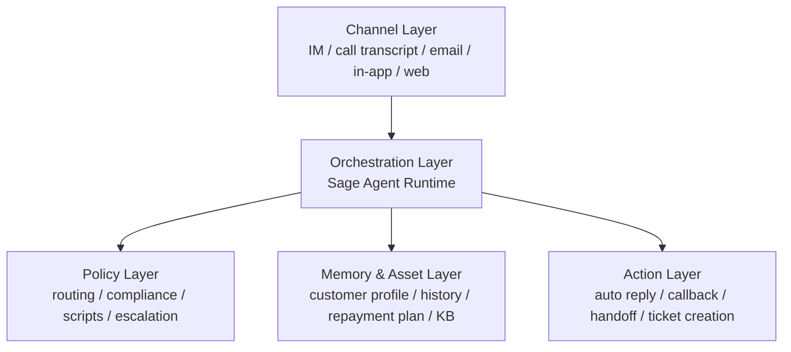

The solution targets four outcomes:

1. Improve first-contact efficiency
2. Reduce manual workload
3. Strengthen compliance stability
4. Continuously improve from real outcomes

---

## 2. Overall Architecture

The collections system uses a **single main execution Agent plus multiple auxiliary Agents** rather than a fully peer-to-peer multi-agent setup.

The main execution Agent is the center of the business loop. It:

- Understands the current conversation
- Decides the next action
- Calls tools to execute work
- Composes the reply
- Decides when to hand off to a human

Auxiliary Agents provide specialized capabilities:

- **Compliance Agent**: checks whether the reply or action crosses a boundary
- **Review Agent**: analyzes successful and failed conversations
- **Knowledge Agent**: retrieves policy, FAQ, and account explanations
- **Customer Insight Agent**: extracts customer state, risk tags, and communication preferences
- **Skill Builder Agent**: turns repeatable experience into reusable skills

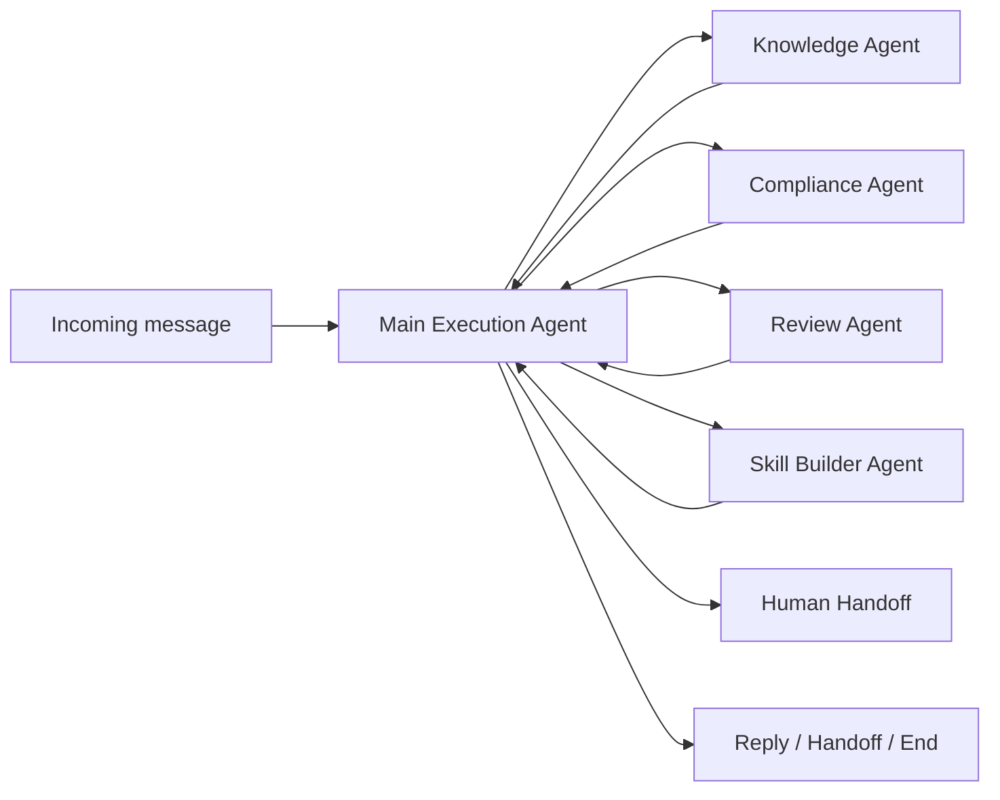

### Why the Main Execution Agent Stays Central

Collections is a closed business loop. The key question is not who can speak better, but who is responsible for the current case.

If multiple Agents are peer-level decision makers, three issues appear:

1. Responsibility becomes diluted
2. Case state can become inconsistent
3. Runtime complexity grows quickly

With a centralized main Agent, the system behaves like a **command center plus specialist advisors**:

- The command center makes decisions and executes actions
- Advisors provide information, checks, and reusable experience

This is easier to explain, easier to govern, and easier to audit.

---

## 3. Agent Development and Runtime Model

### 3.0 Sage `sagents` Runtime Framework

` sagents ` is the runtime kernel of the system. It does not care whether the business is collections or customer service. It provides a stable execution model for models, tools, skills, memory, and audit.

The core logic is:

> **Session holds state, Flow holds the path, Agent makes decisions, Tool performs actions, Skill stores experience, Sandbox isolates execution, and Observability keeps the trace.**

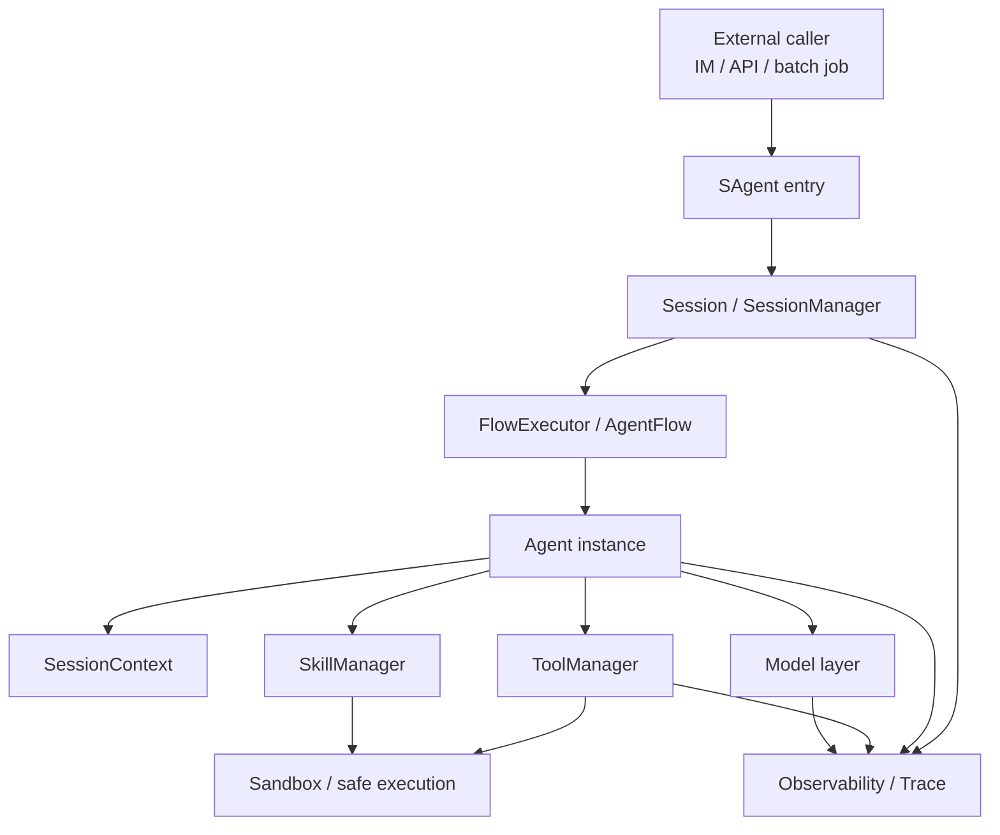

### 3.0.1 Why This Base Layer Matters

For a high-frequency business like collections, the hard part is not making a model say one sentence. The hard part is keeping the system stable over time, making the right action, and leaving the right record.

`sagents` solves four foundational problems:

1. Unified state
2. Unified execution
3. Unified capability access
4. Unified auditability

### 3.0.2 End-to-End Request Path

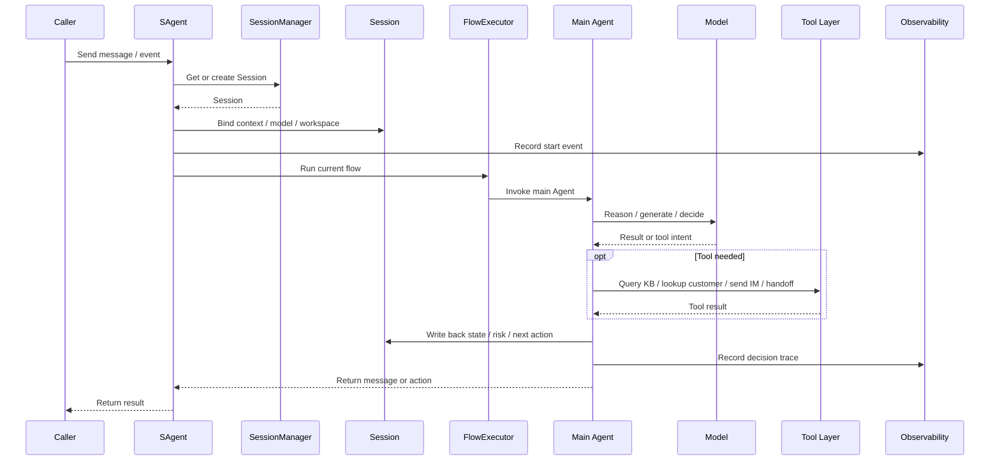

### 3.0.3 Runtime Principles

- The main Agent is the only decision entry point
- Tools are executed through a unified dispatch layer
- Skills capture reusable experience
- Sandbox keeps side effects controlled
- Observability makes the process explainable

### 3.1 Role Split

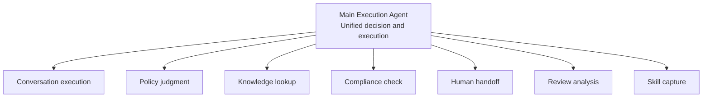

The main Agent is the control center. The auxiliary capabilities are plugin-like specialists.

- **Main Agent**: reads context, decides next steps, calls tools, composes replies, controls pacing
- **Knowledge capability**: provides factual, policy, and account explanations
- **Compliance capability**: checks boundaries before and after generation
- **Handoff capability**: produces a summary and transfers the case to a human specialist
- **Review capability**: analyzes good and bad conversations and extracts improvement points
- **Skill capability**: turns proven experience into reusable business skills

### 3.2 Runtime Mode

The runtime uses an **event-driven + state-driven + tool/skill-driven** model:

- Each message enters a Session
- Session stores customer state, history, risk tags, collections stage, and channel context
- The main Agent makes local decisions based on the Session
- The main Agent chooses whether to call a model, a tool, or a Skill
- Every critical action is logged

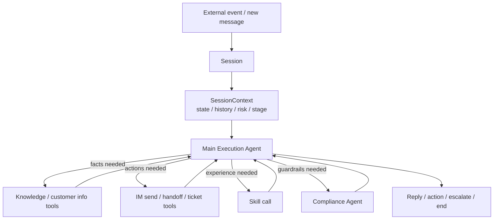

### 3.2.1 Runtime Decision Logic

The main Agent first evaluates:

- Is the task simple?
- Is the context short?
- Is speed important?
- Is the output structured?
- Does the task need deeper reasoning or higher-quality generation?

When the task is simple, the context is short, and speed matters, the small model is used.
When the task is complex, the context is long, or the answer needs stronger reasoning or higher-quality expression, the large model is used.

### 3.3 Benefits

- Faster delivery
- Easier quality control
- Better presales storytelling
- Easier multi-channel scale-out

---

## 4. Small and Large Model Orchestration

In Sage, small/large model orchestration is not a hardcoded model switch. It is a dynamic dispatch decision made by the main execution Agent based on task type.

The recommended pattern is:

- Small models handle high-frequency lightweight tasks
- Large models handle complex judgment and high-value generation

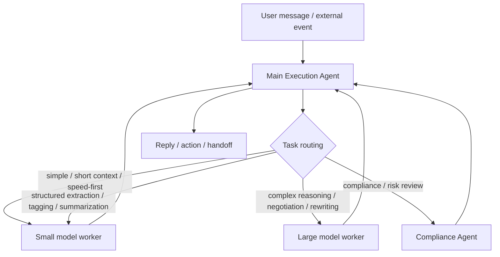

### 4.1 How Sage Dispatches Models

Model dispatch is split into three layers:

1. Routing layer: the main Agent classifies the task
2. Orchestration layer: a model, prompt, and tool set are selected
3. Constraint layer: format, compliance, confidence, and factual consistency are checked

This means Sage does not just switch a model name. It switches the entire execution strategy:

- Small models get shorter context, stronger structure, and fewer tools
- Large models get broader context, more freedom, and richer tool chains
- Compliance Agent reviews both outputs

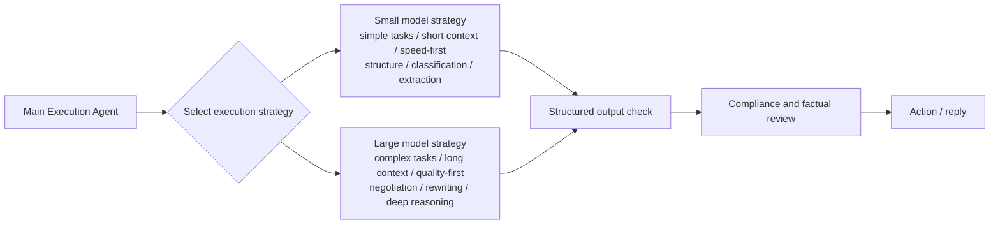

### 4.2 Why This Fits Collections

Collections is naturally tiered:

- Most messages are standard Q&A, status checks, or simple reminders
- Fewer messages require complex negotiation, dispute handling, or escalation

The optimal strategy is therefore:

- Use small models for simple tasks
- Use small models when context is short
- Use small models when speed matters
- Use small models for structured work such as classification and extraction
- Use large models for complex negotiation, long-context reasoning, and higher-quality responses
- Let the main Agent unify the final decision

This keeps cost, speed, and quality in balance.

### 4.3 Execution Flow

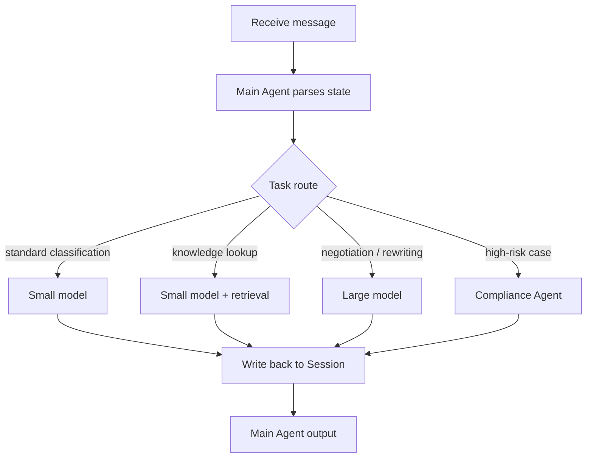

---

## 5. Continuous Improvement

The core idea is not that the model magically becomes smarter. The system is designed as a closed learning loop.

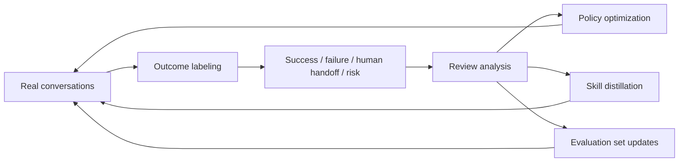

### 5.1 Review Agent

A dedicated Review Agent analyzes successful and failed conversations:

- Why did this case succeed?
- Was it the wording, the timing, or the strategy?
- Which sentence changed the customer’s response?
- Which response increased friction?
- Which case should be handed to a human earlier?

Its output is not just a summary. It produces actionable conclusions:

- reusable conversation patterns
- expressions to avoid
- escalation thresholds
- skill candidates

### 5.2 Learning Successful Paths

When a pattern keeps working, the system can:

1. Extract the key turning points
2. Convert them into a reusable template
3. Add them to the regression evaluation set

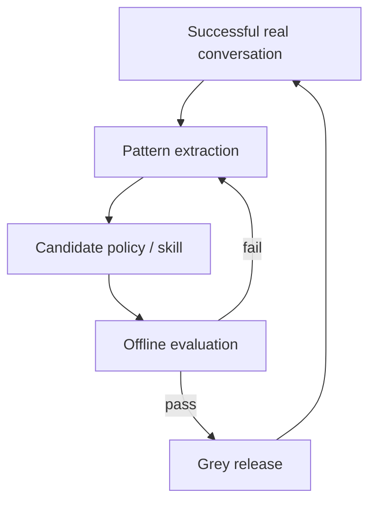

---

## 6. From Experience to AI Capability

The goal is to turn human experience into machine-callable capability assets.

### 6.1 Agent-Assisted Skill Authoring

A Skill Builder Agent helps business experts turn experience into structured skills:

- trigger conditions
- recommended wording
- forbidden wording
- applicable customer groups
- escalation conditions
- example dialogues

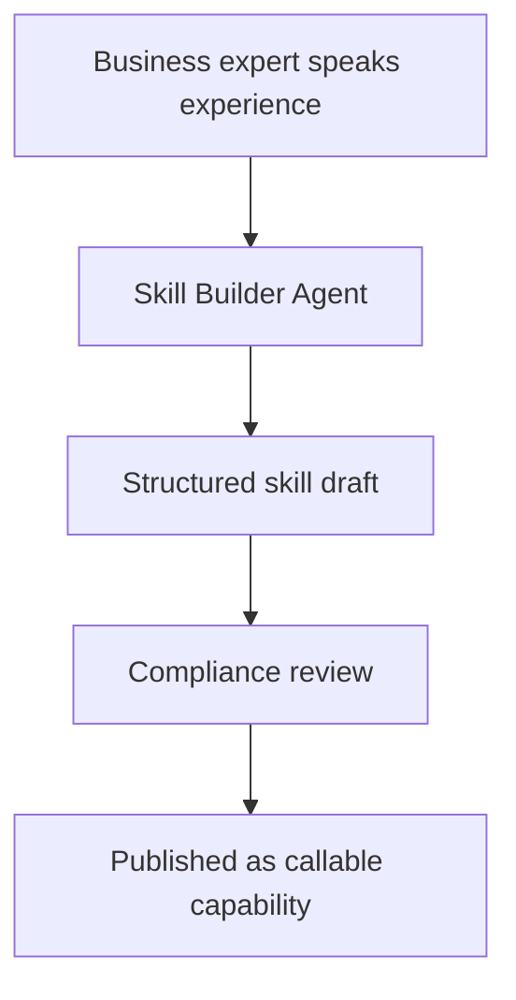

### 6.2 Skill Distillation from Successful Conversations

The system can also distill skills from real successful conversations:

1. Identify high-conversion segments
2. Capture key context
3. Summarize trigger conditions
4. Build a standard skill
5. Publish it to the skill library

This turns scattered human know-how into durable system knowledge.

---

## 7. Compliance and Hallucination Control

In collections, the most important requirement is not “sounds human.” It is “is correct, allowed, and traceable.”

### 7.1 Three Guardrails

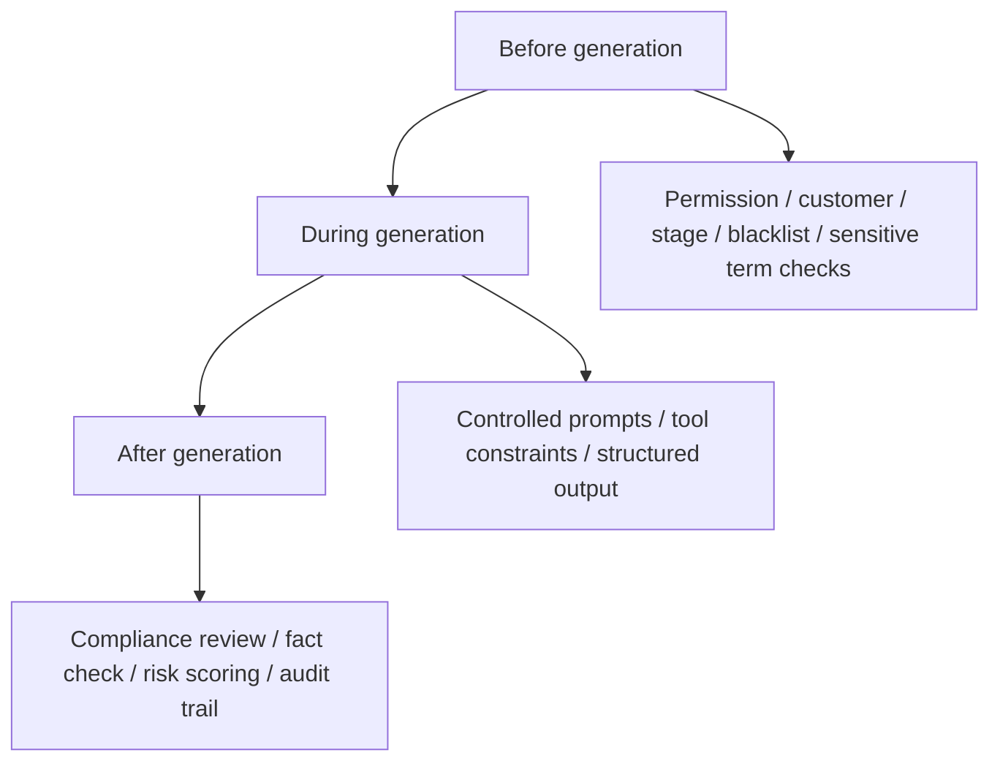

#### Guardrail 1: Before generation

- Check whether the customer may be contacted automatically
- Check whether the channel is compliant
- Check whether the current stage forbids certain phrasing
- Check whether handoff is mandatory
- Check customer tags such as dispute, complaint risk, or legal sensitivity

#### Guardrail 2: During generation

- Keep the model inside controlled tools and templates
- Force structured output to reduce free-form drift
- Provide enough context, but do not expose disallowed information

#### Guardrail 3: After generation

- Compliance Agent reviews again
- Facts are checked for consistency
- Sensitive language is detected
- If needed, the reply is rewritten, downgraded, or handed off

### 7.2 Engineering Controls Against Hallucination

- Retrieval first
- Structured actions first
- Confidence thresholds
- Dual-model cross-checking in critical steps

### 7.3 Reply Principles

The system follows these principles:

1. Do not exaggerate consequences
2. Do not make unverified promises
3. Do not disclose unauthorized personal information
4. Do not use coercive or misleading wording
5. Clarify first when uncertain
6. Hand off to a human when needed

---

## 8. Human Collaboration and Escalation

The Agent is not replacing humans. It is removing low-value work from humans.

### 8.1 When to Handoff

- Complaint or strong negative emotion
- Billing dispute
- Special negotiation request
- High-risk rule trigger
- Uncertain facts
- No progress after multiple turns

### 8.2 What the Handoff Contains

The handoff is not raw conversation text. It includes:

- current customer state
- recent key turns
- strategies already tried
- current risk tags
- recommended next action
- warnings and forbidden expressions

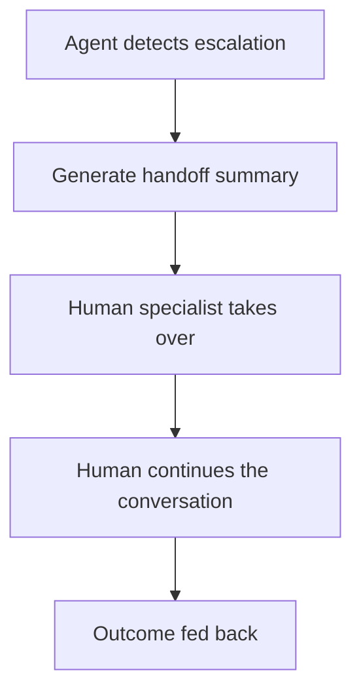

---

## 9. Tools and Skills

This section is important in presales because it shows the system is not just conceptual. It is executable.

### 9.1 Tool List

The tool layer is designed as a standard action set:

- IM message sending
- human handoff
- knowledge base lookup
- customer information lookup
- conversation history lookup
- ticket creation
- follow-up scheduling
- risk checks
- audit logging

### 9.2 Skill List

The skill layer captures reusable experience:

- Collections script skill
- first-contact skill
- negotiation skill
- unreachable-customer recovery skill
- complaint handling skill
- compliance phrasing skill
- human handoff skill
- review extraction skill
- knowledge Q&A skill

### 9.3 Why Skills Matter

Skills make experience durable:

1. Higher consistency
2. Faster replication
3. Easier maintenance
4. Better asset accumulation

---

## 10. Value Proposition

The value can be summarized in four sentences:

1. Faster: standard scenarios are handled automatically
2. Safer: compliance and risk control are built in
3. Cheaper: small models handle high-frequency work
4. Smarter: the system improves from real outcomes

---

## 11. Delivery Path

The delivery path is split into three phases:

### Phase 1: Usable

- Connect one or two main channels
- Enable routing, auto-reply, and human handoff
- Establish basic compliance and audit logging

### Phase 2: Better

- Add small/large model orchestration
- Add review Agents and skill capture
- Improve complex negotiation handling

### Phase 3: Evolving

- Distill skills from real conversations
- Build evaluation and grey release loops
- Turn experience into organizational assets

---

## 12. Closing

This solution is not a “chatbot.” It is a **controllable, explainable, upgradeable, and compliant collections intelligent system**.

The customer sees not a single AI feature, but a business infrastructure that can keep expanding:

- entry points can connect
- the middle layer can be controlled
- policy can be tuned
- humans can take over
- experience can be accumulated
- risk can be contained

That is what makes the solution persuasive in presales.

