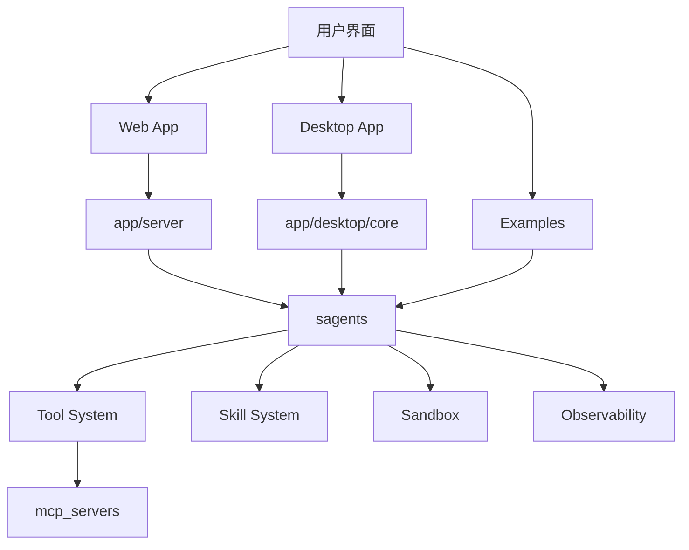



# 架构

## 仓库总览

Sage 采用分层仓库结构，而不是单一二进制项目。主要顶层子系统包括：

- `sagents/`：核心运行时与编排
- `app/server/`：主 FastAPI 应用与 Web 客户端
- `app/desktop/`：桌面本地应用栈
- `examples/`：轻量可运行示例
- `mcp_servers/`：内置 MCP Server 实现
- `release_notes/`：主文档之外的版本说明

## 高层依赖关系

## 核心运行时：`sagents/`

这里包含会话运行时、智能体实现、工具系统、技能加载和沙箱抽象。无论你是从 CLI、Web 还是桌面端进入，最终都会依赖这一层。

## 主服务端：`app/server/`

这部分提供面向多用户和 Web 的主应用形态，包括：

- FastAPI 入口
- 路由与服务层
- 配置与持久化接入
- Web 前端源码

## 桌面应用：`app/desktop/`

桌面版包含桌面入口、桌面本地后端、UI 与构建脚本。它复用 Sage 的核心运行时，但在启动方式和本地资源组织上与服务端模式不同。

## 示例与扩展

`examples/` 提供最小化运行入口，适合验证链路或快速试验。`mcp_servers/` 则承载 Sage 的一类扩展能力，让运行时可以通过 MCP 暴露更多外部工具。
