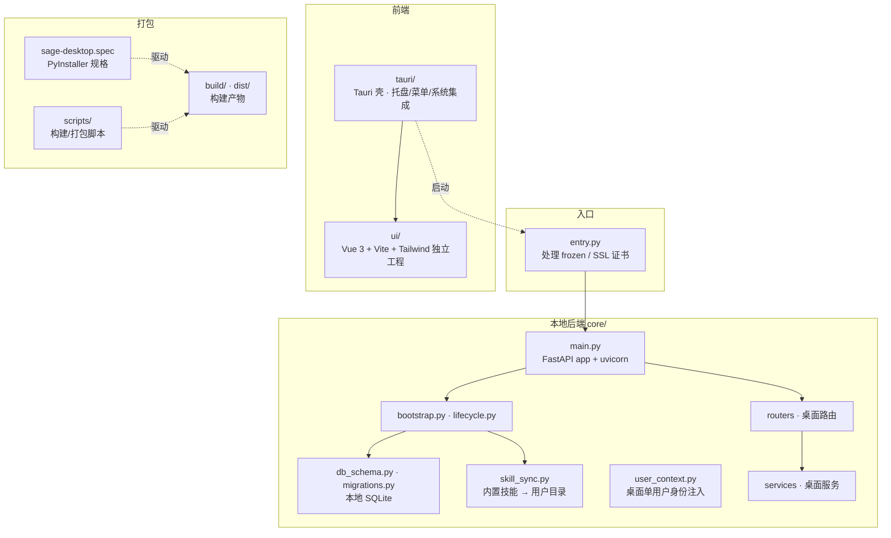
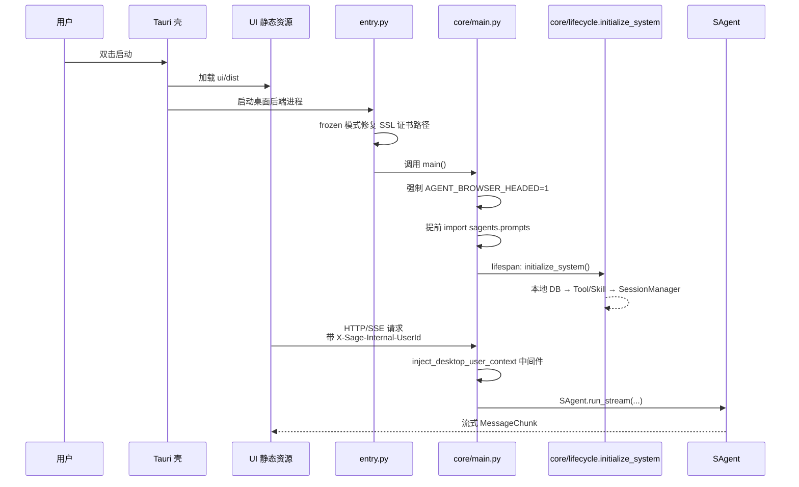
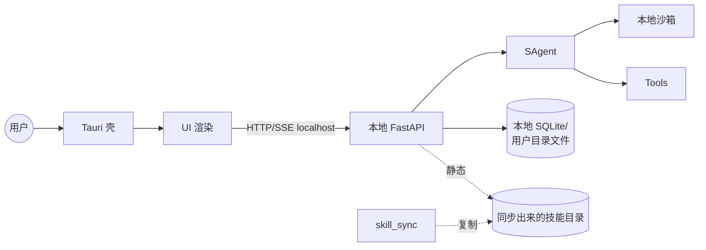
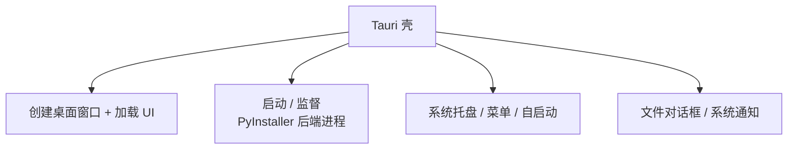
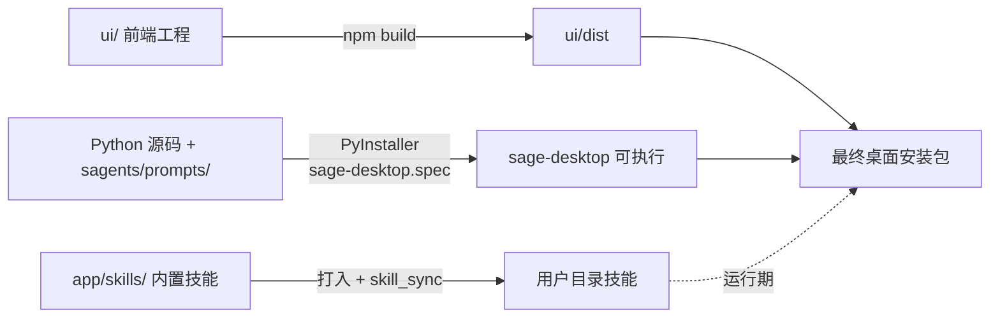



# 桌面应用架构

`app/desktop/` 是 Sage 的桌面形态，特点是“本地优先”：内嵌一个本地的 FastAPI 后端 + 内嵌的 UI，外面套一层 Tauri / PyInstaller 打包，对用户呈现为一个可双击的桌面应用。

## 模块组成

## 启动链路

## 与服务端架构的差异

| 维度 | `app/server/` | `app/desktop/` |
| --- | --- | --- |
| 多用户 | 是，完整鉴权 | 否，单用户，注入身份 |
| 持久化 | 多用户 DB / 对象存储 | 本地 SQLite + 用户目录文件 |
| 部署 | 容器/服务器 | 桌面安装包（PyInstaller + Tauri） |
| 浏览器自动化 | 默认 headless | 默认 headed（`AGENT_BROWSER_HEADED=1`） |
| 技能 | 平台级管理 | `skill_sync.py` 把内置技能同步到用户目录，可被用户编辑 |
| 启动入口 | `app/server/main.py` | `app/desktop/entry.py` → `app/desktop/core/main.py` |
| 鉴权中间件 | 完整 OAuth/JWT | `inject_desktop_user_context` 单用户注入 |

但两者最终都调用同一个 `sagents/` 运行时，行为差异主要来自：沙箱配置（桌面更倾向 `local`）、工具/技能注册集合不同、模型配置来源不同（桌面通常从本地 DB 读取用户填写的 API Key）。

## 桌面运行态依赖关系

## Tauri 壳层职责

## 打包链路与关注点

打包的关键约束：

- `sagents/prompts/` 必须被 PyInstaller 显式收集（`main.py` 里有兜底 import）。
- 内置技能 `app/skills/` 需要被打入并通过 `skill_sync.py` 复制到用户目录。
- 证书路径要兼容 `_MEIPASS` 临时目录（`entry.py` 已处理）。
