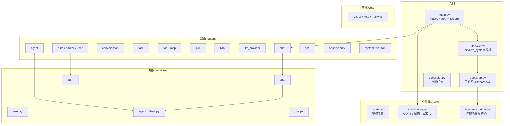
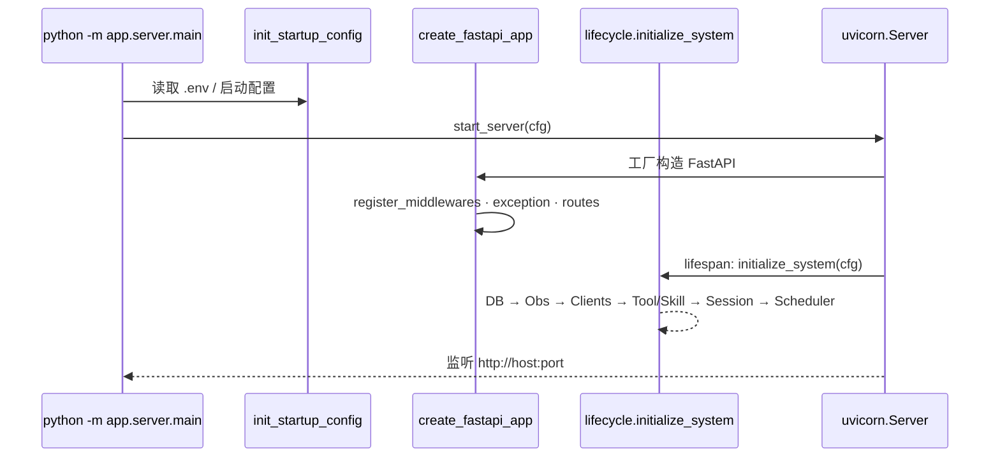
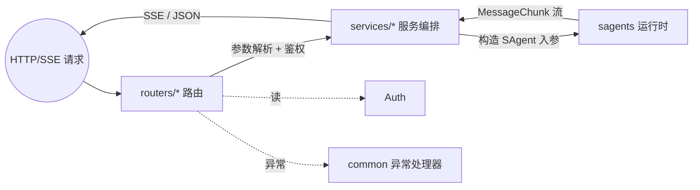
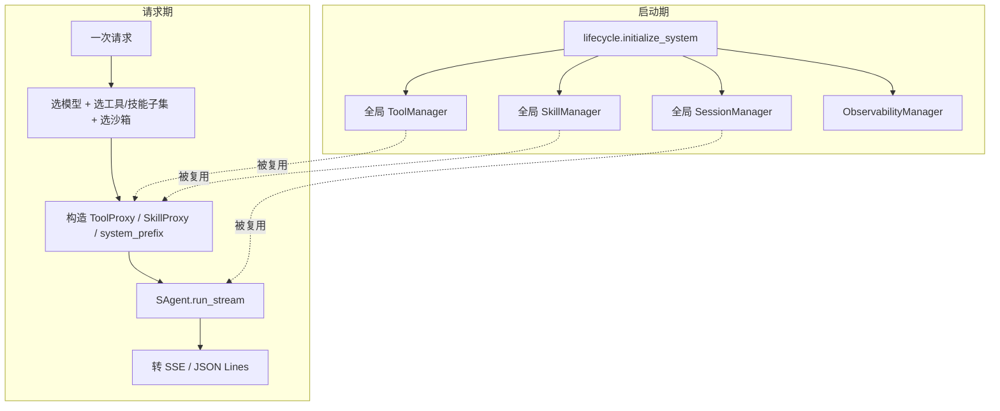
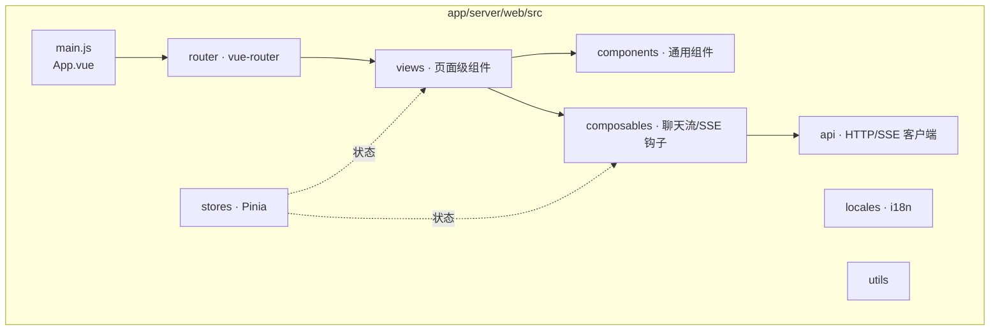



# 服务端与 Web 应用架构

`app/server/` 是 Sage 的主应用入口，承载多用户、Web、智能体管理、知识库、可观测性等完整能力。它是真正“产品级”的入口，而不是演示。

## 模块组成



## 启动链路



## 路由与服务的协作



每个路由模块对应一组 HTTP 资源；服务层把“业务编排”从路由里抽出来：

| 路由模块 | 主要职责 |
| --- | --- |
| `chat` | 会话流式聊天接口（SSE），是 HTTP → `SAgent.run_stream` 的关键层 |
| `agent` | 智能体的 CRUD 与配置管理 |
| `conversation` | 会话历史、列表、收藏 |
| `task` | 长任务/异步任务相关接口 |
| `tool` / `mcp` | 工具与 MCP Server 注册管理 |
| `skill` | 技能包管理 |
| `kdb` | 知识库（Knowledge Base） |
| `llm_provider` | 模型供应商配置 |
| `auth` / `oauth2` / `user` | 登录、用户、第三方 OAuth2（如 Lage） |
| `oss` | 对象存储 |
| `observability` | 可观测性数据查询 |
| `system` / `version` | 系统信息、版本 |

## 与 sagents 的边界



服务端不重新实现智能体逻辑，只负责把 HTTP/SSE 协议、鉴权、用户/Agent 配置、模型供应商等组装成 `SAgent.run_stream` 的入参。详见 [sagents 总览](ARCHITECTURE_SAGENTS_OVERVIEW.md)。

## Web 客户端结构



前端通过 SSE 实时订阅消息分片，并按 `MessageChunk.role` / `message_type` 决定如何渲染（普通消息、工具调用、token 用量等）。

## 部署形态

- 直接 `python -m app.server.main` 启动（开发态）。
- 通过仓库提供的 `docker-compose.yml` / `docker/` 镜像启动（推荐生产）。

详见 [配置](CONFIGURATION.md) 与 [快速开始](GETTING_STARTED.md)。

## 二次开发：新增一个路由

服务端最常见的扩展是“加一个新的 HTTP 资源”，模板如下：

```python
# app/server/routers/my_module.py
from fastapi import APIRouter, Depends
from app.server.core.auth import current_user

router = APIRouter(prefix="/api/my", tags=["my"])

@router.get("/ping")
async def ping(user=Depends(current_user)):
    return {"ok": True, "user_id": user.id}
```

```python
# app/server/routers/__init__.py 中注册
from . import my_module

def register_routes(app):
    ...
    app.include_router(my_module.router)
```

业务逻辑放进 `services/`，路由层只做参数解析、鉴权与响应封装。
