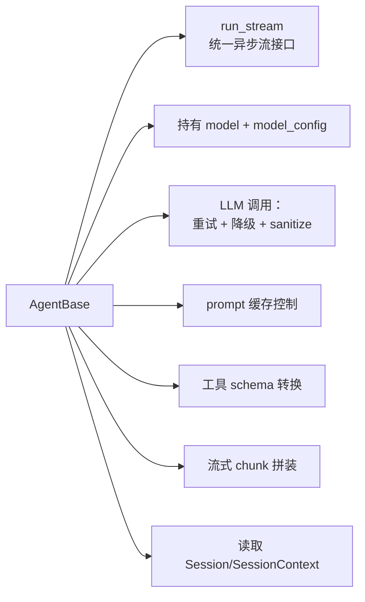
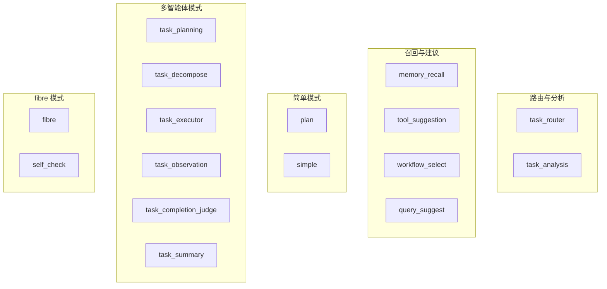
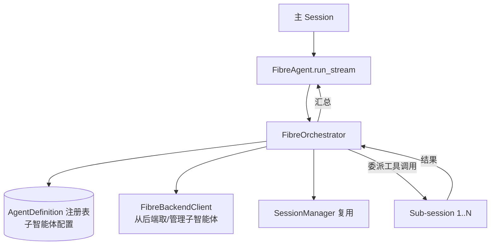
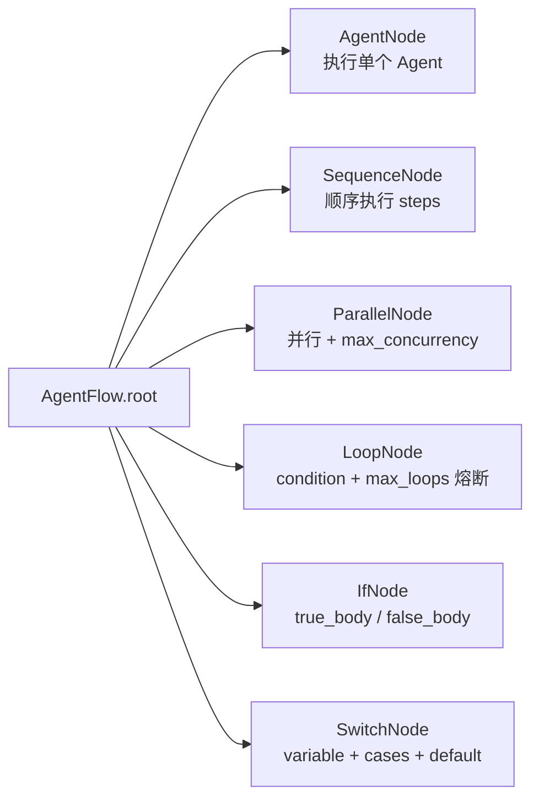
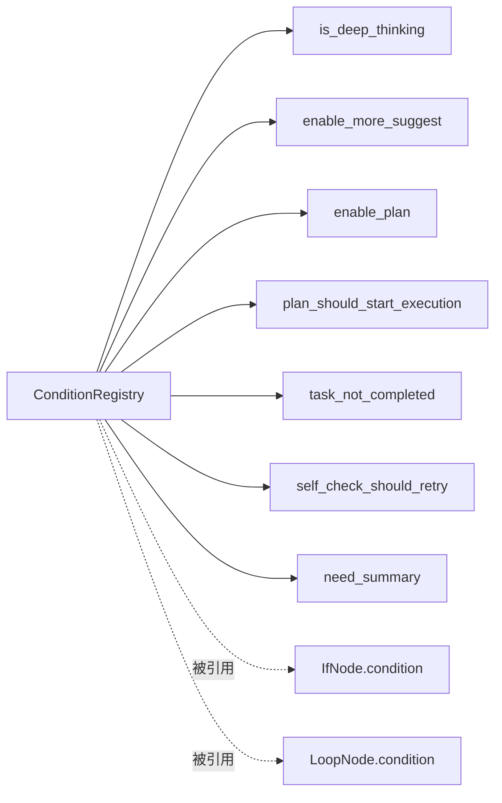
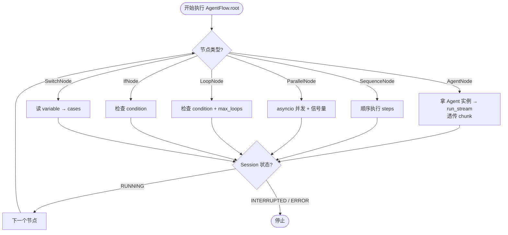
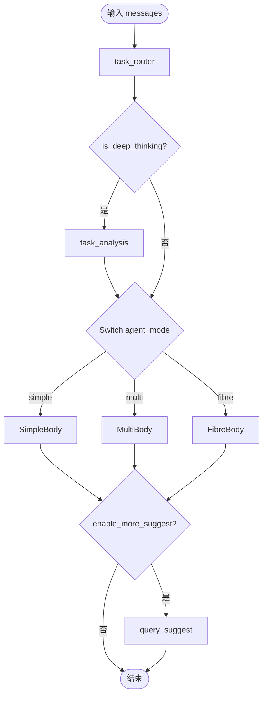
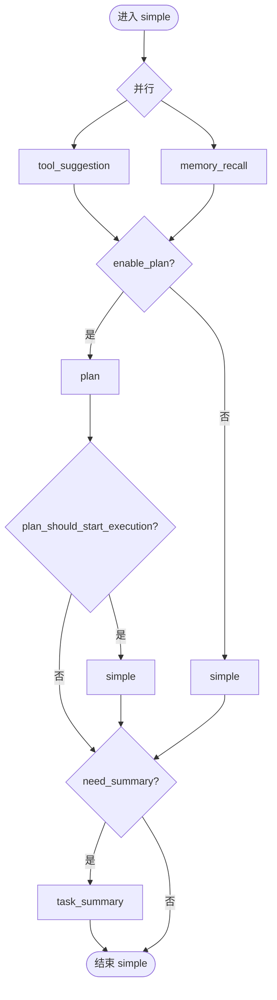
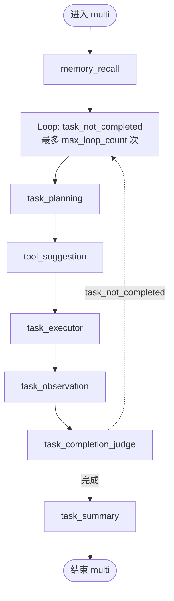
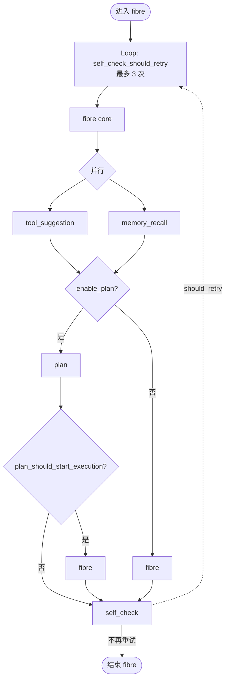

---

## layout: default

title: 智能体与流程编排
parent: 架构
nav_order: 5
description: "AgentBase、各专用 Agent、AgentFlow / FlowExecutor、三种 agent_mode"
lang: zh
ref: architecture-sagents-agent-flow



# 智能体与流程编排

这一篇覆盖 `sagents/agent/` 与 `sagents/flow/`。**Agent 是干活的单元，Flow 决定 Agent 之间的执行关系。** 两者解耦：换流程不改 Agent，换 Agent 也不改流程。

## 1. Agent 层

### 1.1 `AgentBase` 提供的能力




Agent 自身不持有“这次会话的状态”，状态都在 `SessionContext` 里——Agent 因此可以并发复用。

### 1.2 已实现的专用 Agent




各 Agent 的 `agent_key` 是流程中 `AgentNode` 引用它的标识，例如 `task_router`、`simple`、`task_planning` 等。

### 1.3 `FibreAgent` 与子智能体编排




简单理解：**fibre 模式下，主 Agent 通过工具调用把任务委派给子 Agent，每个子 Agent 在自己的 sub-session 里跑，结果再回流到主 session。**

## 2. Flow 层

### 2.1 节点类型




整个 Flow 由 `AgentFlow(name, root)` 包装根节点。`run_stream` 也接受 `custom_flow` 参数，调用方可以完全自定义编排。

### 2.2 条件注册表 `flow/conditions.py`




业务方可以注册自己的条件函数，让 `custom_flow` 用上（见本页末尾）。

### 2.3 执行器 `flow/executor.py`




执行器只负责“怎么走”，不负责“走到 Agent 后做什么”——后者是 Agent 自己的责任。

## 3. 默认流程：simple / multi / fibre

`SAgent._build_default_flow(agent_mode, max_loop_count)` 拼出来的形状：




### simple_agent_body




### multi_agent_full




### fib_agent_body




## 4. 二次开发：自定义流程与子智能体

调用方有三个扩展点，组合起来几乎可以拼出任意复杂的 Agent 编排，而**完全不修改 sagents 源码**。

### 4.1 注册自定义条件

```python
from sagents.flow.conditions import ConditionRegistry

@ConditionRegistry.register("user_paid")
def _user_paid(session_context, session=None) -> bool:
    return session_context.system_context.get("plan") == "pro"
```

### 4.2 自定义 Flow

```python
from sagents.flow.schema import (
    AgentFlow, SequenceNode, AgentNode, IfNode, LoopNode,
)

custom_flow = AgentFlow(
    name="My Pipeline",
    root=SequenceNode(steps=[
        AgentNode(agent_key="task_router"),
        IfNode(
            condition="user_paid",
            true_body=LoopNode(
                condition="task_not_completed",
                max_loops=10,
                body=SequenceNode(steps=[
                    AgentNode(agent_key="task_planning"),
                    AgentNode(agent_key="task_executor"),
                    AgentNode(agent_key="task_completion_judge"),
                ]),
            ),
            false_body=AgentNode(agent_key="simple"),
        ),
        AgentNode(agent_key="task_summary"),
    ]),
)

# 传给 SAgent.run_stream
async for chunks in agent.run_stream(
    ...,
    custom_flow=custom_flow,
):
    ...
```

传了 `custom_flow` 之后，`agent_mode` / `_build_default_flow` 都会被绕过。

### 4.3 自定义子智能体（fibre）

`custom_sub_agents=[...]` 在不重写流程的前提下注入额外子智能体定义，主要服务 fibre 编排：

```python
async for chunks in agent.run_stream(
    ...,
    agent_mode="fibre",
    custom_sub_agents=[
        {
            "agent_key": "data_fetcher",
            "description": "负责从内部 BI 拉数据",
            "system_prompt": "...",
            "available_tools": ["http_fetcher", "sql_runner"],
        },
        # 更多子智能体定义...
    ],
):
    ...
```

主 fibre Agent 会把这些子智能体识别成可委派的目标。