---

## layout: default
title: 沙箱 / LLM / 可观测性
parent: 架构
nav_order: 8
description: "Sandbox 抽象（Local / Remote / Passthrough）、LLM 客户端封装与能力探针、ObservabilityManager 与 OpenTelemetry"
lang: zh
ref: architecture-sagents-sandbox-obs



# 沙箱 / LLM / 可观测性

这一章把三块“横切关注点”合在一起：

- **Sandbox**：所有“执行用户/Agent 代码”的入口都通过统一接口经过它。
- **LLM 层**：模型客户端、能力探针、prompt 缓存等都被封到 `SageAsyncOpenAI` 里。
- **可观测性**：一次会话的运行链路通过 `ObservabilityManager` 派发到多个 handler，OpenTelemetry 是默认实现。

它们不直接出现在“业务流程”里，但任何一个出问题都会让整个 runtime 出问题，所以单独一章。

## 1. 沙箱 `sagents/utils/sandbox/`

### 1.1 模块组成

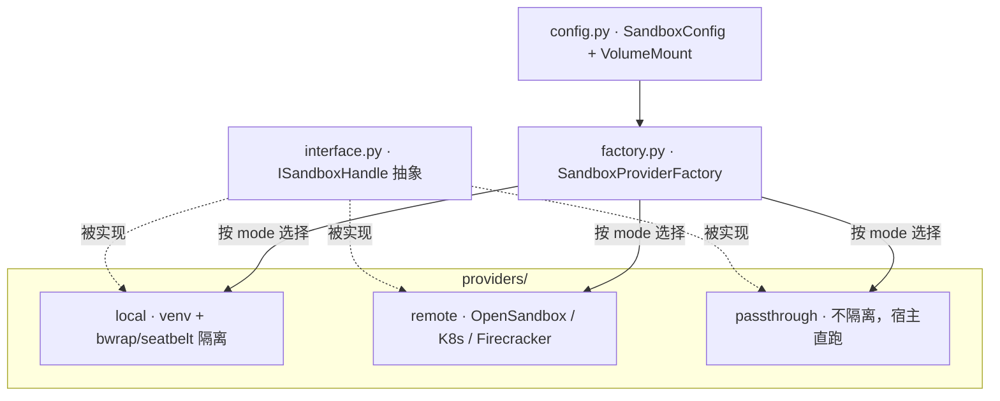


`ISandboxHandle` 是工具层看到的“唯一接口”——无论底下是哪种实现，工具调用都长一样。

### 1.2 三种沙箱模式对比

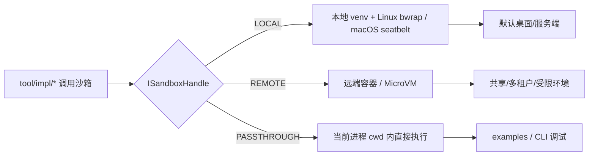


- **LOCAL**：默认模式。给每个会话一个独立目录作为 `sandbox_agent_workspace`，再加资源限制（CPU 时间、内存、可访问路径）。
- **REMOTE**：把执行外包给 OpenSandbox / Kubernetes / Firecracker 等远端运行时，工厂根据 `remote_provider` 选择具体实现。
- **PASSTHROUGH**：完全不隔离，直接在宿主机执行，多用于本地 CLI 与 examples。

### 1.3 ISandboxHandle 关键能力

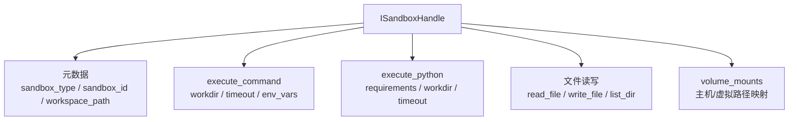


工具层（`execute_command_tool`、`file_system_tool` 等）只调这套接口，不关心具体实现是 venv 还是远端容器。

### 1.4 一次工具调用的链路

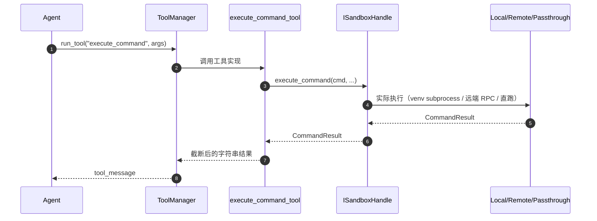


### 1.5 与 Skill 的协作

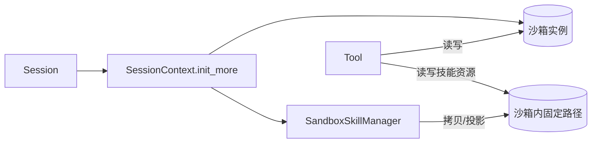


`SandboxSkillManager` 是“技能 → 沙箱”的桥梁：它在沙箱起来后把技能包按约定路径放进去，工具脚本就能像访问本地目录一样使用。

## 2. LLM 层 `sagents/llm/`

### 2.1 模块组成

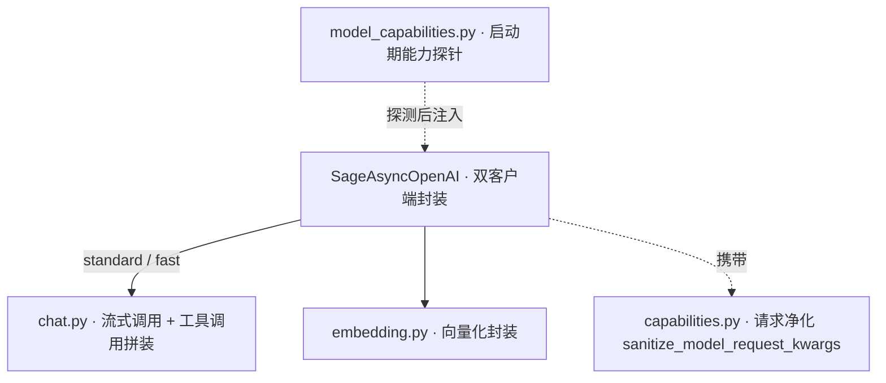


### 2.2 SageAsyncOpenAI：双客户端

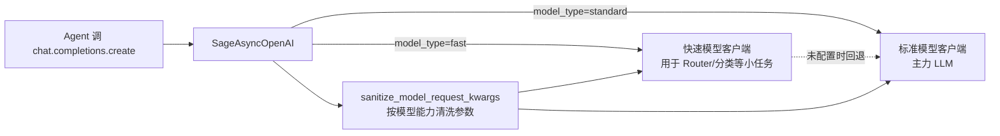


要点：

- 接口完全兼容 `AsyncOpenAI`，只是多一个 `model_type` 参数；
- 把模型能力位（`supports_multimodal` / `supports_structured_output` 等）挂到客户端对象上，调用点直接读，不必到处传配置；
- `sanitize_model_request_kwargs` 会按模型能力裁剪请求体，避免“给不支持 reasoning 的模型传 `reasoning_effort`”这类问题。

### 2.3 启动期能力探针

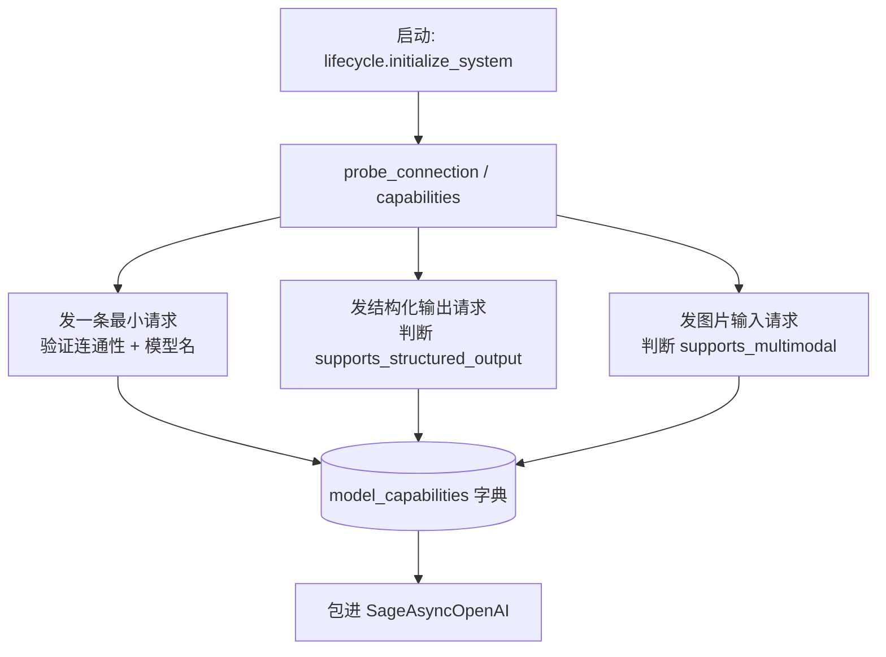


探针运行一次，结果会跟着 `SageAsyncOpenAI` 走完整个生命周期，避免每次请求都查能力。

## 3. 可观测性 `sagents/observability/`

### 3.1 模块组成

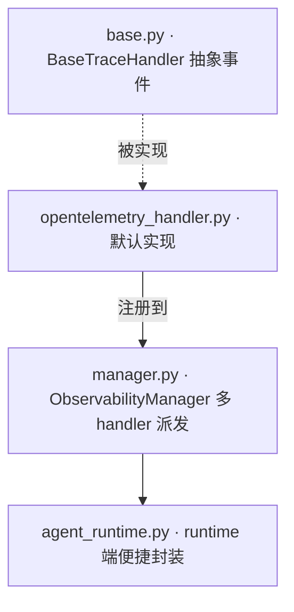


### 3.2 事件模型

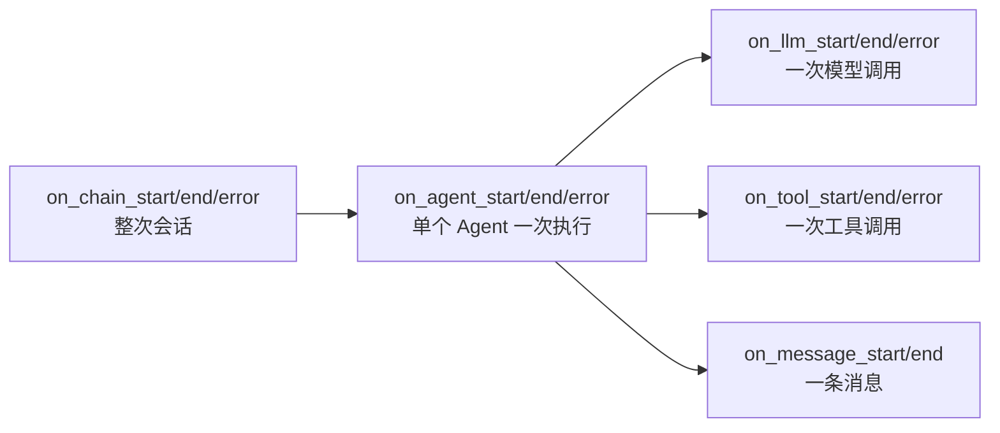


`BaseTraceHandler` 把可观测性的“形状”定下来：链路、Agent、LLM、工具、消息这五类事件，全都成对出现（start/end，加可选 error）。

### 3.3 ObservabilityManager 派发

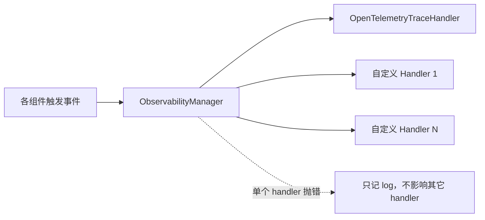


派发器对“一个 handler 抛异常”做了容错：不打断主流程，也不会污染别的 handler。

### 3.4 OpenTelemetry 实现

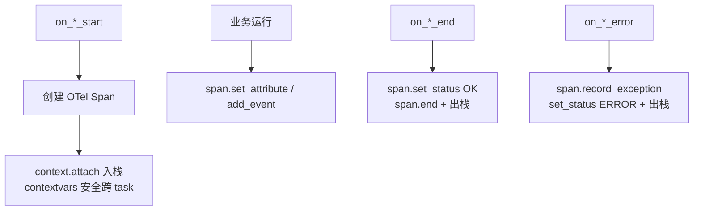


要点：

- 用 `ContextVar` 维护 span 栈，保证异步任务嵌套时 span 关系不串。
- 跨 context 的 detach 错误被显式忽略（async 任务跨边界很容易触发）。
- 这一层只“产生”OTel span，至于导出到哪（Jaeger / Tempo / 自托管 OTLP），由进程外的 OpenTelemetry SDK 配置决定，runtime 不关心。

## 4. 三者怎么串起来

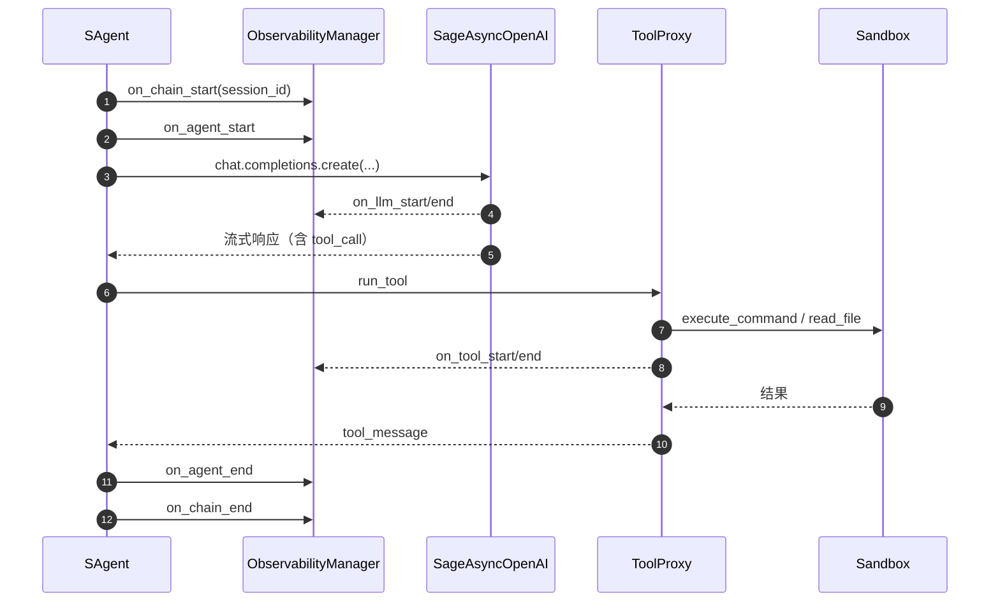


一次会话里：业务流程在 `SAgent` 推进，所有“被外部观测到的事情”都通过 `ObservabilityManager` 抛出来，所有“跨进程的执行”都收敛到 `SageAsyncOpenAI` 与 `ISandboxHandle`。这就是 sagents 把横切关注点解耦的方式。

## 5. 二次开发：自定义 Handler / Provider

### 5.1 自定义可观测性 Handler

```python
from sagents.observability.base import BaseTraceHandler

class MyHandler(BaseTraceHandler):
    def on_llm_start(self, session_id, model_name, messages, step_name=None, **kwargs):
        print(f"[LLM start] session={session_id} model={model_name} step={step_name}")

    def on_llm_end(self, response, **kwargs):
        print("[LLM end]", getattr(response, "usage", None))

# 注册
manager.add_handler(MyHandler())
```

- 可以只实现关心的那几个 `on_*`，其它走父类的空实现；
- 抛异常不会影响主流程，但会被 logger 记录，调试时方便定位。

### 5.2 自定义远程沙箱

```python
from sagents.utils.sandbox.interface import ISandboxHandle, SandboxType, CommandResult
from sagents.utils.sandbox.factory import SandboxProviderFactory

class MyRemoteSandbox(ISandboxHandle):
    @property
    def sandbox_type(self): return SandboxType.REMOTE
    @property
    def sandbox_id(self): return self._id
    # ... 其它属性按 interface 实现 ...

    async def execute_command(self, command, workdir=None, timeout=30, env_vars=None):
        # 调你自己的 RPC / HTTP / SSH
        ...
        return CommandResult(success=True, stdout="...", stderr="", return_code=0, execution_time=0.1)

SandboxProviderFactory.register_remote_provider("my_remote", MyRemoteSandbox)
```

之后只要 `SandboxConfig(mode=SandboxType.REMOTE, remote_provider="my_remote", ...)`，工厂就会用你自己的实现。