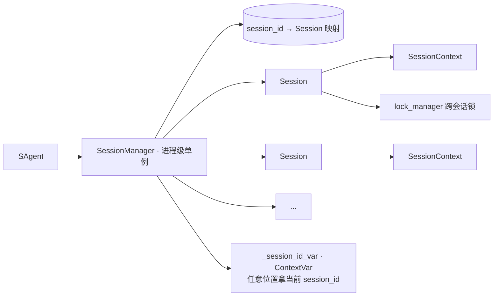
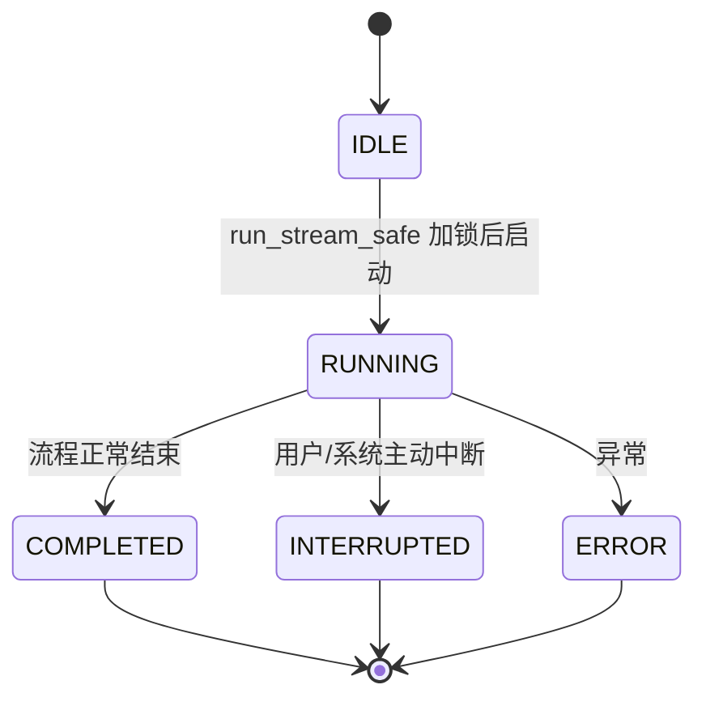
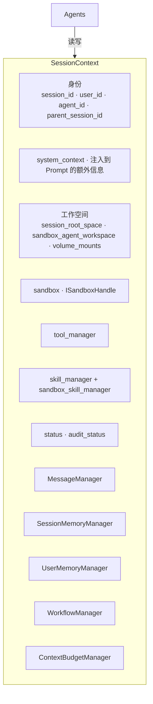
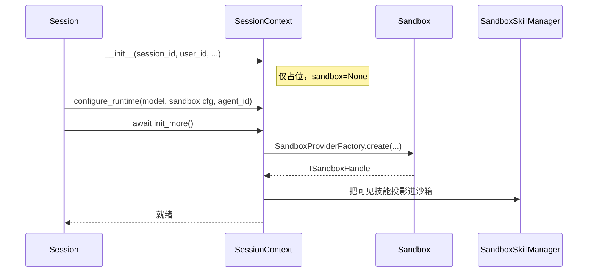
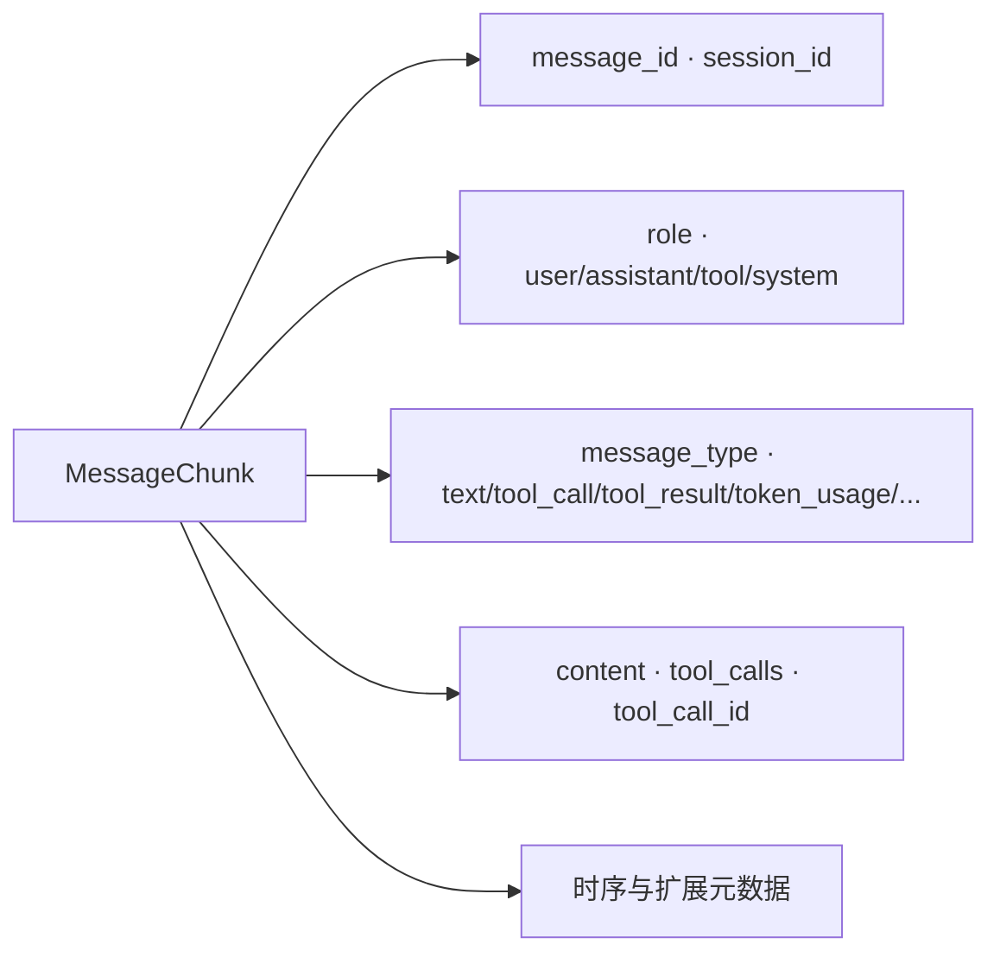
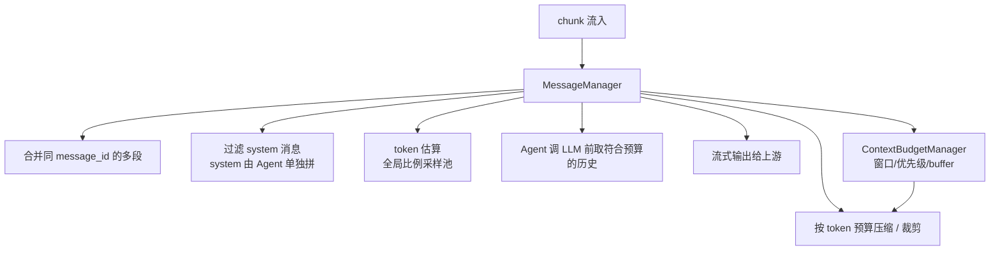
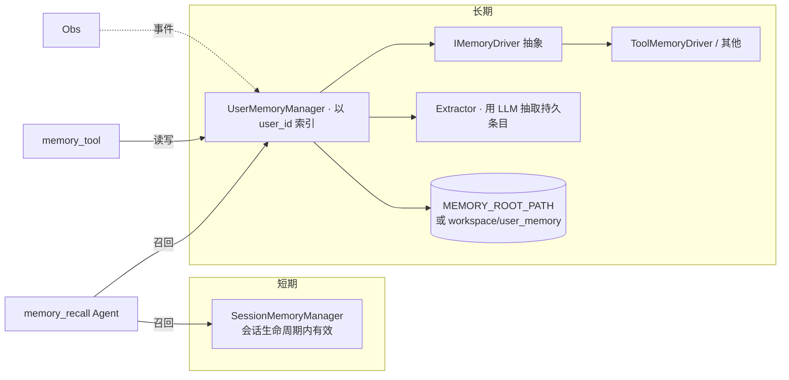
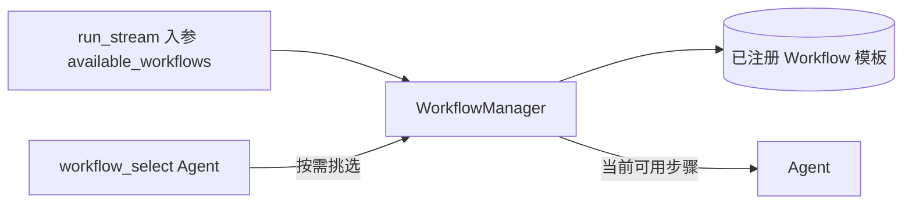
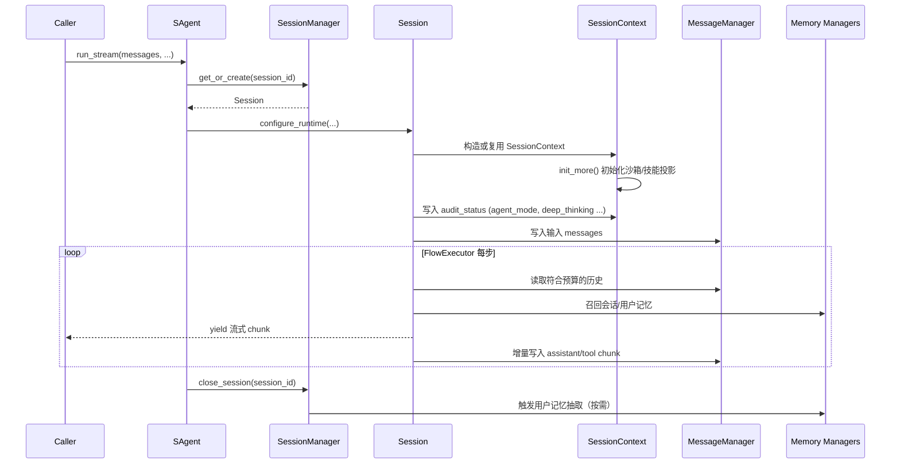
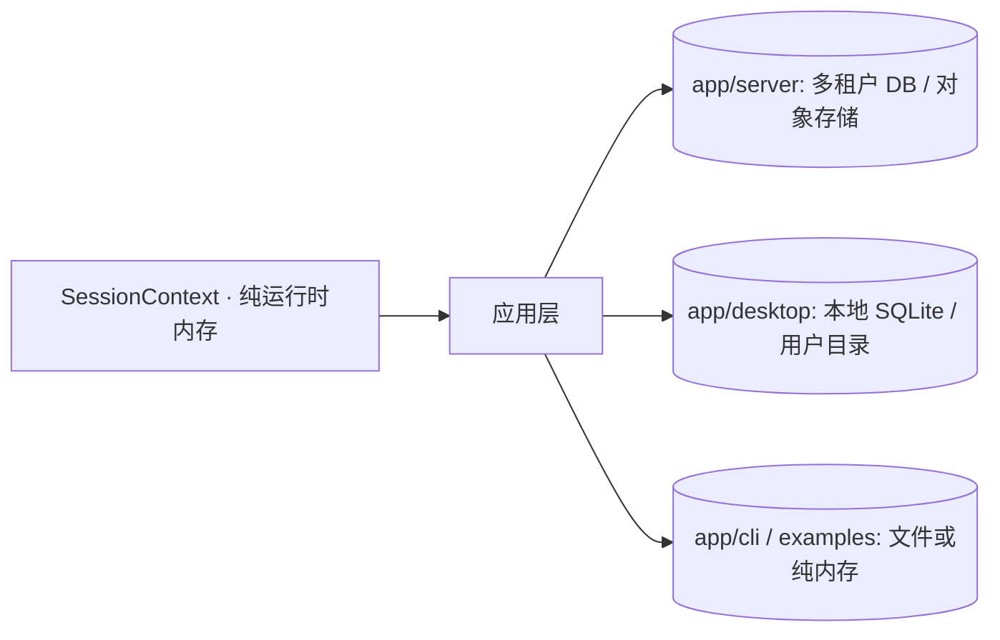



# 会话与上下文

`sagents/session_runtime.py` 与 `sagents/context/` 一起承担“状态层”。智能体本身是无状态的处理器，所有状态都集中在这里。

## 1. 会话生命周期：`Session` 与 `SessionManager`

`SessionManager` 提供：

- `get_or_create(session_id, sandbox_type)`
- `save_session / interrupt_session / close_session`
- `get_live_session(session_id)`：跨模块拿到正在跑的 Session 引用
- 与 `lock_manager` 协作，保证同一 session 不被并发跑两次

### 会话状态机

`FlowExecutor` 在每个节点前后都检查 Session 状态，进入 `INTERRUPTED` / `ERROR` 时立即退出循环，避免“跑一半还在烧 token”。

## 2. `SessionContext`：黑板

它是一个**黑板（Blackboard）**：多个 Agent 通过读写它来协同，但互相之间没有直接依赖。

### 显式两阶段初始化

`init_more()` 把耗时资源（沙箱启动、技能投影）从构造函数里挪出来，避免“半初始化”的上下文被误用。

## 3. 消息：`MessageChunk` + `MessageManager`

### 3.1 MessageChunk 单元

整个运行时的流式输出都是 `List[MessageChunk]`。

### 3.2 MessageManager：消息历史的真理之源

要点：

- system 消息不进历史，由 Agent 在调用时单独拼。
- 上下文预算被收敛到 `ContextBudgetManager` 一处，所有 Agent 共用同一套规则。
- token 估算用全局采样比例（启发式），避免每条都跑 tokenizer。

## 4. 记忆：会话级 + 用户级

记忆系统对 Agent 是“可有可无”的能力，由 `MemoryRecallAgent` 等显式调用，不强制塞进每一次会话。

## 5. Workflow：`context/workflows/`

`Workflow` 是“可重用任务模板”——一段预定义的步骤说明。注意它和 `flow/` 名字相近但定位完全不同：

- `flow/`：跑哪些 Agent（编排）
- `workflows/`：某一类业务任务的固定操作步骤说明（业务模板）

## 6. 一次会话中状态如何演进

## 7. 与外部存储的关系

`SessionContext` 自身不直接绑定任何具体数据库。**“运行时纯内存 + 应用层负责持久化”**，正是 sagents 能被多种应用形态复用的关键之一。
