

# 工具与技能系统

`sagents/tool/` 与 `sagents/skill/` 是“能力层”：决定一次会话里 Agent 可以调用什么、技能包是怎么被加载和执行的。

## 1. 工具系统 `sagents/tool/`

### 1.1 模块组成

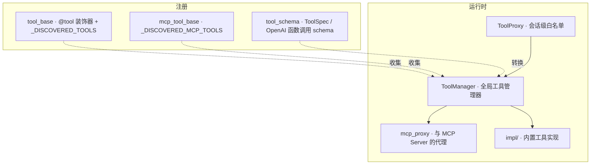

### 1.2 工具的两类来源

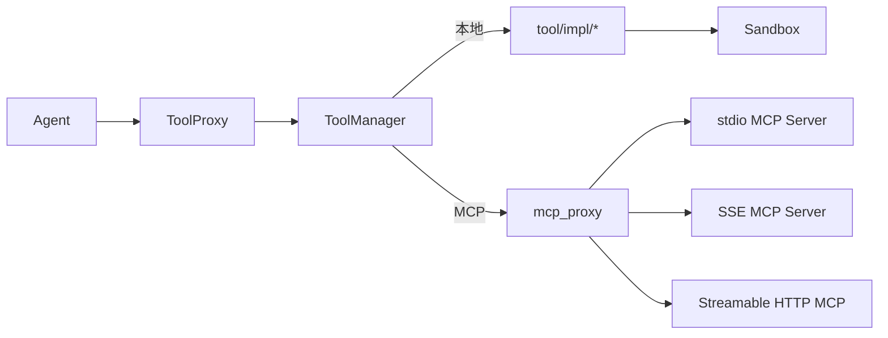

无论本地工具还是 MCP 工具，对 Agent 都长得一样。`ToolManager` 把它们统一登记，再按调用名字派发。

### 1.3 ToolManager 的关键能力

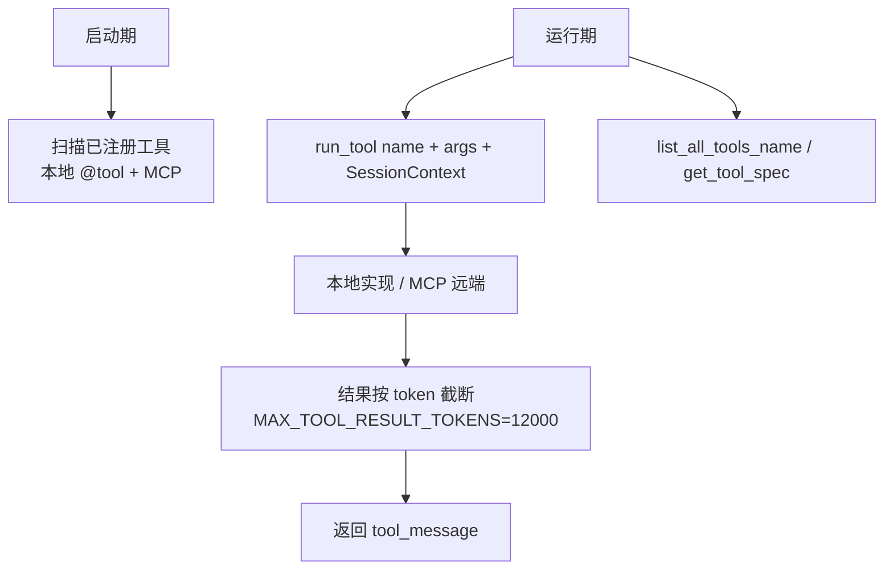

ToolManager 通常是进程级单例，由 `app/server/lifecycle.py`（或桌面端等价物）在启动期初始化。

### 1.4 ToolProxy：会话级白名单

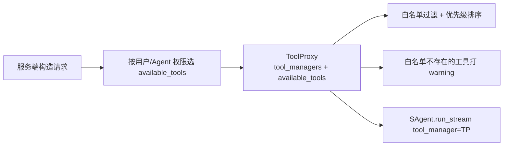

`ToolProxy` 接受多个 `ToolManager`（按列表顺序优先级递减），并兼容 `ToolManager` 的接口，所以 Agent 不需要区分。

### 1.5 内置工具 `tool/impl/`

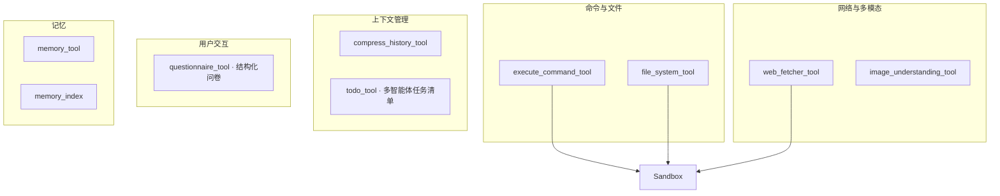

它们的执行最终都要落到 `Sandbox` 抽象上（详见 [Sandbox/LLM/Obs](ARCHITECTURE_SAGENTS_SANDBOX_OBS.md)）。

### 1.6 MCP 集成

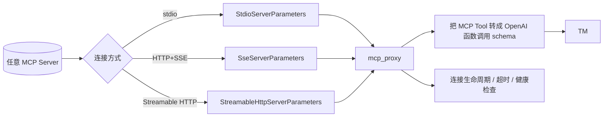

仓库内置的 `mcp_servers/` 也是同样的方式接入。

## 2. 技能系统 `sagents/skill/`

“工具”是函数级能力，“技能”是更大粒度的工作流：一个目录、一份说明、可能配套脚本与示例资源。

### 2.1 模块组成

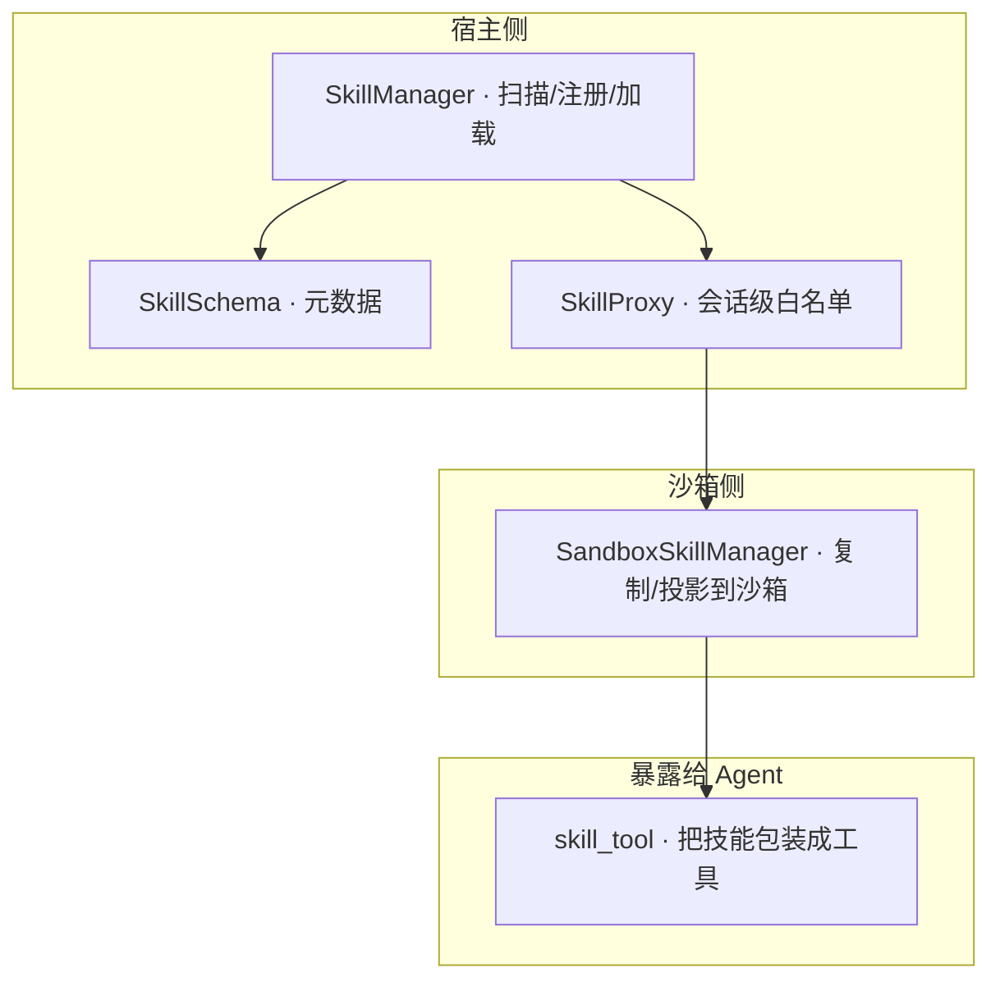

### 2.2 数据流

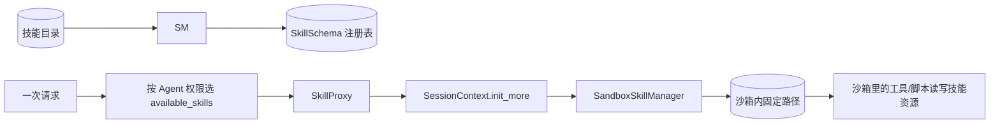

`SkillManager` 不负责把技能拷贝到沙箱——那是 `SandboxSkillManager` 的职责。这种解耦让 remote 沙箱场景也能正常用技能。

### 2.3 技能 → 工具

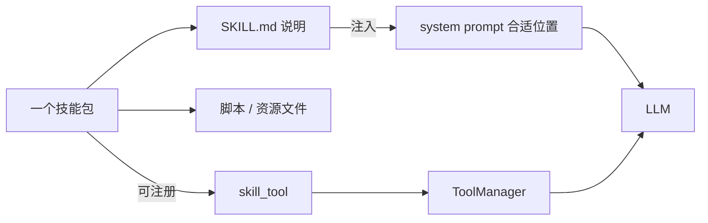

技能既能通过说明影响模型行为，也能直接以工具的形式被 LLM 通过 function call 调用。

## 3. 推荐 / 选择策略

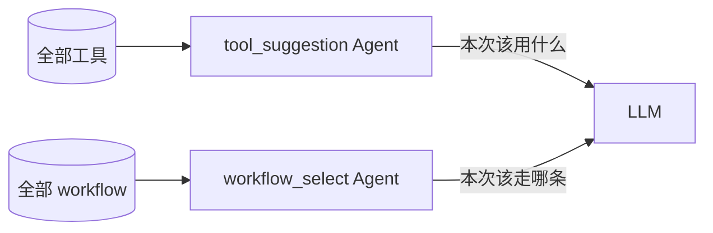

工具/技能层负责“有什么”，建议 Agent 负责“这次用什么”。这样不用一次把全部 schema 塞进上下文。

## 4. 启动期 vs 运行期

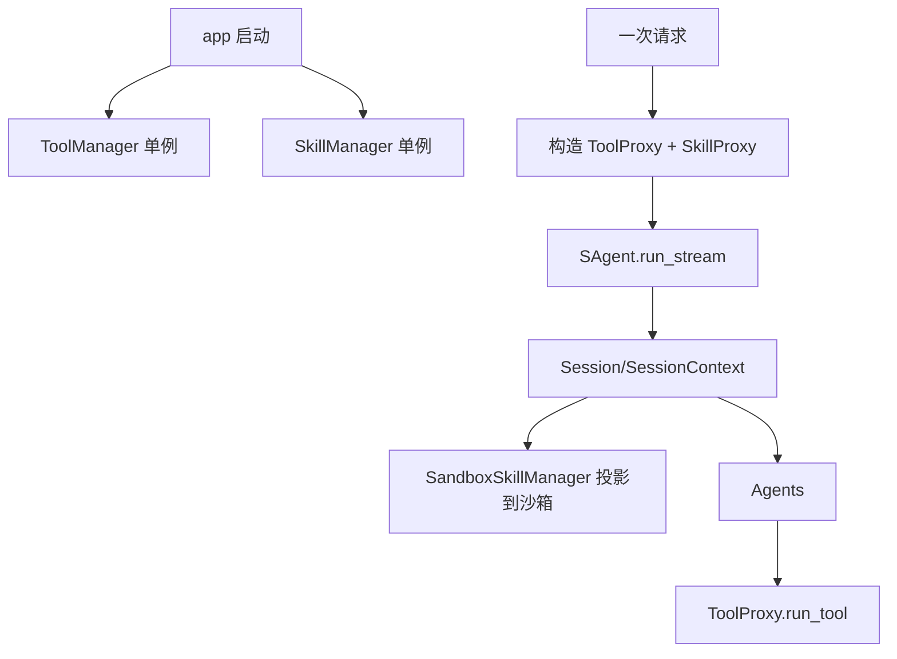

## 5. 二次开发：自定义工具 / MCP / 技能

Sage 的扩展点几乎都在这两层。三种最常用的“给 Agent 加能力”的方式互不冲突。

### 5.1 写一个本地工具

```python
# my_pkg/my_tools.py
from sagents.tool.tool_base import tool

@tool(
    name="get_weather",
    description="按城市名查询天气",
)
async def get_weather(city: str) -> dict:
    """返回 dict 即可，框架自动序列化为 tool_message。"""
    return {"city": city, "temp_c": 23, "condition": "sunny"}
```

只要这个模块被 import 到进程里（例如在 `app/server/bootstrap.py` 的工具初始化阶段 import），它就会被 `ToolManager` 自动收集。

### 5.2 接入一个 MCP Server

```python
from mcp import StdioServerParameters
from sagents.tool.tool_schema import SseServerParameters, StreamableHttpServerParameters

# 三种连接方式按需选一种：
stdio_cfg = StdioServerParameters(command="my-mcp", args=["--stdio"])
sse_cfg = SseServerParameters(url="https://mcp.example.com/sse")
http_cfg = StreamableHttpServerParameters(url="https://mcp.example.com/mcp")

# 通过 ToolManager 提供的注册接口加入（具体 API 看当前 tool_manager.py）
tool_manager.register_mcp_server(name="my_mcp", params=stdio_cfg)
```

注册后，该 MCP Server 暴露的所有工具会被自动转成 OpenAI 函数调用 schema，并和本地工具同等对待。

### 5.3 写一个技能包

技能就是一个目录，按约定包含：

```text
my_skill/
├── SKILL.md          # 必需，人类可读的“怎么用”说明，会注入 LLM
├── skill.yaml        # 可选元数据：id / name / description / 激活场景
├── scripts/          # 可选脚本，可在沙箱里执行
└── assets/           # 可选静态资源
```

`SKILL.md` 的开头一般写：

```markdown
# Skill: My Skill

## 用途
描述这个技能解决什么问题，什么时候该用它。

## 步骤
1. ...
2. ...

## 注意事项
- ...
```

把这个目录所在的根目录注册给 SkillManager 即可：

```python
from sagents.skill import SkillManager

skill_manager = SkillManager()
skill_manager.add_skill_dir("/path/to/skills_root")
```

之后通过 `SkillProxy(skill_manager, available_skills=["my_skill"])` 限定本次会话能看到的技能子集，再传给 `SAgent.run_stream`。
