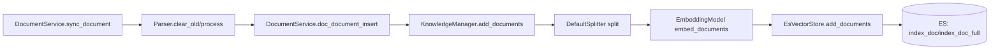
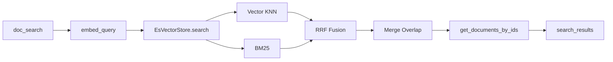



{: .note }
> 需要英文版本？请查看 [Knowledge Base Guide](../en/KNOWLEDGE_BASE.md)

# 📚 Sage 知识库模块指南

本文档聚焦 `app/server/services/knowledge_base` 模块，说明当前版本中知识库的数据流、检索链路以及扩展方式。

## 1. 模块定位

知识库模块在当前版本中承担三类职责：

- 文档同步：解析文件、清理旧数据、重建索引内容。
- 向量检索：为查询生成 embedding，并执行向量与关键词混合检索。
- 工具接入：通过内置 MCP Tool 暴露给 Agent，在对话中按需调用。

当前实现默认使用 Elasticsearch 作为向量库与全文检索引擎。

## 2. 目录结构与职责

```text
app/server/services/knowledge_base/
├── knowledge_base.py                 # DocumentService: 对外服务入口
├── adapter/
│   ├── es_vector_store.py            # EsVectorStore: VectorStore 的 ES 实现
│   └── server_embedding_adapter.py   # Embedding 适配器
└── parser/
    ├── base.py                       # Parser 抽象基类
    ├── common_parser.py              # 通用文件解析
    ├── qa_parser.py                  # QA 数据源解析
    └── eml_parser.py                 # 邮件及附件解析
```

### 2.1 核心类

- `DocumentService`：知识库对外统一入口，封装增删查与同步流程。
- `KnowledgeManager`：检索引擎编排层，组织 split/embed/store。
- `EsVectorStore`：`VectorStore` 抽象接口的 ES 实现。
- `ServerEmbeddingAdapter`：接入服务端 embedding client。

## 3. 文档入库流程

### 3.1 同步入口

`DocumentService.sync_document(...)` 负责一次完整同步：

1. 根据 `data_source` 选择 parser。
2. 调用 `clear_old` 计算需要删除的旧文档 ID。
3. 调用 `process` 解析文件并生成 `DocumentInput` 列表。
4. 写入 `KnowledgeManager.add_documents(...)` 完成切分、向量化、存储。

### 3.2 入库链路



## 4. 检索流程（当前实现）

### 4.1 检索入口

对外检索由 `DocumentService.doc_search(index_name, question, query_size)` 发起：

1. `KnowledgeManager.search(...)` 先生成 query embedding。
2. `EsVectorStore.search(...)` 并发执行：
   - 向量 KNN 检索（`emb` 字段）
   - BM25 关键词检索（`doc_content` 字段）
3. 使用 `SearchResultPostProcessTool` 做 RRF 融合与重叠片段合并。
4. 返回 chunk，并补充完整文档字段（title/path/full_content）。

### 4.2 检索链路图



## 5. ES 索引设计

当前每个知识库会维护两个索引：

- `{index_name}_doc`：chunk 级索引，用于向量与 BM25 检索。
- `{index_name}_doc_full`：完整文档索引，用于返回完整内容与元数据补充。

### 5.1 `_doc` 核心字段

- `doc_id`：所属文档 ID。
- `doc_segment_id`：分片 ID。
- `doc_content`：分片文本（BM25 检索）。
- `emb`：向量字段（dense_vector）。
- `metadata/start/end/path/title/main_doc_id`：检索与展示辅助字段。

### 5.2 `_doc_full` 核心字段

- `doc_id`：文档 ID。
- `full_content`：完整文本。
- `origin_content/path/title/metadata`：原始与展示信息。

## 6. Agent 如何调用知识库

知识库调用通过内置 MCP Tool `retrieve_on_zavixai_db` 进入：

1. Tool 定义在 `app/server/routers/kdb.py`。
2. Agent 请求中若配置 `available_knowledge_bases`，系统会：
   - 向 `available_tools` 注入 `retrieve_on_zavixai_db`。
   - 向 `system_context` 注入知识库 `index_name`。
3. 模型发起 tool call 后，调用 `DocumentService.doc_search(...)`。
4. 检索结果作为 `role=tool` 消息写回会话历史，供后续轮次继续推理。

## 7. 当前版本边界

- 后端固定为 ES：`DocumentService` 构造时直接实例化 `EsVectorStore`。
- `VectorStore.search` 当前无过滤参数，默认策略为向量 + BM25 并行融合。
- 启动阶段对 `es_url` 有依赖，未配置时会跳过文档构建相关调度。

## 8. 快速排查清单

- 无检索结果：
  - 检查 ES 客户端是否初始化成功。
  - 检查对应 `{index_name}_doc` 是否存在且有数据。
- 文档已上传但查不到：
  - 检查 parser 是否按 `data_source` 命中正确实现。
  - 检查 `sync_document` 是否完成 `clear_old + process + insert` 全流程。
- Agent 未调用知识库：
  - 检查 Agent 配置是否包含 `available_knowledge_bases`。
  - 检查工具白名单里是否出现 `retrieve_on_zavixai_db`。
