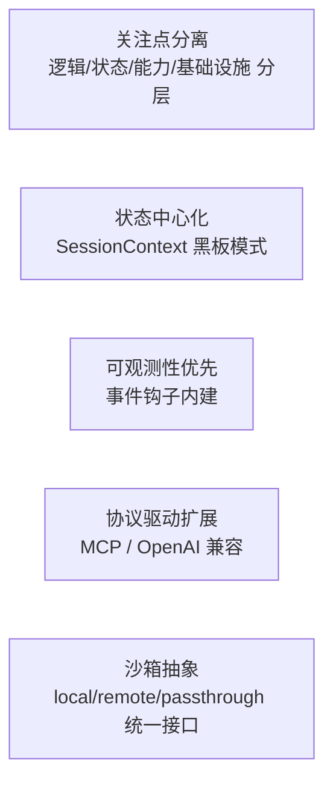
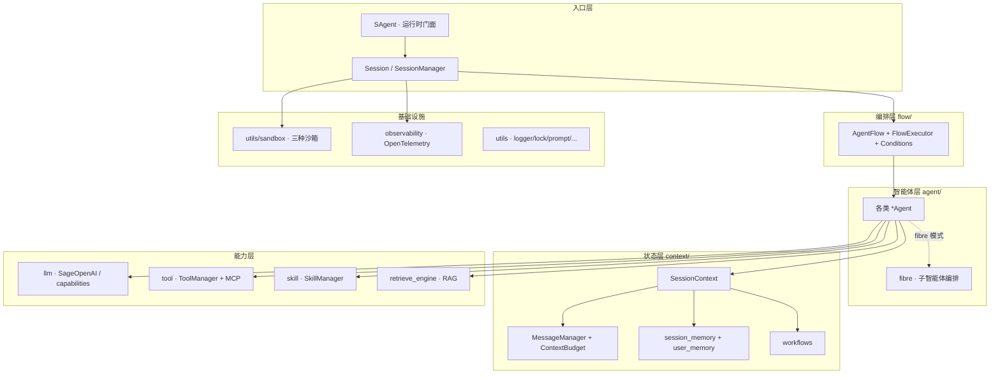
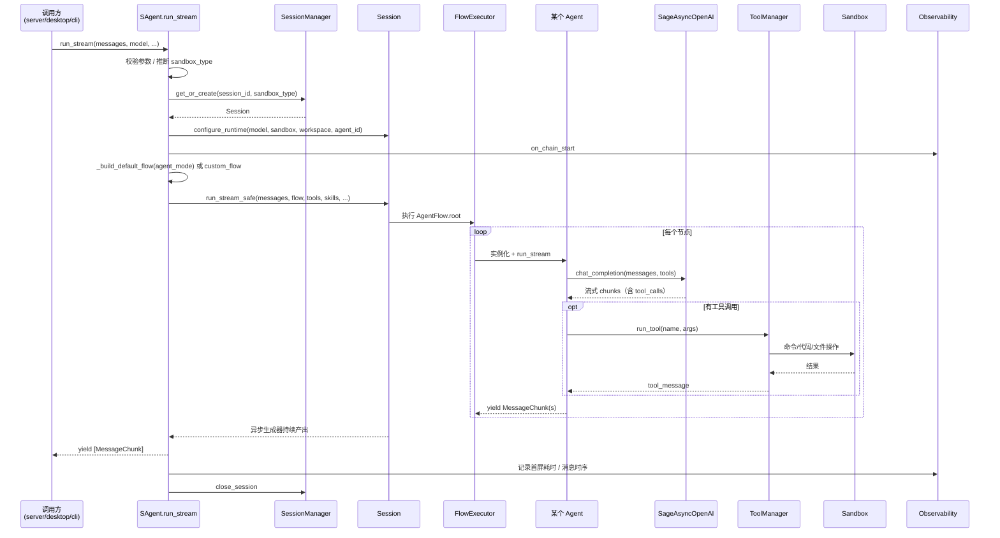
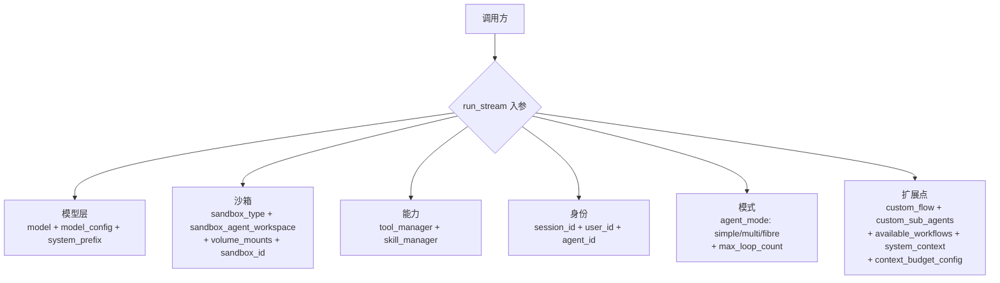
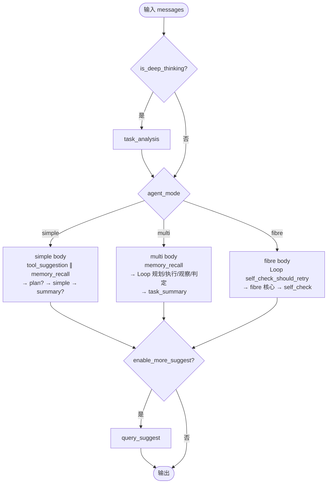
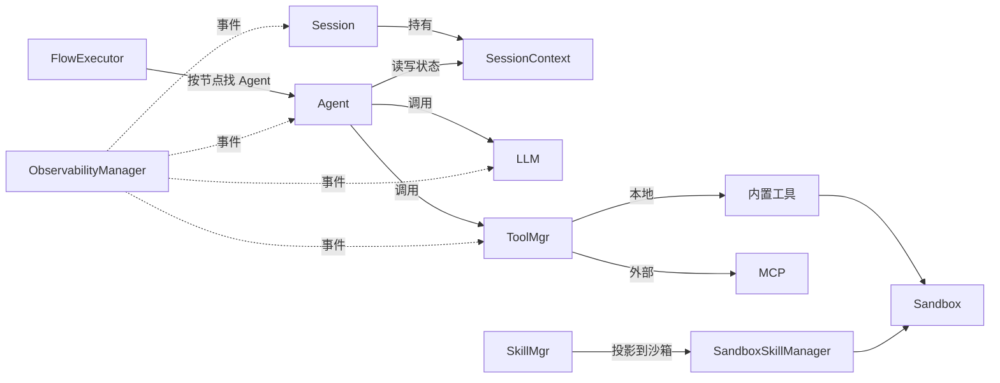
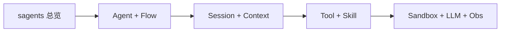



# sagents 总览

`sagents/` 是 Sage 的核心运行时。所有应用形态（服务端、桌面、CLI、示例）最终都通过它来真正“跑一次会话”。这一节用图把 sagents 的分层、模块、以及一次 `run_stream` 的端到端调用关系讲清楚。

## 设计原则




## 分层与模块




## 一次 `SAgent.run_stream` 的全链路




## 入口 API：`SAgent.run_stream` 的关键参数




关键约束：

- `model` 与 `model_config` 必须给。
- `max_loop_count` 必须给，作为最终熔断。
- `sandbox_type` 优先级：参数 > `__init__` > `SAGE_SANDBOX_MODE` 环境变量 > 默认 `local`。
- 不同沙箱模式对 `sandbox_agent_workspace` 的要求不同（local/passthrough 必填，remote 可由默认 `/sage-workspace` 兜底）。

## 默认流程：显式 `agent_mode`




`agent_mode` 由调用方或 UI 显式选择，默认流程里不再有运行期自动路由步骤。逐节点细节见下一篇 [Agent 与 Flow 编排](ARCHITECTURE_SAGENTS_AGENT_FLOW.md)。

## 模块之间是怎么协作的




要点：

- **Agent 不持有状态**，状态全部走 `SessionContext`，方便复用与并发。
- **工具的执行最终落到 Sandbox**，工具层不直接接触本机环境。
- **可观测性是横向能力**，所有关键事件都通过 `ObservabilityManager` 分发。

## 接下来读什么




- [Agent 与 Flow](ARCHITECTURE_SAGENTS_AGENT_FLOW.md)：智能体如何被定义和编排
- [Session 与 Context](ARCHITECTURE_SAGENTS_SESSION_CONTEXT.md)：状态层的细节
- [Tool 与 Skill](ARCHITECTURE_SAGENTS_TOOL_SKILL.md)：能力层
- [Sandbox / LLM / Obs](ARCHITECTURE_SAGENTS_SANDBOX_OBS.md)：基础设施层

## 二次开发：最小调用样板

把 `SAgent.run_stream` 当 SDK 用的最简形式，方便对照参数：

```python
import asyncio
from openai import AsyncOpenAI
from sagents.sagents import SAgent

async def main():
    agent = SAgent(session_root_space="/tmp/sage", sandbox_type="local")
    model = AsyncOpenAI(api_key="...", base_url="...")
    async for chunks in agent.run_stream(
        input_messages=[{"role": "user", "content": "你好"}],
        model=model,
        model_config={"model": "gpt-4o-mini"},
        system_prefix="你是一个助手",
        sandbox_agent_workspace="/tmp/sage/agents/demo",
        max_loop_count=8,
        agent_mode="simple",
    ):
        for c in chunks:
            print(c.role, c.content)

asyncio.run(main())
```

更复杂的扩展点（自定义 Flow、自定义子智能体、自定义条件）见下一篇。
