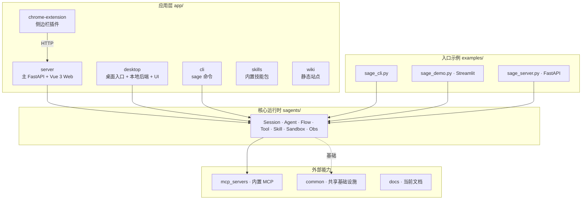
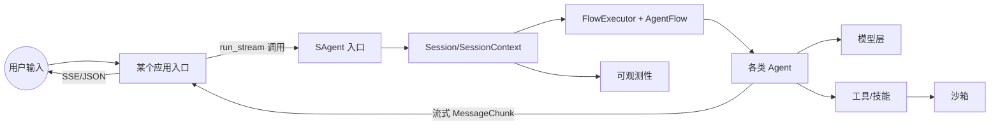
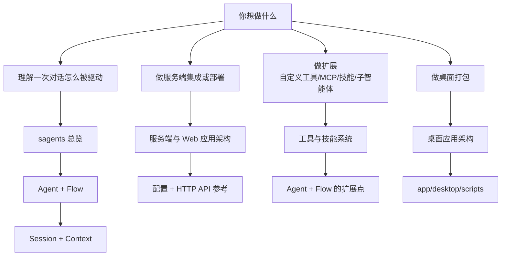



# 架构

Sage 不是一个单一二进制，而是一个分层的代码库。架构这一章被拆成两条主线：

- **应用架构**：每一个面向使用者的入口（Web 服务端、桌面端、CLI、示例与浏览器扩展等）各自的形态、启动路径与边界。
- **核心运行时 `sagents/` 架构**：所有应用都共享的会话与智能体引擎，是真正承载“跑一次对话/一次任务”的中枢。

这一章下面有多篇二级文档，分别拆开讲。本页只提供大图与索引，细节请进入对应子页。

## 仓库分层全景

## 一次会话的高层数据流

## 这一章包含哪些二级文档

应用架构（不同 app 的形态与边界）：

1. [服务端与 Web 应用架构](ARCHITECTURE_APP_SERVER.md)：`app/server/` 的 FastAPI、路由、服务、启动与 Web 客户端结构
2. [桌面应用架构](ARCHITECTURE_APP_DESKTOP.md)：`app/desktop/` 的本地后端、UI、Tauri 壳与与 sagents 的关系
3. [CLI、示例与外部入口架构](ARCHITECTURE_APP_OTHERS.md)：`app/cli/`、`examples/`、`app/chrome-extension/`、`app/wiki/` 等轻量入口

核心运行时 `sagents/` 架构（这一章的核心）：

1. [sagents 总览](ARCHITECTURE_SAGENTS_OVERVIEW.md)：分层、模块边界与典型一次 `run_stream` 的全链路
2. [智能体（Agent）与流程（Flow）编排](ARCHITECTURE_SAGENTS_AGENT_FLOW.md)：`AgentBase`、各专用 Agent、`AgentFlow` / `FlowExecutor`、三种 `agent_mode`
3. [会话与上下文（Session & Context）](ARCHITECTURE_SAGENTS_SESSION_CONTEXT.md)：`Session`、`SessionContext`、消息管理、会话/用户记忆与 workflow
4. [工具与技能（Tool & Skill）系统](ARCHITECTURE_SAGENTS_TOOL_SKILL.md)：`ToolManager` / `ToolProxy`、内置工具、MCP 代理、`SkillManager` / `SkillProxy`、沙箱内技能
5. [沙箱、LLM 适配与可观测性](ARCHITECTURE_SAGENTS_SANDBOX_OBS.md)：`SandboxProviderFactory` 三种沙箱、`SageAsyncOpenAI` 模型层与 OpenTelemetry 链路

## 阅读建议

