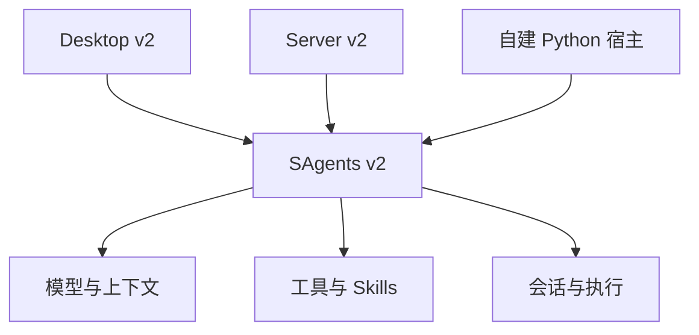



# 架构

## 应用与运行时边界

```mermaid
flowchart TB
    desktop[Desktop v2] --> runtime[SAgents v2]
    server[Server v2] --> runtime
    custom[自建 Python 宿主] --> runtime
    runtime --> model[模型与上下文]
    runtime --> tools[工具与 Skills]
    runtime --> state[会话与执行]
```

宿主负责身份认证、凭据、界面、全局会话索引和工具资源绑定。`SAgentApplication` 负责运行时装配和组件生命周期。SessionStore 保存权威 Session 状态和已确认事件。

## 按主题阅读

- [插件架构](PLUGINS.md)：注册、配置、作用域与宿主注入。
- [记忆](../memory/README.md)：上下文投影与持久历史的区别。
- [工具与 MCP](../MCP_SERVERS.md)：能力与授权。
- [沙箱生命周期](SAGENTS_V2_SANDBOX_LIFECYCLE.md)：暂停与资源释放。
- [Agent 包管理](SAGENTS_V2_AGENT_MANAGEMENT.md) · [Server Agent 平台](SERVER_V2_AGENT_PLATFORM.md)。
- [资源管理](SAGENTS_V2_RESOURCE_MANAGEMENT.md) · [单机并发](sagents-v2-single-host-concurrency.md)。
- [上下文预算](sagents-v2-context-budget.md) · [模型池与持久化](sagents-v2-model-pool-and-persistence.md)。
- [本机沙箱约束](sagents-v2-local-sandbox-security.md)。
- [完整运行时架构](https://github.com/ZHangZHengEric/Sage/blob/main/sagents/v2/ARCHITECTURE.md)：依赖规则与契约。

## 部署边界

内置调度器和会话存储不构成分布式运行时。SQL 持久化、用户配额与 fencing 是不同的保证。Server v2 支持单 worker。本机进程执行不等于容器隔离，安全边界取决于所选 provider 实际执行的约束。
