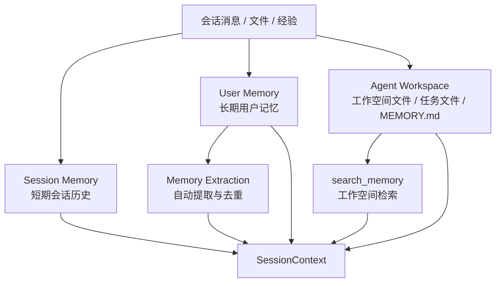



# Memory

这里收纳与 Sage 记忆体系相关的文档。Sage 的 memory 不只是用户记忆，还包括会话历史、Agent workspace 文件、以及基于 `search_memory` 的工作空间检索。

## 体系结构

## 这个目录包含什么

- 会话记忆：当前会话内的历史消息与上下文压缩
- 用户记忆：跨会话的长期记忆与自动提取
- 工作空间记忆：Agent workspace 内的文件、笔记、任务结果
- 记忆搜索：基于 `search_memory` 的工作空间检索与验证

## 当前文档

1. [会话记忆](SESSION_MEMORY.md)
2. [用户记忆](USER_MEMORY.md)
3. [工作空间记忆](WORKSPACE_MEMORY.md)
4. [Memory Search 验证](memory-search/README.md)
