

# 催收 Agent 售前方案

> 说明：本文是面向售前沟通的方案级文档，强调架构逻辑、产品价值与交付可行性。  
> 核心原则：**在授权范围内、在合规约束下、在可审计前提下**，让 Agent 承担更多标准化沟通与流转工作，把人工专员释放到高价值处理环节。

---

## 1. 方案目标

催收场景的关键，不只是“能聊天”，而是“能在正确的时间，用正确的策略，通过正确的渠道，把客户带到正确的下一步”。

整个系统设计为四层：

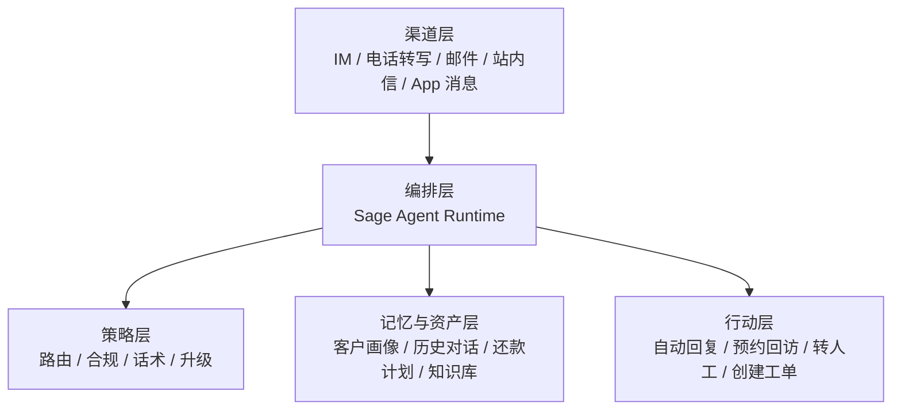

这套设计的目标有四个：

1. **提升首触达效率**：快速覆盖大量重复、标准化的沟通。
2. **降低人工成本**：让专员只处理复杂协商、争议和高风险对话。
3. **提高合规稳定性**：统一话术、统一边界、统一留痕。
4. **持续自我进化**：把成功经验沉淀成可复用能力，而不是停留在单次对话。

---

## 2. 总体架构

催收系统采用“**一个主执行 Agent + 若干辅助 Agent**”的形态，而不是让多个 Agent 平权协作。

主执行 Agent 是整个业务链路的中心，它负责：

- 读懂当前对话
- 决定下一步动作
- 调用工具执行任务
- 组织回复内容
- 决定是否转人工

辅助 Agent 不直接主导业务流，而是在关键点提供“专门能力”：

- **合规 Agent**：判断当前回复和动作是否越界
- **复盘 Agent**：分析成功/失败对话，输出优化结论
- **知识 Agent**：查询政策、FAQ、账务说明
- **客户洞察 Agent**：抽取客户状态、风险标签、沟通偏好
- **Skill Builder Agent**：把经验整理成可复用 skill

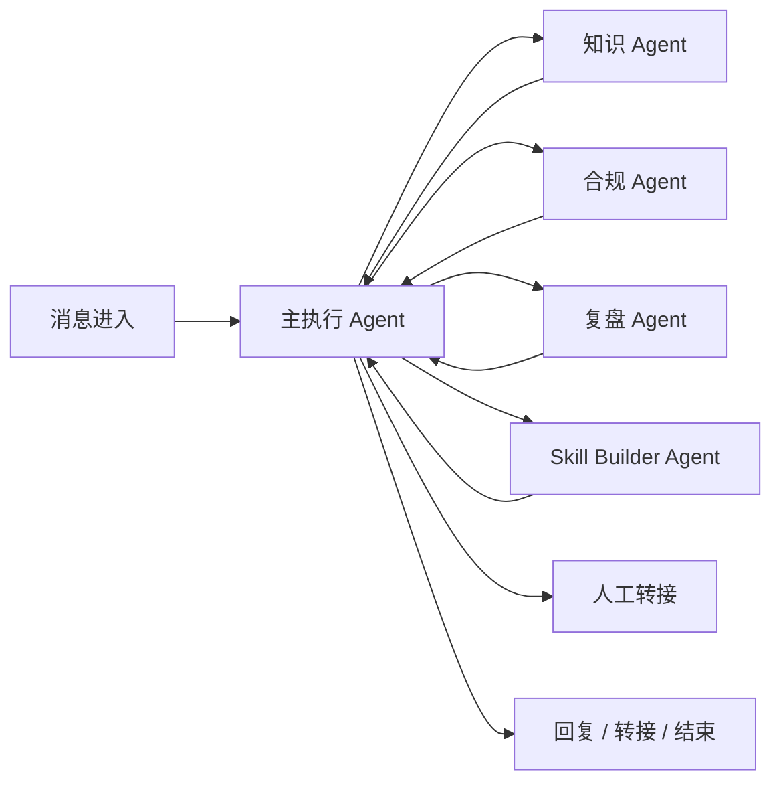

### 为什么主执行 Agent 要保持中心化

因为催收是一个强业务闭环，核心不是“谁更会说”，而是“谁对当前局面负责”。

如果多个 Agent 平权协作，容易出现三个问题：

1. **责任分散**：出了问题很难定位最终决策点。
2. **状态分裂**：不同 Agent 对客户状态的理解可能不一致。
3. **链路膨胀**：看似灵活，实际会让运行时复杂度迅速上升。

主执行 Agent 中心化以后，系统会更像“一个总控大脑 + 多个专家顾问”：

- 大脑负责决策与执行
- 顾问负责补充信息、校验边界、沉淀经验

这种方式更适合售前表达，因为它更符合客户对“可控、可管、可审计”的直觉。

---

## 3. Agent 开发与运行方案

### 3.0 Sage 底层 `sagents` 逻辑框架

`sagents` 是整套系统的运行内核。它不直接关心“这是催收还是客服”，而是提供一套通用的 Agent 执行机制，让上层业务稳定地接入模型、工具、技能、记忆和审计。

它的核心逻辑可以概括成一句话：

> **Session 负责状态，Flow 负责路径，Agent 负责决策，Tool 负责动作，Skill 负责经验，Sandbox 负责隔离，Observability 负责留痕。**

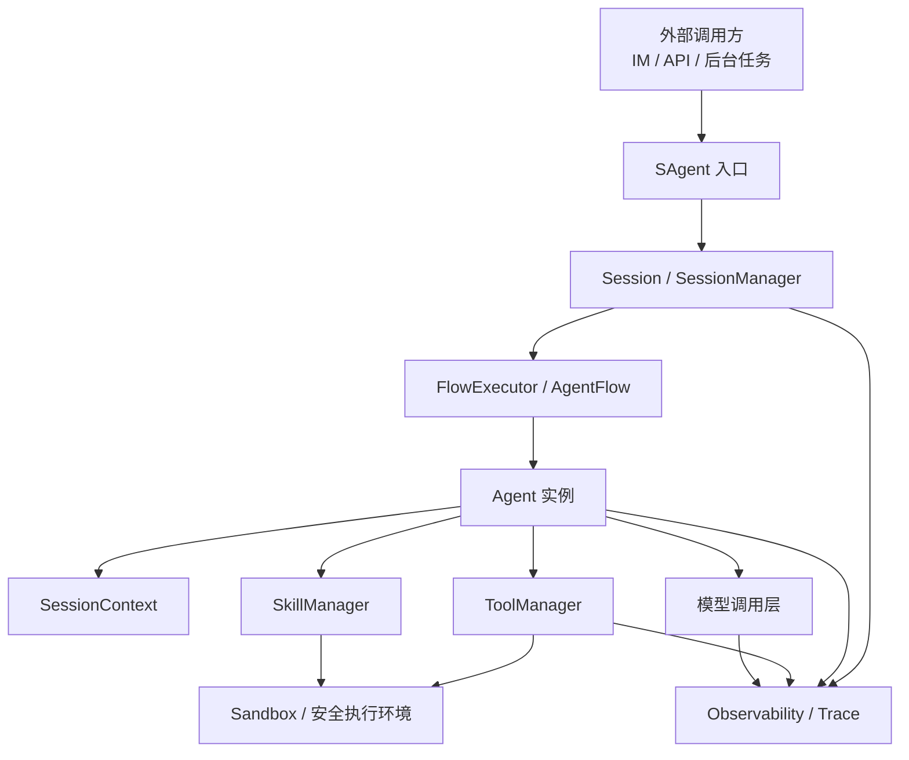

### 3.0.1 这套底座为什么重要

对于催收这样的高频业务，真正难的不是“让模型说一句话”，而是“让系统长期稳定地说对话、做对动作、留下对的记录”。

`sagents` 这一层解决四个底层问题：

1. **状态统一**：一次会话里的客户状态、风险标签、历史上下文都收敛到 `SessionContext`。
2. **执行统一**：所有 Agent 通过同一套运行时进入、退出、循环和中断。
3. **能力统一**：工具、Skill、检索、模型调用都挂在同一个执行框架下。
4. **审计统一**：每次决策、每次调用、每次转接都有可追踪记录。

### 3.0.2 一次请求在 `sagents` 里的完整链路

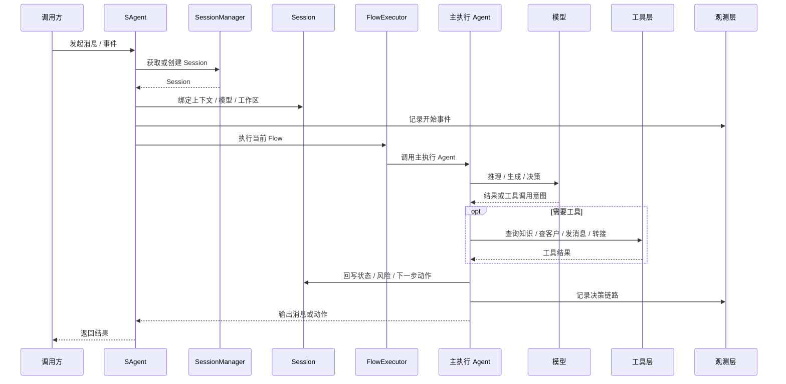

### 3.0.3 运行时的设计理念

- **主执行 Agent 是唯一决策入口**：避免多头决策，保证业务链路收口。
- **工具必须经过统一调度**：模型不能直接碰外部系统，动作通过工具层执行。
- **Skill 是可复用的经验包**：高质量经验会被整理成 Skill，供主执行 Agent 直接调用。
- **Sandbox 保证动作可控**：所有可能产生副作用的操作都在隔离环境或受控接口里完成。
- **Observability 保证可解释**：客户不仅能看到结果，还能看到为什么这么做。

### 3.1 角色分工

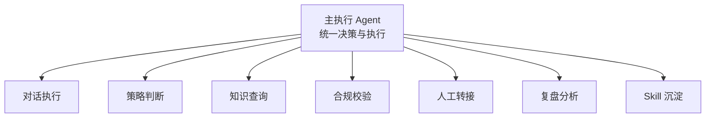

主执行 Agent 是“总控”，辅助能力是“插件式专家”。

- **主执行 Agent**：读懂上下文、决定下一步、调用工具、组织回复、控制节奏
- **知识能力**：在需要事实、政策、账务说明时提供检索结果
- **合规能力**：在回复前后做边界审查，避免越界表达
- **转接能力**：当需要人工介入时，输出摘要并完成交接
- **复盘能力**：分析成功或失败对话，提炼改进方向
- **Skill 能力**：把有效经验沉淀成可复用的业务 skill

### 3.2 运行方式

采用“**事件驱动 + 状态驱动 + 工具/Skill 驱动**”的运行模式：

- 每次收到消息，先进入 **Session**。
- Session 中保存客户状态、对话历史、风险标签、催收阶段、渠道上下文。
- 各 Agent 基于状态做局部决策，不直接依赖外部脚本拼接。
- 主执行 Agent 会根据当前状态选择调用模型、工具或 Skill。
- 所有关键动作都通过统一的动作层执行，并记录审计日志。

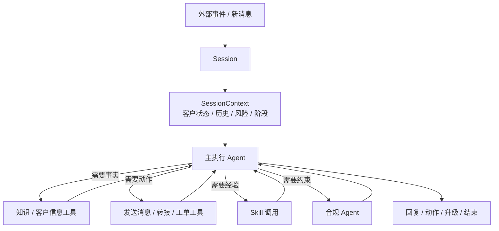

### 3.2.1 运行时的关键判断

主执行 Agent 不会对每个任务都调用大模型，而是先判断：

- 当前任务是不是简单任务
- 上下文是不是足够少
- 是否是结构化整理类任务
- 是否对速度敏感
- 是否需要高质量推理或复杂生成

当任务简单、上下文较少、对速度要求高、且输出偏结构化时，优先使用小模型；
当任务复杂、上下文较长、需要推理或需要高质量表达时，切换到大模型。

### 3.3 方案优势

- **更快交付**：模块化后，能快速替换某个能力，而不影响整体链路。
- **更容易控质**：每一步都有独立验证点，方便做回归测试。
- **更适合售前展示**：客户能清楚理解“系统如何工作”，而不是只看到一个聊天窗口。
- **更容易规模化**：未来可扩展到电话、IM、邮件、App Push、站内信等多渠道一致编排。

---

## 4. 大小模型协同

在 Sage 的 Agent 框架里，大小模型协同不是“手工写死某个模型”，而是由 **主执行 Agent 根据任务类型动态分发**。

主执行 Agent 负责编排，小模型负责高频轻任务，大模型负责复杂判断和高价值生成。

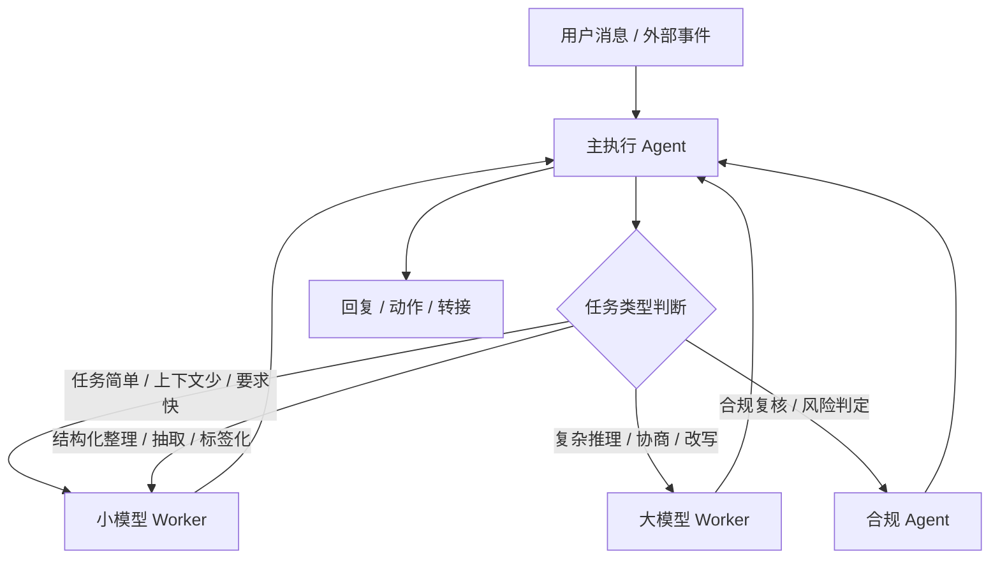

### 4.1 Sage 框架里如何做模型分发

模型分发分为三层：

1. **路由层**：由主执行 Agent 判断当前任务属于哪一类。
2. **编排层**：根据任务类型选择对应模型配置、提示词和工具集。
3. **约束层**：对输出做格式、合规、置信度和事实一致性检查。

也就是说，Sage 不是简单“切换一个 model name”，而是切换整套执行策略：

- 小模型可以拿到更短上下文、更强结构化约束、更少工具
- 大模型可以拿到更完整上下文、更高自由度、更复杂工具链
- 合规 Agent 可以对两者的结果做统一复核

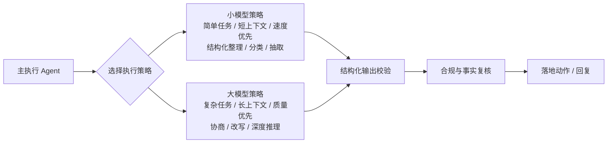

### 4.2 为什么这种分发方式更适合催收

催收场景天然是分层的：

- 大量消息是标准问答、状态查询、简单提醒
- 少量消息是复杂协商、争议、投诉、升级

所以最优策略不是“所有事情都用最强模型”，而是：

- **简单任务用小模型**
- **上下文少的任务用小模型**
- **对速度有要求的任务用小模型**
- **结构化整理、分类、抽取优先用小模型**
- **复杂协商、长上下文推理、需要高质量表达的任务再用大模型**
- **主执行 Agent 负责统一收口**

这样做的直接收益是：

1. **成本更可控**：高频任务不浪费强模型资源。
2. **速度更稳定**：简单任务更快返回。
3. **质量更可控**：复杂任务再交给更强模型兜底。
4. **更容易治理**：所有结果都回到主执行 Agent 统一审查。

### 4.3 一个更贴近 Sage 的执行逻辑

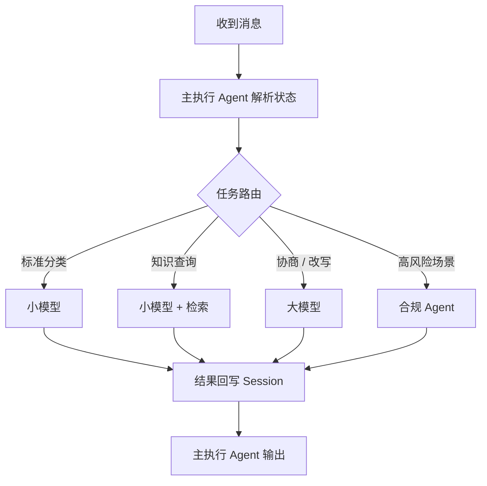

这让 Sage 的模型协同不是“并排堆模型”，而是“按任务精确分发”。

---

## 5. 越用越聪明

这个能力的核心不是“模型自己突然变聪明”，而是我们把系统设计成一个会持续学习的闭环。

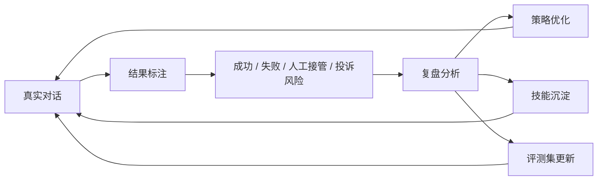

### 5.1 专门的复盘 Agent

“**对话复盘 Agent**”专门分析成功与失败对话：

- 为什么这次成功了？
- 是话术起作用，还是时机合适？
- 哪句话触发了对方配合？
- 哪些回复导致了负面情绪？
- 哪类客户更容易升级给人工？

复盘 Agent 的输出不要只停留在“总结”，而要输出可执行结论：

- 可复用的对话模式
- 需要规避的表达方式
- 推荐升级条件
- 适合沉淀成 skill 的片段

### 5.2 让系统自动学习“成功路径”

当某些对话结果持续表现良好时，系统可以自动做三件事：

1. **抽取关键步骤**：识别对话中真正有效的那几个转折点。
2. **归纳可复用模板**：把成功表达方式沉淀为策略模板。
3. **加入回归评测**：之后每次改模型、改策略，都拿这些样本回测。

这样一来，“越用越聪明”就不是一句口号，而是一个持续闭环：

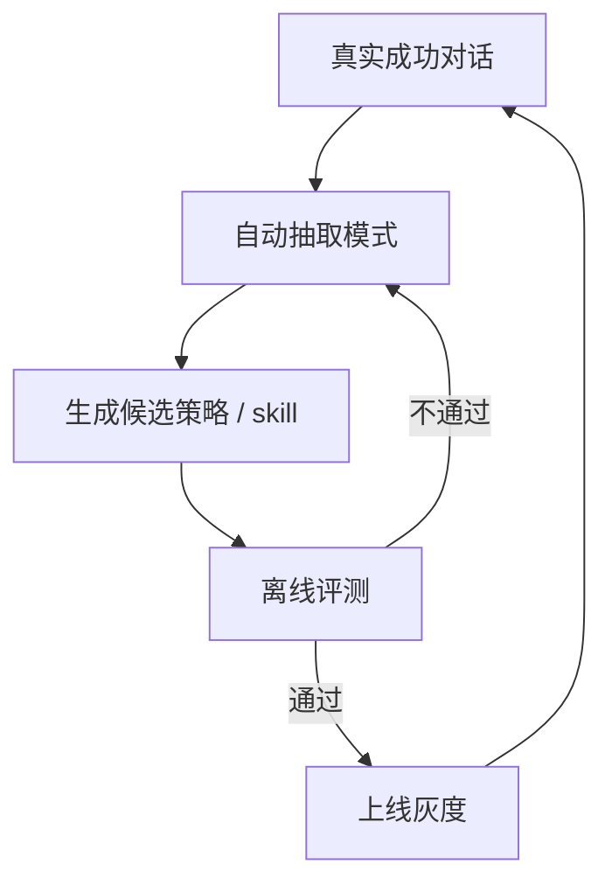

---

## 6. 经验到 AI 能力

这一部分的目标是把“人的经验”变成“机器可调用的能力资产”。

### 6.1 让 Agent 辅助人写 skill

我们可以让一个“**Skill Builder Agent**”帮助业务专家把经验写成结构化 skill：

- 业务人员只需要描述“什么情况下应该怎么做”
- Agent 自动整理成：
  - 触发条件
  - 推荐话术
  - 禁止话术
  - 适用人群
  - 升级条件
  - 示例对话

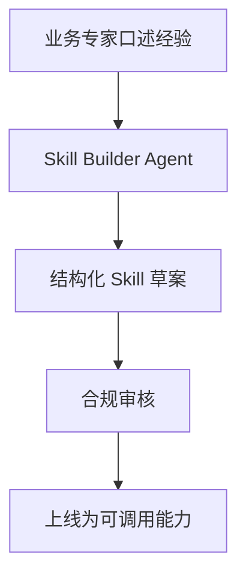

### 6.2 从成功对话蒸馏 skill

更进一步，可以从真实成功对话里自动蒸馏 skill：

1. 识别高转化片段
2. 找到关键上下文
3. 总结触发条件
4. 形成标准 skill
5. 加入技能库供后续 Agent 调用

这会带来一个明显变化：

- 过去是“经验散落在人脑里”
- 现在变成“经验沉淀在系统里”

### 6.3 经验资产化的好处

- 新人能更快上手
- 业务策略能持续复制
- 不同专员之间的能力差异被系统收敛
- 组织知识不会因为人员流动而丢失

---

## 7. 模型、Agent 如何保障合规与降低幻觉

催收场景最重要的一条不是“回答得像不像人”，而是“**说得对不对、能不能说、是否可追溯**”。

### 7.1 三道防线

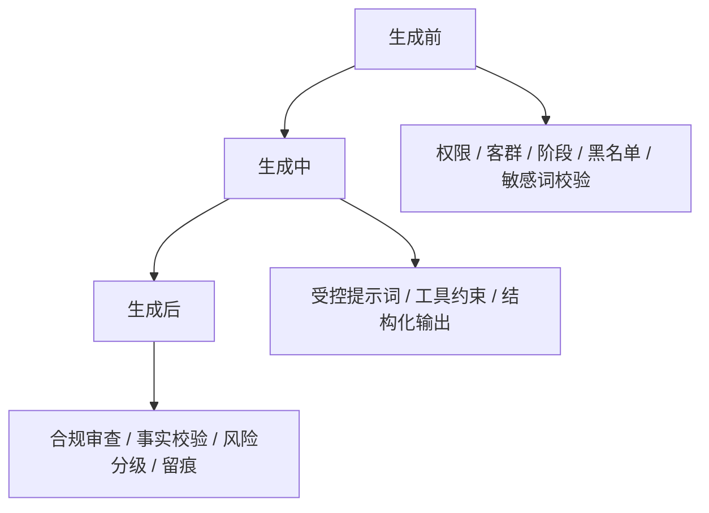

#### 防线一：生成前约束

- 识别客户是否允许自动触达
- 判断渠道是否合规
- 校验是否处于禁止话术阶段
- 判断是否必须转人工
- 检查客户标签，如投诉高风险、争议、司法相关等

#### 防线二：生成中约束

- 只允许模型在受控工具和模板中输出
- 强制结构化输出，避免自由发挥
- 给模型足够上下文，但不把不该说的信息喂进去
- 对关键回复加引用来源或依据

#### 防线三：生成后约束

- 合规 Agent 再审一遍
- 事实一致性校验
- 敏感措辞检测
- 不通过则自动改写、降级或转人工

### 7.2 降低幻觉的工程手段

#### 1. 检索增强

模型不直接“凭空回答”，而是优先从：

- 客户账务状态
- 历史对话
- 标准催收政策
- 业务知识库
- 合规规则库

里取证据，再生成回复。

#### 2. 结构化动作优先

能调用动作就不要只靠自然语言，例如：

- 创建工单
- 安排回访
- 标记风险
- 发起人工接管
- 更新还款承诺

这样能把“猜测”变成“操作”。

#### 3. 置信度门槛

对以下场景设置更高门槛：

- 客户明确争议账单
- 客户投诉倾向明显
- 客户要求提供政策依据
- 涉及金额、时间、身份等敏感事实

模型一旦置信度不足，直接进入：

- 追问澄清
- 检索补证
- 转人工

#### 4. 双模型交叉验证

在关键节点上，可让小模型和大模型并行判断：

- 一个负责“快判断”
- 一个负责“深判断”
- 结果不一致时，走保守路径

### 7.3 合规优先的回复原则

系统内置如下原则：

1. 不夸大后果。
2. 不做未经证实的承诺。
3. 不输出未经授权的个人信息。
4. 不使用强压式、羞辱式或误导式表达。
5. 不确定时先澄清，再继续。
6. 必要时直接转人工。

这会让客户感受到：系统不是“会说话”，而是“说得稳、说得准、说得可控”。

---

## 8. 人工协同与升级机制

催收场景里，Agent 的价值不是替代人，而是把人工从低价值动作中解放出来。

### 8.1 什么情况下必须转人工

- 客户明确投诉或表达强烈负面情绪
- 账务事实存在争议
- 客户要求特殊协商
- 触发高风险敏感规则
- 模型无法确认事实
- 多轮沟通仍无法达成下一步

### 8.2 转交给专员时要带什么

交接不是“把对话甩过去”，而是输出一份可直接接手的摘要：

- 当前客户状态
- 最近 3-5 轮关键对话
- 已尝试策略
- 当前风险标签
- 推荐下一步动作
- 注意事项与禁用表达

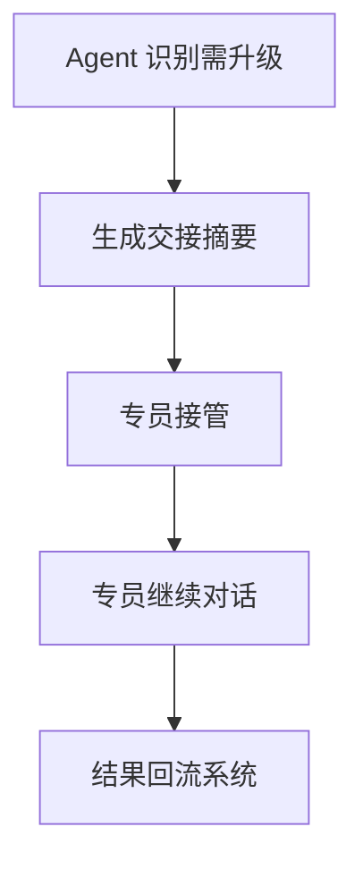

这样专员接手的不是“零散聊天记录”，而是一份可以直接执行的作战单。

---

## 9. 工具与 Skill 清单

这部分在售前讲解时需要明确说明，因为它最能体现“不是空谈 Agent，而是已经具备可执行能力”。

### 9.1 工具清单

工具层设计为标准动作集合，由主执行 Agent 按需调用：

- **IM 消息发送工具**：向客户发送标准消息、模板消息或个性化回复
- **专员转接工具**：把会话、摘要、风险标签、推荐动作一并移交人工
- **知识库查询工具**：查询催收政策、常见问题、标准话术、业务规则
- **客户信息查询工具**：读取客户基本信息、账务状态、历史触达、风险标签
- **对话记录查询工具**：拉取最近消息、互动轮次、是否已承诺还款
- **工单创建工具**：生成跟进工单、投诉工单、特殊协商工单
- **任务编排工具**：安排下一次回访、设置提醒、触发后续动作
- **风控校验工具**：在发送前做敏感词、黑名单、阶段限制校验
- **审计留痕工具**：记录模型输入、输出、决策原因、工具调用结果

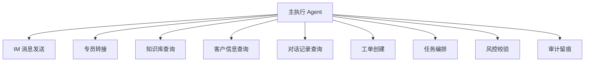

### 9.2 Skill 清单

Skill 更适合承载“经验型能力”，也就是一旦沉淀下来，后续可以被主执行 Agent 直接调用的业务套路。

至少包含以下几类：

- **催收话术 Skill**：不同阶段、不同客群、不同语气强度下的推荐表达
- **首触达 Skill**：首次联系客户时的标准开场、身份确认、意图引导
- **协商 Skill**：分期、缓缴、承诺还款、时间预约等协商策略
- **失联修复 Skill**：客户不回应、拒接、沉默时的追踪策略
- **投诉应对 Skill**：当客户情绪升级或提出异议时的应对方式
- **合规表达 Skill**：在不同地区、不同渠道、不同阶段的合规话术约束
- **转人工 Skill**：什么情况下转接、转接摘要怎么写、人工接手怎么交代
- **复盘提炼 Skill**：从成功案例中抽取关键表达和行动路径
- **知识问答 Skill**：账务说明、流程说明、政策说明、常见问题回答

### 9.3 Skill 的价值

Skill 的价值不在于“做了很多模板”，而在于它能把经验变成稳定能力：

1. **一致性更强**：不同专员、不同模型，最终都能遵循同一套策略。
2. **复制速度更快**：一个好经验可以快速扩散到全量对话。
3. **维护更简单**：调整某个 skill，不需要改整个对话系统。
4. **更利于沉淀资产**：客户项目不再只是交付系统，而是在交付能力库。

---

## 10. 对客户的核心价值表达

售前沟通时，价值总结为四句话：

1. **更快**：标准场景自动处理，首响更快，覆盖更广。
2. **更稳**：合规和风控前置，回复可控、可审计。
3. **更省**：小模型高频处理，大模型只做高价值推理。
4. **更强**：系统会从真实结果中持续学习，能力越跑越成熟。

---

## 11. 推荐落地路径

落地路径分三期：

### 第一期：可用

- 打通 IM / 站内信 / 邮件 等一个或两个主渠道
- 实现路由、自动回复、人工转交
- 建立基础合规规则和审计日志

### 第二期：好用

- 引入大小模型协同
- 引入复盘 Agent 和技能沉淀
- 提升对复杂协商和多轮对话的处理能力

### 第三期：会进化

- 从真实对话中蒸馏 skill
- 建立自动评测与灰度发布
- 把经验沉淀成组织资产

---

## 12. 结语

这套方案的本质，不是做一个“会聊天的机器人”，而是做一个 **可运行、可解释、可升级、可合规的催收智能体系统**。

对客户来说，它看到的不是单点 AI 能力，而是一套能持续扩张的业务基础设施：

- 入口能接
- 中台能控
- 策略能调
- 人工能接
- 经验能沉淀
- 风险能兜住

这就是售前阶段最容易打动客户的地方：**既厉害，又讲得通。**
