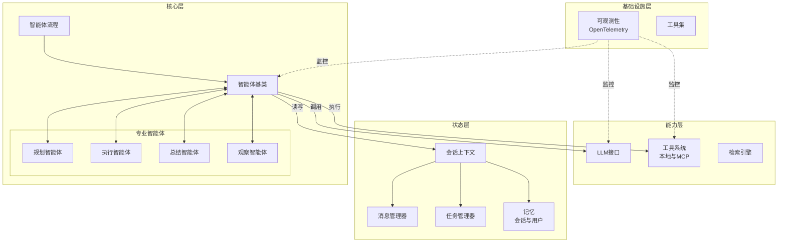

# SAgent 框架架构

SAgent 是一个模块化、可扩展且以可观测性为先的智能体（Agent）框架，专为构建复杂的多步骤智能体应用而设计。它采用分层架构，将业务逻辑、状态管理和基础设施能力进行了清晰的分离。

## 架构概览



该框架构建在四个主要层级之上：

1.  **核心层 (`agent/`)**：实现智能体的核心业务逻辑。
2.  **状态层 (`context/`)**：管理会话、任务、记忆和消息的生命周期。充当智能体协作的“黑板（Blackboard）”。
3.  **能力层 (`tool/`, `llm/`, `retrieve_engine/`)**：提供工具执行、LLM 推理和 RAG（检索增强生成）等基础能力。
4.  **基础设施层 (`observability/`, `utils/`)**：通过可观测性、日志记录和通用工具确保系统的可靠性。

## 目录结构

```text
sagents/
├── agent/              # 智能体实现
│   ├── agent_base.py   # 所有智能体的基类
│   └── ...             # 专用智能体
├── context/            # 状态管理（系统的"大脑"）
│   ├── session_context.py # 核心会话上下文对象
│   ├── messages/       # 消息历史管理
│   ├── tasks/          # 任务生命周期管理
│   ├── session_memory/ # 短期会话记忆
│   └── user_memory/    # 长期用户记忆
├── tool/               # 工具生态系统
│   ├── tool_manager.py # 工具注册与发现
│   └── mcp_proxy.py    # Model Context Protocol (MCP) 支持
├── llm/                # LLM 抽象层
├── observability/      # OpenTelemetry 集成与追踪
├── retrieve_engine/    # RAG (检索增强生成) 引擎
└── utils/              # 通用工具
```

## 核心模块

### 1. Agent 核心 (`agent/`)
`agent` 模块定义了智能体的行为模式。
- **`AgentBase`**：所有智能体继承的抽象基类，标准化了 `run_stream` 接口。
- **`AgentFlow`**：编排多个智能体之间的执行流（例如：规划 -> 执行 -> 总结）。
- **专用智能体**：包含 `TaskPlanningAgent`（任务规划）、`TaskExecutorAgent`（任务执行）、`SimpleAgent`（简单对话）等，每个智能体专注于特定的认知任务。

### 2. 上下文管理 (`context/`)
`context` 模块实现了 **黑板模式（Blackboard Pattern）**，允许不同智能体共享状态而无需直接耦合。
- **`SessionContext`**：持有用户会话所有状态的根对象。
- **`MessageManager`**：处理聊天记录，包括 Token 预算和上下文窗口管理。
- **`TaskManager`**：追踪复杂任务的状态（待处理、进行中、已完成）。

### 3. 工具系统 (`tool/`)
- **`ToolManager`**：管理本地工具的生命周期。
- **MCP 支持**：通过 `mcp_proxy.py` 原生支持 **Model Context Protocol (MCP)**，能够连接外部标准化的工具服务。

### 4. 可观测性 (`observability/`)
对 **OpenTelemetry** 提供一等公民级别的支持。
- **`AgentRuntime`**：一个运行时包装器，自动为智能体注入追踪（Tracing）能力。
- **全链路追踪**：每一次 LLM 调用、工具执行和智能体步骤都会被追踪，便于调试和性能监控。

## 关键设计原则

- **关注点分离**：逻辑、状态和能力被严格解耦。
- **可观测性优先**：追踪（Tracing）是内置的，而非事后添加的。
- **状态中心化**：智能体是无状态的处理器；状态存储在 `SessionContext` 中。
- **协议驱动**：使用标准协议（如 MCP）以增强可扩展性。
