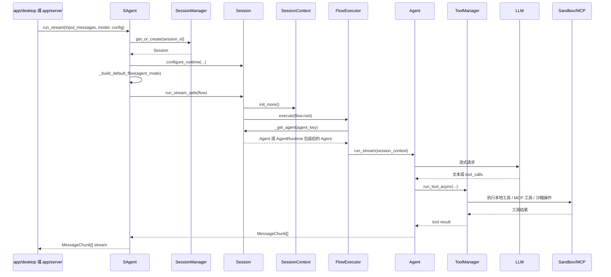

# sagents 核心编排层学习指南

`sagents/` 是 Sage 的核心运行时与编排层。它负责把一次用户请求组织成完整的 Agent 执行过程：创建或复用会话、初始化上下文、选择默认 Flow、调度不同 Agent、管理工具与技能、维护沙箱、处理消息历史，并把执行过程以流式消息返回给上层应用。

如果把 Sage 看成一个产品，`app/desktop/`、`app/server/` 更接近应用入口和 UI/API 层；`sagents/` 则是“引擎室”。你学习这一层，重点不是先记住每个文件，而是理解它如何把这些概念接起来：

- `SAgent`：对外入口。
- `Session`：一次会话的运行时容器。
- `SessionContext`：会话共享状态黑板。
- `AgentFlow`：描述执行顺序的流程图。
- `AgentBase` 和各类 Agent：真正和 LLM、工具交互的执行单元。
- `ToolManager` / `SkillManager`：能力系统。
- `Sandbox`：工具执行和文件操作的边界。
- `Observability`：追踪 Agent、工具和模型调用。

## 一句话架构

```text
SAgent.run_stream()
  -> SessionManager 创建/复用 Session
  -> Session 初始化 SessionContext
  -> SAgent 构造 AgentFlow
  -> FlowExecutor 按流程调度 Agent
  -> Agent 调用 LLM 与 ToolManager
  -> ToolManager 通过 Sandbox/MCP/本地工具执行能力
  -> MessageChunk 流式返回给 UI/API
```

## 目录结构

当前 `sagents/` 的核心目录可以按职责分成几层：

```text
sagents/
├── sagents.py                # SAgent 对外入口，run_stream 和默认 Flow 构建
├── session_runtime.py        # Session / SessionManager，会话生命周期和 Agent 注册表
├── session_registry.py       # session 与 workspace 等持久化索引
├── flow/                     # 声明式流程系统：schema、executor、conditions
├── agent/                    # 各类 Agent 实现：simple、multi、fibre、team 等
├── context/                  # SessionContext、消息、记忆、工作流模板
├── tool/                     # 本地工具、MCP 工具、ToolManager、ToolProxy
├── skill/                    # SkillManager、SkillProxy、沙箱技能管理
├── llm/                      # OpenAI 兼容客户端、模型能力、embedding
├── prompts/                  # 各类 Agent 和工具生成相关 prompt
├── observability/            # OpenTelemetry / Prometheus / AgentRuntime
├── retrieve_engine/          # RAG 相关抽象与实现
└── utils/                    # 沙箱、日志、文件解析、序列化、流式解析等基础工具
```

需要注意：旧文档里可能提到 `context/tasks/` 或独立 `TaskManager`，但当前代码树里没有这一层。任务进度更多是通过 `SessionContext.audit_status`、`todo_tool`、multi-agent 的 planning 结构，以及工具调用结果来维护。

## 核心调用链

一次典型运行从 `SAgent.run_stream()` 开始。它不是直接调用模型，而是先搭建运行时环境，再交给 Flow 调度。


```mermaid
sequenceDiagram
    participant App as app/desktop 或 app/server
    participant SAgent
    participant SM as SessionManager
    participant S as Session
    participant SC as SessionContext
    participant FE as FlowExecutor
    participant A as Agent
    participant TM as ToolManager
    participant LLM
    participant SB as Sandbox/MCP

    App->>SAgent: run_stream(input_messages, model, config)
    SAgent->>SM: get_or_create(session_id)
    SM-->>SAgent: Session
    SAgent->>S: configure_runtime(...)
    SAgent->>SAgent: _build_default_flow(agent_mode)
    SAgent->>S: run_stream_safe(flow)
    S->>SC: init_more()
    S->>FE: execute(flow.root)
    FE->>S: _get_agent(agent_key)
    S-->>FE: Agent 或 AgentRuntime 包装后的 Agent
    FE->>A: run_stream(session_context)
    A->>LLM: 流式请求
    LLM-->>A: 文本或 tool_calls
    A->>TM: run_tool_async(...)
    TM->>SB: 执行本地工具 / MCP 工具 / 沙箱操作
    SB-->>TM: 工具结果
    TM-->>A: tool result
    A-->>SAgent: MessageChunk[]
    SAgent-->>App: MessageChunk[] stream
```

这条链路里最重要的分工是：

- `SAgent` 负责“把一局跑起来”。
- `Session` 负责“这局运行中的生命周期和 Agent 注册表”。
- `SessionContext` 负责“这局的共享状态”。
- `FlowExecutor` 负责“下一步该跑哪个 Agent”。
- `Agent` 负责“怎么向 LLM 提问、怎么处理工具调用”。
- `ToolManager` 负责“工具怎么注册、怎么转 schema、怎么执行”。

## 入口：`SAgent`

文件：`sagents/sagents.py`

`SAgent` 是最重要的对外入口。上层应用通常不直接 new 各类 Agent，而是通过：

```python
from sagents import SAgent

agent = SAgent(session_root_space="...")

async for chunks in agent.run_stream(
    input_messages=[{"role": "user", "content": "你好"}],
    model=model_client,
    model_config=model_config,
    system_prefix="...",
    tool_manager=tool_manager,
    skill_manager=skill_manager,
    session_id="...",
    agent_mode="simple",
    max_loop_count=100,
):
    ...
```

`run_stream()` 的主要职责：

1. 校验 `model`、`model_config`、`system_prefix`、`max_loop_count` 等必要参数。
2. 准备 `ToolManager`、`SkillManager`、沙箱配置、工作空间配置。
3. 从全局 `SessionManager` 获取或创建 `Session`。
4. 把本轮运行参数写入 `Session`。
5. 构建默认 `AgentFlow`，或使用调用方传入的 `custom_flow`。
6. 调用 `Session.run_stream_safe()` 执行。
7. 在出口处隐藏部分协议性内部工具流，比如 `turn_status` 之类不应展示给用户的工具调用。

`SAgent._build_default_flow()` 是理解默认编排的关键。`agent_mode` 不同，默认流程不同。

## 会话：`Session` 与 `SessionManager`

文件：`sagents/session_runtime.py`

`SessionManager` 是会话管理器。它维护 live session，负责创建、复用、关闭会话。`SAgent` 初始化时会通过 `get_global_session_manager()` 拿到全局 manager。

`Session` 是一次会话的运行时容器，保存：

- `session_id`
- `session_context`
- 当前状态：`IDLE`、`RUNNING`、`INTERRUPTED`、`COMPLETED`、`ERROR`
- LLM 客户端和模型配置
- system prompt
- sandbox 配置
- Agent 实例缓存
- agent key 到 Agent class 的注册表
- observability manager
- 中断事件和子会话列表

`Session` 中有一个重要注册表：

```text
"simple" -> SimpleAgent
"task_analysis" -> TaskAnalysisAgent
"task_planning" -> TaskPlanningAgent
"task_executor" -> TaskExecutorAgent
"task_observation" -> TaskObservationAgent
"task_completion_judge" -> TaskCompletionJudgeAgent
"task_summary" -> TaskSummaryAgent
"tool_suggestion" -> ToolSuggestionAgent
"memory_recall" -> MemoryRecallAgent
"plan" -> PlanAgent
"self_check" -> SelfCheckAgent
"fibre" -> FibreAgent
"team" -> TeamAgent
```

Flow 里写的是 `agent_key`，真正实例化哪个类由 `Session._get_agent()` 决定。

## 状态黑板：`SessionContext`

文件：`sagents/context/session_context.py`

`SessionContext` 是理解 Sage 运行时的第二个核心。Agent 本身尽量不持久保存业务状态，状态集中放在 `SessionContext` 里。它像一个黑板，不同 Agent 在上面读写消息、任务状态、系统上下文、技能视图和沙箱句柄。

它保存的关键内容包括：

- `session_id`、`user_id`、`agent_id`
- `system_context`
- `external_paths`
- `message_manager`
- `session_memory`
- `tool_manager`
- `skill_manager`
- `sandbox_skill_manager`
- `sandbox`
- `audit_status`
- `available_workflows`
- 会话持久化路径和工作空间路径

`init_more()` 是初始化顺序的核心：

1. 判断沙箱模式：`local`、`remote`、`passthrough`。
2. 解析 `session_workspace` 和 `sandbox_agent_workspace`。
3. 处理外部路径和系统上下文。
4. 初始化沙箱和文件系统。
5. 准备 workspace 引导文件。
6. 注册和准备技能。
7. 最终化系统上下文。
8. 加载已持久化的消息。
9. 清理过期待办任务。

这里要特别注意 `system_context`。它不是 system prompt，而是一组结构化背景数据。例如外部路径、业务配置、用户偏好、预设上下文等。Agent、工具、技能都可能使用它。

## Flow：声明式编排系统

文件：

- `sagents/flow/schema.py`
- `sagents/flow/executor.py`
- `sagents/flow/conditions.py`

Flow 是 Sage 的“调度图”。它描述“先跑谁、后跑谁、什么时候循环、什么时候分支”，但它不直接调用 LLM。

`schema.py` 定义了几种节点：

```text
AgentNode      执行单个 Agent
SequenceNode   顺序执行多个节点
ParallelNode   并行执行多个分支
LoopNode       按条件循环执行
IfNode         条件分支
SwitchNode     根据变量多路选择，例如 agent_mode
AgentFlow      顶层流程对象
```

`executor.py` 递归执行这些节点。执行到 `AgentNode` 时，它会让 `Session` 按 `agent_key` 找到对应 Agent，然后调用 Agent 的 `run_stream()`。

`conditions.py` 注册条件判断函数，例如：

- `is_deep_thinking`
- `enable_more_suggest`
- `enable_plan`
- `plan_should_start_execution`
- `self_check_should_retry`
- `need_summary`
- `task_not_completed`
- `always_true`
- `always_false`

如果条件名没有注册，`ConditionRegistry.check()` 会返回 `False` 并记录 warning。这一点很容易导致某些分支被静默跳过。

## 默认运行模式

`agent_mode` 决定默认 Flow。当前主要模式是：

| 模式 | 适用场景 | 典型行为 |
| --- | --- | --- |
| `simple` | 普通对话、单 Agent 工具调用 | 以 `SimpleAgent` 为主，配合工具建议、记忆召回、自检、总结 |
| `multi` | 多步骤任务，需要规划、执行、观察、判断 | 通过 planning/executor/observation/judge 循环推进 |
| `fibre` | 动态多 Agent 委派 | `FibreAgent` 可 spawn 子 Agent 并委派任务 |
| `team` | 团队式多 Agent 协作 | `TeamAgent` 使用 team orchestrator 组织角色 |

默认 `simple` 模式大致包含：

```text
可选 task_analysis
-> tool_suggestion + memory_recall
-> 可选 plan
-> simple 主执行
-> self_check
-> 必要时 retry
-> 可选 task_summary
-> 可选 query_suggest
```

`multi` 模式更偏传统“规划-执行-观察-判断”的循环：

```text
memory_recall
-> loop:
     task_planning
     tool_suggestion
     task_executor
     task_observation
     task_completion_judge
-> task_summary
```

`fibre` 和 `team` 则把核心执行 Agent 换成更复杂的 orchestrator。

## Agent 层

目录：`sagents/agent/`

`AgentBase` 是所有 Agent 的基类，文件是 `sagents/agent/agent_base.py`。它提供通用能力：

- 标准 `run_stream(session_context)` 接口。
- 消息清理和 OpenAI tool call 兼容处理。
- 多模态图片处理。
- LLM 流式调用。
- 工具调用解析和执行。
- token 和上下文预算相关处理。
- 错误处理与部分流消费异常处理。

不同 Agent 负责不同认知阶段：

- `SimpleAgent`：默认单 Agent 主循环。
- `TaskAnalysisAgent`：深度思考/任务分析。
- `ToolSuggestionAgent`：根据当前任务推荐工具。
- `MemoryRecallAgent`：召回相关记忆。
- `PlanAgent`：可选规划阶段。
- `SelfCheckAgent`：自检与重试判断。
- `TaskPlanningAgent`：multi 模式规划。
- `TaskExecutorAgent`：multi 模式执行。
- `TaskObservationAgent`：multi 模式观察。
- `TaskCompletionJudgeAgent`：multi 模式完成判断。
- `TaskSummaryAgent`：总结。
- `QuerySuggestAgent`：后续问题建议。
- `FibreAgent`：动态多 Agent 编排。
- `TeamAgent`：团队式编排。

学习时建议先读 `SimpleAgent`，再读 `AgentBase` 中的 LLM/tool 调用辅助方法。不要一开始就钻进 fibre/team，它们更复杂。

## 工具系统

目录：`sagents/tool/`

工具是 Agent 能实际执行的能力。工具可以来自：

- Sage 内置工具，例如文件读写、命令执行、todo、记忆搜索、网页获取等。
- MCP 工具，即外部 MCP Server 暴露的工具。
- 代理/白名单工具集，例如 `ToolProxy`。

关键文件：

- `tool_manager.py`：工具注册、schema 转换、MCP 连接、工具执行、结果截断。
- `tool_base.py`：内置工具基类和发现机制。
- `mcp_tool_base.py`：MCP 工具抽象。
- `tool_proxy.py`：限制可用工具范围。
- `impl/`：内置工具实现。

Agent 不应该直接调用外部服务。它通常产生 tool call，由 `ToolManager` 统一执行。这样工具权限、结果截断、MCP 连接、沙箱边界都可以集中管理。

## Skill 系统

目录：`sagents/skill/`

Skill 和 Tool 不同：

```text
Tool = 能做什么
Skill = 什么时候做、按什么步骤做、注意什么
```

Skill 通常是 `SKILL.md` 加辅助文件，给 Agent 提供领域流程、操作手册、约束和示例。`SkillManager` 负责发现宿主机上的技能；`SandboxSkillManager` 负责沙箱工作区内的技能副本。

`SessionContext.effective_skill_manager` 会优先使用沙箱中已经准备好的技能视图；如果沙箱技能为空，则回退宿主机 `SkillManager` 或 `SkillProxy`。

## 沙箱系统

目录：`sagents/utils/sandbox/`

沙箱是 Sage 控制文件、命令、代码执行边界的关键抽象。`SessionContext.init_more()` 会根据 `SAGE_SANDBOX_MODE` 或运行参数初始化沙箱。

支持的主要模式：

| 模式 | 含义 |
| --- | --- |
| `local` | 本地沙箱，使用本地环境和隔离策略 |
| `remote` | 远程沙箱，如 OpenSandbox、Kubernetes、Firecracker |
| `passthrough` | 直通模式，基本直接使用宿主环境 |

重要文件：

- `utils/sandbox/interface.py`：沙箱接口。
- `utils/sandbox/factory.py`：根据配置创建具体沙箱。
- `utils/sandbox/config.py`：沙箱配置和卷挂载。
- `utils/sandbox/providers/`：各类沙箱实现。

对 Agent 来说，沙箱不应该是一个被直接关心的细节。Agent 通过工具执行，工具通过 `SessionContext.sandbox` 操作文件和命令。

## 记忆与消息

相关目录：

- `sagents/context/messages/`
- `sagents/context/session_memory/`
- `sagents/context/user_memory/`
- `sagents/tool/impl/compress_history_tool.py`

这几类概念要分清：

| 概念 | 作用 |
| --- | --- |
| `MessageManager` | 当前会话消息 ledger、推理视图、上下文预算、压缩锚点和 token 控制 |
| `session_memory` | 会话内记忆检索和持久化 |
| `user_memory` | 跨会话用户记忆和偏好 |
| `MemoryRecallAgent` | Flow 中的召回 Agent，常和 `search_memory` 工具相关 |

也就是说，`memory_recall` 不是整个记忆系统本身，它只是默认 Flow 中的一个 Agent 阶段。

### 新版上下文压缩策略

当前压缩策略的核心目标是：**保留完整原始消息账本，同时为每次 LLM 请求构造一个更短、更安全的推理视图**。因此要区分两条线：

```text
self.messages          原始 ledger，尽量保存完整会话事实
inference_messages     最近一次发给 LLM 前构造出的视图快照
compact_manifest       从压缩锚点派生的调试/审计索引
active_start_index     最近一次成功压缩锚点位置，仅供 memory 检索划界
```

#### 1. 原始 ledger 不再等同于 LLM 上下文

`MessageManager.messages` 是会话事实源，保存用户消息、助手消息、工具调用、工具结果和压缩工具结果。新版策略不会简单按 `active_start_index` 把旧消息硬截断后发给模型，而是通过 `MessageManager.build_inference_view(...)` 构造推理视图。

这意味着：

- 持久化和审计应看 `self.messages`。
- 发给 LLM 的内容应看 `build_inference_view(...)` 或 `inference_messages`。
- 不要把 `active_start_index` 理解成“LLM 上下文从这里开始”。

#### 2. 压缩锚点是显式消息对

上下文过长时，`AgentBase._prepare_context_messages_for_llm(...)` 会选择一段可压缩历史，自动生成一对内部消息：

```text
assistant tool_call: compress_conversation_history
tool result: 压缩后的结构化摘要
```

这对消息带有 metadata，例如：

- `tool_name = "compress_conversation_history"`
- `compression_anchor = true`
- `source_message_ids`
- `source_start_message_id`
- `source_end_message_id`
- `source_message_count`

`MessageManager` 通过这些压缩锚点计算 coverage graph：被成功摘要覆盖的旧消息会从 inference view 中隐藏，但原始 ledger 仍保留。

#### 3. inference view 会隐藏已覆盖历史

`MessageManager.build_inference_view(...)` 大致做三件事：

1. 过滤不应进入推理的消息类型，例如 reasoning content。
2. 根据成功的 `compress_conversation_history` anchor，隐藏已被摘要覆盖的旧消息。
3. 对超长 assistant/tool 内容做规则级 artifact offload，只在推理视图中替换为文件引用。

这里的 artifact offload 不会改写原始 ledger。它只是把过长内容写到：

```text
.sage/context/artifacts/<session_id>/<message_id>.txt
```

然后在 inference view 中放一个引用说明，减少上下文 token。

#### 4. `active_start_index` 语义已经变了

旧理解里，`active_start_index` 更像“活跃上下文的起点”。新版里它由最近一次成功压缩锚点推导出来，主要供 memory / RAG 检索划分历史范围，不再负责 LLM 上下文硬截断。

因此读代码时要注意：

```text
prepare_history_split(...)
  -> 计算 budget_info
  -> 刷新 compression anchor
  -> 更新 active_start_index
```

但真正发给模型前，还会重新经过 `build_inference_view(...)` 和 `AgentBase._prepare_context_messages_for_llm(...)`。

#### 5. 压缩由 AgentBase 统一触发

`SimpleAgent` 会先从 `MessageManager.extract_all_context_messages(...)` 拿上下文，再进入 `AgentBase._prepare_messages_for_llm(...)` / `_prepare_context_messages_for_llm(...)`。后者负责：

- 构造 inference view。
- 估算 token 数。
- 超过 `max_model_len * 0.85` 时选择可压缩历史段。
- 调用 `CompressHistoryTool` 生成结构化摘要。
- 把成功的压缩锚点插回 message ledger。
- 最终再把压缩后的 inference view 传给 LLM。

这个设计把“是否需要压缩、压缩哪一段、压缩后怎么隐藏旧消息”的逻辑集中到 `AgentBase` + `MessageManager`，而不是散落在各个 Agent 里。

#### 6. 读代码时优先看这些函数

如果要理解压缩策略，建议按顺序读：

1. `MessageManager.build_inference_view(...)`
2. `MessageManager._expanded_compression_pairs(...)`
3. `MessageManager.select_llm_compression_segment(...)`
4. `MessageManager._apply_rule_artifact_offload(...)`
5. `AgentBase._prepare_context_messages_for_llm(...)`
6. `AgentBase._compress_messages_with_tool(...)`
7. `CompressHistoryTool.compress_conversation_history(...)`

这条链路读完后，再回头看 `SimpleAgent.run_stream(...)` 会更清楚。

## 可观测性

目录：`sagents/observability/`

Sage 把观测作为运行时的一部分，而不是外部补丁。核心组件包括：

- `ObservabilityManager`
- `AgentRuntime`
- `OpenTelemetryTraceHandler`
- `PrometheusTraceHandler`
- `ObservableAsyncOpenAI`

当观测开启时，`Session._get_agent()` 可能会用 `AgentRuntime` 包装 Agent，使 Agent 执行、工具调用和 LLM 请求进入 tracing 链路。`FibreAgent` / `TeamAgent` 这类复杂 Agent 有额外处理，避免双重包装。

## LLM 层

目录：`sagents/llm/`

LLM 层提供 OpenAI 兼容客户端和模型能力判断。常见职责：

- 统一 OpenAI 兼容模型调用。
- 判断模型是否支持 reasoning effort。
- 处理 embedding。
- 包装可观测 LLM 客户端。

真正的 LLM 请求通常由 `AgentBase` 发起，但它会借助 `llm/` 和 `utils/llm_request_utils.py` 中的兼容逻辑。

## RAG 与文件解析

目录：

- `sagents/retrieve_engine/`
- `sagents/utils/file_parser/`

`retrieve_engine/` 是检索增强生成的基础设施，包含文本切分、向量库接口、embedding 接口和后处理。它相对独立，不是每次普通 Agent 运行都会走完整 RAG 链路。

`utils/file_parser/` 提供 PDF、DOCX、PPTX、Excel、HTML、EML、纯文本等文件解析能力，供工具或上层能力复用。

## 推荐阅读顺序

如果你想认真学习这块，建议按这个顺序读：

1. `sagents/sagents.py`
   理解 `SAgent.run_stream()` 和 `_build_default_flow()`。

2. `sagents/session_runtime.py`
   理解 `Session`、`SessionManager`、Agent 注册表、会话状态。

3. `sagents/context/session_context.py`
   理解状态黑板、沙箱初始化、技能准备、消息持久化。

4. `sagents/flow/schema.py`
   理解 Flow 的节点类型。

5. `sagents/flow/executor.py`
   理解 Flow 是如何递归执行的。

6. `sagents/flow/conditions.py`
   理解循环和分支判断来自哪里。

7. `sagents/agent/simple_agent.py`
   理解默认单 Agent 模式。

8. `sagents/agent/agent_base.py`
   理解 LLM 流式调用、tool call、消息清理，以及上下文压缩触发。

9. `sagents/tool/tool_manager.py`
   理解工具注册和执行。

10. `sagents/context/messages/message_manager.py`
    理解消息 ledger、inference view、compression anchor 和 compact manifest。

11. `sagents/tool/impl/compress_history_tool.py`
    理解压缩摘要的生成格式和 metadata。

12. `sagents/skill/skill_manager.py` 与 `sagents/skill/sandbox_skill_manager.py`
    理解技能如何被发现和同步到沙箱。

13. `sagents/utils/sandbox/`
    理解工具执行环境。

14. `sagents/agent/fibre/` 和 `sagents/agent/team/`
    最后再看高级多 Agent 编排。

## 常见误解

### 1. `sagents/` 不只是 agent 目录

`sagents/agent/` 只是 Agent 实现层。真正的核心编排还包括 `session_runtime.py`、`flow/`、`context/`、`tool/`、`skill/`、`utils/sandbox/`。

### 2. Flow 不是 Agent

Flow 描述执行顺序，Agent 执行具体认知和工具调用。`AgentFlow` 在 `sagents/flow/schema.py`，不是 `sagents/agent/`。

### 3. Agent 尽量无状态

Agent 实例可以被缓存复用，但状态主要在 `SessionContext`。不要把会话状态藏在某个 Agent 实例字段里。

### 4. Skill 不是 Tool

Tool 是可执行动作。Skill 是指导 Agent 如何使用动作的说明书。MCP tool 接进来后，最好配套写 Skill，告诉 Agent 何时调用、怎么追问、如何确认。

### 5. `system_context` 不是 `system_prefix`

`system_prefix` 是系统提示词，定义 Agent 的角色、规则和行为风格。`system_context` 是结构化背景数据，比如外部路径、业务参数、用户偏好、预设上下文。

### 6. `deep_thinking` 参数已不是推荐入口

`SAgent.run_stream()` 里仍有 `deep_thinking` 参数，但注释说明它已过时。推荐通过消息中的控制标签 `<enable_deep_thinking>true/false</enable_deep_thinking>` 控制。

### 7. 条件名写错会导致分支不执行

Flow 里的条件依赖 `ConditionRegistry`。未注册条件默认返回 `False`，这可能导致流程分支跳过。

### 8. 沙箱路径和宿主机路径不是一回事

`session_root_space` 是宿主机上的会话根目录。`sandbox_agent_workspace` 是沙箱内 Agent 工作目录。remote 模式下尤其要注意二者区别。

### 9. 原始消息不等于推理上下文

`MessageManager.messages` 是完整 ledger；LLM 实际看到的是经过压缩锚点、规则 offload 和协议工具过滤后的 inference view。调试“模型为什么没看到某段历史”时，不要只看 `messages.json`，还要看 `inference_messages`、压缩锚点 metadata 和 compact manifest。

## 修改和扩展建议

### 新增一个 Agent

通常需要：

1. 在 `sagents/agent/` 下实现新类，继承 `AgentBase`。
2. 实现 `run_stream(session_context)`。
3. 在 `Session._agent_registry` 注册 `agent_key -> AgentClass`。
4. 在默认 Flow 或自定义 Flow 中添加 `AgentNode(agent_key="...")`。
5. 如果需要 prompt，在 `sagents/prompts/` 中补充模板。

### 新增一个内置 Tool

通常需要：

1. 在 `sagents/tool/impl/` 下实现工具。
2. 定义工具名称、描述、参数 schema 和执行逻辑。
3. 确保工具能被发现或注册到 `ToolManager`。
4. 如果是危险能力，考虑权限、沙箱和前端展示。

### 接入 MCP Tool

通常不需要改 `sagents/` 核心。你需要：

1. 启动 MCP Server。
2. 在 Sage 的 MCP 配置里登记它。
3. `ToolManager` 通过 MCP 发现工具。
4. 给 Agent 勾选这些工具。
5. 为这组工具写配套 Skill。

### 新增一种 Flow

可以：

1. 用 `AgentNode`、`SequenceNode`、`ParallelNode`、`LoopNode` 等拼一个 `AgentFlow`。
2. 作为 `custom_flow` 传给 `SAgent.run_stream()`。
3. 或者改 `_build_default_flow()`，让某个 `agent_mode` 使用新流程。
4. 如果需要条件分支，在 `ConditionRegistry` 注册新条件。

## 学习路线图

第一阶段：跑通主链路。

- 看 `SAgent.run_stream()`。
- 看 `Session.run_stream_safe()` 和 `run_stream_with_flow()`。
- 看 `FlowExecutor.execute()`。
- 看 `SimpleAgent.run_stream()`。

第二阶段：理解状态。

- 看 `SessionContext.__init__()`。
- 看 `SessionContext.init_more()`。
- 看 `MessageManager`。
- 看 `build_inference_view`、`select_llm_compression_segment` 和 `compact_manifest`。
- 看 `audit_status` 是如何被不同 Agent 读写的。

第三阶段：理解能力系统。

- 看 `ToolManager`。
- 看几个简单内置工具。
- 看 MCP 连接相关代码。
- 看 SkillManager 和 SandboxSkillManager。

第四阶段：理解高级编排。

- 看 `multi` 默认 flow。
- 看 task planning/executor/observation/judge。
- 看 fibre/team orchestrator。

第五阶段：尝试扩展。

- 新增一个简单工具。
- 写一个 Skill。
- 写一个 custom Flow。
- 给一个 Agent 增加自定义上下文和工具白名单。

## 总结

`sagents/` 是 Sage 的核心编排层，但它不是单一“Agent 类集合”。它更像一个运行时系统：入口层负责接收请求，会话层负责生命周期，上下文层负责状态，Flow 层负责调度，Agent 层负责认知执行，工具和技能层负责扩展能力，沙箱和可观测性负责可靠运行。

学习这块时，建议始终带着一个问题看代码：一次 `run_stream()` 从用户输入到最终流式输出，中间经过了哪些对象，每个对象只负责哪一件事。把这条主线理清后，再看 fibre、team、RAG、sandbox、observability 这些高级部分会容易很多。
