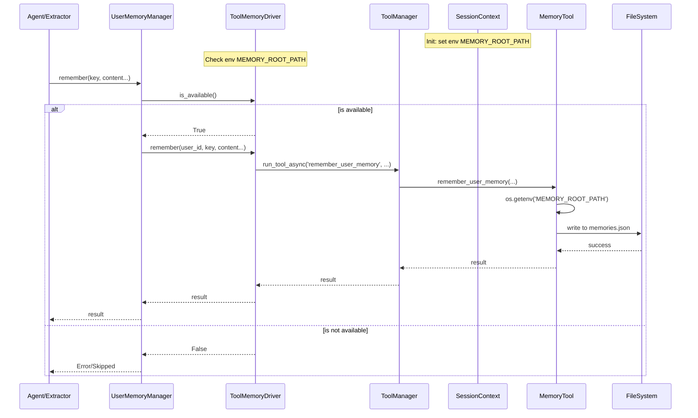

# 用户记忆管理系统

这是 Reagent 框架的用户记忆管理模块，提供跨会话的用户个人记忆存储、检索和管理功能。

## 功能特性

- 🧠 **智能记忆管理**：支持偏好、经验、上下文等多种记忆类型
- 🔍 **智能搜索**：根据关键词和类型快速检索相关记忆
- 💾 **多种存储后端**：
    - **本地文件**：轻量级 JSON 存储
    - **向量数据库**：基于 Embedding 的语义检索（支持 Chroma, Milvus 等，需适配 VectorStore 接口）
    - **MCP 工具**：通过 MCP 协议集成的外部记忆服务
- 🛠️ **工具化接口**：提供大模型可调用的记忆工具
- 📊 **统计分析**：记忆使用统计和分析功能
- 🔒 **数据安全**：支持备份和恢复功能

## 架构说明

模块采用分层架构设计：

```
sagents/context/user_memory/
├── __init__.py          # 统一导出模块
├── manager.py           # UserMemoryManager：核心业务逻辑
├── interfaces.py        # IMemoryDriver：驱动接口定义
├── schemas.py           # MemoryEntry, MemoryType：数据模型
├── extractor.py         # MemoryExtractor：记忆提取服务
└── drivers/             # 存储后端实现
    ├── tool.py          # ToolMemoryDriver：本地文件/MCP工具驱动
    └── vector.py        # VectorMemoryDriver：向量数据库驱动
```

## 调用链路

系统中的记忆调用链路如下，以 `ToolMemoryDriver` 为例：

1.  **环境配置 (SessionContext)**：
    *   `SessionContext` 在初始化时，如果提供了 `memory_root`，会自动设置 `MEMORY_ROOT_PATH` 环境变量。

2.  **可用性检查 (ToolMemoryDriver)**：
    *   `ToolMemoryDriver.is_available()` 检查 `MEMORY_ROOT_PATH` 是否设置。
    *   如果没有设置，记忆功能标记为不可用，后续调用将被跳过。

3.  **业务触发**：
    *   **Agent** (通过 `manage_core_memory` 工具) 或 **MemoryExtractor** (后台任务) 发起记忆操作请求。

4.  **管理层 (UserMemoryManager)**：
    *   接收请求，调用 `driver.is_available()` 确认功能状态。
    *   若可用，调用 Driver 的 `remember` / `recall` / `forget` 方法。

5.  **驱动层 (ToolMemoryDriver)**：
    *   将业务请求转换为标准的 Tool 调用参数。
    *   通过 `ToolManager.run_tool_async` 调用底层工具。

6.  **工具层 (MemoryTool)**：
    *   接收调用请求。
    *   通过 `os.getenv('MEMORY_ROOT_PATH')` 获取存储路径。
    *   执行实际的文件读写操作（如读写 `memories.json`）。



## 快速开始

### 基础使用

```python
from sagents.context.user_memory import UserMemoryManager, MemoryType

# 1. 自动使用 ToolMemoryDriver (需配合 ToolManager)
# memory_manager = UserMemoryManager(user_id="eric_zz", tool_manager=tool_manager)

# 2. 或者注入自定义 Driver (例如向量存储)
# from sagents.context.user_memory import VectorMemoryDriver
# driver = VectorMemoryDriver(vector_store, embedding_model)
# memory_manager = UserMemoryManager(user_id="eric_zz", driver=driver)

# 添加经验记录
await memory_manager.remember(
    memory_key="docker_issue_001",
    content="Docker容器启动失败：检查端口占用，重启Docker服务",
    memory_type="experience",
    tags="docker,故障排除"
)

# 搜索相关记忆
result_str = await memory_manager.recall("docker")
print(result_str)
```

### 在 SessionContext 中集成

在 Reagent 框架中，通常通过 `SessionContext` 初始化记忆管理。`memory_root` 会自动配置为环境变量。

```python
from sagents.context.session_context import init_session_context

# 创建带记忆功能的会话
session_context = init_session_context(
    session_id="session_123",
    user_id="eric_zz",
    workspace_root="/path/to/workspace",
    # 指定记忆存储根目录（用于本地文件存储）
    memory_root="/path/to/user_memories",
    context_budget_config={...}
)

# 访问记忆管理器
if session_context.user_memory_manager:
    # 获取系统级记忆摘要
    summary = await session_context.user_memory_manager.get_system_memories_summary(session_id="session_123")
    print(summary)
```

## 存储后端配置

### 1. 本地文件存储 (ToolMemoryDriver)

这是默认的存储方式，适用于单机环境。

*   **配置方式**：在 `init_session_context` 时传入 `memory_root` 参数。`SessionContext` 会自动将其设置为环境变量 `MEMORY_ROOT_PATH`。
*   **存储结构**：
    ```
    {memory_root}/
    └── {user_id}/
        └── memories.json     # 记忆数据文件
    ```
*   **工作原理**：`ToolMemoryDriver` 会通过 `sagents.tool.memory_tool` 进行文件读写操作。

### 2. 向量数据库存储 (VectorMemoryDriver)

适用于需要大规模语义检索的场景。

*   **配置方式**：需要手动实例化 `VectorMemoryDriver` 并注入到 `UserMemoryManager`。
*   **依赖**：需要实现 `sagents.retrieve_engine` 中的 `VectorStore` 和 `EmbeddingModel` 接口。

## 记忆类型

- **preference**: 用户偏好（语言、风格、习惯等）
- **experience**: 个人经验（解决方案、学习记录等）
- **requirement**: 用户明确要求
- **persona**: 用户人设/背景
- **constraint**: 约束条件
- **pattern**: 行为模式
- **context**: 个人上下文
- **note**: 个人备注
- **bookmark**: 个人书签

## 智能搜索策略

系统会根据用户输入智能判断是否需要搜索记忆：

| 输入类型 | 是否搜索 | 搜索内容 | 示例 |
|---------|---------|---------|------|
| 错误/问题 | ✅ 必搜索 | 经验记录 | "Docker启动失败" |
| 操作询问 | ✅ 必搜索 | 经验+偏好 | "怎么部署React应用" |
| 偏好相关 | ✅ 必搜索 | 偏好记录 | "我喜欢什么编程语言" |
| 技术讨论 | 🔍 智能判断 | 经验+上下文 | "Python性能优化" |
| 简单对话 | ❌ 不搜索 | - | "你好"、"谢谢" |

## API 参考

### UserMemoryManager

*   `remember(memory_key, content, memory_type, tags, ...)`: 记住记忆
*   `recall(query, limit, ...)`: 语义检索记忆
*   `forget(memory_key, ...)`: 删除记忆
*   `get_system_memories(session_id)`: 获取系统级记忆（偏好、人设等）
*   `get_system_memories_summary(session_id)`: 获取格式化的系统记忆摘要

## 作者

Eric ZZ - 2024年12月21日
